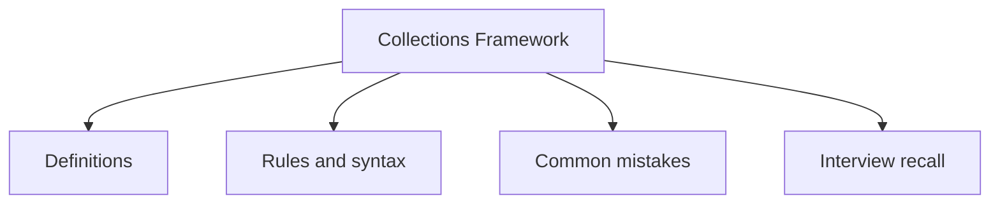

# 19 - Collections Framework

Chủ đề này tuân theo đề cương chính trong [outline.md](../outline.md). Mục tiêu là hiểu sâu sắc từng khái niệm để có thể giải thích, nhận biết trong code và trả lời các câu hỏi phỏng vấn.

## Thứ tự Học tập (Study Order)

- [Các khái niệm về những gì cấu thành nên Collection Framework](theory/01-what-is-the-collection-framework-concepts.md)
- [Các khái niệm về ArrayList](theory/02-arraylist-concepts.md)
- [Các khái niệm về TreeSet](theory/03-treeset-concepts.md)
- [Các khái niệm về LinkedList dùng làm Queue](theory/04-linkedlist-as-queue-concepts.md)
- [Các khái niệm về ConcurrentHashMap](theory/05-concurrenthashmap-concepts.md)
- [Các khái niệm về Fail-Fast Iterator](theory/06-fail-fast-iterator-concepts.md)
- [Các khái niệm về Collections.unmodifiableList](theory/07-collections-unmodifiablelist-concepts.md)
- [Thuật ngữ chính](terms/01-key-terms.md)

## Danh sách kiểm tra Đề cương (Outline Checklist)

- Collection Framework là gì?
- Iterable
- Collection
- List
- Set
- Queue
- Deque
- Map
- ArrayList
- LinkedList
- Vector
- Stack
- So sánh ArrayList và LinkedList
- Khi nào nên dùng List?
- HashSet
- LinkedHashSet
- TreeSet
- SortedSet
- NavigableSet
- Khi nào nên dùng Set?
- Cơ chế loại bỏ phần tử trùng lặp
- Vai trò của equals() và hashCode()
- PriorityQueue
- ArrayDeque
- LinkedList làm Queue
- FIFO (Vào trước ra trước)
- LIFO (Vào sau ra trước)
- Hàng đợi ưu tiên (Priority queue)
- HashMap
- LinkedHashMap
- TreeMap
- Hashtable
- ConcurrentHashMap
- WeakHashMap
- IdentityHashMap
- SortedMap
- NavigableMap
- Khi nào nên dùng Map?
- Iterator
- ListIterator
- Fail-fast iterator
- Fail-safe iterator
- ConcurrentModificationException
- Collections.sort
- Collections.reverse
- Collections.shuffle
- Collections.max
- Collections.min
- Collections.unmodifiableList
- Collections.synchronizedList
- Arrays.sort
- Arrays.binarySearch
- Arrays.asList
- Arrays.copyOf
- Arrays.equals
- Arrays.deepEquals

## Tự kiểm tra (Self-Check)

Trước khi chuyển sang chủ đề tiếp theo, hãy xác minh xem bạn có thể trả lời các câu hỏi sau hay không:
1. Tại sao `ArrayList` thay đổi kích thước tăng 1.5 lần (và cách phương thức `grow()` thực hiện cấp phát/sao chép bộ nhớ), và tại sao việc thay đổi kích thước này lại tốn kém?
   &rarr; Xem [Tại sao ArrayList thay đổi kích thước tăng 1.5 lần](theory/02-arraylist-concepts.md#why-arraylist-resizes-by-15x)
2. Tại sao bạn phải ghi đè đồng thời cả `equals()` và `hashCode()` khi sử dụng các đối tượng tùy chỉnh làm khóa trong `HashMap`, và hiện tượng sai lệch cấu trúc nào sẽ xảy ra trong bảng băm nếu bạn không làm như vậy?
   &rarr; Xem [Tại sao Equals và HashCode phải được ghi đè cùng nhau](theory/04-linkedlist-as-queue-concepts.md#why-equals-and-hashcode-must-be-overridden-together)
3. Tại sao `TreeSet`/`TreeMap` dựa vào `Comparable`/`Comparator` thay vì `equals()` để xác định phần tử trùng lặp và thứ tự sắp xếp, và lỗi gì xảy ra nếu `compareTo()` không nhất quán với `equals()`?
   &rarr; Xem [Tại sao TreeSet và TreeMap dựa vào Comparable/Comparator](theory/03-treeset-concepts.md#why-treeset-and-treemap-rely-on-comparablecomparator)
4. Tại sao `ConcurrentHashMap` đạt được tính an toàn luồng (Thread) cao mà không cần khóa toàn bộ bản đồ (và các khối `synchronized` trên đầu xô (bucket-head) và CAS khác biệt thế nào so với `Hashtable`/`synchronizedMap`), và tại sao nó từ chối các khóa và giá trị là null?
   &rarr; Xem [Tại sao ConcurrentHashMap tránh cơ chế Khóa toàn cục](theory/05-concurrenthashmap-concepts.md#why-concurrenthashmap-avoids-global-locking)
5. Tại sao các fail-fast iterator ném ra ngoại lệ `ConcurrentModificationException` (và cơ chế `modCount` phát hiện các thay đổi cấu trúc như thế nào), và làm thế nào các iterator fail-safe/weakly-consistent tránh được ngoại lệ này?
   &rarr; Xem [Tại sao các Fail-Fast Iterator ném ra ngoại lệ ConcurrentModificationException](theory/06-fail-fast-iterator-concepts.md#why-fail-fast-iterators-throw-concurrentmodificationexception)
6. Tại sao lại có sự khác biệt giữa `Collections.unmodifiableList()` (giao diện chỉ đọc) và `List.of()` / `List.copyOf()` (tập hợp bất biến), và cấu trúc bộ nhớ bên dưới của chúng khác nhau như thế nào?
   &rarr; Xem [Tại sao giao diện không thể sửa đổi (Unmodifiable Views) và Tập hợp bất biến (Immutable Collections) khác nhau](theory/07-collections-unmodifiablelist-concepts.md#why-unmodifiable-views-and-immutable-collections-differ)

## Thẻ Anki (Anki Cards)

- [Cơ bản](anki/basic.tsv)
- [Cơ bản Mở rộng](anki/basic-extra.tsv)
- [Khuyết (Cloze)](anki/cloze.tsv)
- [Câu hỏi Code](anki/code-question.tsv)

## Tổng quan bằng Mermaid (Mermaid Overview)

## Liên kết tham khảo (Reference Links)

- https://docs.oracle.com/javase/tutorial/collections/
- https://docs.oracle.com/en/java/javase/21/docs/api/java.base/java/util/package-summary.html
