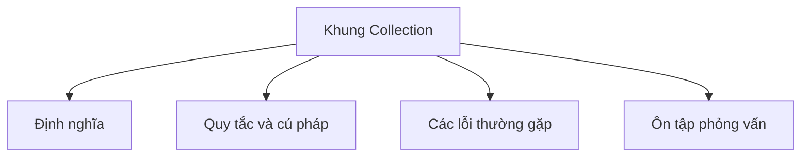

# 19 - Khung Collection (Collections Framework)

Chủ đề này bám sát đề cương chính trong [outline.md](../outline.md). Mục tiêu là giúp bạn hiểu sâu từng khái niệm để có thể giải thích, nhận diện chúng trong mã nguồn và trả lời các câu hỏi phỏng vấn.

## Thứ Tự Học Tập (Study Order)

- [Khái niệm về Khung Collection](theory/01-what-is-the-collection-framework-concepts.md)
- [Khái niệm về ArrayList](theory/02-arraylist-concepts.md)
- [Khái niệm về TreeSet](theory/03-treeset-concepts.md)
- [Khái niệm về LinkedList dưới vai trò Hàng đợi (Queue)](theory/04-linkedlist-as-queue-concepts.md)
- [Khái niệm về ConcurrentHashMap](theory/05-concurrenthashmap-concepts.md)
- [Khái niệm về Trình lặp fail-fast (Fail-fast Iterator)](theory/06-fail-fast-iterator-concepts.md)
- [Khái niệm về Danh sách không thể sửa đổi (Unmodifiable List) của Collections](theory/07-collections-unmodifiablelist-concepts.md)
- [Thuật Ngữ Cốt Lõi](terms/01-key-terms.md)

## Danh Sách Kiểm Tra Đề Cương (Outline Checklist)

- Khung Collection là gì?
- Iterable
- Collection
- List
- Set
- Queue
- Deque
- Map
- ArrayList
- LinkedList
- Vector
- Stack
- So sánh ArrayList và LinkedList
- Khi nào nên dùng List?
- HashSet
- LinkedHashSet
- TreeSet
- SortedSet
- NavigableSet
- Khi nào nên dùng Set?
- Cơ chế loại bỏ phần tử trùng lặp (Duplicate removal mechanism)
- Vai trò của equals() và hashCode()
- PriorityQueue
- ArrayDeque
- LinkedList dưới vai trò Queue
- Vào trước ra trước (FIFO - First-In-First-Out)
- Vào sau ra trước (LIFO - Last-In-First-Out)
- Hàng đợi ưu tiên (Priority Queue)
- HashMap
- LinkedHashMap
- TreeMap
- Hashtable
- ConcurrentHashMap
- WeakHashMap
- IdentityHashMap
- SortedMap
- NavigableMap
- Khi nào nên dùng Map?
- Iterator
- ListIterator
- Trình lặp fail-fast
- Trình lặp fail-safe (Fail-safe Iterator)
- ConcurrentModificationException
- Collections.sort
- Collections.reverse
- Collections.shuffle
- Collections.max
- Collections.min
- Collections.unmodifiableList
- Collections.synchronizedList
- Arrays.sort
- Arrays.binarySearch
- Arrays.asList
- Arrays.copyOf
- Arrays.equals
- Arrays.deepEquals

## Tự Kiểm Tra (Self-Check)

Trước khi chuyển sang chủ đề tiếp theo, hãy đảm bảo bạn có thể trả lời các câu hỏi sau:
1. Tại sao `ArrayList` lại thay đổi kích thước (Resize) gấp 1.5 lần (và phương thức `grow()` thực hiện cấp phát bộ nhớ (Memory Allocation) cũng như sao chép dữ liệu như thế nào), và tại sao việc thay đổi kích thước này lại tốn kém chi phí hiệu năng?
   &rarr; Xem [Tại sao ArrayList thay đổi kích thước gấp 1.5 lần](theory/02-arraylist-concepts.md#why-arraylist-resizes-by-15x)
2. Tại sao bạn phải ghi đè (Override) đồng thời cả `equals()` và `hashCode()` khi sử dụng các đối tượng tùy chỉnh (Custom Object) làm khóa (Key) trong `HashMap`, và sự sai lệch cấu trúc (Structural Corruption) nào sẽ xảy ra trong bảng băm (Hash Table) nếu bạn không làm như vậy?
   &rarr; Xem [Tại sao phải ghi đè đồng thời cả Equals và HashCode](theory/04-linkedlist-as-queue-concepts.md#why-equals-and-hashcode-must-be-overridden-together)
3. Tại sao `TreeSet`/`TreeMap` lại phụ thuộc vào `Comparable`/`Comparator` thay vì `equals()` để xác định các phần tử trùng lặp và thứ tự sắp xếp, và lỗi (Bug) nào sẽ xảy ra nếu `compareTo()` không nhất quán với `equals()`?
   &rarr; Xem [Tại sao TreeSet và TreeMap phụ thuộc vào Comparable/Comparator](theory/03-treeset-concepts.md#why-treeset-and-treemap-rely-on-comparablecomparator)
4. Tại sao `ConcurrentHashMap` đạt được độ an toàn đa luồng (Thread-safety) cao mà không cần khóa (Locking) toàn bộ bản đồ (Map) (và cơ chế CAS (Compare-And-Swap) cùng các khối `synchronized` ở đầu bucket (Bucket-head) khác biệt như thế nào so với `Hashtable`/`synchronizedMap`), và tại sao nó lại từ chối các khóa và giá trị `null`?
   &rarr; Xem [Tại sao ConcurrentHashMap tránh việc khóa toàn cục](theory/05-concurrenthashmap-concepts.md#why-concurrenthashmap-avoids-global-locking)
5. Tại sao các trình lặp fail-fast lại ném ra ngoại lệ `ConcurrentModificationException` (và cơ chế `modCount` phát hiện các thay đổi cấu trúc như thế nào), và làm thế nào các trình lặp fail-safe/nhất quán yếu (Weakly-consistent Iterator) lại tránh được ngoại lệ này?
   &rarr; Xem [Tại sao các trình lặp Fail-Fast ném ra ngoại lệ ConcurrentModificationException](theory/06-fail-fast-iterator-concepts.md#why-fail-fast-iterators-throw-concurrentmodificationexception)
6. Tại sao lại có sự khác biệt giữa `Collections.unmodifiableList()` (giao diện xem không thể sửa đổi (Unmodifiable View)) và `List.of()` / `List.copyOf()` (tập hợp bất biến (Immutable Collection)), và cấu trúc bộ nhớ bên dưới của chúng khác nhau như thế nào?
   &rarr; Xem [Tại sao giao diện xem không thể sửa đổi và tập hợp bất biến lại khác nhau](theory/07-collections-unmodifiablelist-concepts.md#why-unmodifiable-views-and-immutable-collections-differ)

## Thẻ Ghi Nhớ Anki (Anki Cards)

- [Cơ Bản](anki/basic.tsv)
- [Cơ Bản Mở Rộng](anki/basic-extra.tsv)
- [Điền Vào Chỗ Trống (Cloze)](anki/cloze.tsv)
- [Câu Hỏi Về Mã Nguồn](anki/code-question.tsv)

## Sơ Đồ Tổng Quan Mermaid (Mermaid Overview)

## Liên Kết Tham Khảo (Reference Links)

- https://docs.oracle.com/javase/tutorial/collections/
- https://docs.oracle.com/en/java/javase/21/docs/api/java.base/java/util/package-summary.html