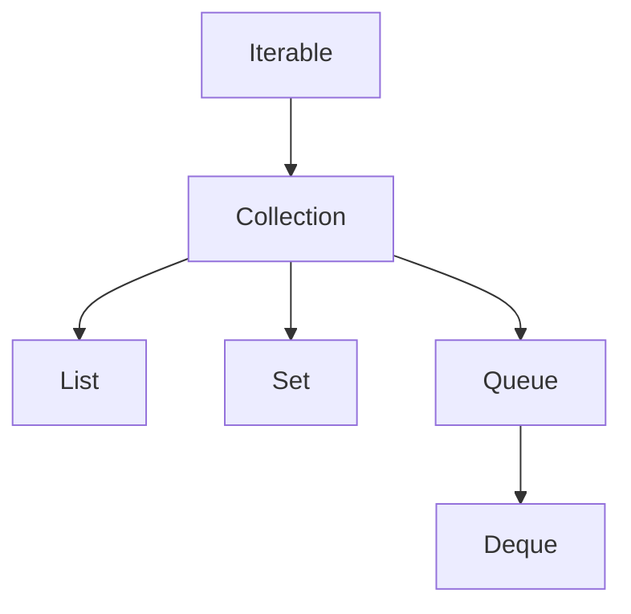

# Cấu Trúc Tập Hợp (Collections Framework) - Phần 1

## Mục Tiêu Học Tập

File này đề cập đến một phần trọng tâm của **Cấu Trúc Tập Hợp (Collections Framework)**. Hãy nghiên cứu từng khái niệm như một quy tắc Java thực tế, chứ không phải là những từ vựng rời rạc.

## Đề Cương Khái Niệm

| Khái niệm | Những điều cần biết |
| --- | --- |
| `Cấu trúc tập hợp (Collection Framework) là gì?` | Một tập hợp (collection) là một đối tượng nhóm nhiều phần tử lại với nhau dưới một API chung. |
| `Iterable` | Iterable là hợp đồng duyệt gốc cho phép một đối tượng được sử dụng trong các vòng lặp for cải tiến (enhanced for loop). |
| `Collection` | Một tập hợp (collection) là một đối tượng nhóm nhiều phần tử lại với nhau dưới một API chung. |
| `List` | Một List là một tập hợp có thứ tự có thể chứa các phần tử trùng lặp và hỗ trợ truy cập theo vị trí. |
| `Set` | Một Set là một tập hợp loại bỏ các phần tử trùng lặp theo các quy tắc so sánh bằng. |
| `Queue` | Queue đại diện cho một tập hợp được thiết kế để giữ các phần tử trước khi xử lý, thường theo cơ chế FIFO. |
| `Deque` | Deque là một hàng đợi hai đầu hỗ trợ việc chèn và xóa ở cả hai đầu. |
| `Map` | Một Map lưu trữ các cặp khóa-giá trị (key-value pair) và truy xuất các giá trị bằng khóa. |

## Ghi Chú Chi Tiết

### Phân Cấp Các Tập Hợp (The Collection Hierarchy)

Dưới đây là mối quan hệ trực quan giữa các giao diện cốt lõi trong Cấu Trúc Tập Hợp Java (Java Collections Framework):


*Lưu ý: Map là một phân cấp riêng biệt và không kế thừa Collection, mặc dù nó là một phần cốt lõi của Cấu Trúc Tập Hợp (Collections Framework).*

### Cấu Trúc Tập Hợp (Collections Framework) là gì?

Một tập hợp là một đối tượng nhóm nhiều phần tử lại với nhau dưới một API chung. Cấu Trúc Tập Hợp cung cấp:
1. **Các giao diện (Interfaces)**: Các biểu diễn trừu tượng của tập hợp (ví dụ: `List`, `Set`, `Map`).
2. **Các triển khai (Implementations)**: Các triển khai cụ thể của các giao diện này (ví dụ: `ArrayList`, `HashSet`, `HashMap`).
3. **Các thuật toán (Algorithms)**: Các phương thức tiện ích tĩnh để tìm kiếm, sắp xếp và thao tác trên tập hợp (ví dụ: `Collections.sort()`).

### Iterable

`Iterable` là hợp đồng duyệt gốc cho phép một đối tượng được sử dụng trong các vòng lặp `for-each` cải tiến.

**Ví dụ Mã Nguồn Chạy Được:**
```java
import java.util.Iterator;
import java.util.List;

public class IterableExample {
    public static void main(String[] args) {
        Iterable<String> iterable = List.of("Java", "Python", "Go");
        
        // 1. Using enhanced for-each loop (compiler translates this to Iterator)
        for (String lang : iterable) {
            System.out.println(lang);
        }
        
        // 2. Using explicit Iterator traversal
        Iterator<String> iterator = iterable.iterator();
        while (iterator.hasNext()) {
            System.out.println(iterator.next());
        }
    }
}
```

### Collection

Giao diện `Collection` đại diện cho các hành vi chung được chia sẻ bởi tất cả các tập hợp (như thêm, xóa và kiểm tra kích thước).

**Ví dụ Mã Nguồn Chạy Được:**
```java
import java.util.ArrayList;
import java.util.Collection;

public class CollectionExample {
    public static void main(String[] args) {
        Collection<Integer> numbers = new ArrayList<>();
        numbers.add(10);
        numbers.add(20);
        numbers.add(30);
        
        System.out.println("Size: " + numbers.size()); // Size: 3
        System.out.println("Contains 20: " + numbers.contains(20)); // true
        
        // removeIf takes a Predicate (Java 8+)
        numbers.removeIf(n -> n > 15);
        System.out.println("Remaining: " + numbers); // [10]
    }
}
```

### List

Một `List` là một tập hợp có thứ tự (còn được gọi là một chuỗi - sequence) có thể chứa các phần tử trùng lặp. Người dùng có quyền kiểm soát chính xác vị trí của từng phần tử được chèn vào và có thể truy cập các phần tử bằng chỉ số (index) kiểu nguyên của chúng.

**Ví dụ Mã Nguồn Chạy Được:**
```java
import java.util.ArrayList;
import java.util.List;

public class ListExample {
    public static void main(String[] args) {
        List<String> list = new ArrayList<>();
        list.add("Apple");
        list.add("Banana");
        list.add("Apple"); // Duplicates are allowed
        
        // Positional access
        String first = list.get(0);
        System.out.println("First element: " + first); // Apple
        System.out.println("List elements: " + list);  // [Apple, Banana, Apple]
        
        list.set(1, "Cherry"); // Modify element at index 1
        System.out.println("Updated List: " + list);  // [Apple, Cherry, Apple]
    }
}
```

### Set

Một `Set` là một tập hợp không thể chứa các phần tử trùng lặp. Nó mô phỏng lại sự trừu tượng hóa của tập hợp toán học.

**Ví dụ Mã Nguồn Chạy Được:**
```java
import java.util.HashSet;
import java.util.Set;

public class SetExample {
    public static void main(String[] args) {
        Set<String> set = new HashSet<>();
        boolean addedFirst = set.add("Java");
        boolean addedSecond = set.add("Java"); // Duplicate entry
        
        System.out.println("Added first: " + addedFirst);   // true
        System.out.println("Added second: " + addedSecond); // false
        System.out.println("Set size: " + set.size());       // 1
    }
}
```

### Queue

`Queue` đại diện cho một tập hợp được thiết kế để giữ các phần tử trước khi xử lý. Thông thường (nhưng không nhất thiết), các hàng đợi sắp xếp các phần tử theo cơ chế FIFO (vào trước ra trước).

**Ví dụ Mã Nguồn Chạy Được:**
```java
import java.util.LinkedList;
import java.util.Queue;

public class QueueExample {
    public static void main(String[] args) {
        Queue<String> queue = new LinkedList<>();
        
        // offer() inserts an element without throwing exceptions if capacity is restricted
        queue.offer("Task 1");
        queue.offer("Task 2");
        
        // peek() retrieves, but does not remove, the head
        System.out.println("Head: " + queue.peek()); // Task 1
        
        // poll() retrieves and removes the head, returning null if empty
        System.out.println("Polled: " + queue.poll()); // Task 1
        System.out.println("Next Head: " + queue.peek()); // Task 2
    }
}
```

### Deque

`Deque` (Hàng đợi hai đầu - Double Ended Queue) là một tập hợp tuyến tính hỗ trợ chèn và xóa phần tử ở cả hai đầu. Nó có thể được sử dụng làm hàng đợi FIFO hoặc ngăn xếp LIFO (vào sau ra trước).

**Ví dụ Mã Nguồn Chạy Được:**
```java
import java.util.ArrayDeque;
import java.util.Deque;

public class DequeExample {
    public static void main(String[] args) {
        Deque<String> deque = new ArrayDeque<>();
        
        // Using as a Queue (FIFO)
        deque.addLast("A");
        deque.addLast("B");
        System.out.println(deque.removeFirst()); // A
        
        // Using as a Stack (LIFO)
        deque.push("First");
        deque.push("Second");
        System.out.println(deque.pop()); // Second
    }
}
```

### Map

Một `Map` là một đối tượng ánh xạ các khóa sang các giá trị. Một map không thể chứa các khóa trùng lặp; mỗi khóa có thể ánh xạ tới tối đa một giá trị.

**Ví dụ Mã Nguồn Chạy Được:**
```java
import java.util.HashMap;
import java.util.Map;

public class MapExample {
    public static void main(String[] args) {
        Map<String, Integer> ageMap = new HashMap<>();
        ageMap.put("Alice", 25);
        ageMap.put("Bob", 30);
        ageMap.put("Alice", 26); // Overwrites the existing value for key "Alice"
        
        System.out.println("Alice's age: " + ageMap.get("Alice")); // 26
        
        // Iterating over Map entries
        for (Map.Entry<String, Integer> entry : ageMap.entrySet()) {
            System.out.println(entry.getKey() + " => " + entry.getValue());
        }
    }
}
```

---

## Các Lỗi Thường Gặp

### 1. Coi Map Như Một Collection

Một bẫy phỏng vấn phổ biến là giả định rằng `Map` kế thừa giao diện `Collection`. Thực tế không phải vậy. Các phương thức như `map.add()` hoặc `map.iterator()` không hề tồn tại. Để duyệt qua nội dung của một map, bạn phải gọi `map.keySet()`, `map.values()`, hoặc `map.entrySet()`.

### 2. Nhầm Lẫn Giữa Các Phương Thức Của Queue/Deque

Việc chèn vào một Queue bằng cách sử dụng `add()` hoặc `remove()` sẽ ném ra ngoại lệ (như `IllegalStateException` hoặc `NoSuchElementException`) nếu hàng đợi đầy/rỗng. Ngược lại, `offer()`, `poll()`, và `peek()` trả về các giá trị đặc biệt (`false` hoặc `null`) thay vì ném ra ngoại lệ. Việc trộn lẫn các phương thức này dẫn đến xử lý lỗi rất mỏng manh.

### 3. Sửa Đổi Một List Trong Vòng Lặp Dựa Trên Chỉ Số Cơ Bản

Việc sử dụng một vòng lặp `for` tiêu chuẩn với duyệt chỉ số trong khi sửa đổi kích thước của list có thể dẫn đến việc bỏ sót phần tử hoặc gây ra lỗi `IndexOutOfBoundsException`:
```java
// BUG: Modifies list while iterating forwards
for (int i = 0; i < list.size(); i++) {
    if (list.get(i).equals("remove-me")) {
        list.remove(i); // Shifts elements, causing the next element to be skipped!
    }
}
```
*\*Giải pháp: Sử dụng một iterator tường minh hoặc `removeIf`.\**

## Các Câu Hỏi Ôn Tập Thường Gặp

- Những khái niệm nào ở đây là quy tắc tại thời điểm biên dịch?
- Những khái niệm nào ở đây ảnh hưởng đến hành vi tại thời điểm chạy?
- Những khái niệm nào ở đây có khả năng là bẫy phỏng vấn?
