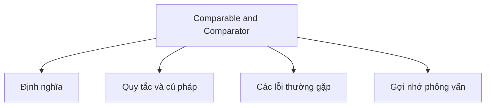

# 20 - Comparable và Comparator

Chủ đề này tuân theo đề cương chính trong [outline.md](../outline.md). Mục tiêu là hiểu sâu sắc từng khái niệm để có thể giải thích, nhận biết chúng trong mã nguồn và trả lời các câu hỏi phỏng vấn.

## Thứ Tự Học Tập

- [Khái niệm Comparable](theory/01-comparable-concepts.md)
- [Khái niệm Đảo Ngược Thứ Tự (Reverse Order)](theory/02-reverse-order-concepts.md)
- [Các Thuật Ngữ Khóa](terms/01-key-terms.md)

## Danh Sách Khái Niệm

- Comparable
- compareTo
- Comparator
- compare
- Thứ tự tự nhiên (Natural ordering)
- Thứ tự tùy chỉnh (Custom ordering)
- Sắp xếp đối tượng danh sách (Sort List object)
- Sắp xếp theo nhiều tiêu chí (Sort by multiple criteria)
- Comparator.comparing
- thenComparing
- Thứ tự đảo ngược (Reverse order)
- Xử lý giá trị null (Null handling):
  - nullsFirst
  - nullsLast

## Tự Kiểm Tra

1. Tại sao Java phân tách thứ tự tự nhiên (`Comparable`) khỏi thứ tự tùy chỉnh bên ngoài (`Comparator`), và khi nào bạn nên chọn cái này thay vì cái kia?
2. Tại sao ràng buộc về tính bắc cầu (Transitivity contract) trong `Comparable.compareTo` và `Comparator.compare` là cực kỳ quan trọng, và hành vi hoặc ngoại lệ nào tại thời điểm chạy sẽ xảy ra nếu tính bắc cầu bị vi phạm?
3. Tại sao `TreeSet` và `TreeMap` yêu cầu phương thức so sánh (`compareTo` / `compare`) phải nhất quán với `equals()`, và những bất thường về mặt chức năng nào xảy ra nếu biểu thức `(x.compareTo(y) == 0) == (x.equals(y))` nhận giá trị `false`?
4. Tại sao việc triển khai `compareTo` hoặc `compare` bằng phép trừ số nguyên/số thực (ví dụ: `this.id - other.id`) là một lỗi nguy hiểm, và việc tràn số nguyên (overflow/underflow) phá vỡ các hợp đồng sắp xếp như thế nào?
5. Tại sao Java sử dụng thuật toán sắp xếp nhanh hai chốt (Dual-Pivot Quicksort) để sắp xếp các kiểu nguyên thủy (ví dụ: `Arrays.sort(int[])`) nhưng lại dùng TimSort để sắp xếp các đối tượng (ví dụ: `Arrays.sort(Object[])`), và chúng khác nhau như thế nào về độ phức tạp thời gian, độ phức tạp không gian và tính ổn định (stability)?

## Thẻ Anki

- [Basic](anki/basic.tsv)
- [Basic Extra](anki/basic-extra.tsv)
- [Cloze](anki/cloze.tsv)
- [Code Question](anki/code-question.tsv)

## Sơ Đồ Mermaid Tổng Quan

## Liên Kết Tham Khảo

- https://docs.oracle.com/en/java/javase/21/docs/api/java.base/java/lang/Comparable.html
- https://docs.oracle.com/en/java/javase/21/docs/api/java.base/java/util/Comparator.html
