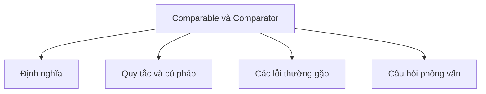

# 20 - Comparable và Comparator (Comparable and Comparator)

Chủ đề này tuân theo đề cương chính trong [outline.md](../outline.md). Mục tiêu là hiểu sâu sắc từng khái niệm để có thể giải thích, nhận biết trong code và trả lời các câu hỏi phỏng vấn.

## Thứ tự học tập (Study Order)

- [Comparable Concepts](theory/01-comparable-concepts.md)
- [Reverse Order Concepts](theory/02-reverse-order-concepts.md)
- [Key Terms](terms/01-key-terms.md)

## Danh sách đề cương (Outline Checklist)

- Comparable
- compareTo
- Comparator
- compare
- Thứ tự tự nhiên (Natural ordering)
- Thứ tự tùy chỉnh (Custom ordering)
- Sắp xếp đối tượng List (Sort List object)
- Sắp xếp theo nhiều tiêu chí (Sort by multiple criteria)
- Comparator.comparing
- thenComparing
- Đảo ngược thứ tự (Reverse order)
- Xử lý giá trị null (Null handling):
- nullsFirst
- nullsLast

## Tự kiểm tra (Self-Check)

1. Tại sao Java lại tách biệt thứ tự tự nhiên (`Comparable`) khỏi thứ tự tùy chỉnh bên ngoài (`Comparator`), và khi nào bạn nên chọn cái này hơn cái kia?
2. Tại sao ràng buộc về tính bắc cầu (transitivity contract) trong `Comparable.compareTo` và `Comparator.compare` lại quan trọng, và hành vi thời gian chạy (runtime behavior) hoặc ngoại lệ (exceptions) nào sẽ xảy ra nếu tính bắc cầu bị vi phạm?
3. Tại sao `TreeSet` và `TreeMap` yêu cầu phương thức so sánh (`compareTo` / `compare`) phải nhất quán với `equals()`, và những bất thường về mặt chức năng nào xảy ra nếu `(x.compareTo(y) == 0) == (x.equals(y))` là false?
4. Tại sao việc triển khai `compareTo` hoặc `compare` bằng phép trừ số nguyên/số thực dấu phẩy động (ví dụ: `this.id - other.id`) là một lỗi nguy hiểm, và hiện tượng tràn số nguyên (integer overflow/underflow) phá vỡ các ràng buộc sắp xếp như thế nào?
5. Tại sao Java sử dụng Dual-Pivot Quicksort để sắp xếp các kiểu dữ liệu nguyên thủy (ví dụ: `Arrays.sort(int[])`) nhưng lại dùng TimSort để sắp xếp các đối tượng (ví dụ: `Arrays.sort(Object[])`), và chúng khác nhau như thế nào về độ phức tạp thời gian (time complexity), độ phức tạp không gian (space complexity) và tính ổn định (stability)?

## Thẻ Anki (Anki Cards)

- [Basic](anki/basic.tsv)
- [Basic Extra](anki/basic-extra.tsv)
- [Cloze](anki/cloze.tsv)
- [Code Question](anki/code-question.tsv)

## Sơ đồ Mermaid tổng quan (Mermaid Overview)

## Liên kết tham khảo (Reference Links)

- https://docs.oracle.com/en/java/javase/21/docs/api/java.base/java/lang/Comparable.html
- https://docs.oracle.com/en/java/javase/21/docs/api/java.base/java/util/Comparator.html
