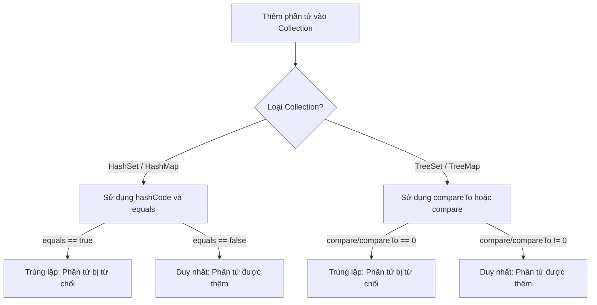
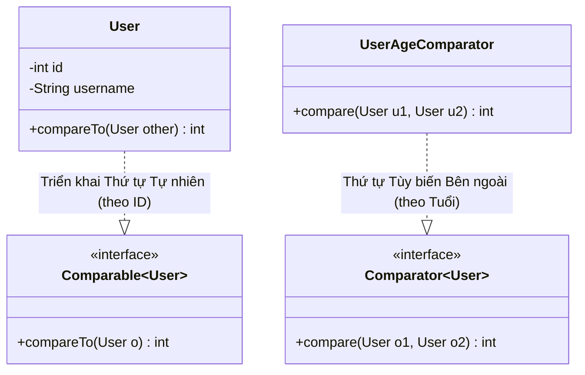

# Comparable và Comparator - Phần 1 (Comparable and Comparator - Part 1)

## Mục Tiêu Học Tập (Learning Goal)

Tài liệu này đề cập đến một phần trọng tâm của **Comparable và Comparator**. Hãy nghiên cứu từng khái niệm như một quy tắc Java thực tế, chứ không phải là những thuật ngữ riêng lẻ.

## Phạm Vi Outline (Outline Coverage)

| Khái niệm (Concept) | Những điều cần biết (What to know) |
| --- | --- |
| `Comparable` | `Comparable` định nghĩa thứ tự tự nhiên (natural ordering) bên trong lớp được so sánh. |
| `compareTo` | `compareTo` là một phương thức cụ thể trong `Comparable`; hãy tìm hiểu quy tắc Java, các trường hợp sử dụng hợp lệ và lỗi thường gặp của nó thay vì chỉ biết mỗi tên gọi. |
| `Comparator` | `Comparator` định nghĩa thứ tự tùy biến (custom ordering) từ bên ngoài cho các đối tượng. |
| `compare` | `compare` là một phương thức cụ thể trong `Comparator`; hãy tìm hiểu quy tắc Java, các trường hợp sử dụng hợp lệ và lỗi thường gặp của nó thay vì chỉ biết mỗi tên gọi. |
| `Natural ordering` | Thứ tự tự nhiên (Natural ordering) là một khái niệm cụ thể trong `Comparable` và `Comparator`; hãy tìm hiểu quy tắc Java, các trường hợp sử dụng hợp lệ và lỗi thường gặp của nó thay vì chỉ biết mỗi tên gọi. |
| `Custom ordering` | Thứ tự tùy biến (Custom ordering) là một khái niệm cụ thể trong `Comparable` và `Comparator`; hãy tìm hiểu quy tắc Java, các trường hợp sử dụng hợp lệ và lỗi thường gặp của nó thay vì chỉ biết mỗi tên gọi. |
| `Sort List object` | Một `List` là một collection có thứ tự, có thể chứa các phần tử trùng lặp và hỗ trợ truy cập theo vị trí chỉ mục. |
| `Sort by multiple criteria` | Sắp xếp theo nhiều tiêu chí (Sort by multiple criteria) là một khái niệm cụ thể trong `Comparable` và `Comparator`; hãy tìm hiểu quy tắc Java, các trường hợp sử dụng hợp lệ và lỗi thường gặp của nó thay vì chỉ biết mỗi tên gọi. |
| `Comparator.comparing` | `Comparator` định nghĩa thứ tự tùy biến từ bên ngoài cho các đối tượng. |
| `thenComparing` | `thenComparing` là một khái niệm cụ thể trong `Comparable` và `Comparator`; hãy tìm hiểu quy tắc Java, các trường hợp sử dụng hợp lệ và lỗi thường gặp của nó thay vì chỉ biết mỗi tên gọi. |

## Ghi Chú Chi Tiết (Detailed Notes)

### Comparable

`Comparable` định nghĩa thứ tự tự nhiên (natural ordering) bên trong lớp được so sánh.

#### Giải thích chi tiết (Enriched Explanation)
`Comparable<T>` là một generic interface (`java.lang.Comparable`) được một lớp triển khai (implement) để định nghĩa **thứ tự tự nhiên (natural ordering)** của nó. Khi một lớp triển khai `Comparable`, các đối tượng của lớp đó có thể được sắp xếp tự động bằng các công cụ tiện ích của collection như `Collections.sort()` hoặc `Arrays.sort()`, và có thể được sử dụng làm key trong các map có thứ tự (`TreeMap`) hoặc làm phần tử trong các set có thứ tự (`TreeSet`) mà không cần cung cấp một bộ so sánh (comparator) tường minh.

#### Ví dụ mã nguồn (Code Example)
```java
public class User implements Comparable<User> {
    private final String username;
    private final int id;

    public User(String username, int id) {
        this.username = username;
        this.id = id;
    }

    @Override
    public int compareTo(User other) {
        // Thứ tự tự nhiên dựa trên ID tăng dần
        return Integer.compare(this.id, other.id);
    }
}
```

#### Lỗi thường gặp & Chế độ thất bại (Gotchas & Failure Modes)
- **ClassCastException**: Nếu bạn cố gắng sắp xếp một danh sách các đối tượng không triển khai `Comparable` (và không cung cấp một `Comparator`), Java sẽ ném ra `ClassCastException` tại thời điểm chạy (runtime) nếu sử dụng kiểu thô (raw types) hoặc gây lỗi biên dịch (với kiểu generic).
- **Tính nhất quán với Equals (Consistency with Equals)**: Khuyến nghị mạnh mẽ (mặc dù không bắt buộc) là thứ tự tự nhiên nên nhất quán với `equals`. Nghĩa là, `(x.compareTo(y) == 0) == (x.equals(y))`. Các collection như `TreeSet` và `TreeMap` sử dụng `compareTo` (chứ không phải `equals`) để xác định tính duy nhất; nếu chúng không nhất quán, set/map sẽ vi phạm ràng buộc chung của `Set`/`Map` và hoạt động không như mong đợi.

## Tại Sao TreeSet và TreeMap Yêu Cầu Tính Nhất Quán Với Equals (Why TreeSet and TreeMap Require Consistency with Equals)

Các collection có thứ tự như `TreeSet` và `TreeMap` hoạt động khác với các collection thông thường. Không giống như `HashSet` hoặc `HashMap` (vốn xác định tính duy nhất bằng cách sử dụng `Object.hashCode()` và `Object.equals()`), các collection có thứ tự chỉ phụ thuộc vào phương thức so sánh (`compareTo` hoặc `compare`) để xác định các phần tử trùng lặp. Nếu `compareTo` trả về `0` cho hai phần tử, chúng được coi là giống hệt nhau, bất kể `equals()` trả về kết quả gì. Nếu thứ tự tự nhiên không nhất quán với `equals()`, các phần tử khác nhau theo `equals()` sẽ bị bỏ qua một cách âm thầm khi thêm vào `TreeSet` hoặc `TreeMap`. Điều này làm phá vỡ hợp đồng (contract) chính thức của các interface `Set` và `Map` (vốn được định nghĩa dựa trên `equals()`), dẫn đến mất mát dữ liệu ngoài ý muốn hoặc lỗi truy xuất dữ liệu trong mã nguồn sử dụng collection.

### Mô hình tư duy: Xác định tính duy nhất trong Java Collections (Mental Model: Uniqueness Resolution in Java Collections)


### Ví dụ mã nguồn: Sự không nhất quán của BigDecimal (Code Example: BigDecimal Inconsistency)
```java
import java.math.BigDecimal;
import java.util.HashSet;
import java.util.Set;
import java.util.TreeSet;

public class ConsistencyExample {
    public static void main(String[] args) {
        BigDecimal d1 = new BigDecimal("1.0");
        BigDecimal d2 = new BigDecimal("1.00");

        // 1. HashSet sử dụng hashCode() và equals()
        // d1.equals(d2) trả về false vì số chữ số thập phân khác nhau (1 so với 2 chữ số)
        Set<BigDecimal> hashSet = new HashSet<>();
        hashSet.add(d1);
        hashSet.add(d2);
        System.out.println("Kích thước HashSet: " + hashSet.size()); // Kết quả: Kích thước HashSet: 2

        // 2. TreeSet sử dụng compareTo()
        // d1.compareTo(d2) trả về 0 vì giá trị số học của chúng bằng nhau
        Set<BigDecimal> treeSet = new TreeSet<>();
        treeSet.add(d1);
        treeSet.add(d2); // Bị từ chối vì coi là trùng lặp!
        System.out.println("Kích thước TreeSet: " + treeSet.size()); // Kết quả: Kích thước TreeSet: 1
    }
}
```

### Chuỗi nguyên nhân - kết quả (Cause-Effect Chain)
`(x.compareTo(y) == 0) == (x.equals(y))` trả về false $\rightarrow$ `TreeSet`/`TreeMap` chỉ dựa vào `compareTo` để kiểm tra tính duy nhất $\rightarrow$ Các đối tượng khác nhau theo `equals` nhưng trả về `0` từ `compareTo` sẽ bị coi là các phần tử trùng lặp $\rightarrow$ Các phần tử trùng lặp này bị từ chối khi chèn $\rightarrow$ Mất dữ liệu xảy ra và collection vi phạm hợp đồng Set/Map tiêu chuẩn của Java Collections.

### compareTo

`compareTo` là một phương thức cụ thể trong `Comparable` được sử dụng để định nghĩa các quy tắc thứ tự tự nhiên.

#### Giải thích chi tiết (Enriched Explanation)
Phương thức `compareTo(T o)` là phương thức trừu tượng duy nhất của interface `Comparable`. Nó so sánh đối tượng hiện tại (`this`) với đối tượng được chỉ định `o`.
- Trả về một **số nguyên âm** nếu `this` nhỏ hơn `o`.
- Trả về **số 0** nếu `this` bằng `o`.
- Trả về một **số nguyên dương** nếu `this` lớn hơn `o`.

#### Ví dụ mã nguồn (Code Example)
```java
// Việc triển khai compareTo của String so sánh các ký tự theo thứ tự từ điển (lexicographical)
int result = "apple".compareTo("banana"); // trả về một số âm (< 0)
```

#### Lỗi thường gặp & Chế độ thất bại (Gotchas & Failure Modes)
- **Lỗi tràn số khi trừ số nguyên (Integer Subtraction Overflow Bug)**: Một sai lầm kinh điển là triển khai `compareTo` bằng cách thực hiện phép trừ:
  ```java
  public int compareTo(User other) {
      return this.id - other.id; // NGUY HIỂM: có thể bị tràn số!
  }
  ```
  Nếu `this.id` là `Integer.MIN_VALUE` và `other.id` là `1`, phép trừ sẽ dẫn đến kết quả `Integer.MAX_VALUE` (một số dương), chỉ ra một cách sai lầm rằng `this` lớn hơn `other`. Hãy luôn luôn sử dụng `Integer.compare(a, b)` để thay thế.
- **NullPointerException**: `x.compareTo(null)` luôn luôn phải ném ra một `NullPointerException`.

## Tại Sao So Sánh Dựa Trên Phép Trừ Dẫn Đến Lỗi Tràn Số (Why Subtraction-Based Comparison Leads to Overflow Bugs)

Sử dụng phép trừ (ví dụ: `this.id - other.id`) để triển khai việc so sánh là một anti-pattern nguy hiểm trong Java. Công thức phép trừ giả định rằng nếu `x > y` thì `x - y` sẽ dương; tuy nhiên, giả định này bị phá vỡ bởi giới hạn của số học nhị phân có độ chính xác giới hạn. Trong biểu diễn mã bù hai (two's complement), việc trừ một số dương cho một số âm lớn (hoặc ngược lại) có thể khiến kết quả vượt quá giá trị cực tiểu hoặc cực đại của kiểu dữ liệu đó, làm cho giá trị bị vòng lặp lại (wrap around) và đảo ngược dấu của kết quả. Khi sự đảo ngược dấu này xảy ra, thuật toán sắp xếp nhận được kết quả hoàn toàn trái ngược với so sánh thực tế, dẫn đến các collection không được sắp xếp đúng, thứ tự sắp xếp sai, hoặc các ngoại lệ vi phạm hợp đồng (contract violation) xảy ra tại thời điểm chạy.

### Mô hình tư duy: Tràn phép trừ trong mã bù hai (Mental Model: Subtraction Overflow Under Two's Complement)
Hãy so sánh hai giá trị: `x = Integer.MIN_VALUE` ($-2147483648$) và `y = 1`.
Về mặt toán học, $x < y$, vì vậy một phép so sánh phải trả về một số âm.
Sử dụng phép trừ:
```text
  10000000 00000000 00000000 00000000   (Integer.MIN_VALUE)
- 00000000 00000000 00000000 00000001   (1)
=====================================
  01111111 11111111 11111111 11111111   (Integer.MAX_VALUE / +2147483647)
```
Bit dấu thay đổi từ `1` (âm) sang `0` (dương). Java hiện kết luận sai rằng $x > y$.

### Ví dụ mã nguồn: Lỗi phép trừ minh họa tràn số (Code Example: Subtraction Bug Demonstrating Overflow)
```java
public class SubtractionOverflowDemo {
    public static void main(String[] args) {
        int x = Integer.MIN_VALUE;
        int y = 1;

        // Phương pháp trừ (BỊ LỖI)
        int buggyResult = x - y;
        System.out.println("Kết quả lỗi: " + buggyResult); // Kết quả: Kết quả lỗi: 2147483647 (> 0, biểu thị x > y!)

        // Phương pháp so sánh đúng (AN TOÀN)
        int safeResult = Integer.compare(x, y);
        System.out.println("Kết quả an toàn: " + safeResult);   // Kết quả: Kết quả an toàn: -1 (< 0, biểu thị x < y)
    }
}
```

### Chuỗi nguyên nhân - kết quả (Cause-Effect Chain)
Các giá trị có dấu ngược nhau được so sánh thông qua phép trừ $\rightarrow$ Hiệu số vượt quá giới hạn tối thiểu hoặc tối đa của kiểu dữ liệu nguyên thủy $\rightarrow$ Biểu diễn nhị phân dưới dạng toán học mã bù hai bị tràn số dương (overflow) hoặc tràn số âm (underflow) $\rightarrow$ Bit dấu của kết quả phép trừ bị đảo ngược $\rightarrow$ Bộ so sánh trả về số dương cho một mối quan hệ nhỏ hơn $\rightarrow$ Thuật toán sắp xếp thứ tự các phần tử không chính xác hoặc ném ra ngoại lệ vi phạm hợp đồng.

### Comparator

`Comparator` định nghĩa thứ tự tùy biến (custom ordering) từ bên ngoài cho các đối tượng.

#### Giải thích chi tiết (Enriched Explanation)
`Comparator<T>` là một functional interface (`java.util.Comparator`) được sử dụng để định nghĩa một **thứ tự tùy biến từ bên ngoài (external, custom ordering)** cho một lớp. Không giống như `Comparable` vốn được nhúng bên trong chính lớp đó, một `Comparator` có thể được định nghĩa dưới dạng các lớp riêng biệt, các anonymous class (lớp vô danh) hoặc các biểu thức lambda. Điều này cho phép nhiều chiến lược sắp xếp khác nhau cho cùng một lớp (ví dụ: sắp xếp nhân viên theo lương, sau đó theo phòng ban).

#### Ví dụ mã nguồn (Code Example)
```java
import java.util.Comparator;

public class EmployeeSalaryComparator implements Comparator<Employee> {
    @Override
    public int compare(Employee e1, Employee e2) {
        return Double.compare(e1.getSalary(), e2.getSalary());
    }
}
```

#### Lỗi thường gặp & Chế độ thất bại (Gotchas & Failure Modes)
- **Sự thay đổi đồng thời / Các trường thuộc tính khả biến (Concurrent Modification / Mutable Fields)**: Nếu bạn sắp xếp một collection và sau đó sửa đổi các thuộc tính của một đối tượng mà `Comparator` sử dụng để sắp xếp, trạng thái sắp xếp sẽ trở nên không nhất quán. Collection (như `TreeSet` hoặc `TreeMap`) sẽ thất bại trong việc truy xuất, xóa hoặc sắp xếp chính xác các phần tử đã bị sửa đổi.

## Tại Sao Java Phân Tách Comparable và Comparator (Why Java Separates Comparable and Comparator)

Java phân tách khả năng sắp xếp thành `Comparable` và `Comparator` để hỗ trợ nguyên lý đơn nhiệm (single-responsibility principle) và tạo điều kiện cho nhiều chiến lược sắp xếp. Interface `Comparable` định nghĩa *thứ tự tự nhiên (natural ordering)* của một lớp, nghĩa là nó đại diện cho logic sắp xếp mặc định, nội tại được viết mã cứng trực tiếp vào chính lớp đó. Tuy nhiên, việc nhúng logic so sánh vào bên trong lớp là không thể khi làm việc với các lớp của bên thứ ba, hoặc khi một lớp cần được sắp xếp động trong các ngữ cảnh khác nhau (chẳng hạn như sắp xếp nhân viên theo lương ở một giao diện hiển thị này và theo tên ở giao diện khác). Interface `Comparator` giải quyết điều này bằng cách hoạt động như một đối tượng chiến lược bên ngoài, cho phép các lập trình viên định nghĩa số lượng quy tắc sắp xếp tùy chỉnh tùy ý tách biệt với định nghĩa của chính lớp đó.

### Mô hình tư duy: Thứ tự nội tại (Comparable) so với Thứ tự bên ngoài (Comparator) (Mental Model: Intrinsic (Comparable) vs Extrinsic (Comparator) Ordering)


### Ví dụ mã nguồn: Thứ tự tự nhiên so với Bộ so sánh tùy biến (Code Example: Natural Ordering vs Custom Comparator)
```java
import java.util.ArrayList;
import java.util.Collections;
import java.util.Comparator;
import java.util.List;

public class SortingComparison {
    public static class User implements Comparable<User> {
        final String name;
        final int id;

        public User(String name, int id) {
            this.name = name;
            this.id = id;
        }

        // Comparable định nghĩa một thứ tự tự nhiên mặc định duy nhất (theo ID)
        @Override
        public int compareTo(User other) {
            return Integer.compare(this.id, other.id);
        }

        @Override
        public String toString() {
            return name + "(ID:" + id + ")";
        }
    }

    public static void main(String[] args) {
        List<User> users = new ArrayList<>(List.of(
            new User("Charlie", 3),
            new User("Alice", 1),
            new User("Bob", 2)
        ));

        // 1. Sắp xếp tự nhiên sử dụng Comparable (theo ID)
        Collections.sort(users);
        System.out.println("Thứ tự tự nhiên: " + users); // Kết quả: Thứ tự tự nhiên: [Alice(ID:1), Bob(ID:2), Charlie(ID:3)]

        // 2. Sắp xếp tùy biến sử dụng một Comparator bên ngoài (theo tên theo thứ tự từ điển)
        users.sort(Comparator.comparing(u -> u.name));
        System.out.println("Thứ tự tùy biến:  " + users); // Kết quả: Thứ tự tùy biến:  [Alice(ID:1), Bob(ID:2), Charlie(ID:3)]
    }
}
```

### Chuỗi nguyên nhân - kết quả (Cause-Effect Chain)
Lớp yêu cầu một thứ tự mặc định phổ biến duy nhất $\rightarrow$ Triển khai `Comparable` trong chính lớp đó $\rightarrow$ Gọi `Collections.sort(list)` mà không cần truyền đối số.

Lớp yêu cầu nhiều thứ tự cụ thể theo ngữ cảnh hoặc không thể sửa đổi $\rightarrow$ Định nghĩa các thực thể `Comparator` bên ngoài $\rightarrow$ Truyền bộ so sánh vào `list.sort(comparator)` để thực hiện động chiến lược đã chọn.

### compare

`compare` là phương thức trừu tượng trong `Comparator` được sử dụng để đánh giá hai đối tượng.

#### Giải thích chi tiết (Enriched Explanation)
Phương thức `compare(T o1, T o2)` là phương thức trừu tượng chính của `Comparator`.
- Trả về một **số nguyên âm** nếu `o1` nhỏ hơn `o2`.
- Trả về **số 0** nếu `o1` bằng `o2`.
- Trả về một **số nguyên dương** nếu `o1` lớn hơn `o2`.

#### Ví dụ mã nguồn (Code Example)
```java
Comparator<String> lengthComparator = (s1, s2) -> Integer.compare(s1.length(), s2.length());
int result = lengthComparator.compare("short", "extremelyLong"); // số âm
```

#### Lỗi thường gặp & Chế độ thất bại (Gotchas & Failure Modes)
- **Null Safety (An toàn Null)**: Không giống như `compareTo` (nơi mà `x.compareTo(null)` ném ra NPE theo đặc tả), `compare(o1, o2)` có thể nhận giá trị `null` cho cả hai hoặc một trong hai tham số. Các triển khai phải quyết định cách xử lý `null` (ví dụ: sử dụng `Comparator.nullsFirst()`) để tránh ném ra các `NullPointerException` không mong muốn.
- **Lỗi bất đối xứng (Asymmetry Bug)**: Việc triển khai phải thỏa mãn tính đối xứng: `signum(compare(x, y)) == -signum(compare(y, x))`. Nếu không đáp ứng, các thuật toán sắp xếp có thể lặp vô hạn hoặc tạo ra kết quả sai.

## Tại Sao Hợp Đồng Tính Bắc Cầu Lại Quan Trọng Đối Với Việc Sắp Xếp (Why the Transitivity Contract is Critical for Sorting)

Hợp đồng toán học cho `Comparable.compareTo` và `Comparator.compare` quy định ba tính chất: tính phản xạ (reflexivity), tính đối xứng (symmetry), và tính bắc cầu (transitivity). Trong số đó, **hợp đồng tính bắc cầu (transitivity contract)** là quan trọng nhất đối với tính chính xác: nếu phần tử $A$ lớn hơn phần tử $B$ ($compare(A, B) > 0$), và phần tử $B$ lớn hơn phần tử $C$ ($compare(B, C) > 0$), thì phần tử $A$ phải lớn hơn phần tử $C$ ($compare(A, C) > 0$). Tính bắc cầu đảm bảo rằng một tập hợp các phần tử có thể được ánh xạ tới một chuỗi tuyến tính, nhất quán về mặt logic. Nếu một bộ so sánh vi phạm tính bắc cầu (tạo ra các ưu tiên xoay vòng như trò chơi Oẳn tù tì), các thuật toán sắp xếp hiện đại như TimSort sẽ phát hiện ra sự mâu thuẫn logic trong giai đoạn trộn (merge phase), ném ra ngoại lệ `IllegalArgumentException` tại thời điểm chạy. Trong các phiên bản JDK cũ hơn hoặc các thuật toán khác, việc vi phạm tính bắc cầu có thể dẫn đến hỏng dữ liệu một cách âm thầm, lặp vô hạn hoặc các phần tử bị mất hoàn toàn trong quá trình sắp xếp.

### Mental Model: Thứ tự bắc cầu tuyến tính so với Mâu thuẫn xoay vòng (Mental Model: Linear Transitive Order vs Cyclic Contradiction)
```mermaid
graph TD
    subgraph Chu trình không bắc cầu (Oẳn tù tì - LỖI)
        Rock -->|thắng| Scissors
        Scissors -->|thắng| Paper
        Paper -->|thắng| Rock
    end
    subgraph Thứ tự bắc cầu (Tuyến tính - ĐÚNG)
        A[A: 3] -->|lớn hơn| B[B: 2]
        B -->|lớn hơn| C[C: 1]
        A -->|lớn hơn| C
    end
```

### Ví dụ mã nguồn: Bộ so sánh vi phạm tính bắc cầu kích hoạt ngoại lệ (Code Example: Non-Transitive Comparator Triggering Exception)
```java
import java.util.ArrayList;
import java.util.Collections;
import java.util.List;

public class TransitivityViolationDemo {
    public static void main(String[] args) {
        // Tạo danh sách đại diện cho trò chơi oẳn tù tì
        List<String> rps = new ArrayList<>();
        for (int i = 0; i < 15; i++) {
            rps.add("Rock");
            rps.add("Paper");
            rps.add("Scissors");
        }

        try {
            // Một bộ so sánh xoay vòng, không bắc cầu
            rps.sort((a, b) -> {
                if (a.equals(b)) return 0;
                if (a.equals("Rock") && b.equals("Scissors")) return 1;
                if (a.equals("Scissors") && b.equals("Paper")) return 1;
                if (a.equals("Paper") && b.equals("Rock")) return 1;
                return -1; // Đảo ngược mối quan hệ
            });
            System.out.println("Đã sắp xếp: " + rps);
        } catch (IllegalArgumentException e) {
            System.out.println("Bắt được lỗi mong muốn: " + e.getMessage());
            // Kết quả: Bắt được lỗi mong muốn: Comparison method violates its general contract!
        }
    }
}
```

### Chuỗi nguyên nhân - kết quả (Cause-Effect Chain)
Phương thức so sánh thể hiện mối quan hệ xoay vòng không bắc cầu $\rightarrow$ Thuật toán sắp xếp (TimSort) xử lý các phần tử bằng cách trộn các phân đoạn $\rightarrow$ Logic trộn gặp phải mâu thuẫn (ví dụ: $A > B$ và $B > C$ nhưng $C > A$) $\rightarrow$ Kiểm tra tính hợp lệ tại thời điểm chạy thất bại $\rightarrow$ JVM hủy thực thi và ném ra `IllegalArgumentException: Comparison method violates its general contract!`.

### Natural ordering

Thứ tự tự nhiên (Natural ordering) là thứ tự mặc định được định nghĩa bởi việc triển khai `compareTo` của lớp.

#### Giải thích chi tiết (Enriched Explanation)
**Thứ tự tự nhiên (Natural ordering)** đề cập đến thứ tự sắp xếp mặc định được định nghĩa bên trong một lớp bằng cách triển khai `Comparable`. Đối với các lớp được xây dựng sẵn trong Java, thứ tự tự nhiên đã được định nghĩa trước:
- `String` sử dụng thứ tự từ điển (lexicographical order - so sánh giá trị mã Unicode).
- Các lớp bao số nguyên thủy (`Integer`, `Double`, v.v.) sử dụng thứ tự số học tăng dần.
- `LocalDate` và `LocalDateTime` sử dụng thứ tự thời gian.

#### Ví dụ mã nguồn (Code Example)
```java
List<String> fruits = new ArrayList<>(List.of("Orange", "Apple", "Banana"));
Collections.sort(fruits); // Sử dụng thứ tự tự nhiên của String
System.out.println(fruits); // [Apple, Banana, Orange]
```

#### Lỗi thường gặp & Chế độ thất bại (Gotchas & Failure Modes)
- **Phân biệt chữ hoa chữ thường (Case Sensitivity)**: Thứ tự tự nhiên của `String` phân biệt chữ hoa chữ thường (theo thứ tự từ điển), nghĩa là các chữ cái viết hoa đứng trước các chữ cái viết thường (ví dụ: `"Zebra"` đứng trước `"apple"` vì `'Z'` có giá trị ASCII là 90 và `'a'` có giá trị là 97).

### Custom ordering

Thứ tự tùy biến (Custom ordering) là một thứ tự thay thế được cung cấp bên ngoài bởi một `Comparator`.

#### Giải thích chi tiết (Enriched Explanation)
**Thứ tự tùy biến (Custom ordering)** cho phép sắp xếp các đối tượng theo một chuỗi khác với thứ tự tự nhiên của chúng, hoặc sắp xếp các đối tượng của một lớp không triển khai `Comparable`. Nó được thực hiện bằng cách cung cấp một `Comparator`.

#### Ví dụ mã nguồn (Code Example)
```java
List<String> fruits = new ArrayList<>(List.of("Orange", "Apple", "Banana"));
// Thứ tự tùy biến không phân biệt chữ hoa chữ thường
fruits.sort(String.CASE_INSENSITIVE_ORDER);
System.out.println(fruits); // [Apple, Banana, Orange]
```

#### Lỗi thường gặp & Chế độ thất bại (Gotchas & Failure Modes)
- **Vi phạm hợp đồng (Contract Violation)**: Từ Java 7 trở đi, các thuật toán sắp xếp sử dụng TimSort, vốn thực thi nghiêm ngặt hợp đồng toán học của `Comparator` (tính phản xạ, tính bắc cầu và tính đối xứng). Nếu một bộ so sánh tùy biến vi phạm các quy tắc này, JVM sẽ ném ra ngoại lệ thời gian chạy `IllegalArgumentException: Comparison method violates its general contract!`.

### Sort List object

Sắp xếp các đối tượng danh sách thông qua `Collections.sort` hoặc `List.sort`.

#### Giải thích chi tiết (Enriched Explanation)
Sắp xếp một danh sách có thể được thực hiện bằng cách sử dụng:
1. `Collections.sort(List<T> list)`: Sắp xếp dựa trên thứ tự tự nhiên.
2. `Collections.sort(List<T> list, Comparator<? super T> c)`: Sắp xếp sử dụng bộ so sánh được chỉ định.
3. `List.sort(Comparator<? super T> c)`: (Từ Java 8+) Phương thức thực thể trên interface `List`. Để sắp xếp một danh sách bằng thứ tự tự nhiên, truyền vào `null` hoặc `Comparator.naturalOrder()`.

`List.sort()` thường được ưa chuộng hơn `Collections.sort()` vì nó là một phương thức thực thể và có thể được ghi đè bởi các triển khai danh sách cụ thể để có hiệu suất tối ưu.

#### Ví dụ mã nguồn (Code Example)
```java
List<Integer> numbers = new ArrayList<>(List.of(3, 1, 4, 1, 5));
// Sử dụng List.sort với thứ tự tự nhiên
numbers.sort(Comparator.naturalOrder()); // [1, 1, 3, 4, 5]
// Sử dụng Collections.sort
Collections.sort(numbers, Comparator.reverseOrder()); // [5, 4, 3, 1, 1]
```

#### Lỗi thường gặp & Chế độ thất bại (Gotchas & Failure Modes)
- **Danh sách bất biến/Kích thước cố định (Immutable/Fixed-Size Lists)**: Cố gắng sắp xếp một danh sách không thể sửa đổi (ví dụ: được tạo thông qua `List.of()`, `List.copyOf()` hoặc `Collections.unmodifiableList()`) sẽ ném ra `UnsupportedOperationException` tại thời điểm chạy. Lưu ý rằng `Arrays.asList()` trả về một danh sách có kích thước cố định nhưng khả biến, do đó việc sắp xếp nó được cho phép, nhưng nó sẽ trực tiếp thay đổi mảng bên dưới.

### Sort by multiple criteria

Sắp xếp các đối tượng theo một chuỗi các khóa (key) bằng cách sử dụng `thenComparing`.

#### Giải thích chi tiết (Enriched Explanation)
Sắp xếp theo nhiều tiêu chí liên quan đến việc sắp xếp các đối tượng theo một khóa chính, sau đó giải quyết các liên kết bằng cách sử dụng các khóa phụ, khóa cấp ba, v.v. Điều này dễ dàng đạt được trong Java 8+ bằng cách liên kết chuỗi các thực thể `Comparator` sử dụng các phương thức tĩnh như `Comparator.comparing` và các phương thức mặc định như `thenComparing`.

#### Ví dụ mã nguồn (Code Example)
```java
List<Employee> list = getEmployees();
// Sắp xếp theo phòng ban, sau đó theo lương (tăng dần)
list.sort(Comparator.comparing(Employee::getDepartment)
                    .thenComparingDouble(Employee::getSalary));
```

#### Lỗi thường gặp & Chế độ thất bại (Gotchas & Failure Modes)
- **Vấn đề suy luận kiểu (Type Inference Issues)**: Đôi khi trình biên dịch thất bại trong việc suy luận các kiểu khi liên kết chuỗi các phương thức so sánh nếu các kiểu không được khai báo rõ ràng hoặc nếu các tham chiếu phương thức (method reference) bị nạp chồng (overloaded). Cung cấp các kiểu rõ ràng trong đối số generic (ví dụ: `Comparator.<Employee, String>comparing(...)`) sẽ giải quyết được vấn đề này.
- **Lỗi NPE trên các phương thức liên kết chuỗi (NPE on Chained Methods)**: Nếu bất kỳ hàm trích xuất khóa trung gian nào trả về `null`, bộ so sánh chuỗi sẽ ném ra một `NullPointerException`.

### Comparator.comparing

Phương thức trợ giúp tĩnh để tạo ra một `Comparator` từ một hàm trích xuất khóa.

#### Giải thích chi tiết (Enriched Explanation)
`Comparator.comparing` là một phương thức nhà máy tĩnh (static factory method) được giới thiệu trong Java 8. Nó nhận một hàm trích xuất khóa và trả về một `Comparator` so sánh các đối tượng dựa trên khóa được trích xuất đó. Các phiên bản nạp chồng cho phép chỉ định một bộ so sánh tùy biến cho khóa được trích xuất. Ngoài ra còn có các phiên bản chuyên biệt cho kiểu nguyên thủy: `comparingInt`, `comparingLong` và `comparingDouble` để tránh chi phí tự động đóng hộp (autoboxing).

#### Ví dụ mã nguồn (Code Example)
```java
// Tránh việc đóng hộp từ double sang Double:
Comparator<Employee> salaryComp = Comparator.comparingDouble(Employee::getSalary);
```

#### Lỗi thường gặp & Chế độ thất bại (Gotchas & Failure Modes)
- **Giá trị Null**: Nếu hàm trích xuất khóa trả về `null`, việc gọi `compare` sẽ dẫn đến `NullPointerException`. Để xử lý các khóa null, hãy bao bọc hàm trích xuất hoặc bộ so sánh khóa bằng `Comparator.nullsFirst` hoặc `Comparator.nullsLast`.

### thenComparing

Phương thức mặc định trên `Comparator` để liên kết chuỗi một tiêu chí so sánh phụ.

#### Giải thích chi tiết (Enriched Explanation)
`thenComparing` là một phương thức mặc định trong interface `Comparator`. Nó trả về một bộ so sánh theo thứ tự từ điển (lexicographic-order) kết hợp với một bộ so sánh khác. Nếu bộ so sánh đầu tiên coi hai phần tử là bằng nhau (trả về 0), bộ so sánh thứ hai sẽ được gọi để phân định thứ tự.

#### Ví dụ mã nguồn (Code Example)
```java
Comparator<Employee> comp = Comparator.comparing(Employee::getLastName)
                                      .thenComparing(Employee::getFirstName);
```

#### Lỗi thường gặp & Chế độ thất bại (Gotchas & Failure Modes)
- **Hiệu suất**: Liên kết chuỗi quá nhiều lệnh gọi `thenComparing` dựa trên đối tượng có thể gây ra việc cấp phát đối tượng quá mức (các thể hiện lambda) và chi phí cuộc gọi phương thức. Đối với việc sắp xếp hiệu suất cao, hãy xem xét so sánh kiểu nguyên thủy tùy chỉnh trong một khối duy nhất thay vì liên kết chuỗi nhiều hàm trích xuất chức năng.

## Case Study: Sắp Xếp Danh Sách Nhân Viên Theo Phòng Ban Sau Đó Đến Lương (Case Study: Sorting a List of Employees by Department then Salary)

Trong các ứng dụng thực tế, sắp xếp các bản ghi theo nhiều tiêu chí là cực kỳ phổ biến. Dưới đây là một case study hoàn chỉnh cho thấy cách sắp xếp danh sách các đối tượng `Employee` trước tiên theo phòng ban (thứ tự từ điển) và sau đó theo lương (giảm dần) trong trường hợp phòng ban trùng nhau.

### Bước 1: Định nghĩa lớp Employee
```java
public class Employee {
    private final String name;
    private final String department;
    private final double salary;

    public Employee(String name, String department, double salary) {
        this.name = name;
        this.department = department;
        this.salary = salary;
    }

    public String getName() { return name; }
    public String getDepartment() { return department; }
    public double getSalary() { return salary; }

    @Override
    public String toString() {
        return String.format("%s (%s: $%.2f)", name, department, salary);
    }
}
```

### Bước 2: Logic sắp xếp (Liên kết chuỗi Java 8)
```java
import java.util.ArrayList;
import java.util.Comparator;
import java.util.List;

public class EmployeeSorter {
    public static void main(String[] args) {
        List<Employee> employees = new ArrayList<>();
        employees.add(new Employee("Alice", "HR", 50000));
        employees.add(new Employee("Bob", "IT", 80000));
        employees.add(new Employee("Charlie", "IT", 90000));
        employees.add(new Employee("David", "HR", 60000));

        // Liên kết chuỗi Comparator: 
        // 1. Sắp xếp theo phòng ban tăng dần (thứ tự tự nhiên của String)
        // 2. Sắp xếp theo lương giảm dần (sử dụng reversed() trên double comparing)
        Comparator<Employee> deptThenSalaryComp = Comparator
            .comparing(Employee::getDepartment)
            .thenComparing(Comparator.comparingDouble(Employee::getSalary).reversed());

        employees.sort(deptThenSalaryComp);

        // Kết quả đầu ra:
        // David (HR: $60000.00)
        // Alice (HR: $50000.00)
        // Charlie (IT: $90000.00)
        // Bob (IT: $80000.00)
        employees.forEach(System.out::println);
    }
}
```

## Các Lỗi Thường Gặp (Common Mistakes)

Dưới đây là các bẫy và lỗi nghiêm trọng mà các lập trình viên thường mắc phải với `Comparable` và `Comparator`:

### 1. Lỗi tràn số khi trừ số nguyên (Integer.compare so với phép trừ)
Sử dụng phép trừ để triển khai so sánh là một anti-pattern nguy hiểm:
```java
// BỊ LỖI: Đừng làm thế này!
public int compareTo(Product other) {
    return this.id - other.id; 
}
```
Nếu `this.id = Integer.MIN_VALUE` (-2147483648) và `other.id = 1`, `-2147483648 - 1` bị tràn số thành `2147483647` (một số dương). Java sẽ coi `this` lớn hơn `other` một cách sai lầm.
**Khắc phục:** Luôn sử dụng các phương thức hỗ trợ kiểu nguyên thủy:
```java
public int compareTo(Product other) {
    return Integer.compare(this.id, other.id);
}
```

### 2. Sắp xếp các Collection bất biến
`Collections.sort()` và `List.sort()` thay đổi trực tiếp collection hiện tại. Nếu collection là bất biến, chúng sẽ ném ra một ngoại lệ thời gian chạy.
```java
List<Integer> list = List.of(3, 1, 2); // Bất biến
list.sort(Comparator.naturalOrder()); // Ném ra UnsupportedOperationException!
```
**Khắc phục:** Tạo một bản sao khả biến trước, hoặc sử dụng stream:
```java
List<Integer> mutableList = new ArrayList<>(list);
mutableList.sort(Comparator.naturalOrder()); // Hoạt động tốt!

// Hoặc sử dụng Stream API (trả về một danh sách mới):
List<Integer> sortedList = list.stream().sorted().toList();
```

### 3. Sự không nhất quán giữa compareTo và equals
Nếu `x.compareTo(y) == 0` nhưng `x.equals(y)` trả về `false`, việc chèn cả hai vào `TreeSet` hoặc `TreeMap` sẽ coi chúng là các phần tử trùng lặp và chỉ lưu trữ phần tử đầu tiên.
```java
import java.math.BigDecimal;
import java.util.HashSet;
import java.util.TreeSet;

BigDecimal d1 = new BigDecimal("1.0");
BigDecimal d2 = new BigDecimal("1.00");

// HashSet sử dụng equals() -> d1 và d2 KHÔNG bằng nhau, nên kích thước là 2
HashSet<BigDecimal> hashSet = new HashSet<>();
hashSet.add(d1);
hashSet.add(d2); // kích thước = 2

// TreeSet sử dụng compareTo() -> d1.compareTo(d2) là 0, nên kích thước là 1
TreeSet<BigDecimal> treeSet = new TreeSet<>();
treeSet.add(d1);
treeSet.add(d2); // kích thước = 1 (d2 bị từ chối như là phần tử trùng lặp!)
```

### 4. NullPointerException với các bộ so sánh mặc định
Truyền danh sách có phần tử `null` vào các hàm sắp xếp tiêu chuẩn sẽ dẫn đến `NullPointerException`:
```java
List<String> names = Arrays.asList("Alice", null, "Bob");
Collections.sort(names); // Ném ra NullPointerException!
```
**Khắc phục:** Bao bọc so sánh bằng `nullsFirst` hoặc `nullsLast`:
```java
names.sort(Comparator.nullsFirst(Comparator.naturalOrder())); // [null, Alice, Bob]
```

## Các Câu Hỏi Ôn Tập Thường Gặp (Common Review Prompts)

- Những khái niệm nào ở đây là quy tắc tại thời điểm biên dịch (compile-time)?
- Những khái niệm nào ở đây ảnh hưởng đến hành vi tại thời điểm chạy (runtime)?
- Những khái niệm nào ở đây có khả năng là bẫy khi phỏng vấn?

## Liên Kết Tham Khảo (Reference Links)

- https://docs.oracle.com/en/java/javase/21/docs/api/java.base/java/lang/Comparable.html (Comparable Interface Specification)
- https://docs.oracle.com/en/java/javase/21/docs/api/java.base/java/util/Comparator.html (Comparator Interface Specification)
- https://docs.oracle.com/en/java/javase/21/docs/api/java.base/java/util/Collections.html#sort(java.util.List) (Collections.sort contract)
