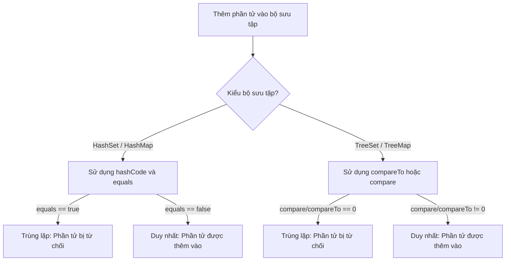
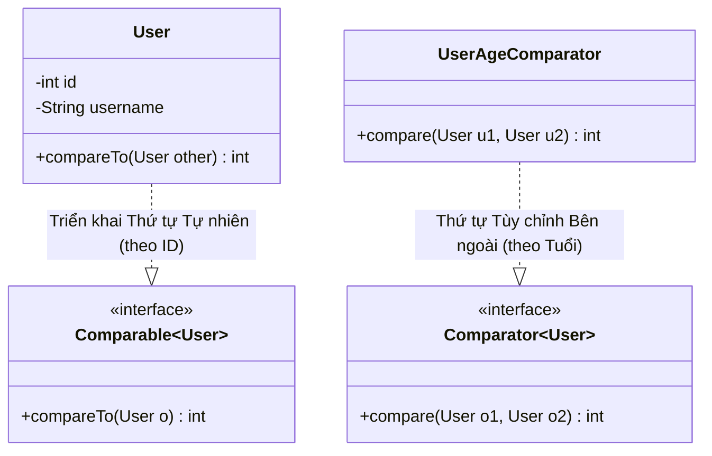

# Comparable và Comparator - Phần 1 (Comparable and Comparator - Part 1)

## Mục tiêu học tập

Tài liệu này tập trung vào một phần trọng tâm của **Comparable và Comparator**. Hãy nghiên cứu từng khái niệm dưới dạng quy tắc Java thực tế, thay vì chỉ học các từ vựng rời rạc.

## Đề cương chi tiết

| Khái niệm | Điều cần biết |
| --- | --- |
| `Comparable` | Comparable: Định nghĩa thứ tự sắp xếp tự nhiên (natural ordering) bên trong lớp được so sánh. |
| `compareTo` | compareTo: compareTo là một phương thức cụ thể trong Comparable và Comparator; hãy tìm hiểu quy tắc Java của nó, các trường hợp sử dụng hợp lệ và trạng thái lỗi thay vì chỉ nhớ tên của nó. |
| `Comparator` | Comparator: Định nghĩa thứ tự sắp xếp tùy chỉnh bên ngoài (external custom ordering) cho các đối tượng. |
| `compare` | compare: compare là một phương thức cụ thể trong Comparable và Comparator; hãy tìm hiểu quy tắc Java của nó, các trường hợp sử dụng hợp lệ và trạng thái lỗi thay vì chỉ nhớ tên của nó. |
| `Natural ordering` | Thứ tự sắp xếp tự nhiên (Natural ordering): Thứ tự sắp xếp tự nhiên là một khái niệm cụ thể trong Comparable và Comparator; hãy tìm hiểu quy tắc Java của nó, các trường hợp sử dụng hợp lệ và trạng thái lỗi thay vì chỉ nhớ tên của nó. |
| `Custom ordering` | Thứ tự sắp xếp tùy chỉnh (Custom ordering): Thứ tự sắp xếp tùy chỉnh là một khái niệm cụ thể trong Comparable và Comparator; hãy tìm hiểu quy tắc Java của nó, các trường hợp sử dụng hợp lệ và trạng thái lỗi thay vì chỉ nhớ tên của nó. |
| `Sort List object` | Sắp xếp đối tượng List (Sort List object): Sắp xếp các đối tượng danh sách thông qua Collections.sort hoặc List.sort. |
| `Sort by multiple criteria` | Sắp xếp theo nhiều tiêu chí (Sort by multiple criteria): Sắp xếp theo nhiều tiêu chí là một khái niệm cụ thể trong Comparable và Comparator; hãy tìm hiểu quy tắc Java của nó, các trường hợp sử dụng hợp lệ và trạng thái lỗi thay vì chỉ nhớ tên của nó. |
| `Comparator.comparing` | Comparator.comparing: Phương thức tĩnh hỗ trợ tạo một Comparator từ một hàm trích xuất khóa. |
| `thenComparing` | thenComparing: thenComparing là một phương thức cụ thể trong Comparable và Comparator; hãy tìm hiểu quy tắc Java của nó, các trường hợp sử dụng hợp lệ và trạng thái lỗi thay vì chỉ nhớ tên của nó. |

## Ghi chú chi tiết

### Comparable

Comparable định nghĩa thứ tự sắp xếp tự nhiên bên trong lớp được so sánh.

`Comparable<T>` là một giao diện generic (`java.lang.Comparable`) được triển khai bởi một lớp để định nghĩa **thứ tự sắp xếp tự nhiên (natural ordering)** của nó. Khi một lớp triển khai `Comparable`, các đối tượng của lớp đó có thể được sắp xếp tự động bằng các công cụ tiện ích bộ sưu tập như `Collections.sort()` hoặc `Arrays.sort()`, và có thể được sử dụng làm các khóa trong các bản đồ được sắp xếp (`TreeMap`) hoặc các phần tử trong các tập hợp được sắp xếp (`TreeSet`) mà không cần cung cấp một bộ so sánh rõ ràng.

#### Ví dụ mã nguồn
```java
public class User implements Comparable<User> {
    private final String username;
    private final int id;

    public User(String username, int id) {
        this.username = username;
        this.id = id;
    }

    @Override
    public int compareTo(User other) {
        // Natural ordering based on ID ascending
        return Integer.compare(this.id, other.id);
    }
}
```

#### Các bẫy và trạng thái lỗi
- **ClassCastException**: Nếu bạn cố gắng sắp xếp một danh sách các đối tượng không triển khai `Comparable` (và không cung cấp một `Comparator`), Java sẽ ném ra ngoại lệ `ClassCastException` tại thời điểm chạy (nếu sử dụng kiểu thô) hoặc lỗi biên dịch (với kiểu generic).
- **Tính nhất quán với Equals**: Chúng tôi khuyên bạn nên (mặc dù không bắt buộc nghiêm ngặt) giữ cho thứ tự tự nhiên nhất quán với `equals`. Nghĩa là, `(x.compareTo(y) == 0) == (x.equals(y))`. Các bộ sưu tập như `TreeSet` và `TreeMap` sử dụng `compareTo` (chứ không phải `equals`) để xác định tính duy nhất; nếu chúng không nhất quán, tập hợp/bản đồ sẽ vi phạm giao ước chung của `Set`/`Map` và hoạt động không mong muốn.

## Tại sao TreeSet và TreeMap yêu cầu tính nhất quán với phương thức Equals

Các bộ sưu tập được sắp xếp như `TreeSet` và `TreeMap` hoạt động khác với các bộ sưu tập thông thường. Không giống như `HashSet` hoặc `HashMap`, vốn xác định tính duy nhất bằng cách sử dụng `Object.hashCode()` và `Object.equals()`, các bộ sưu tập được sắp xếp hoàn toàn phụ thuộc vào phương thức so sánh (`compareTo` hoặc `compare`) để xác định các phần tử trùng lặp. Nếu `compareTo` trả về `0` cho hai phần tử, chúng được coi là giống hệt nhau, bất kể phương thức `equals()` trả về giá trị gì. Nếu thứ tự tự nhiên không nhất quán với `equals()`, các phần tử khác biệt theo định nghĩa của `equals()` sẽ bị bỏ qua một cách âm thầm khi thêm vào một `TreeSet` hoặc `TreeMap`. Điều này phá vỡ giao ước chính thức của các giao diện `Set` và `Map`, vốn được định nghĩa dựa trên `equals()`, dẫn đến mất dữ liệu không mong muốn hoặc các lỗi truy xuất trong mã nguồn làm việc với bộ sưu tập.

### Mô hình tư duy: Giải quyết tính duy nhất trong Java Collections


### Ví dụ mã nguồn: Sự không nhất quán của BigDecimal
```java
import java.math.BigDecimal;
import java.util.HashSet;
import java.util.Set;
import java.util.TreeSet;

public class ConsistencyExample {
    public static void main(String[] args) {
        BigDecimal d1 = new BigDecimal("1.0");
        BigDecimal d2 = new BigDecimal("1.00");

        // 1. HashSet uses hashCode() and equals()
        // d1.equals(d2) is false because scale differs (1 vs 2 decimal places)
        Set<BigDecimal> hashSet = new HashSet<>();
        hashSet.add(d1);
        hashSet.add(d2);
        System.out.println("HashSet size: " + hashSet.size()); // Output: HashSet size: 2

        // 2. TreeSet uses compareTo()
        // d1.compareTo(d2) is 0 because the numerical values are equal
        Set<BigDecimal> treeSet = new TreeSet<>();
        treeSet.add(d1);
        treeSet.add(d2); // Rejected as duplicate!
        System.out.println("TreeSet size: " + treeSet.size()); // Output: TreeSet size: 1
    }
}
```

### Chuỗi nguyên nhân - kết quả
`(x.compareTo(y) == 0) == (x.equals(y))` trả về false &rarr; `TreeSet`/`TreeMap` chỉ dựa vào `compareTo` để kiểm tra tính duy nhất &rarr; Các đối tượng khác biệt theo `equals` nhưng trả về `0` từ `compareTo` được xử lý như các phần tử trùng lặp &rarr; Các phần tử trùng lặp bị từ chối khi chèn &rarr; Xảy ra hiện tượng mất dữ liệu và bộ sưu tập vi phạm giao ước Set/Map tiêu chuẩn của Java Collections.

> Xem thêm: Chi tiết về cách TreeSet và TreeMap sử dụng Comparable để sắp xếp và kiểm tra trùng lặp, được trình bày chi tiết trong [Ch.19 - Collections Framework](../../19-collections-framework/theory/03-treeset-concepts.md).

### compareTo

compareTo là một phương thức cụ thể trong Comparable được sử dụng để định nghĩa các quy tắc thứ tự sắp xếp tự nhiên.

Phương thức `compareTo(T o)` là phương thức trừu tượng duy nhất của giao diện `Comparable`. Nó so sánh đối tượng hiện tại (`this`) với đối tượng được chỉ định `o`.
- Trả về một **số nguyên âm** nếu `this` nhỏ hơn `o`.
- Trả về **không** nếu `this` bằng `o`.
- Trả về một **số nguyên dương** nếu `this` lớn hơn `o`.

#### Ví dụ mã nguồn
```java
// String's compareTo implementation compares characters lexicographically
int result = "apple".compareTo("banana"); // returns a negative number (< 0)
```

#### Các bẫy và trạng thái lỗi
- **Lỗi tràn số khi thực hiện phép trừ**: Một lỗi kinh điển là triển khai `compareTo` bằng phép trừ:
  ```java
  public int compareTo(User other) {
      return this.id - other.id; // DANGER: can overflow!
  }
  ```
  Nếu `this.id` là `Integer.MIN_VALUE` và `other.id` là `1`, phép trừ dẫn đến `Integer.MAX_VALUE` (một số dương), chỉ ra sai lệch rằng `this` lớn hơn `other`. Luôn sử dụng `Integer.compare(a, b)` thay thế.
- **NullPointerException**: `x.compareTo(null)` phải luôn ném ra ngoại lệ `NullPointerException`.

## Tại sao so sánh dựa trên phép trừ dẫn đến lỗi tràn số (Overflow)

Sử dụng phép trừ (ví dụ: `this.id - other.id`) để thực hiện so sánh là một phản mẫu nguy hiểm trong Java. Công thức phép trừ giả định rằng nếu `x > y`, thì `x - y` sẽ dương; tuy nhiên, giả định này bị phá vỡ bởi ranh giới của số học nhị phân có độ chính xác hữu hạn. Trong biểu diễn bù hai (two's complement), việc trừ một số dương cho một số âm lớn (hoặc ngược lại) có thể khiến kết quả vượt quá giá trị tối thiểu hoặc tối đa của kiểu dữ liệu, làm quay vòng giá trị và đảo ngược dấu của kết quả. Khi hiện tượng đảo dấu này xảy ra, thuật toán sắp xếp nhận được kết quả hoàn toàn ngược lại với phép so sánh thực tế, dẫn đến các bộ sưu tập không được sắp xếp, thứ tự sắp xếp sai, hoặc các ngoại lệ vi phạm giao ước lúc chạy.

### Mô hình tư duy: Tràn số khi thực hiện phép trừ trong số bù hai
Hãy so sánh hai giá trị: `x = Integer.MIN_VALUE` ($-2147483648$) và `y = 1`.
Về mặt toán học, $x < y$, nên phép so sánh phải trả về một số âm.
Sử dụng phép trừ:
```text
  10000000 00000000 00000000 00000000   (Integer.MIN_VALUE)
- 00000000 00000000 00000000 00000001   (1)
=====================================
  01111111 11111111 11111111 11111111   (Integer.MAX_VALUE / +2147483647)
```
Bit dấu chuyển từ `1` (âm) sang `0` (dương). Java lúc này kết luận sai rằng $x > y$.

### Ví dụ mã nguồn: Lỗi phép trừ gây ra tràn số
```java
public class SubtractionOverflowDemo {
    public static void main(String[] args) {
        int x = Integer.MIN_VALUE;
        int y = 1;

        // Subtraction method (BUGGY)
        int buggyResult = x - y;
        System.out.println("Buggy Result: " + buggyResult); // Output: Buggy Result: 2147483647 (> 0, indicating x > y!)

        // Proper comparison method (SAFE)
        int safeResult = Integer.compare(x, y);
        System.out.println("Safe Result: " + safeResult);   // Output: Safe Result: -1 (< 0, indicating x < y)
    }
}
```

### Chuỗi nguyên nhân - kết quả
Các giá trị khác dấu được so sánh qua phép trừ &rarr; Hiệu số vượt quá giới hạn tối thiểu hoặc tối đa của kiểu dữ liệu nguyên thủy &rarr; Biểu diễn nhị phân dưới dạng số học bù hai bị tràn số hoặc thiếu số (overflow/underflow) &rarr; Bit dấu của kết quả phép trừ bị đảo ngược &rarr; Bộ so sánh trả về một số dương cho một mối quan hệ nhỏ hơn &rarr; Thuật toán sắp xếp sắp xếp sai vị trí các phần tử hoặc ném ra ngoại lệ vi phạm giao ước.

### Comparator

Comparator định nghĩa thứ tự sắp xếp tùy chỉnh bên ngoài cho các đối tượng.

`Comparator<T>` là một giao diện chức năng (functional interface `java.util.Comparator`) được sử dụng để định nghĩa một **thứ tự sắp xếp tùy chỉnh bên ngoài (external custom ordering)** cho một lớp. Không giống như `Comparable` vốn được nhúng trực tiếp trong chính lớp đó, một `Comparator` có thể được định nghĩa dưới dạng các lớp riêng biệt, lớp vô danh, hoặc các biểu thức lambda. Điều này cho phép nhiều chiến lược sắp xếp khác nhau cho cùng một lớp (ví dụ: sắp xếp nhân viên theo lương, sau đó theo phòng ban).

#### Ví dụ mã nguồn
```java
import java.util.Comparator;

public class EmployeeSalaryComparator implements Comparator<Employee> {
    @Override
    public int compare(Employee e1, Employee e2) {
        return Double.compare(e1.getSalary(), e2.getSalary());
    }
}
```

#### Các bẫy và trạng thái lỗi
- **Sửa đổi đồng thời / Các trường có thể thay đổi**: Nếu bạn sắp xếp một bộ sưu tập và sau đó sửa đổi các trường của một đối tượng mà `Comparator` sử dụng để sắp xếp, trạng thái sắp xếp sẽ trở nên không nhất quán. Bộ sưu tập (như `TreeSet` hoặc `TreeMap`) sẽ thất bại khi truy xuất, xóa hoặc sắp xếp chính xác các phần tử đã sửa đổi.

## Tại sao Java phân tách giữa Comparable và Comparator

Java phân chia khả năng sắp xếp thành `Comparable` and `Comparator` để hỗ trợ nguyên lý đơn nhiệm (single-responsibility principle) và tạo điều kiện cho nhiều chiến lược sắp xếp. Giao diện `Comparable` định nghĩa thứ tự sắp xếp tự nhiên của một lớp, nghĩa là nó đại diện cho logic sắp xếp mặc định, nội tại được viết cứng trực tiếp bên trong chính lớp đó. Tuy nhiên, việc nhúng logic so sánh bên trong lớp là bất khả thi khi làm việc với các lớp của bên thứ ba, hoặc khi một lớp cần được sắp xếp động trong các ngữ cảnh khác nhau (chẳng hạn như sắp xếp nhân viên theo lương trong một dạng xem và theo tên trong một dạng xem khác). Giao diện `Comparator` giải quyết điều này bằng cách hoạt động như một đối tượng chiến lược (strategy object) bên ngoài, cho phép các nhà phát triển định nghĩa một số lượng tùy ý các quy tắc sắp xếp tùy chỉnh tách biệt với định nghĩa lớp.

### Mô hình tư duy: Thứ tự sắp xếp Nội tại (Comparable) so với Bên ngoài (Comparator)


### Ví dụ mã nguồn: Sắp xếp tự nhiên so với Bộ so sánh tùy chỉnh
```java
import java.util.ArrayList;
import java.util.Collections;
import java.util.Comparator;
import java.util.List;

public class SortingComparison {
    public static class User implements Comparable<User> {
        final String name;
        final int id;

        public User(String name, int id) {
            this.name = name;
            this.id = id;
        }

        // Comparable defines the single, default natural order (by ID)
        @Override
        public int compareTo(User other) {
            return Integer.compare(this.id, other.id);
        }

        @Override
        public String toString() {
            return name + "(ID:" + id + ")";
        }
    }

    public static void main(String[] args) {
        List<User> users = new ArrayList<>(List.of(
            new User("Charlie", 3),
            new User("Alice", 1),
            new User("Bob", 2)
        ));

        // 1. Natural Sort using Comparable (by ID)
        Collections.sort(users);
        System.out.println("Natural order: " + users); // Output: Natural order: [Alice(ID:1), Bob(ID:2), Charlie(ID:3)]

        // 2. Custom Sort using an external Comparator (by Name lexicographically)
        users.sort(Comparator.comparing(u -> u.name));
        System.out.println("Custom order:  " + users); // Output: Custom order:  [Alice(ID:1), Bob(ID:2), Charlie(ID:3)]
    }
}
```

### Chuỗi nguyên nhân - kết quả
Lớp yêu cầu một thứ tự mặc định duy nhất, phổ quát &rarr; Triển khai `Comparable` trong chính lớp đó &rarr; Gọi `Collections.sort(list)` mà không cần truyền đối số.
Lớp yêu cầu nhiều thứ tự sắp xếp đặc thù theo ngữ cảnh hoặc không thể sửa đổi &rarr; Định nghĩa các thực thể `Comparator` bên ngoài &rarr; Truyền bộ so sánh vào `list.sort(comparator)` để thực thi động chiến lược đã chọn.

### compare

compare là phương thức trừu tượng trong Comparator được sử dụng để đánh giá hai đối tượng.

Phương thức `compare(T o1, T o2)` là phương thức trừu tượng chính của `Comparator`.
- Trả về một **số nguyên âm** nếu `o1` nhỏ hơn `o2`.
- Trả về **không** nếu `o1` bằng `o2`.
- Trả về một **số nguyên dương** nếu `o1` lớn hơn `o2`.

#### Ví dụ mã nguồn
```java
Comparator<String> lengthComparator = (s1, s2) -> Integer.compare(s1.length(), s2.length());
int result = lengthComparator.compare("short", "extremelyLong"); // negative
```

#### Các bẫy và trạng thái lỗi
- **An toàn với Null**: Không giống như `compareTo` (nơi `x.compareTo(null)` ném ra NPE theo giao ước), `compare(o1, o2)` có thể nhận `null` cho một hoặc cả hai tham số. Các triển khai phải quyết định cách xử lý `null` (ví dụ: sử dụng `Comparator.nullsFirst()`) để tránh ném ra ngoại lệ `NullPointerException` không mong muốn.
- **Lỗi bất đối xứng (Asymmetry Bug)**: Triển khai phải thỏa mãn tính bất đối xứng: `signum(compare(x, y)) == -signum(compare(y, x))`. Nếu không đáp ứng, các thuật toán sắp xếp có thể lặp vô hạn hoặc tạo ra kết quả sai.

## Tại sao giao ước bắc cầu (Transitivity) lại quan trọng đối với việc sắp xếp

Các giao ước toán học cho `Comparable.compareTo` và `Comparator.compare` quy định ba thuộc tính: tính phản xạ (reflexivity), tính đối xứng (symmetry), và tính bắc cầu (transitivity). Trong số này, giao ước bắc cầu là quan trọng nhất đối với tính chính xác: nếu phần tử $A$ lớn hơn phần tử $B$ ($compare(A, B) > 0$), và phần tử $B$ lớn hơn phần tử $C$ ($compare(B, C) > 0$), thì phần tử $A$ phải lớn hơn phần tử $C$ ($compare(A, C) > 0$). Tính bắc cầu đảm bảo rằng một tập hợp các phần tử có thể được ánh xạ vào một chuỗi tuyến tính, nhất quán về mặt logic. Nếu một bộ so sánh vi phạm tính bắc cầu (tạo ra các ưu tiên dạng vòng lặp như Kéo-Búa-Bao), các thuật toán sắp xếp hiện đại như TimSort sẽ phát hiện ra sự mâu thuẫn logic trong giai đoạn trộn (merge phase), ném ra một ngoại lệ thời gian chạy `IllegalArgumentException`. Trong các phiên bản JDK cũ hơn hoặc các thuật toán khác, việc vi phạm tính bắc cầu có thể dẫn đến hỏng hóc dữ liệu trong im lặng, vòng lặp vô hạn, hoặc các phần tử bị mất hoàn toàn trong quá trình sắp xếp.

### Mô hình tư duy: Thứ tự bắc cầu tuyến tính so với Mâu thuẫn vòng lặp
```mermaid
graph TD
    subgraph Non-Transitive Cycle (Rock-Paper-Scissors - BUG) [Chu trình phi bắc cầu (Búa-Bao-Kéo - LỖI)]
        Rock -->|thắng| Scissors
        Scissors -->|thắng| Paper
        Paper -->|thắng| Rock
    end
    subgraph Transitive Order (Linear - CORRECT) [Thứ tự bắc cầu (Tuyến tính - ĐÚNG)]
        A[A: 3] -->|lớn hơn| B[B: 2]
        B -->|lớn hơn| C[C: 1]
        A -->|lớn hơn| C
    end
```

### Ví dụ mã nguồn: Bộ so sánh phi bắc cầu kích hoạt ngoại lệ
```java
import java.util.ArrayList;
import java.util.Collections;
import java.util.List;

public class TransitivityViolationDemo {
    public static void main(String[] args) {
        // Create a list representing a rock-paper-scissors game
        List<String> rps = new ArrayList<>();
        for (int i = 0; i < 15; i++) {
            rps.add("Rock");
            rps.add("Paper");
            rps.add("Scissors");
        }

        try {
            // A cyclic, non-transitive comparator
            rps.sort((a, b) -> {
                if (a.equals(b)) return 0;
                if (a.equals("Rock") && b.equals("Scissors")) return 1;
                if (a.equals("Scissors") && b.equals("Paper")) return 1;
                if (a.equals("Paper") && b.equals("Rock")) return 1;
                return -1; // Reverse relationships
            });
            System.out.println("Sorted: " + rps);
        } catch (IllegalArgumentException e) {
            System.out.println("Caught Expected Error: " + e.getMessage());
            // Output: Caught Expected Error: Comparison method violates its general contract!
        }
    }
}
```

### Chuỗi nguyên nhân - kết quả
Phương thức so sánh biểu hiện các mối quan hệ vòng lặp phi bắc cầu &rarr; Thuật toán sắp xếp (TimSort) xử lý các phần tử bằng cách trộn các chuỗi chạy (run) &rarr; Logic trộn gặp phải sự mâu thuẫn (ví dụ: $A > B$ và $B > C$ nhưng $C > A$) &rarr; Kiểm tra xác thực thời điểm chạy thất bại &rarr; JVM hủy bỏ thực thi và ném ra `IllegalArgumentException: Comparison method violates its general contract!`.

### Thứ tự sắp xếp tự nhiên (Natural ordering)

Thứ tự sắp xếp tự nhiên (Natural ordering) là thứ tự mặc định được định nghĩa bởi triển khai `compareTo` của lớp.

Thứ tự sắp xếp tự nhiên đề cập đến thứ tự sắp xếp mặc định được định nghĩa bên trong một lớp bằng cách triển khai `Comparable`. Đối với các lớp tích hợp sẵn của Java, thứ tự sắp xếp tự nhiên đã được định nghĩa trước:
- `String` sử dụng thứ tự từ điển (so sánh giá trị Unicode).
- Các lớp bao bọc số (`Integer`, `Double`, v.v.) sử dụng thứ tự số tăng dần.
- `LocalDate` và `LocalDateTime` sử dụng thứ tự thời gian.

#### Ví dụ mã nguồn
```java
List<String> fruits = new ArrayList<>(List.of("Orange", "Apple", "Banana"));
Collections.sort(fruits); // Uses String's natural ordering
System.out.println(fruits); // [Apple, Banana, Orange]
```

#### Các bẫy và trạng thái lỗi
- **Phân biệt hoa thường**: Thứ tự tự nhiên của `String` phân biệt chữ hoa chữ thường (lexicographical), nghĩa là các chữ cái in hoa đứng trước các chữ cái viết thường (ví dụ: `"Zebra"` đứng trước `"apple"` vì `'Z'` có mã ASCII 90 và `'a'` là 97).

### Thứ tự sắp xếp tùy chỉnh (Custom ordering)

Thứ tự sắp xếp tùy chỉnh (Custom ordering) là một thứ tự thay thế được cung cấp từ bên ngoài bởi một `Comparator`.

Thứ tự sắp xếp tùy chỉnh cho phép sắp xếp các đối tượng theo một trình tự khác với thứ tự sắp xếp tự nhiên của chúng, hoặc sắp xếp các đối tượng của một lớp không triển khai `Comparable`. Nó đạt được bằng cách cung cấp một `Comparator`.

#### Ví dụ mã nguồn
```java
List<String> fruits = new ArrayList<>(List.of("Orange", "Apple", "Banana"));
// Case-insensitive custom ordering
fruits.sort(String.CASE_INSENSITIVE_ORDER);
System.out.println(fruits); // [Apple, Banana, Orange]
```

#### Các bẫy và trạng thái lỗi
- **Vi phạm giao ước**: Trong Java 7 trở lên, các thuật toán sắp xếp sử dụng TimSort, vốn thực thi nghiêm ngặt các quy tắc toán học của giao ước `Comparator` (tính phản xạ, bắc cầu, và đối xứng). Nếu một bộ so sánh tùy chỉnh vi phạm các quy tắc này, JVM sẽ ném ra ngoại lệ `IllegalArgumentException: Comparison method violates its general contract!`.

### Sắp xếp đối tượng List (Sort List object)

Sắp xếp đối tượng List (Sort List object) thông qua `Collections.sort` hoặc `List.sort`.

Việc sắp xếp một danh sách có thể được thực hiện bằng cách sử dụng:
1. `Collections.sort(List<T> list)`: Sắp xếp dựa trên thứ tự sắp xếp tự nhiên.
2. `Collections.sort(List<T> list, Comparator<? super T> c)`: Sắp xếp bằng bộ so sánh được chỉ định.
3. `List.sort(Comparator<? super T> c)`: (Java 8+) Phương thức thực thể trên giao diện `List`. Để sắp xếp một danh sách bằng thứ tự tự nhiên, hãy truyền `null` hoặc `Comparator.naturalOrder()`.

`List.sort()` thường được ưu tiên hơn `Collections.sort()` vì nó là phương thức thực thể và có thể được ghi đè bởi các triển khai danh sách cụ thể để tối ưu hóa hiệu năng.

#### Ví dụ mã nguồn
```java
List<Integer> numbers = new ArrayList<>(List.of(3, 1, 4, 1, 5));
// Using List.sort with natural ordering
numbers.sort(Comparator.naturalOrder()); // [1, 1, 3, 4, 5]
// Using Collections.sort
Collections.sort(numbers, Comparator.reverseOrder()); // [5, 4, 3, 1, 1]
```

#### Các bẫy và trạng thái lỗi
- **Các bộ sưu tập không thể sửa đổi/Kích thước cố định**: Cố gắng sắp xếp một danh sách không thể sửa đổi (ví dụ: được tạo qua `List.of()`, `List.copyOf()`, hoặc `Collections.unmodifiableList()`) sẽ ném ra `UnsupportedOperationException` lúc chạy. Lưu ý rằng `Arrays.asList()` trả về một danh sách có kích thước cố định nhưng có thể thay đổi, nên việc sắp xếp được phép thực hiện, nhưng nó trực tiếp thay đổi mảng bên dưới.

### Sắp xếp theo nhiều tiêu chí (Sort by multiple criteria)

Sắp xếp các đối tượng theo một chuỗi các khóa bằng cách sử dụng thenComparing.

Sắp xếp theo nhiều tiêu chí liên quan đến việc sắp xếp các đối tượng theo một khóa chính, và sau đó giải quyết các trường hợp hòa bằng các khóa phụ, khóa thứ ba, v.v. Điều này dễ dàng đạt được trong Java 8+ bằng cách liên kết các thực thể `Comparator` bằng các phương thức tĩnh như `Comparator.comparing` và các phương thức mặc định như `thenComparing`.

#### Ví dụ mã nguồn
```java
List<Employee> list = getEmployees();
// Sort by department, then by salary (ascending)
list.sort(Comparator.comparing(Employee::getDepartment)
                    .thenComparingDouble(Employee::getSalary));
```

#### Các bẫy và trạng thái lỗi
- **Vấn đề suy luận kiểu**: Đôi khi trình biên dịch thất bại khi suy luận các kiểu dữ liệu khi liên kết các phương thức bộ so sánh nếu các kiểu không được khai báo rõ ràng hoặc nếu các tham chiếu phương thức bị nạp chồng. Việc cung cấp các kiểu rõ ràng trong các đối số generic (ví dụ: `Comparator.<Employee, String>comparing(...)`) sẽ giải quyết vấn đề này.
- **NPE trên các phương thức liên kết**: Nếu bất kỳ hàm trích xuất khóa trung gian nào trả về `null`, bộ so sánh liên kết sẽ ném ra ngoại lệ `NullPointerException`.

### Comparator.comparing

Phương thức tĩnh hỗ trợ tạo một Comparator từ một hàm trích xuất khóa.

`Comparator.comparing` là một phương thức nhà máy tĩnh (static factory method) được giới thiệu trong Java 8. Nó nhận một hàm trích xuất khóa (key extractor function) và trả về một `Comparator` so sánh các đối tượng dựa trên khóa được trích xuất đó. Các phiên bản nạp chồng (overloaded) cho phép chỉ định một bộ so sánh tùy chỉnh cho khóa được trích xuất. Ngoài ra còn có các phiên bản chuyên biệt cho kiểu nguyên thủy: `comparingInt`, `comparingLong`, và `comparingDouble` để tránh chi phí tự động đóng hộp (autoboxing).

#### Ví dụ mã nguồn
```java
// Avoids boxing from double to Double:
Comparator<Employee> salaryComp = Comparator.comparingDouble(Employee::getSalary);
```

#### Các bẫy và trạng thái lỗi
- **Giá trị Null**: Nếu hàm trích xuất khóa trả về `null`, việc gọi `compare` sẽ dẫn đến ngoại lệ `NullPointerException`. Để xử lý các khóa null, hãy bao bọc bộ trích xuất hoặc bộ so sánh khóa với `Comparator.nullsFirst` hoặc `Comparator.nullsLast`.

### thenComparing

Phương thức mặc định trong Comparator để liên kết một tiêu chí so sánh phụ.

`thenComparing` là một phương thức mặc định trong giao diện `Comparator`. Nó trả về một bộ so sánh thứ tự từ điển kết hợp với một bộ so sánh khác. Nếu bộ so sánh đầu tiên coi hai phần tử là bằng nhau (trả về 0), bộ so sánh thứ hai sẽ được gọi để giải quyết trường hợp hòa đó.

#### Ví dụ mã nguồn
```java
Comparator<Employee> comp = Comparator.comparing(Employee::getLastName)
                                      .thenComparing(Employee::getFirstName);
```

#### Các bẫy và trạng thái lỗi
- **Hiệu năng**: Liên kết quá nhiều lệnh gọi `thenComparing` dựa trên đối tượng có thể gây ra việc cấp phát quá nhiều thực thể (các thực thể lambda) và chi phí gọi phương thức. Đối với việc sắp xếp hiệu năng cao, hãy cân nhắc so sánh kiểu nguyên thủy tùy chỉnh trong một khối duy nhất thay vì liên kết nhiều bộ trích xuất chức năng.

---

## Ví Dụ Thực Tế: Sắp xếp danh sách nhân viên theo phòng ban sau đó theo lương

Trong các ứng dụng thực tế, sắp xếp các bản ghi theo nhiều tiêu chí là cực kỳ phổ biến. Dưới đây là một ví dụ thực tế hoàn chỉnh chỉ ra cách sắp xếp danh sách các đối tượng `Employee` trước tiên theo phòng ban (thứ tự từ điển) và sau đó theo lương (giảm dần) trong trường hợp phòng ban trùng nhau.

### Bước 1: Định nghĩa lớp Employee
```java
public class Employee {
    private final String name;
    private final String department;
    private final double salary;

    public Employee(String name, String department, double salary) {
        this.name = name;
        this.department = department;
        this.salary = salary;
    }

    public String getName() { return name; }
    public String getDepartment() { return department; }
    public double getSalary() { return salary; }

    @Override
    public String toString() {
        return String.format("%s (%s: $%.2f)", name, department, salary);
    }
}
```

### Bước 2: Logic sắp xếp (Liên kết trong Java 8)
```java
import java.util.ArrayList;
import java.util.Comparator;
import java.util.List;

public class EmployeeSorter {
    public static void main(String[] args) {
        List<Employee> employees = new ArrayList<>();
        employees.add(new Employee("Alice", "HR", 50000));
        employees.add(new Employee("Bob", "IT", 80000));
        employees.add(new Employee("Charlie", "IT", 90000));
        employees.add(new Employee("David", "HR", 60000));

        // Comparator chaining: 
        // 1. Sort by department ascending (natural order of String)
        // 2. Sort by salary descending (using reversed() on double comparing)
        Comparator<Employee> deptThenSalaryComp = Comparator
            .comparing(Employee::getDepartment)
            .thenComparing(Comparator.comparingDouble(Employee::getSalary).reversed());

        employees.sort(deptThenSalaryComp);

        // Output:
        // David (HR: $60000.00)
        // Alice (HR: $50000.00)
        // Charlie (IT: $90000.00)
        // Bob (IT: $80000.00)
        employees.forEach(System.out::println);
    }
}
```

## Các lỗi thường gặp

Dưới đây là các bẫy và lỗi nghiêm trọng mà các nhà phát triển hay gặp phải với Comparable và Comparator:

### 1. Lỗi tràn số khi thực hiện phép trừ (Integer.compare so với phép trừ)
Sử dụng phép trừ để thực hiện so sánh là một phản mẫu nguy hiểm:
```java
// BUGGY: Do not do this!
public int compareTo(Product other) {
    return this.id - other.id; 
}
```
Nếu `this.id = Integer.MIN_VALUE` (-2147483648) và `other.id = 1`, thì `-2147483648 - 1` sẽ bị tràn số thành `2147483647` (một số dương). Java sẽ coi `this` lớn hơn `other` một cách sai lầm.
**Khắc phục:** Luôn sử dụng các phương thức trợ giúp kiểu nguyên thủy:
```java
public int compareTo(Product other) {
    return Integer.compare(this.id, other.id);
}
```

### 2. Sắp xếp các bộ sưu tập bất biến
`Collections.sort()` và `List.sort()` thay đổi trực tiếp trên bộ sưu tập gốc. Nếu bộ sưu tập là bất biến, chúng sẽ ném ra ngoại lệ tại thời điểm chạy.
```java
List<Integer> list = List.of(3, 1, 2); // Immutable
list.sort(Comparator.naturalOrder()); // Throws UnsupportedOperationException!
```
**Khắc phục:** Tạo một bản sao có thể sửa đổi trước, hoặc sử dụng stream:
```java
List<Integer> mutableList = new ArrayList<>(list);
mutableList.sort(Comparator.naturalOrder()); // Works!

// Or using Stream API (returns a new list):
List<Integer> sortedList = list.stream().sorted().toList();
```

### 3. Sự không nhất quán giữa compareTo và equals
Nếu `x.compareTo(y) == 0` nhưng `x.equals(y)` trả về `false`, việc chèn cả hai vào `TreeSet` hoặc `TreeMap` sẽ coi chúng là phần tử trùng lặp, và chỉ phần tử đầu tiên được lưu trữ.
```java
import java.math.BigDecimal;
import java.util.HashSet;
import java.util.TreeSet;

BigDecimal d1 = new BigDecimal("1.0");
BigDecimal d2 = new BigDecimal("1.00");

// HashSet uses equals() -> d1 and d2 are NOT equal, so size is 2
HashSet<BigDecimal> hashSet = new HashSet<>();
hashSet.add(d1);
hashSet.add(d2); // size = 2

// TreeSet uses compareTo() -> d1.compareTo(d2) is 0, so size is 1
TreeSet<BigDecimal> treeSet = new TreeSet<>();
treeSet.add(d1);
treeSet.add(d2); // size = 1 (d2 is rejected as a duplicate!)
```

### 4. Lỗi NullPointerException với các bộ so sánh mặc định
Truyền danh sách chứa các phần tử `null` vào các hàm sắp xếp tiêu chuẩn sẽ dẫn đến ngoại lệ `NullPointerException`:
```java
List<String> names = Arrays.asList("Alice", null, "Bob");
Collections.sort(names); // Throws NullPointerException!
```
**Khắc phục:** Bao bọc phép so sánh bằng `nullsFirst` hoặc `nullsLast`:
```java
names.sort(Comparator.nullsFirst(Comparator.naturalOrder())); // [null, Alice, Bob]
```

## Các câu hỏi ôn tập thường gặp

- Khái niệm nào ở đây là quy tắc thời điểm biên dịch?
- Khái niệm nào ở đây ảnh hưởng đến hành vi thời điểm chạy?
- Khái niệm nào ở đây có khả năng là bẫy phỏng vấn?

## Liên kết tham khảo

- https://docs.oracle.com/en/java/javase/21/docs/api/java.base/java/lang/Comparable.html (Comparable Interface Specification)
- https://docs.oracle.com/en/java/javase/21/docs/api/java.base/java/util/Comparator.html (Comparator Interface Specification)
- https://docs.oracle.com/en/java/javase/21/docs/api/java.base/java/util/Collections.html#sort(java.util.List) (Collections.sort contract)
