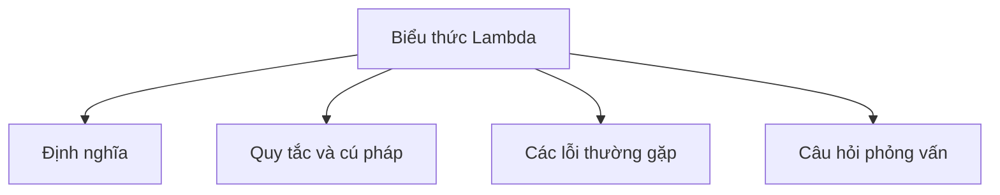

# 21 - Biểu Thức Lambda (Lambda Expression)

Chủ đề này tuân theo đề cương chính trong [outline.md](../outline.md). Mục tiêu là hiểu sâu sắc từng khái niệm để có thể giải thích, nhận biết trong mã nguồn và trả lời các câu hỏi phỏng vấn.

## Thứ Tự Học Tập (Study Order)

- [Khái niệm về Lambda (What Is A Lambda Concepts)](theory/01-what-is-a-lambda-concepts.md)
- [Lambda với Collection (Lambda With Collection Concepts)](theory/02-lambda-with-collection-concepts.md)
- [Thuật ngữ chính (Key Terms)](terms/01-key-terms.md)

## Danh Sách Kiểm Tra Đề Cương (Outline Checklist)

- Lambda là gì? (What is a lambda?)
- Cú pháp Lambda (Lambda syntax)
- Interface chức năng (Functional interface)
- `@FunctionalInterface`
- Tham chiếu phương thức (Method reference):
  - Tham chiếu phương thức tĩnh (static method reference)
  - Tham chiếu phương thức thực thể (instance method reference)
  - Tham chiếu constructor (constructor reference)
- Chụp biến (Variable capture)
- Hiệu dụng final (Effectively final)
- Lambda với Collection (Lambda with Collection)
- Lambda với Thread (Lambda with Thread)
- Lambda với Comparator (Lambda with Comparator)

## Tự Kiểm Tra (Self-Check)

1. Tại sao trình biên dịch Java biên dịch biểu thức lambda thành các lệnh `invokedynamic` và các phương thức bootstrap động thay vì các lớp nội danh (anonymous inner class) truyền thống? (Những lợi ích về nạp lớp - class loading và dung lượng bộ nhớ thời gian chạy - runtime footprint là gì?)
2. Tại sao các biến cục bộ được closure của lambda chụp lại (capture) phải là final hoặc hiệu dụng final (effectively final), trong khi các biến thực thể (instance variable) và biến tĩnh (static variable) lại được miễn trừ khỏi quy tắc này?
3. Các loại tham chiếu phương thức (method reference) khác nhau (static, bound instance, unbound instance, constructor reference) khác nhau như thế nào về cách chúng xác định đối tượng nhận và ánh xạ danh sách tham số tới chữ ký phương thức mục tiêu ở bên dưới?
4. Tại sao biểu thức lambda không thể ném ra các ngoại lệ đã được kiểm tra (checked exception) trừ khi chúng được khai báo tường minh bởi phương thức trừu tượng của functional interface mục tiêu, và cơ chế nào thực thi hoặc bỏ qua ràng buộc này?
5. Tại sao việc tái cấu trúc (refactoring) các lớp vô danh thành lambda lại thay đổi ngữ nghĩa của từ khóa `this` và việc ẩn biến (variable shadowing), và cơ chế phạm vi (scoping mechanism) cơ bản cho cả hai là gì?

## Thẻ Anki (Anki Cards)

- [Cơ bản (Basic)](anki/basic.tsv)
- [Cơ bản Mở rộng (Basic Extra)](anki/basic-extra.tsv)
- [Điền vào chỗ trống (Cloze)](anki/cloze.tsv)
- [Câu hỏi code (Code Question)](anki/code-question.tsv)

## Biểu Đồ Tổng Quan Mermaid (Mermaid Overview)

## Liên Kết Tham Khảo (Reference Links)

- https://docs.oracle.com/javase/tutorial/java/javaOO/lambdaexpressions.html
