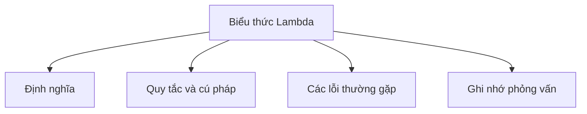

# 21 - Biểu Thức Lambda (Lambda Expression)

Chủ đề này bám sát đề cương chính trong [outline.md](../outline.md). Mục tiêu là hiểu sâu từng khái niệm để có thể giải thích, nhận diện trong mã nguồn và trả lời các câu hỏi phỏng vấn.

## Thứ Tự Học Tập (Study Order)

- [Khái Niệm Lambda Là Gì](theory/01-what-is-a-lambda-concepts.md)
- [Khái Niệm Lambda Với Collection](theory/02-lambda-with-collection-concepts.md)
- [Thuật Ngữ Chính](terms/01-key-terms.md)

## Checklist Đề Cương (Outline Checklist)

- Lambda là gì?
- Cú pháp lambda
- Giao diện chức năng (Functional Interface)
- @FunctionalInterface
- Tham chiếu phương thức (Method reference):
  - tham chiếu phương thức tĩnh (static method reference)
  - tham chiếu phương thức thực thể (instance method reference)
  - tham chiếu hàm khởi tạo (constructor reference)
- Thu nạp biến (Variable capture)
- Thực sự hằng (Effectively final)
- Lambda với Collection
- Lambda với Thread
- Lambda với Comparator

## Tự Kiểm Tra (Self-Check)

1. Tại sao trình biên dịch Java lại biên dịch biểu thức lambda thành các chỉ thị `invokedynamic` và các phương thức bootstrap động thay vì các lớp nội danh (anonymous inner class) truyền thống? (Lợi ích về tải lớp và dung lượng bộ nhớ khi chạy là gì?)
2. Tại sao các biến cục bộ được thu nạp (captured) bởi các closure lambda phải là `final` hoặc thực sự hằng (`effectively final`), trong khi các biến thực thể và biến tĩnh lại được miễn trừ khỏi quy tắc này?
3. Làm thế nào mà các kiểu tham chiếu phương thức khác nhau (tĩnh, thực thể ràng buộc - bound instance, thực thể không ràng buộc - unbound instance, tham chiếu hàm khởi tạo) khác nhau trong việc xác định đối tượng nhận và ánh xạ danh sách tham số tới chữ ký phương thức đích bên dưới?
4. Tại sao một biểu thức lambda không thể ném ra ngoại lệ được kiểm tra (checked exception) trừ khi chúng được khai báo tường minh bởi phương thức trừu tượng của giao diện chức năng đích, và cơ chế nào thực thi hoặc bỏ qua ràng buộc này?
5. Tại sao việc cấu trúc lại (refactoring) các lớp nội danh thành lambda lại làm thay đổi ngữ nghĩa của từ khóa `this` và cơ chế che bóng biến (variable shadowing), và cơ chế phạm vi (scoping) cơ bản cho cả hai là gì?

## Thẻ Anki (Anki Cards)

- [Cơ Bản (Basic)](anki/basic.tsv)
- [Cơ Bản Mở Rộng (Basic Extra)](anki/basic-extra.tsv)
- [Điền Khuyết (Cloze)](anki/cloze.tsv)
- [Câu Hỏi Code (Code Question)](anki/code-question.tsv)

## Tổng Quan Sơ Đồ Mermaid (Mermaid Overview)

## Liên Kết Tham Khảo (Reference Links)

- https://docs.oracle.com/javase/tutorial/java/javaOO/lambdaexpressions.html
