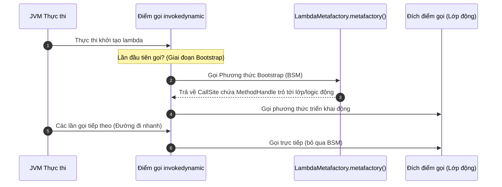
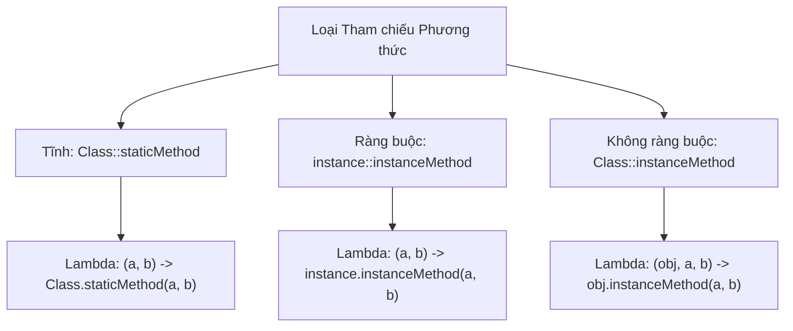

# Biểu Thức Lambda - Phần 1 (Lambda Expression - Part 1)

## Mục Tiêu Học Tập (Learning Goal)

Tài liệu này đề cập đến một phần trọng tâm của **Biểu Thức Lambda**. Hãy nghiên cứu từng khái niệm như một quy tắc Java thực tế, chứ không phải là những thuật ngữ riêng lẻ.

## Phạm Vi Outline (Outline Coverage)

| Khái niệm (Concept) | Những điều cần biết (What to know) |
| --- | --- |
| `What is a lambda?` | Một biểu thức lambda là một khối giống như hàm nhỏ gọn được sử dụng ở những nơi mong đợi một interface chức năng (functional interface). |
| `Lambda syntax` | Một biểu thức lambda là một khối giống như hàm nhỏ gọn được sử dụng ở những nơi mong đợi một interface chức năng (functional interface). |
| `Functional interface` | Một functional interface có đúng một phương thức trừu tượng và có thể được triển khai bằng một biểu thức lambda. |
| `@FunctionalInterface` | `@FunctionalInterface` là một khái niệm cụ thể trong Biểu thức Lambda; hãy tìm hiểu quy tắc Java, các trường hợp sử dụng hợp lệ và lỗi thường gặp của nó thay vì chỉ biết mỗi tên gọi. |
| `Method reference:` | Tham chiếu phương thức (Method reference) là một nhóm các quy tắc liên quan trong Biểu thức Lambda nhóm lại một số chi tiết liên quan. |
| `static method reference` | Static có nghĩa là thành viên thuộc về lớp chứ không thuộc về một đối tượng cụ thể nào. |
| `instance method reference` | Tham chiếu phương thức thực thể (instance method reference) là một khái niệm cụ thể trong Biểu thức Lambda; hãy tìm hiểu quy tắc Java, các trường hợp sử dụng hợp lệ và lỗi thường gặp của nó thay vì chỉ biết mỗi tên gọi. |
| `constructor reference` | Tham chiếu constructor (constructor reference) là một khái niệm cụ thể trong Biểu thức Lambda; hãy tìm hiểu quy tắc Java, các trường hợp sử dụng hợp lệ và lỗi thường gặp của nó thay vì chỉ biết mỗi tên gọi. |
| `Variable capture` | Chụp biến (Variable capture) là một khái niệm cụ thể trong Biểu thức Lambda; hãy tìm hiểu quy tắc Java, các trường hợp sử dụng hợp lệ và lỗi thường gặp của nó thay vì chỉ biết mỗi tên gọi. |
| `Effectively final` | Final có nghĩa là biến, phương thức, lớp hoặc tham số bị hạn chế thay đổi sau đó theo một cách cụ thể. |

## Ghi Chú Chi Tiết (Detailed Notes)

### Lambda là gì? (What is a lambda?)

Một biểu thức lambda là một khối giống như hàm nhỏ gọn được sử dụng ở những nơi mong đợi một interface chức năng (functional interface).

Nó quan trọng vì các API Java hiện đại sử dụng rất nhiều các đường ống (pipeline) kiểu hàm. Một sự nhầm lẫn phổ biến là quên mất thao tác nào là lười biếng (lazy evaluation) và thao tác nào thực sự kích hoạt việc thực thi.

Kiểm tra thực tế:
- Định nghĩa `Lambda là gì?` trong một câu.
- Nhận biết `Lambda là gì?` trong mã nguồn, câu lệnh, tài liệu hoặc câu hỏi phỏng vấn.
- Giải thích một lỗi, hạn chế hoặc đánh đổi liên quan đến `Lambda là gì?`.

Ví dụ nhỏ hoặc mô hình tư duy:
- `n -> n > 0` là một lambda được sử dụng làm vị từ (predicate).

#### Xác định kiểu mục tiêu của Functional Interface (Functional Interface Target Typing)
Bản thân một lambda không có kiểu tường minh riêng. Nó được liên kết với một kiểu tại thời điểm biên dịch bằng cách xem xét ngữ cảnh (gọi là **xác định kiểu mục tiêu - target typing**). Kiểu mục tiêu phải là một functional interface.
```java
// Kiểu mục tiêu là Runnable
Runnable runTask = () -> System.out.println("Đang thực thi...");

// Kiểu mục tiêu là Predicate<Integer>
java.util.function.Predicate<Integer> isPositive = n -> n > 0;
```

### Tại Sao Lambda Sử Dụng invokedynamic Và Các Phương Thức Bootstrap (Why Lambdas Use invokedynamic and Bootstrap Methods)

Các lớp nội danh vô danh (anonymous inner class) truyền thống biên dịch thành các tệp lớp riêng biệt (ví dụ: `EnclosingClass$1.class`). Việc tạo và nạp các tệp lớp này làm tiêu tốn dung lượng ổ đĩa, tăng kích thước gói JAR và phát sinh chi phí IO của bộ nạp lớp (class loader) khi khởi động. Thay vì dịch các biểu thức lambda thành các lớp nội danh, trình biên dịch Java sử dụng lệnh `invokedynamic` (Indy) được giới thiệu trong Java 7, cùng với các phương thức bootstrap động. Khi một lambda được biên dịch, trình biên dịch sẽ tạo ra một công thức để xây dựng thực thể functional interface, phát ra một điểm gọi `invokedynamic` và một phương thức trợ giúp riêng tư chứa logic của thân lambda. Tại thời điểm chạy, lần đầu tiên lệnh này được chạm tới, một phương thức bootstrap (cụ thể là `LambdaMetafactory.metafactory`) sẽ được gọi để liên kết động điểm gọi với một đích đến của điểm gọi (ví dụ: một lớp được tạo động hoặc một handle phương thức trực tiếp). Điều này tránh được việc tạo các tệp `.class` tĩnh riêng biệt trên đĩa, giảm chi phí nạp lớp và nhường việc tối ưu hóa cho trình biên dịch JIT của JVM.

#### Mô hình tư duy: Vòng đời khởi tạo Lambda (Mental Model: Lambda Bootstrapping Lifecycle)


#### Ví dụ mã nguồn: Kết quả tạo lớp động (Code Example: Dynamic Class Generation Output)
```java
public class LambdaCompilationDemo {
    public static void main(String[] args) {
        Runnable r = () -> System.out.println("Xin chào từ Lambda!");
        r.run();
        // Kết quả:
        // Xin chào từ Lambda!
        
        System.out.println(r.getClass().getName());
        // Kết quả:
        // LambdaCompilationDemo$$Lambda$1/0x0000000801000840 (tên lớp được tạo động)
    }
}
```

#### Chuỗi nguyên nhân - kết quả (Cause-Effect Chain)
```
Lambda được viết trong mã nguồn
  │
  ▼
Trình biên dịch biên dịch thân hàm thành một phương thức private của lớp và phát ra invokedynamic tại điểm gọi
  │
  ▼
Thời gian chạy chạm tới điểm gọi lần đầu tiên
  │
  ▼
LambdaMetafactory tạo lớp/lớp bọc trong bộ nhớ tại thời điểm chạy
  │
  ▼
JVM liên kết MethodHandle với điểm gọi
  │
  ▼
Các cuộc gọi trong tương lai bỏ qua việc tạo lớp tại thời điểm chạy và thực thi gọi trực tiếp (đường đi nhanh)
```

### Cú pháp Lambda (Lambda syntax)

Một biểu thức lambda là một khối giống như hàm nhỏ gọn được sử dụng ở những nơi mong đợi một interface chức năng (functional interface).

Nó quan trọng vì các API Java hiện đại sử dụng rất nhiều các đường ống (pipeline) kiểu hàm. Một sự nhầm lẫn phổ biến là quên mất thao tác nào là lười biếng (lazy evaluation) và thao tác nào thực sự kích hoạt việc thực thi.

Kiểm tra thực tế:
- Định nghĩa `Cú pháp Lambda` trong một câu.
- Nhận biết `Cú pháp Lambda` trong mã nguồn, câu lệnh, tài liệu hoặc câu hỏi phỏng vấn.
- Giải thích một lỗi, hạn chế hoặc đánh đổi liên quan đến `Cú pháp Lambda`.

Ví dụ nhỏ hoặc mô hình tư duy:
- `n -> n > 0` là một lambda được sử dụng làm vị từ (predicate).

#### Ví dụ mã nguồn: Các biến thể cú pháp (Code Example: Syntax Variations)
```java
// 1. Không có tham số
Runnable r = () -> System.out.println("Không tham số");

// 2. Một tham số (dấu ngoặc đơn và kiểu dữ liệu là tùy chọn)
java.util.function.Consumer<String> c1 = s -> System.out.println(s);
java.util.function.Consumer<String> c2 = (s) -> System.out.println(s);
java.util.function.Consumer<String> c3 = (String s) -> System.out.println(s);

// 3. Nhiều tham số (bắt buộc phải có dấu ngoặc đơn)
java.util.function.BinaryOperator<Integer> add = (a, b) -> a + b;

// 4. Thân hàm dạng khối (bắt buộc phải có dấu ngoặc nhọn, các câu lệnh, dấu chấm phẩy và từ khóa return)
java.util.function.BinaryOperator<Integer> calc = (a, b) -> {
    int sum = a + b;
    return sum;
};
```

#### Lỗi thường gặp: Sử dụng sai dấu ngoặc nhọn và từ khóa return (Common Mistake: Incorrect Braces and return Keywords)
- Thân lambda chỉ có một biểu thức duy nhất có thể ngầm định trả về một giá trị mà không cần dấu ngoặc nhọn hoặc từ khóa `return`.
- Nếu sử dụng dấu ngoặc nhọn `{}`, bạn phải viết một khối các câu lệnh, điều này yêu cầu từ khóa `return` nếu phương thức đó trả về một giá trị.
```java
// Lỗi biên dịch: từ khóa return không thể được sử dụng mà không có dấu ngoặc nhọn
java.util.function.BinaryOperator<Integer> bad1 = (a, b) -> return a + b;

// Lỗi biên dịch: có dấu ngoặc nhọn nhưng thiếu từ khóa return
java.util.function.BinaryOperator<Integer> bad2 = (a, b) -> { a + b; };
```

### Interface chức năng (Functional interface)

Một functional interface có đúng một phương thức trừu tượng và có thể được triển khai bằng một biểu thức lambda.

Nó quan trọng vì các API Java hiện đại sử dụng rất nhiều các đường ống (pipeline) kiểu hàm. Một sự nhầm lẫn phổ biến là quên mất thao tác nào là lười biếng (lazy evaluation) và thao tác nào thực sự kích hoạt việc thực thi.

Kiểm tra thực tế:
- Định nghĩa `Functional interface` trong một câu.
- Nhận biết `Functional interface` trong mã nguồn, câu lệnh, tài liệu hoặc câu hỏi phỏng vấn.
- Giải thích một lỗi, hạn chế hoặc đánh đổi liên quan đến `Functional interface`.

Ví dụ nhỏ hoặc mô hình tư duy:
- Khi đọc mã nguồn, hãy hỏi: `Functional interface` thay đổi, cho phép, từ chối hoặc làm rõ điều gì?

#### Ví dụ mã nguồn: Định nghĩa các Functional Interface tùy chỉnh (Code Example: Defining custom Functional Interfaces)
```java
interface SimpleCalculator {
    int calculate(int x, int y); // đúng một phương thức trừu tượng
}

// Các phương thức kế thừa từ Object không được tính vào giới hạn phương thức trừu tượng
interface ObjectOverride {
    void process();
    boolean equals(Object obj); // ghi đè trừu tượng phương thức của Object, không được tính
}
```

### @FunctionalInterface

`@FunctionalInterface` là một khái niệm cụ thể trong Biểu thức Lambda; hãy tìm hiểu quy tắc Java, các trường hợp sử dụng hợp lệ và lỗi thường gặp của nó thay vì chỉ biết mỗi tên gọi.

Nó quan trọng vì các API Java hiện đại sử dụng rất nhiều các đường ống (pipeline) kiểu hàm. Một sự nhầm lẫn phổ biến là quên mất thao tác nào là lười biếng (lazy evaluation) và thao tác nào thực sự kích hoạt việc thực thi.

Kiểm tra thực tế:
- Định nghĩa `@FunctionalInterface` trong một câu.
- Nhận biết `@FunctionalInterface` trong mã nguồn, câu lệnh, tài liệu hoặc câu hỏi phỏng vấn.
- Giải thích một lỗi, hạn chế hoặc đánh đổi liên quan đến `@FunctionalInterface`.

Ví dụ nhỏ hoặc mô hình tư duy:
- Khi đọc mã nguồn, hãy hỏi: `@FunctionalInterface` thay đổi, cho phép, từ chối hoặc làm rõ điều gì?

#### Ví dụ mã nguồn: Kiểm tra tại thời điểm biên dịch (Code Example: Compile-time check)
```java
@FunctionalInterface
interface Valid {
    void execute();
}

// Lỗi biên dịch: InvalidFunctionalInterfaceException (nhiều phương thức trừu tượng không ghi đè)
@FunctionalInterface
interface Invalid {
    void execute();
    void clean();
}
```

### Tại Sao Lambda Không Thể Ném Ra Checked Exception Và Cách Giải Quyết (Why Lambdas Cannot Throw Checked Exceptions and How to Bypass It)

Hệ thống kiểu của Java yêu cầu các ngoại lệ đã được kiểm tra (checked exception) phải được xử lý trong khối `try-catch` hoặc được khai báo trong chữ ký phương thức bằng mệnh đề `throws`. Khi viết các biểu thức lambda, phương thức trừu tượng của functional interface mục tiêu sẽ định nghĩa chữ ký kiểu, bao gồm cả những ngoại lệ mà nó được phép ném ra. Các functional interface tiêu chuẩn trong gói `java.util.function` (như `Function`, `Consumer`, `Predicate`) không khai báo bất kỳ checked exception nào trong chữ ký phương thức của chúng. Do đó, một lambda triển khai các interface này bị cấm ném ra checked exception, vì làm như vậy sẽ vi phạm hợp đồng của interface và gây ra lỗi biên dịch. Để giải quyết điều này, lập trình viên phải bọc cuộc gọi có khả năng ném ngoại lệ trong khối try-catch bên trong lambda, thiết kế các functional interface tùy chỉnh khai báo `throws Exception`, hoặc sử dụng các kỹ thuật ném lén lút (sneaky throwing) để đánh lừa trình biên dịch.

#### Mô hình tư duy: Xác minh chữ ký Checked Exception (Mental Model: Checked Exception Signature Verification)
```
[Biểu thức Lambda] ──(Cố gắng ném checked Exception)──► [Xác minh của Trình biên dịch]
                                                                  │
                                            Ngoại lệ có được khai báo trong Functional Interface?
                                             /                                    \
                                           (Không)                                (Có)
                                           /                                        \
                                    [Lỗi biên dịch]                          [Biên dịch thành công]
```

#### Ví dụ mã nguồn: Bắt so với Lan truyền Checked Exception (Code Example: Catching vs Propagating Checked Exceptions)
```java
import java.io.IOException;
import java.util.function.Consumer;

public class LambdaExceptionHandling {
    @FunctionalInterface
    interface ThrowingConsumer<T> {
        void accept(T t) throws Exception;
    }

    public static void main(String[] args) {
        // Consumer Tiêu chuẩn: Lỗi biên dịch nếu chúng ta ném trực tiếp checked exception
        // Consumer<String> bad = s -> { throw new IOException(); }; 

        // Cách khắc phục 1: Khối Try-catch bên trong lambda
        Consumer<String> consumerWithCatch = s -> {
            try {
                throwChecked(s);
            } catch (IOException e) {
                System.out.println("Bắt được bên trong lambda: " + e.getMessage());
            }
        };
        consumerWithCatch.accept("test");
        // Kết quả:
        // Bắt được bên trong lambda: Ngoại lệ kiểm tra
 
        // Cách khắc phục 2: Sử dụng functional interface tùy chỉnh
        ThrowingConsumer<String> customConsumer = s -> throwChecked(s);
        try {
            customConsumer.accept("test");
        } catch (Exception e) {
            System.out.println("Bắt được từ interface tùy chỉnh: " + e.getMessage());
        }
        // Kết quả:
        // Bắt được từ interface tùy chỉnh: Ngoại lệ kiểm tra
    }

    private static void throwChecked(String s) throws IOException {
        throw new IOException("Ngoại lệ kiểm tra");
    }
}
```

#### Chuỗi nguyên nhân - kết quả (Cause-Effect Chain)
```
Lambda ném ra checked exception
  │
  ▼
Trình biên dịch kiểm tra chữ ký của phương thức Functional Interface mục tiêu
  │
  ▼
Phương thức thiếu khai báo throws cho ngoại lệ đó
  │
  ▼
Trình biên dịch từ chối mã nguồn và báo lỗi biên dịch
  │
  ▼
Khối bọc try-catch hoặc functional interface tùy chỉnh với throws sẽ giải quyết sự không khớp chữ ký
```

### Tham chiếu phương thức (Method reference)

Tham chiếu phương thức (Method reference) là một nhóm các quy tắc liên quan trong Biểu thức Lambda nhóm lại một số chi tiết liên quan.

Sử dụng nó để dự đoán quy tắc Java chính xác, dạng được cho phép và lỗi thường gặp. Hãy ôn tập nó với một ví dụ nhỏ thay vì chỉ ghi nhớ nhãn tên.

Kiểm tra thực tế:
- Định nghĩa `Tham chiếu phương thức:` trong một câu.
- Nhận biết `Tham chiếu phương thức:` trong mã nguồn, câu lệnh, tài liệu hoặc câu hỏi phỏng vấn.
- Giải thích một lỗi, hạn chế hoặc đánh đổi liên quan đến `Tham chiếu phương thức:`.

Ví dụ nhỏ hoặc mô hình tư duy:
- Khi đọc mã nguồn, hãy hỏi: `Tham chiếu phương thức:` thay đổi, cho phép, từ chối hoặc làm rõ điều gì?

#### Phân loại tham chiếu phương thức (Classification of Method References)
Có 4 loại tham chiếu phương thức chính:
1. Tham chiếu phương thức tĩnh (Static method reference): `ContainingClass::staticMethodName`
2. Tham chiếu phương thức thực thể ràng buộc (Bound instance method reference): `containingObject::instanceMethodName`
3. Tham chiếu phương thức thực thể không ràng buộc (Unbound instance method reference): `ContainingClass::instanceMethodName`
4. Tham chiếu constructor (Constructor reference): `ClassName::new`

### Tham chiếu phương thức tĩnh (static method reference)

Static có nghĩa là thành viên thuộc về lớp chứ không thuộc về một đối tượng cụ thể nào.

Sử dụng nó để dự đoán quy tắc Java chính xác, dạng được cho phép và lỗi thường gặp. Hãy ôn tập nó với một ví dụ nhỏ thay vì chỉ ghi nhớ nhãn tên.

Kiểm tra thực tế:
- Định nghĩa `static method reference` trong một câu.
- Nhận biết `static method reference` trong mã nguồn, câu lệnh, tài liệu hoặc câu hỏi phỏng vấn.
- Giải thích một lỗi, hạn chế hoặc đánh đổi liên quan đến `static method reference`.

Ví dụ nhỏ hoặc mô hình tư duy:
- `ClassName.member` truy cập một thành viên ở cấp độ lớp.

#### Ví dụ mã nguồn: Tham chiếu phương thức tĩnh (Code Example: Static method references)
```java
// Dạng Lambda:
java.util.function.Function<String, Integer> parserLambda = s -> Integer.parseInt(s);

// Dạng Tham chiếu phương thức tương đương:
java.util.function.Function<String, Integer> parserRef = Integer::parseInt;
```

### Tham chiếu phương thức thực thể (instance method reference)

Tham chiếu phương thức thực thể (instance method reference) là một khái niệm cụ thể trong Biểu thức Lambda; hãy tìm hiểu quy tắc Java, các trường hợp sử dụng hợp lệ và lỗi thường gặp của nó thay vì chỉ biết mỗi tên gọi.

Sử dụng nó để dự đoán quy tắc Java chính xác, dạng được cho phép và lỗi thường gặp. Hãy ôn tập nó với một ví dụ nhỏ thay vì chỉ ghi nhớ nhãn tên.

Kiểm tra thực tế:
- Định nghĩa `instance method reference` trong một câu.
- Nhận biết `instance method reference` trong mã nguồn, câu lệnh, tài liệu hoặc câu hỏi phỏng vấn.
- Giải thích một lỗi, hạn chế hoặc đánh đổi liên quan đến `instance method reference`.

Ví dụ nhỏ hoặc mô hình tư duy:
- Khi đọc mã nguồn, hãy hỏi: `instance method reference` thay đổi, cho phép, từ chối hoặc làm rõ điều gì?

#### So sánh Tham chiếu phương thức thực thể Ràng buộc và Không ràng buộc (Bound vs Unbound Instance Method References)
- **Tham chiếu phương thức ràng buộc (Bound Method Reference)**: Tham chiếu đến một phương thức thực thể của một đối tượng hiện có. Đối tượng nhận cuộc gọi phương thức được cố định tại thời điểm biên dịch.
- **Tham chiếu phương thức không ràng buộc (Unbound Method Reference)**: Tham chiếu đến một phương thức thực thể của một đối tượng tùy ý thuộc một kiểu cụ thể. Tham số đầu tiên của lambda được sử dụng làm đối tượng nhận cuộc gọi.
```java
// 1. Tham chiếu phương thức thực thể ràng buộc (Bound)
String prefix = "DEBUG: ";
java.util.function.Consumer<String> boundPrinter = prefix::concat; 
// Lambda tương đương: msg -> prefix.concat(msg);

// 2. Tham chiếu phương thức thực thể không ràng buộc (Unbound)
java.util.function.BiFunction<String, String, String> unboundConcat = String::concat;
// Lambda tương đương: (str, suffix) -> str.concat(suffix);
```

### Tham chiếu constructor (constructor reference)

Tham chiếu constructor (constructor reference) là một khái niệm cụ thể trong Biểu thức Lambda; hãy tìm hiểu quy tắc Java, các trường hợp sử dụng hợp lệ và lỗi thường gặp của nó thay vì chỉ biết mỗi tên gọi.

Sử dụng nó để dự đoán quy tắc Java chính xác, dạng được cho phép và lỗi thường gặp. Hãy ôn tập nó với một ví dụ nhỏ thay vì chỉ ghi nhớ nhãn tên.

Kiểm tra thực tế:
- Định nghĩa `constructor reference` trong một câu.
- Nhận biết `constructor reference` trong mã nguồn, câu lệnh, tài liệu hoặc câu hỏi phỏng vấn.
- Giải thích một lỗi, hạn chế hoặc đánh đổi liên quan đến `constructor reference`.

Ví dụ nhỏ hoặc mô hình tư duy:
- Khi đọc mã nguồn, hãy hỏi: `constructor reference` thay đổi, cho phép, từ chối hoặc làm rõ điều gì?

#### Ví dụ mã nguồn: Tham chiếu Constructor (Code Example: Constructor References)
```java
// Khớp với constructor không tham số ArrayList()
java.util.function.Supplier<java.util.List<String>> listSupplier = java.util.ArrayList::new;

// Khớp với constructor ArrayList(int initialCapacity)
java.util.function.Function<Integer, java.util.List<String>> sizeSupplier = java.util.ArrayList::new;
```

### Cách Tham Chiếu Phương Thức Xác Định Đối Tượng Nhận Và Chữ Ký Phương Thức Ở Bên Dưới (How Method References Resolve Receivers and Signatures Under the Hood)

Tham chiếu phương thức (`Class::method` hoặc `instance::method`) là cú pháp rút gọn tiện lợi (syntactic sugar) cho lambda, nhưng chúng ánh xạ tới chữ ký phương thức functional interface bên dưới theo cách khác nhau tùy thuộc vào loại của chúng. Trong một tham chiếu phương thức tĩnh, tất cả các đối số của phương thức functional interface được truyền trực tiếp làm tham số cho phương thức tĩnh. Trong một tham chiếu phương thức thực thể ràng buộc, đối tượng nhận thực thể được xác định trước tại thời điểm biên dịch, và tất cả các tham số interface được ánh xạ làm tham số cho phương thức thực thể. Ngược lại, một tham chiếu phương thức thực thể không ràng buộc yêu cầu tham số đầu tiên của phương thức functional interface hoạt động như đối tượng nhận mục tiêu (đối tượng mà phương thức được gọi trên đó), và mọi tham số còn lại được ánh xạ làm đối số truyền vào phương thức.

#### Mô hình tư duy: Ánh xạ tham chiếu phương thức (Mental Model: Method Reference Mapping)


#### Ví dụ mã nguồn: Sự khác biệt trong ánh xạ tham số (Code Example: Parameter Mapping Differences)
```java
import java.util.function.*;

public class MethodRefResolution {
    public static void main(String[] args) {
        // 1. Tham chiếu phương thức tĩnh
        Function<String, Integer> parser = Integer::parseInt;
        System.out.println(parser.apply("123")); // Kết quả: 123
        
        // 2. Tham chiếu phương thức thực thể ràng buộc (Bound)
        String prefix = "Java";
        Predicate<String> boundRef = prefix::startsWith;
        System.out.println(boundRef.test("J")); // Kết quả: true (Tương đương prefix.startsWith("J"))

        // 3. Tham chiếu phương thức thực thể không ràng buộc (Unbound)
        BiPredicate<String, String> unboundRef = String::startsWith;
        System.out.println(unboundRef.test("Java", "J")); // Kết quả: true (Tương đương "Java".startsWith("J"))
    }
}
```

#### Chuỗi nguyên nhân - kết quả (Cause-Effect Chain)
```
Loại tham chiếu phương thức được xác định tại thời điểm biên dịch
  │
  ▼
Phương thức tĩnh ánh xạ các tham số từ 1..N
  │
  ▼
Phương thức ràng buộc cố định đối tượng nhận và ánh xạ các tham số từ 1..N
  │
  ▼
Phương thức không ràng buộc coi tham số 1 là đối tượng nhận và các tham số từ 2..N là đối số
  │
  ▼
Phương thức functional interface khớp chữ ký và thực thi thành công
```

### Chụp biến (Variable capture)

Chụp biến (Variable capture) là một khái niệm cụ thể trong Biểu thức Lambda; hãy tìm hiểu quy tắc Java, các trường hợp sử dụng hợp lệ và lỗi thường gặp của nó thay vì chỉ biết mỗi tên gọi.

Sử dụng nó để dự đoán quy tắc Java chính xác, dạng được cho phép và lỗi thường gặp. Hãy ôn tập nó với một ví dụ nhỏ thay vì chỉ ghi nhớ nhãn tên.

Kiểm tra thực tế:
- Định nghĩa `Variable capture` trong một câu.
- Nhận biết `Variable capture` trong mã nguồn, câu lệnh, tài liệu hoặc câu hỏi phỏng vấn.
- Giải thích một lỗi, hạn chế hoặc đánh đổi liên quan đến `Variable capture`.

Ví dụ nhỏ hoặc mô hình tư duy:
- Khi đọc mã nguồn, hãy hỏi: `Variable capture` thay đổi, cho phép, từ chối hoặc làm rõ điều gì?

#### Ví dụ mã nguồn: Chụp các biến từ phạm vi bao quanh (Code Example: Capturing Variables from Enclosing Scope)
Các lambda có thể đọc các biến tĩnh, biến thực thể và biến cục bộ. Tuy nhiên, các biến cục bộ bắt buộc phải là final hoặc hiệu dụng final (effectively final).
```java
class VariableCaptureDemo {
    private int instanceVar = 10;
    private static int staticVar = 20;

    public void demo() {
        int localVar = 30; // biến cục bộ hiệu dụng final

        Runnable r = () -> {
            instanceVar++; // OK: biến thực thể không bị hạn chế
            staticVar++;   // OK: biến tĩnh không bị hạn chế
            System.out.println(localVar); // OK: đọc biến cục bộ hiệu dụng final
        };
        r.run();
    }
}
```

### Hiệu dụng final (Effectively final)

Final có nghĩa là biến, phương thức, lớp hoặc tham số bị hạn chế thay đổi sau đó theo một cách cụ thể.

Sử dụng nó để dự đoán quy tắc Java chính xác, dạng được cho phép và lỗi thường gặp. Hãy ôn tập nó với một ví dụ nhỏ thay vì chỉ ghi nhớ nhãn tên.

Kiểm tra thực tế:
- Định nghĩa `Effectively final` trong một câu.
- Nhận biết `Effectively final` trong mã nguồn, câu lệnh, tài liệu hoặc câu hỏi phỏng vấn.
- Giải thích một lỗi, hạn chế hoặc đánh đổi liên quan đến `Effectively final`.

Ví dụ nhỏ hoặc mô hình tư duy:
- `final int limit = 10;` không thể bị gán lại giá trị khác.

#### Ví dụ mã nguồn: Lỗi biên dịch biến hiệu dụng Final (Code Example: Effectively Final Compilation Errors)
Nếu một biến cục bộ bị gán lại giá trị ở bất kỳ đâu trong phương thức (bên trong lambda hoặc bên ngoài nó), nó sẽ không còn là hiệu dụng final. Việc cố gắng chụp nó trong một lambda sẽ gây ra lỗi tại thời điểm biên dịch.
```java
public void testEffectivelyFinal() {
    int val = 42; 
    
    // Lỗi biên dịch: các biến cục bộ được tham chiếu từ một biểu thức lambda phải là final hoặc hiệu dụng final
    Runnable r1 = () -> System.out.println(val); 
    
    val = 100; // việc gán lại giá trị làm cho biến KHÔNG còn là hiệu dụng final
}

public void testReassignmentInLambda() {
    int count = 0;
    
    // Lỗi biên dịch: các biến cục bộ được tham chiếu từ một biểu thức lambda phải là final hoặc hiệu dụng final
    Runnable r2 = () -> {
        count = count + 1; // cố gắng sửa đổi biến bên trong lambda
    };
}
```

### Tại Sao Các Biến Cục Bộ Được Lambda Chụp Lại Phải Là Final Hoặc Hiệu Dụng Final (Why Local Variables Captured by Lambdas Must Be Final or Effectively Final)

Các biến cục bộ nằm trên ngăn xếp thực thi (execution stack) và bị hủy ngay lập tức khi phương thức chứa nó thoát ra. Tuy nhiên, một biểu thức lambda được biểu diễn bởi một đối tượng trên heap có thể tồn tại lâu hơn thời gian thực thi phương thức (ví dụ: nếu nó được truyền sang một luồng chạy nền hoặc được lưu trữ trong một biến thực thể). Để ngăn lambda truy cập vào một biến ngăn xếp đã bị thu hồi, Java sử dụng kỹ thuật "chụp biến" (variable capture), sao chép giá trị của biến vào các trường thuộc tính của thực thể lambda tại thời điểm tạo. Nếu biến cục bộ ban đầu hoặc bản sao bên trong lambda có thể được sửa đổi, giá trị của chúng sẽ bị lệch lệch pha (out of sync), tạo ra các vấn đề tranh chấp bất đồng bộ (concurrency issues) khó hiểu và vi phạm các đảm bảo an toàn ngăn xếp của JVM. Bằng cách thực thi ràng buộc final hoặc hiệu dụng final, Java đảm bảo rằng giá trị được sao chép luôn giống hệt với biến ban đầu, duy trì tính nhất quán trên các ranh giới ngăn xếp (stack) và đống (heap).

#### Mô hình tư duy: Vòng đời chụp biến Stack so với Heap (Mental Model: Variable Capture stack vs heap Lifecycle)
```
STACK (Khung Phương thức)         HEAP (Thực thể Lambda)
┌────────────────────────┐      ┌──────────────────────────────┐
│ localVar = 42          │      │ LambdaInstance               │
│ (bị hủy khi thoát)     │      │ ┌──────────────────────────┐ │
│                        │      │ │ capturedLocalVarCopy = 42│ │
└───────────┬────────────┘      │ └──────────────────────────┘ │
            │                   │                              │
            │ (Chụp: Bản sao)   │                              │
            └──────────────────►│ Giá trị không thể thay đổi!  │
                                └──────────────────────────────┘
```

#### Ví dụ mã nguồn: Truy cập các biến được chụp (Code Example: Accessing Captured Variables)
```java
public class VariableCaptureWhy {
    public static void main(String[] args) {
        int nonMutable = 100; // Biến cục bộ hiệu dụng final
        
        Runnable r = () -> {
            System.out.println(nonMutable);
        };
        r.run();
        // Kết quả:
        // 100
        
        // Nếu bỏ chú thích dòng tiếp theo, việc biên dịch sẽ thất bại:
        // nonMutable = 200; 
        // lỗi: các biến cục bộ được tham chiếu từ một biểu thức lambda phải là final hoặc hiệu dụng final
    }
}
```

#### Chuỗi nguyên nhân - kết quả (Cause-Effect Chain)
```
Biến cục bộ được lưu trữ trên khung ngăn xếp (stack frame)
  │
  ▼
Phương thức chứa nó thoát ra và khung ngăn xếp bị đẩy khỏi stack (pop)
  │
  ▼
Lambda trên heap cố gắng đọc biến đó
  │
  ▼
Biến trên ngăn xếp không còn tồn tại
  │
  ▼
Nguy cơ hỏng bộ nhớ/không đồng bộ dữ liệu xảy ra
  │
  ▼
Trình biên dịch bắt buộc biến phải là final/hiệu dụng final để đảm bảo các bản sao được chụp không bao giờ bị lệch pha
```

## Case Study: Tái Cấu Trúc Các Callback Lớp Vô Danh Thành Lambda Và Tham Chiếu Phương Thức (Case Study: Refactoring Anonymous Class Callbacks to Lambdas and Method References)

Trong các mã nguồn Java cũ, các interface bất đồng bộ hoặc hướng callback thường được triển khai bằng các lớp nội danh vô danh (anonymous inner class) dài dòng. Việc tái cấu trúc những lớp này thành các biểu thức lambda và tham chiếu phương thức giúp cải thiện khả năng đọc, giảm thiểu mã nguồn trùng lặp và tránh được chi phí tạo ra một tệp lớp riêng biệt.

### Triển khai kiểu cũ (Lớp nội danh vô danh)
```java
import java.util.ArrayList;
import java.util.Collections;
import java.util.Comparator;
import java.util.List;

public class RefactoringDemo {
    public static void main(String[] args) {
        List<String> names = new ArrayList<>();
        names.add("Charles");
        names.add("Alice");
        names.add("Bob");

        // Callback sắp xếp dài dòng sử dụng lớp vô danh
        Collections.sort(names, new Comparator<String>() {
            @Override
            public int compare(String s1, String s2) {
                return s1.compareTo(s2);
            }
        });
    }
}
```

### Tái cấu trúc thành Biểu thức Lambda
Vì `Comparator` là một functional interface chỉ có duy nhất một phương thức trừu tượng `compare`, chúng ta có thể thay thế lớp vô danh bằng một biểu thức lambda:
```java
// Tái cấu trúc 1: Lambda tiêu chuẩn
Collections.sort(names, (s1, s2) -> s1.compareTo(s2));
```

### Tái cấu trúc thành Tham chiếu Phương thức
Vì lambda chỉ đơn giản là nhận các đối số và chuyển tiếp chúng tới `s1.compareTo(s2)`, chúng ta có thể sử dụng một tham chiếu phương thức thực thể không ràng buộc `String::compareTo`:
```java
// Tái cấu trúc 2: Tham chiếu phương thức thực thể không ràng buộc
Collections.sort(names, String::compareTo);

// Cú pháp sắp xếp danh sách hiện đại:
names.sort(String::compareTo);
```

### Các điểm khác biệt chính & Bẫy cần lưu ý
1. **Phạm vi tham chiếu `this`**: Bên trong một lớp vô danh, `this` tham chiếu đến chính thực thể của lớp vô danh đó. Bên trong một lambda, `this` tham chiếu đến thực thể của lớp bao quanh nơi lambda được định nghĩa.
2. **Các tệp lớp (.class)**: Lớp vô danh tạo ra một tệp `.class` phụ khi biên dịch (ví dụ: `RefactoringDemo$1.class`). Lambda được biên dịch thành các phương thức private trong lớp máy chủ sử dụng các lệnh `invokedynamic`, giúp cải thiện lượng bộ nhớ sử dụng và thời gian khởi động.

### Ngữ Nghĩa Phạm Vi Và Phân Cực Phạm Vi: Lambda so với Lớp Nội Danh Vô Danh (Scope and Scoping Semantics: Lambdas vs Anonymous Inner Classes)

Một lớp nội danh vô danh giới thiệu một phạm vi từ vựng (lexical scope) hoàn toàn mới, tạo ra một ngữ cảnh lớp mới nơi `this` tham chiếu đến chính thực thể lớp nội danh được tạo ra đó. Điều này yêu cầu các nhà phát triển phải sử dụng `EnclosingClass.this` nếu họ cần tham chiếu đến thực thể lớp ngoài bao quanh từ bên trong lớp vô danh. Ngược lại, một biểu thức lambda không giới thiệu một cấp độ phạm vi mới và được giới hạn phạm vi từ vựng (lexical scope) vào thực thể lớp bao quanh. Bên trong thân lambda, từ khóa `this` chỉ tham chiếu duy nhất đến thực thể của lớp bao quanh, giống hệt như trong khối code xung quanh. Thêm vào đó, vì lambda chia sẻ phạm vi của phương thức chứa nó, việc khai báo một tham số lambda trùng tên với một biến cục bộ trong phương thức sẽ gây ra xung đột ẩn biến (variable shadowing) tại thời điểm biên dịch.

#### Mô hình tư duy: Ranh giới phạm vi từ vựng so với Phạm vi lớp (Mental Model: Lexical vs Class Scoping Boundaries)
```
Phạm vi từ vựng (Lexical Scoping) trong Phương thức Bao quanh:
┌────────────────────────────────────────────────────────┐
│ Thực thể Lớp Ngoài (this = OuterClassInstance)         │
│  ┌──────────────────────────────────────────────────┐  │
│  │ Phương thức Bao quanh                             │  │
│  │  ┌────────────────────────────────────────────┐  │  │
│  │  │ Biểu thức Lambda (this = OuterClassInstance)│  │  │
│  │  └────────────────────────────────────────────┘  │  │
│  │  ┌────────────────────────────────────────────┐  │  │
│  │  │ Lớp Nội Danh Vô Danh (this = InnerClass)   │  │  │
│  │  └────────────────────────────────────────────┘  │  │
│  └──────────────────────────────────────────────────┘  │
└────────────────────────────────────────────────────────┘
```

#### Ví dụ mã nguồn: Phạm vi từ vựng và Phân giải 'this' (Code Example: Lexical Scoping and 'this' Resolution)
```java
public class ScopingDemo {
    private final String name = "Outer";

    public void run() {
        // 1. Lớp nội danh vô danh (Anonymous Inner Class)
        Runnable r1 = new Runnable() {
            private final String name = "Inner";
            @Override
            public void run() {
                System.out.println("Anonymous inner class 'this': " + this.name);
                System.out.println("Enclosing class 'this': " + ScopingDemo.this.name);
            }
        };
        r1.run();
        // Kết quả:
        // Anonymous inner class 'this': Inner
        // Enclosing class 'this': Outer

        // 2. Biểu thức Lambda (Lambda Expression)
        Runnable r2 = () -> {
            // 'this' tham chiếu tới thực thể ScopingDemo
            System.out.println("Lambda 'this': " + this.name);
        };
        r2.run();
        // Kết quả:
        // Lambda 'this': Outer
    }

    public static void main(String[] args) {
        new ScopingDemo().run();
    }
}
```

#### Chuỗi nguyên nhân - kết quả (Cause-Effect Chain)
```
Lambda sử dụng phạm vi từ vựng (lexical scoping)
  │
  ▼
Phạm vi được kế thừa từ môi trường bao quanh
  │
  ▼
'this' tham chiếu đến đối tượng bao quanh chứ không phải bất kỳ lớp con động nào
  │
  ▼
Trình biên dịch ngăn chặn xung đột khai báo biến cục bộ (không cho phép ẩn biến - variable shadowing)
```

## Các Lỗi Thường Gặp (Common Mistakes)

### 1. Gán lại giá trị cho biến bên trong hoặc bên ngoài lambda (Quy tắc hiệu dụng Final)
Một lỗi rất phổ biến là cố gắng cập nhật một biến đếm hoặc cờ boolean bên trong một lambda.
```java
public void badCounter() {
    int count = 0;
    // Lỗi biên dịch: các biến cục bộ được tham chiếu từ một biểu thức lambda phải là final hoặc hiệu dụng final
    java.util.List.of("a", "b").forEach(item -> count++); 
}
```
**Khắc phục**: Sử dụng một đối tượng bọc (wrapper object), một mảng có một phần tử, hoặc các biến atomic an toàn với luồng (như `AtomicInteger`) nếu cần đồng bộ hóa.
```java
public void goodCounter() {
    java.util.concurrent.atomic.AtomicInteger count = new java.util.concurrent.atomic.AtomicInteger(0);
    java.util.List.of("a", "b").forEach(item -> count.incrementAndGet()); // OK
}
```

### 2. Xung đột ẩn biến (Variable Shadowing Conflicts)
Lambda không giới thiệu một cấp phạm vi mới. Chúng chia sẻ phạm vi của khối bao quanh. Do đó, bạn không thể khai báo một tham số lambda trùng tên với một biến cục bộ trong phương thức bao quanh.
```java
public void shadowingDemo() {
    String message = "Hello";
    
    // Lỗi biên dịch: Biến 'message' đã được định nghĩa trong phạm vi này
    java.util.function.Consumer<String> printer = message -> System.out.println(message);
}
```

### 3. Nhầm lẫn số lượng tham số của Tham chiếu phương thức ràng buộc và không ràng buộc
Khi sử dụng `Class::methodName` cho một phương thức thực thể (tham chiếu phương thức không ràng buộc - unbound), chữ ký phương thức của functional interface phải chấp nhận đối tượng nhận (receiver object) làm tham số đầu tiên của nó.
```java
// BiFunction<String, String, Boolean> yêu cầu hai tham số
// String::startsWith yêu cầu một tham số. 
// Vì đây là unbound, tham số thứ 1 trở thành đối tượng nhận, tham số thứ 2 là đối số. 
// String::startsWith tương đương với: (str, prefix) -> str.startsWith(prefix)
java.util.function.BiFunction<String, String, Boolean> checker = String::startsWith; // OK

// Function<String, Boolean> chỉ yêu cầu duy nhất một tham số.
// Nếu là unbound (String::startsWith), nó sẽ phân giải thành: (str) -> str.startsWith()
// Nhưng lớp String không có phương thức startsWith() nào không nhận tham số, vì vậy lệnh này thất bại.
java.util.function.Function<String, Boolean> badChecker = String::startsWith; // Lỗi biên dịch!
```

## Các Câu Hỏi Ôn Tập Thường Gặp (Common Review Prompts)

- Những khái niệm nào ở đây là quy tắc tại thời điểm biên dịch (compile-time)?
- Những khái niệm nào ở đây ảnh hưởng đến hành vi tại thời điểm chạy (runtime)?
- Những khái niệm nào ở đây có khả năng là bẫy khi phỏng vấn?

## Liên Kết Tham Khảo (Reference Links)

- https://docs.oracle.com/javase/specs/jls/se21/html/jls-15.html#jls-15.27 (Lambda Expressions JLS)
- https://docs.oracle.com/javase/8/docs/api/java/lang/invoke/LambdaMetafactory.html (LambdaMetafactory API)
- https://docs.oracle.com/javase/tutorial/java/javaOO/lambdaexpressions.html (Oracle Java Tutorials: Lambda Expressions)
