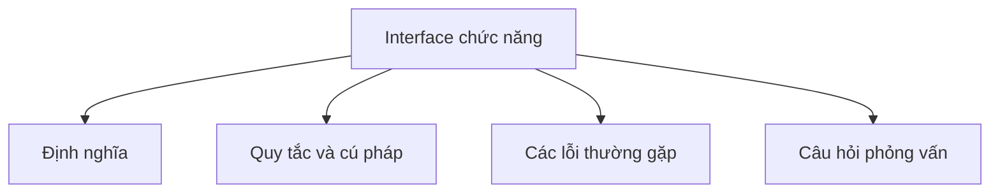

# 22 - Interface Chức Năng (Functional Interface)

Chủ đề này tuân theo đề cương chính trong [outline.md](../outline.md). Mục tiêu là hiểu sâu sắc từng khái niệm để có thể giải thích, nhận biết trong mã nguồn và trả lời các câu hỏi phỏng vấn.

## Thứ Tự Học Tập (Study Order)

- [Khái niệm Predicate T (Predicate T Concepts)](theory/01-predicate-t-concepts.md)
- [Khái niệm kết quả đầu ra (What Is The Output Concepts)](theory/02-what-is-the-output-concepts.md)
- [Thuật ngữ chính (Key Terms)](terms/01-key-terms.md)

## Danh Sách Kiểm Tra Đề Cương (Outline Checklist)

- `Predicate<T>`
- `Function<T, R>`
- `Consumer<T>`
- `Supplier<T>`
- `UnaryOperator<T>`
- `BinaryOperator<T>`
- `BiPredicate<T, U>`
- `BiFunction<T, U, R>`
- `BiConsumer<T, U>`
- Đầu vào là gì? (What is the input?)
- Đầu ra là gì? (What is the output?)
- Khi nào sử dụng interface nào? (When to use which interface?)

## Thẻ Anki (Anki Cards)

- [Cơ bản (Basic)](anki/basic.tsv)
- [Cơ bản Mở rộng (Basic Extra)](anki/basic-extra.tsv)
- [Điền vào chỗ trống (Cloze)](anki/cloze.tsv)
- [Câu hỏi code (Code Question)](anki/code-question.tsv)

## Biểu Đồ Tổng Quan Mermaid (Mermaid Overview)

## Tự Kiểm Tra (Self-Check)

Dưới đây là 5 câu hỏi khái niệm sâu sắc để xác minh sự hiểu biết của bạn về các functional interface. Các câu trả lời có thể được tìm thấy trong các tệp lý thuyết:

1. Tại sao annotation `@FunctionalInterface` lại không bắt buộc, và nó cung cấp những lợi ích gì tại thời điểm biên dịch?
2. Hợp đồng thiết kế của `Predicate`, `Function`, `Consumer` và `Supplier` khác nhau thế nào về khuôn dạng đầu vào/đầu ra và mục đích sử dụng?
3. Tại sao chúng ta cần các phiên bản chuyên biệt cho kiểu nguyên thủy (như `IntPredicate`, `LongFunction`, `DoubleConsumer`) thay vì chỉ sử dụng các lớp bao bọc generic (generic wrapper), và cách chúng ngăn ngừa chi phí đóng hộp (boxing) là gì?
4. Làm thế nào các functional interface tận dụng các phương thức mặc định (default method) để thực hiện liên kết chuỗi và kết hợp hàm (functional composition)?
5. Quy chuẩn Ngôn ngữ Java (JLS) đếm số lượng phương thức trừu tượng cho một functional interface như thế nào, và các quy tắc chính xác liên quan đến các phương thức được ghi đè từ `java.lang.Object` là gì?

## Liên Kết Tham Khảo (Reference Links)

- https://docs.oracle.com/en/java/javase/21/docs/api/java.base/java/util/function/package-summary.html
- https://docs.oracle.com/en/java/javase/21/docs/api/java.base/java/lang/FunctionalInterface.html
