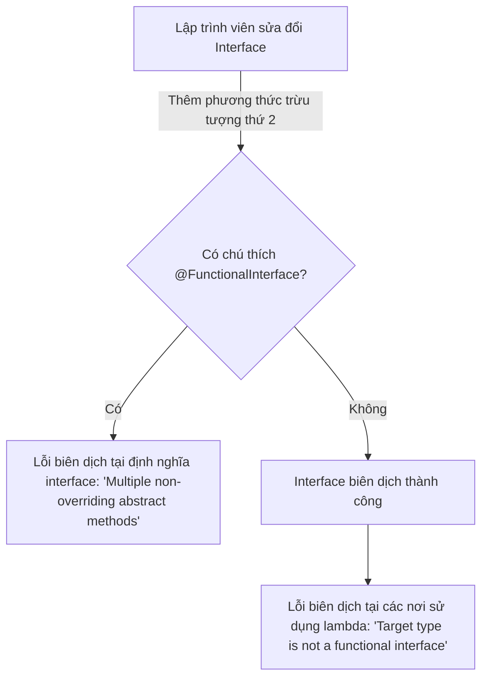
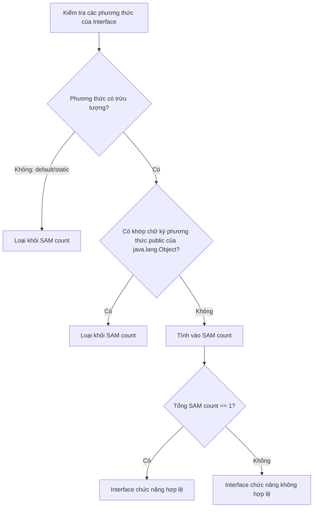

# Interface Chức Năng - Phần 1 (Functional Interface - Part 1)

## Mục Tiêu Học Tập (Learning Goal)

Tài liệu này đề cập đến một phần trọng tâm của **Interface Chức Năng**. Hãy nghiên cứu từng khái niệm như một quy tắc Java thực tế, chứ không phải là những thuật ngữ riêng lẻ.

## Phạm Vi Outline (Outline Coverage)

| Khái niệm (Concept) | Những điều cần biết (What to know) |
| --- | --- |
| `Predicate<T>` | `Predicate<T>` là một khái niệm cụ thể trong Interface chức năng; hãy tìm hiểu quy tắc Java, các trường hợp sử dụng hợp lệ và lỗi thường gặp của nó thay vì chỉ biết mỗi tên gọi. |
| `Function<T, R>` | `Function<T, R>` là một khái niệm cụ thể trong Interface chức năng; hãy tìm hiểu quy tắc Java, các trường hợp sử dụng hợp lệ và lỗi thường gặp của nó thay vì chỉ biết mỗi tên gọi. |
| `Consumer<T>` | `Consumer<T>` là một khái niệm cụ thể trong Interface chức năng; hãy tìm hiểu quy tắc Java, các trường hợp sử dụng hợp lệ và lỗi thường gặp của nó thay vì chỉ biết mỗi tên gọi. |
| `Supplier<T>` | `Supplier<T>` là một khái niệm cụ thể trong Interface chức năng; hãy tìm hiểu quy tắc Java, các trường hợp sử dụng hợp lệ và lỗi thường gặp của nó thay vì chỉ biết mỗi tên gọi. |
| `UnaryOperator<T>` | `UnaryOperator<T>` là một khái niệm cụ thể trong Interface chức năng; hãy tìm hiểu quy tắc Java, các trường hợp sử dụng hợp lệ và lỗi thường gặp của nó thay vì chỉ biết mỗi tên gọi. |
| `BinaryOperator<T>` | `BinaryOperator<T>` là một khái niệm cụ thể trong Interface chức năng; hãy tìm hiểu quy tắc Java, các trường hợp sử dụng hợp lệ và lỗi thường gặp của nó thay vì chỉ biết mỗi tên gọi. |
| `BiPredicate<T, U>` | `BiPredicate<T, U>` là một khái niệm cụ thể trong Interface chức năng; hãy tìm hiểu quy tắc Java, các trường hợp sử dụng hợp lệ và lỗi thường gặp của nó thay vì chỉ biết mỗi tên gọi. |
| `BiFunction<T, U, R>` | `BiFunction<T, U, R>` là một khái niệm cụ thể trong Interface chức năng; hãy tìm hiểu quy tắc Java, các trường hợp sử dụng hợp lệ và lỗi thường gặp của nó thay vì chỉ biết mỗi tên gọi. |
| `BiConsumer<T, U>` | `BiConsumer<T, U>` là một khái niệm cụ thể trong Interface chức năng; hãy tìm hiểu quy tắc Java, các trường hợp sử dụng hợp lệ và lỗi thường gặp của nó thay vì chỉ biết mỗi tên gọi. |
| `What is the input?` | Đầu vào là gì (What is the input) là một câu hỏi then chốt để hiểu về Interface chức năng. |

## Ghi Chú Chi Tiết (Detailed Notes)

### Annotation @FunctionalInterface (The @FunctionalInterface Annotation)

Một interface chức năng (functional interface) trong Java là một interface chứa **đúng một phương thức trừu tượng** (Single Abstract Method - SAM). Nó có thể chứa bất kỳ số lượng phương thức `default` hoặc `static` nào.

Annotation `@FunctionalInterface` là tùy chọn nhưng được khuyến nghị mạnh mẽ. Nó thông báo cho trình biên dịch xác thực rằng interface được chú thích có đúng một phương thức trừu tượng. Nếu không thỏa mãn, lỗi biên dịch sẽ xảy ra.

#### Ghi Đè Các Phương Thức Của Object (Overriding Object Methods)
Một interface có thể khai báo các phương thức trừu tượng ghi đè các phương thức public của `java.lang.Object` (như `equals`, `hashCode`, hoặc `toString`). Những khai báo này **không** được tính vào số lượng duy nhất của phương thức trừu tượng.

```java
@FunctionalInterface
public interface SimpleCalculator {
    int calculate(int a, int b); // Phương thức trừu tượng duy nhất (SAM)

    // Các phương thức mặc định (default) được phép
    default int add(int a, int b) {
        return a + b;
    }

    // Các phương thức tĩnh (static) được phép
    static boolean isPositive(int val) {
        return val > 0;
    }

    // Ghi đè phương thức của Object được phép và KHÔNG tính là trừu tượng
    @Override
    boolean equals(Object obj);
}
```

## Tại Sao Nên Sử Dụng Annotation @FunctionalInterface (Why Use the @FunctionalInterface Annotation)

Annotation `@FunctionalInterface` là một chú thích hướng dẫn trình biên dịch để tài liệu hóa rõ ràng ý định thiết kế của một interface. Mặc dù Java cho phép bất kỳ interface nào chứa đúng một phương thức trừu tượng hoạt động như một đích đến cho biểu thức lambda hoặc tham chiếu phương thức, việc bỏ qua annotation này có thể dẫn đến các lỗi không mong muốn trong tương lai. Nếu một lập trình viên vô tình thêm phương thức trừu tượng thứ hai vào một interface chức năng mà không có chú thích này, lỗi biên dịch sẽ hiển thị tại các nơi sử dụng (nơi viết biểu thức lambda) chứ không phải tại chính khai báo interface, làm cho việc gỡ lỗi trở nên khó khăn hơn. Việc sử dụng `@FunctionalInterface` đảm bảo trình biên dịch kiểm tra hợp đồng phương thức trừu tượng duy nhất (SAM) ngay lập tức tại nơi khai báo, ngăn chặn việc vô tình thêm các phương thức trừu tượng khác.



### Ví dụ mã nguồn: Bắt buộc kiểm tra bằng chú thích (Code Example: Annotation Enforcement)

```java
// Cách dùng đúng: trình biên dịch kiểm tra khai báo
@FunctionalInterface
interface StringTransformer {
    String transform(String input);
    
    // Nếu bỏ chú thích dòng bên dưới, trình biên dịch sẽ báo lỗi ngay lập tức:
    // "StringTransformer is not a functional interface"
    // void anotherMethod(); 
}

public class AnnotationDemo {
    public static void main(String[] args) {
        StringTransformer upper = String::toUpperCase;
        System.out.println(upper.transform("hello")); // Kết quả: HELLO
    }
}
```

### Chuỗi nguyên nhân - kết quả (Cause-Effect Chain)
- **Được chú thích với `@FunctionalInterface`** $\rightarrow$ Trình biên dịch bắt buộc kiểm tra ràng buộc phương thức trừu tượng duy nhất tại nơi khai báo $\rightarrow$ Ngăn chặn việc vô tình thêm mới các phương thức trừu tượng $\rightarrow$ Tránh lỗi biên dịch tại các nơi sử dụng lambda hạ nguồn.

---

## Quy Chuẩn JLS Đếm Số Lượng Phương Thức Trừu Tượng Và Xử Lý Việc Ghi Đè java.lang.Object (How the JLS Counts Abstract Methods and Treats java.lang.Object Overrides)

Quy chuẩn Ngôn ngữ Java (JLS §9.8) định nghĩa một interface chức năng là một interface có đúng một phương thức chức năng, tức là một phương thức trừu tượng duy nhất không bị ghi đè. Khi xác định số lượng phương thức trừu tượng, bất kỳ phương thức trừu tượng nào được khai báo trong interface mà ghi đè một phương thức public của lớp `java.lang.Object` (chẳng hạn như `equals(Object)`, `hashCode()`, hoặc `toString()`) đều được loại trừ khỏi lượt đếm. Việc loại trừ này tồn tại bởi vì bất kỳ lớp nào triển khai interface này sẽ tự động kế thừa các triển khai của các phương thức này từ `java.lang.Object` (trực tiếp hoặc thông qua phân cấp lớp cha), nghĩa là lớp triển khai không cần cung cấp một triển khai mới cho chúng. Nếu một phương thức trong interface ghi đè một phương thức phi-public của `Object` (chẳng hạn như `clone()`), hoặc nếu nó khai báo một phương thức trừu tượng không có trong `Object`, nó sẽ được tính vào giới hạn phương thức trừu tượng duy nhất.



### Ví dụ mã nguồn: Ghi đè phương thức của Object (Code Example: Object Overrides)

```java
@FunctionalInterface
interface CustomComparator<T> {
    // 1. Tính là phương thức trừu tượng duy nhất (SAM)
    int compare(T o1, T o2);

    // 2. Ghi đè phương thức public của java.lang.Object: KHÔNG tính
    @Override
    boolean equals(Object obj);

    // 3. Ghi đè phương thức public của java.lang.Object: KHÔNG tính
    @Override
    String toString();
    
    // 4. Ghi đè phương thức protected/phi-public của Object là KHÔNG được phép nếu không muốn tính vào SAM.
    // Object clone(); // Nếu bỏ chú thích, nó sẽ tính là phương thức trừu tượng thứ hai và lỗi biên dịch!
}

public class JlsChecksDemo {
    public static void main(String[] args) {
        CustomComparator<String> lengthComp = (s1, s2) -> Integer.compare(s1.length(), s2.length());
        System.out.println(lengthComp.compare("apple", "banana")); // Kết quả: -1
        System.out.println(lengthComp.equals(lengthComp));         // Kết quả: true
    }
}
```

### Chuỗi nguyên nhân - kết quả (Cause-Effect Chain)
- **Khai báo phương thức public của `Object` là trừu tượng** $\rightarrow$ Trình biên dịch nhận dạng chữ ký khớp với phương thức public của `Object` $\rightarrow$ Phương thức bị loại trừ khỏi bộ đếm phương thức trừu tượng của interface chức năng $\rightarrow$ Interface biên dịch thành công dưới dạng một `@FunctionalInterface` hợp lệ.

---

### Predicate<T>

`Predicate<T>` đại diện cho một hàm nhận một đối số và trả về giá trị kiểu `boolean`.
- **Phương thức chức năng**: `boolean test(T t)`
- **Trường hợp sử dụng phổ biến**: Lọc (filtering) các phần tử từ Stream hoặc Collection.

```java
import java.util.function.Predicate;
import java.util.List;
import java.util.stream.Collectors;

public class PredicateExample {
    public static void main(String[] args) {
        Predicate<String> isLong = s -> s.length() > 3;
        
        List<String> names = List.of("Al", "Bob", "Charlie");
        List<String> filtered = names.stream()
                                     .filter(isLong)
                                     .collect(Collectors.toList());
        System.out.println(filtered); // [Charlie]
        
        // Liên kết chuỗi: and(), or(), negate()
        Predicate<String> startsWithC = s -> s.startsWith("C");
        Predicate<String> combined = isLong.and(startsWithC);
        System.out.println(combined.test("Charlie")); // true
        System.out.println(combined.test("Bob"));     // false
    }
}
```

#### Các phiên bản kiểu nguyên thủy (Primitive Variants)
Để tránh chi phí đóng hộp và mở hộp các kiểu nguyên thủy (ví dụ: `int` thành `Integer`), Java cung cấp các predicate chuyên biệt cho kiểu nguyên thủy:
- `IntPredicate`: `boolean test(int value)`
- `LongPredicate`: `boolean test(long value)`
- `DoublePredicate`: `boolean test(double value)`

```java
import java.util.function.IntPredicate;

public class PrimitivePredicateExample {
    public static void main(String[] args) {
        IntPredicate isEven = value -> value % 2 == 0;
        System.out.println(isEven.test(42)); // true (không có tự động đóng hộp)
    }
}
```

---

### Function<T, R>

`Function<T, R>` chuyển đổi một đầu vào kiểu `T` thành một kết quả kiểu `R`.
- **Phương thức chức năng**: `R apply(T t)`
- **Trường hợp sử dụng phổ biến**: Ánh xạ (mapping) các đối tượng từ dạng này sang dạng khác.

```java
import java.util.function.Function;

public class FunctionExample {
    public static void main(String[] args) {
        Function<String, Integer> stringLength = s -> s.length();
        System.out.println(stringLength.apply("Java")); // 4

        // Liên kết chuỗi: andThen(), compose()
        Function<Integer, Integer> multiplyBy2 = n -> n * 2;
        
        // andThen: áp dụng stringLength trước, sau đó áp dụng multiplyBy2
        Function<String, Integer> lengthDouble = stringLength.andThen(multiplyBy2);
        System.out.println(lengthDouble.apply("Java")); // 8

        // compose: áp dụng multiplyBy2 trước, sau đó áp dụng stringLength (cần khớp kiểu đầu vào của stringLength)
        Function<Integer, Integer> addThree = n -> n + 3;
        Function<Integer, Integer> pipeline = addThree.compose(multiplyBy2); // multiplyBy2 trước rồi đến addThree
        System.out.println(pipeline.apply(5)); // 5 * 2 + 3 = 13
    }
}
```

#### Các phiên bản kiểu nguyên thủy (Primitive Variants)
Việc sử dụng `Function<T, R>` với các kiểu nguyên thủy yêu cầu đóng hộp. Java cung cấp các Function chuyên biệt cho kiểu nguyên thủy để tránh điều này:
- **Đầu vào kiểu nguyên thủy**: `IntFunction<R>` (`R apply(int)`), `LongFunction<R>`, `DoubleFunction<R>`.
- **Đầu ra kiểu nguyên thủy**: `ToIntFunction<T>` (`int applyAsInt(T)`), `ToLongFunction<T>`, `ToDoubleFunction<T>`.
- **Nguyên thủy sang nguyên thủy**: `IntToDoubleFunction` (`double applyAsDouble(int)`), `IntToLongFunction`, `LongToIntFunction`, `LongToDoubleFunction`, `DoubleToIntFunction`, `DoubleToLongFunction`.

```java
import java.util.function.IntToDoubleFunction;

public class PrimitiveFunctionExample {
    public static void main(String[] args) {
        IntToDoubleFunction half = val -> val / 2.0;
        System.out.println(half.applyAsDouble(5)); // 2.5 (không đóng hộp)
    }
}
```

---

### Consumer<T>

`Consumer<T>` thực hiện một thao tác trên một đầu vào kiểu `T` và không trả về kết quả (trả về `void`).
- **Phương thức chức năng**: `void accept(T t)`
- **Trường hợp sử dụng phổ biến**: In ấn, ghi vào cơ sở dữ liệu, hoặc sửa đổi trạng thái nội bộ của một đối tượng.

```java
import java.util.function.Consumer;

public class ConsumerExample {
    public static void main(String[] args) {
        Consumer<String> printUpper = s -> System.out.println(s.toUpperCase());
        printUpper.accept("hello"); // HELLO

        // Liên kết chuỗi: andThen()
        Consumer<String> printLength = s -> System.out.println(s.length());
        Consumer<String> combined = printUpper.andThen(printLength);
        combined.accept("java"); // JAVA sau đó in 4
    }
}
```

#### Các phiên bản kiểu nguyên thủy (Primitive Variants)
- `IntConsumer`: `void accept(int value)`
- `LongConsumer`: `void accept(long value)`
- `DoubleConsumer`: `void accept(double value)`

```java
import java.util.function.IntConsumer;

public class PrimitiveConsumerExample {
    public static void main(String[] args) {
        IntConsumer printInt = val -> System.out.println("Giá trị: " + val);
        printInt.accept(100);
    }
}
```

---

### Supplier<T>

`Supplier<T>` không nhận đối số nào và trả về một kết quả kiểu `T`.
- **Phương thức chức năng**: `T get()`
- **Trường hợp sử dụng phổ biến**: Tạo giá trị lười biếng (lazy generation), các nhà máy (factory), hoặc cung cấp giá trị mặc định.

```java
import java.util.function.Supplier;
import java.time.LocalDateTime;

public class SupplierExample {
    public static void main(String[] args) {
        Supplier<LocalDateTime> currentTime = () -> LocalDateTime.now();
        System.out.println(currentTime.get());
    }
}
```

#### Các phiên bản kiểu nguyên thủy (Primitive Variants)
- `IntSupplier`: `int getAsInt()`
- `LongSupplier`: `long getAsLong()`
- `DoubleSupplier`: `double getAsDouble()`
- `BooleanSupplier`: `boolean getAsBoolean()`

```java
import java.util.function.IntSupplier;

public class PrimitiveSupplierExample {
    public static void main(String[] args) {
        IntSupplier diceRoller = () -> (int) (Math.random() * 6) + 1;
        System.out.println(diceRoller.getAsInt());
    }
}
```

---

### UnaryOperator<T>

`UnaryOperator<T>` là một `Function<T, T>` chuyên biệt trong đó kiểu đầu vào và đầu ra giống nhau.
- **Phương thức chức năng**: `T apply(T t)`
- **Trường hợp sử dụng phổ biến**: Sửa đổi một giá trị tại chỗ hoặc thay thế các phần tử trong một danh sách.

```java
import java.util.function.UnaryOperator;
import java.util.ArrayList;
import java.util.List;

public class UnaryOperatorExample {
    public static void main(String[] args) {
        UnaryOperator<String> sanitize = s -> s.trim().toLowerCase();
        System.out.println(sanitize.apply("  Java21  ")); // "java21"

        List<String> list = new ArrayList<>(List.of("  A ", " B  "));
        list.replaceAll(sanitize);
        System.out.println(list); // [a, b]
    }
}
```

#### Các phiên bản kiểu nguyên thủy (Primitive Variants)
- `IntUnaryOperator`: `int applyAsInt(int)`
- `LongUnaryOperator`: `long applyAsLong(long)`
- `DoubleUnaryOperator`: `double applyAsDouble(double)`

```java
import java.util.function.IntUnaryOperator;

public class PrimitiveUnaryOperatorExample {
    public static void main(String[] args) {
        IntUnaryOperator square = val -> val * val;
        System.out.println(square.applyAsInt(5)); // 25
    }
}
```

---

### BinaryOperator<T>

`BinaryOperator<T>` là một `BiFunction<T, T, T>` chuyên biệt trong đó hai kiểu đầu vào và kiểu đầu ra đều có chung kiểu `T`.
- **Phương thức chức năng**: `T apply(T t1, T t2)`
- **Trường hợp sử dụng phổ biến**: Rút gọn (reducing) collection hoặc gộp hai giá trị.

```java
import java.util.function.BinaryOperator;

public class BinaryOperatorExample {
    public static void main(String[] args) {
        BinaryOperator<Integer> sum = (a, b) -> a + b;
        System.out.println(sum.apply(10, 20)); // 30

        // Các phương thức tĩnh hỗ trợ: minBy, maxBy
        BinaryOperator<Integer> min = BinaryOperator.minBy(Integer::compareTo);
        System.out.println(min.apply(15, 8)); // 8
    }
}
```

#### Các phiên bản kiểu nguyên thủy (Primitive Variants)
- `IntBinaryOperator`: `int applyAsInt(int, int)`
- `LongBinaryOperator`: `long applyAsLong(long, long)`
- `DoubleBinaryOperator`: `double applyAsDouble(double, double)`

```java
import java.util.function.IntBinaryOperator;

public class PrimitiveBinaryOperatorExample {
    public static void main(String[] args) {
        IntBinaryOperator product = (a, b) -> a * b;
        System.out.println(product.applyAsInt(6, 7)); // 42
    }
}
```

---

### BiPredicate<T, U>

`BiPredicate<T, U>` nhận hai đối số có kiểu `T` và `U` và trả về một giá trị kiểu boolean.
- **Phương thức chức năng**: `boolean test(T t, U u)`
- **Trường hợp sử dụng phổ biến**: Kiểm tra mối quan hệ giữa hai đối tượng khác nhau.

```java
import java.util.function.BiPredicate;

public class BiPredicateExample {
    public static void main(String[] args) {
        BiPredicate<String, String> containsWord = (text, word) -> text.contains(word);
        System.out.println(containsWord.test("Java Programming", "Prog")); // true
    }
}
```

---

### BiFunction<T, U, R>

`BiFunction<T, U, R>` nhận hai đối số có kiểu `T` và `U` và tạo ra một kết quả có kiểu `R`.
- **Phương thức chức năng**: `R apply(T t, U u)`
- **Trường hợp sử dụng phổ biến**: Kết hợp hai đầu vào khác nhau thành một dạng biểu diễn thứ ba.

```java
import java.util.function.BiFunction;

public class BiFunctionExample {
    public static void main(String[] args) {
        BiFunction<String, Integer, String> repeatString = (s, count) -> s.repeat(count);
        System.out.println(repeatString.apply("Hi", 3)); // "HiHiHi"
    }
}
```

---

### BiConsumer<T, U>

`BiConsumer<T, U>` nhận hai đối số có kiểu `T` và `U` và không trả về kết quả (`void`).
- **Phương thức chức năng**: `void accept(T t, U u)`
- **Trường hợp sử dụng phổ biến**: Duyệt qua các phần tử của một Map sử dụng `Map.forEach`.

```java
import java.util.function.BiConsumer;
import java.util.HashMap;
import java.util.Map;

public class BiConsumerExample {
    public static void main(String[] args) {
        Map<String, Integer> map = new HashMap<>();
        map.put("Apple", 10);
        map.put("Banana", 20);

        BiConsumer<String, Integer> printer = (key, value) -> System.out.println(key + " có số lượng " + value);
        map.forEach(printer);
    }
}
```

---

### Đầu vào là gì? (What is the input?)

Đầu vào là gì (What is the input) là một câu hỏi then chốt để hiểu về Interface chức năng.

Khi thiết kế hoặc lựa chọn một functional interface, hãy luôn luôn phân tích:
1. **Có bao nhiêu đầu vào?** (Không có, Một, hoặc Hai)
2. **Kiểu đầu vào là gì?** (Các đối tượng generic `T`, `U`, hoặc các kiểu nguyên thủy như `int`, `double`, `long`).

Ví dụ:
- `Supplier<T>` có **không** đầu vào.
- `Function<T, R>` có **một** đầu vào.
- `BiFunction<T, U, R>` có **hai** đầu vào.
- `IntConsumer` có **một** đầu vào kiểu nguyên thủy `int`.

---

## Tại Sao Các Phiên Bản Chuyên Biệt Cho Kiểu Nguyên Thủy Giúp Ngăn Ngừa Chi Phí Đóng Hộp (Why Primitive Specializations Prevent Boxing Overhead)

Các kiểu generic trong Java phải tuân theo cơ chế xóa kiểu (type erasure), nghĩa là JVM chỉ hoạt động trên các tham chiếu có kiểu `java.lang.Object` tại thời điểm chạy. Điều này ngăn cản các kiểu nguyên thủy như `int` hoặc `double` được sử dụng trực tiếp làm đối số kiểu (type argument). Khi sử dụng các functional interface tiêu chuẩn như `Predicate<Integer>`, bất kỳ giá trị nguyên thủy `int` nào được truyền dưới dạng đối số đều phải được bọc trong một đối tượng `Integer` được cấp phát trên heap thông qua cơ chế tự động đóng hộp (autoboxing). Quá trình đóng hộp này cấp phát bộ nhớ trên heap, tăng áp lực lên trình thu gom rác (garbage collection - GC), và yêu cầu giải tham chiếu (dereferencing) để truy xuất giá trị nguyên thủy trong quá trình thực thi phương thức. Để giải quyết vấn đề hiệu năng này, Java cung cấp các phiên bản chuyên biệt cho kiểu nguyên thủy như `IntPredicate` hoặc `DoubleConsumer` định nghĩa các phương thức trừu tượng nhận trực tiếp các đối số kiểu nguyên thủy (ví dụ: `test(int value)`). Việc sử dụng các phiên bản chuyên biệt này giúp loại bỏ việc cấp phát trên heap, tránh chi phí bộ nhớ, và cho phép JVM thực thi các hoạt động với chi phí tối thiểu bên trong các vòng lặp tần suất cao.

```mermaid
sequenceDiagram
    autonumber
    participant Loop as Vòng lặp / Code
    participant Generic as Predicate<Integer>
    participant Heap as Bộ nhớ JVM Heap
    participant Primitive as IntPredicate
    
    Note over Loop, Heap: Sử dụng Predicate Generic (Autoboxing)
    Loop->>Generic: test(42)
    Generic->>Heap: Cấp phát Integer(42) [Chi phí Heap!]
    Heap-->>Generic: Trả về tham chiếu Integer
    Generic->>Generic: Mở hộp Integer thành int
    Generic-->>Loop: Trả về boolean
    
    Note over Loop, Primitive: Sử dụng Phiên bản Nguyên thủy Chuyên biệt
    Loop->>Primitive: test(42)
    Primitive->>Primitive: Thực thi logic trực tiếp trên kiểu nguyên thủy 42
    Primitive-->>Loop: Trả về boolean [Không cấp phát Heap]
```

### Ví dụ mã nguồn: Chi phí đóng hộp so với các phiên bản nguyên thủy chuyên biệt (Code Example: Boxing Overhead vs Primitive Specializations)

```java
import java.util.function.Predicate;
import java.util.function.IntPredicate;

public class BoxingOverheadDemo {
    public static void main(String[] args) {
        int iterations = 10_000_000;
        
        // 1. Predicate Generic (chi phí autoboxing)
        Predicate<Integer> isEvenGeneric = x -> x % 2 == 0;
        long startGeneric = System.nanoTime();
        for (int i = 0; i < iterations; i++) {
            isEvenGeneric.test(i); // đóng hộp 'i' thành Integer
        }
        long endGeneric = System.nanoTime();
        
        // 2. Phiên bản chuyên biệt nguyên thủy (không autoboxing)
        IntPredicate isEvenPrimitive = x -> x % 2 == 0;
        long startPrimitive = System.nanoTime();
        for (int i = 0; i < iterations; i++) {
            isEvenPrimitive.test(i); // truyền int nguyên thủy
        }
        long endPrimitive = System.nanoTime();
        
        System.out.println("Generic mất: " + (endGeneric - startGeneric) / 1_000_000 + " ms");
        System.out.println("Primitive mất: " + (endPrimitive - startPrimitive) / 1_000_000 + " ms");
    }
}
```

### Chuỗi nguyên nhân - kết quả (Cause-Effect Chain)
- **Tham số kiểu generic được sử dụng** $\rightarrow$ Trình biên dịch bắt buộc đối số phải là kiểu tham chiếu $\rightarrow$ Các giá trị nguyên thủy phải được đóng hộp vào các đối tượng bao bọc $\rightarrow$ Tăng cấp phát heap và tăng áp lực lên GC $\rightarrow$ Hiệu suất giảm so với sử dụng trực tiếp các phiên bản nguyên thủy chuyên biệt.

---

## Các Lỗi Thường Gặp (Common Mistakes)

### 1. Chi phí đóng hộp/mở hộp tự động (Autoboxing/Unboxing)
Sử dụng các functional interface dựa trên đối tượng bao bọc như `Function<Integer, Integer>` trong các vòng lặp tần suất cao thay vì các biến thể kiểu nguyên thủy như `IntUnaryOperator` dẫn đến áp lực thu gom rác lớn và giảm hiệu năng đáng kể.
```java
// Tệ: việc autoboxing xảy ra 1.000.000 lần
Function<Integer, Integer> badSquare = x -> x * x; 
for (int i = 0; i < 1_000_000; i++) {
    badSquare.apply(i); 
}

// Tốt: không có autoboxing
IntUnaryOperator goodSquare = x -> x * x;
for (int i = 0; i < 1_000_000; i++) {
    goodSquare.applyAsInt(i);
}
```

### 2. NullPointerException với các biến thể kiểu nguyên thủy
Nếu một lambda trả về `null` hoặc một đối tượng bao bọc tham chiếu đến `null` cho một interface chức năng kiểu nguyên thủy, ngoại lệ `NullPointerException` sẽ bị ném ra tại thời điểm chạy do quá trình mở hộp ngầm định.
```java
Integer value = null;
IntSupplier supplier = () -> value; // Biên dịch bình thường!
int x = supplier.getAsInt(); // Ném ra NullPointerException tại thời điểm chạy!
```

### 3. Nhiều phương thức trừu tượng
Khai báo nhiều phương thức trừu tượng trong một interface được chú thích bằng `@FunctionalInterface` sẽ gây ra lỗi biên dịch.
```java
@FunctionalInterface
public interface InvalidInterface {
    void doSomething();
    void doSomethingElse(); // Lỗi biên dịch: Multiple non-overriding abstract methods found
}
```

### 4. Nhầm lẫn các phương thức default/static với phương thức trừu tượng
Các phương thức default và static không phải là phương thức trừu tượng. Một interface có thể có nhiều phương thức default và static mà vẫn là một functional interface hợp lệ, miễn là nó có đúng một phương thức trừu tượng.

---

## Các Câu Hỏi Ôn Tập Thường Gặp (Common Review Prompts)

- Những khái niệm nào ở đây là quy tắc tại thời điểm biên dịch (compile-time)?
- Những khái niệm nào ở đây ảnh hưởng đến hành vi tại thời điểm chạy (runtime)?
- Những khái niệm nào ở đây có khả năng là bẫy khi phỏng vấn?
