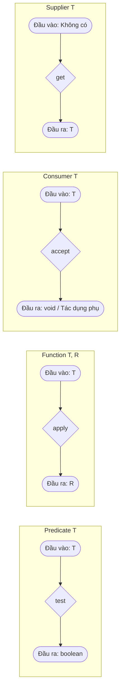
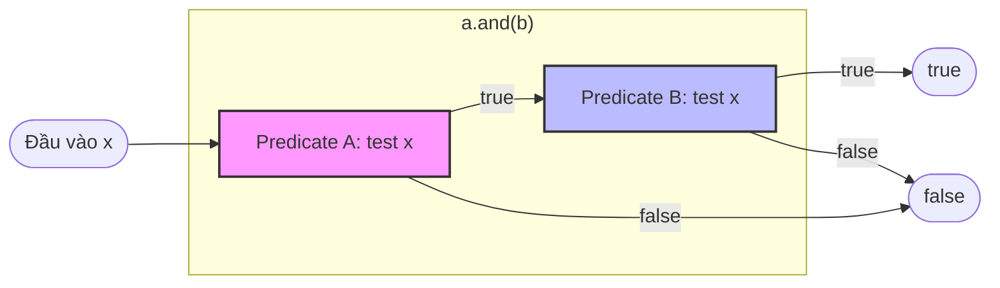

# Giao Diện Chức Năng - Phần 2 (Functional Interface - Part 2)

## Mục Tiêu Học Tập (Learning Goal)

Tài liệu này tập trung vào một phần trọng tâm về **Giao Diện Chức Năng (Functional Interface)**. Hãy nghiên cứu từng khái niệm như một quy tắc Java thực tế, tránh việc ghi nhớ từ vựng một cách máy móc.

## Khung Nội Dung (Outline Coverage)

| Khái niệm (Concept) | Nội dung cần biết (What to know) |
| --- | --- |
| `What is the output?` | Kết quả đầu ra là gì? (What is the output?) là câu hỏi cốt lõi để hiểu cách hoạt động của Giao diện chức năng. |
| `When to use which interface?` | Khi nào nên sử dụng giao diện nào? (When to use which interface?) là định hướng lựa chọn giao diện chức năng chuẩn của JDK dựa trên số lượng tham số đầu vào và kiểu dữ liệu trả về. |

---

## Ghi Chú Chi Tiết (Detailed Notes)

### Kết quả đầu ra là gì? (What is the output?)

Việc xác định kết quả trả về (output) của phương thức trừu tượng trong giao diện chức năng sẽ quyết định cách nó được sử dụng trong mã nguồn.
- `void`: Dùng khi chỉ cần thực hiện hành động tạo tác dụng phụ (ví dụ: `Consumer`).
- `boolean`: Dùng để lọc và kiểm tra các điều kiện (ví dụ: `Predicate`).
- Kiểu generic hoặc kiểu dữ liệu nguyên thủy: Dùng để biến đổi kiểu hoặc tính toán giá trị (ví dụ: `Function`, `Supplier`).

```java
import java.util.function.*;

public class OutputExample {
    public static void main(String[] args) {
        // Đầu ra là void: chỉ thực hiện tác dụng phụ
        Consumer<String> consumer = s -> System.out.println("Processing " + s);
        
        // Đầu ra là boolean: kiểm tra điều kiện
        Predicate<Integer> isPositive = n -> n > 0;
        
        // Đầu ra là một kiểu dữ liệu: trả về giá trị
        Supplier<String> supplier = () -> "Hello World";
        Function<String, Integer> lengthMapper = String::length;
    }
}
```

---

### Khi nào nên sử dụng giao diện nào? (When to use which interface?)

#### Ma Trận Quyết Định (Decision Matrix)
Sử dụng bảng hướng dẫn dưới đây để chọn giao diện chức năng phù hợp dựa trên số lượng đầu vào và kiểu dữ liệu đầu ra:

| Tham số đầu vào | Kiểu đầu ra | Giao diện chuẩn | Ví dụ kiểu nguyên thủy | Biến thể hai tham số (Bi-Variant) |
|---|---|---|---|---|
| 0 | Kiểu `T` | `Supplier<T>` | `IntSupplier` | Không hỗ trợ |
| 1 (`T`) | `void` | `Consumer<T>` | `DoubleConsumer` | `BiConsumer<T, U>` |
| 1 (`T`) | `boolean` | `Predicate<T>` | `LongPredicate` | `BiPredicate<T, U>` |
| 1 (`T`) | Kiểu `R` | `Function<T, R>` | `ToIntFunction<T>` | `BiFunction<T, U, R>` |
| 1 (`T`) | Kiểu `T` | `UnaryOperator<T>` | `IntUnaryOperator` | Không hỗ trợ |
| 2 (`T`, `T`) | Kiểu `T` | `BinaryOperator<T>` | `IntBinaryOperator` | Không hỗ trợ |

---

## Tại Sao Các Phong Cách Hợp Đồng Chức Năng Lại Khác Nhau (Why Functional Contract Styles Differ)

Các giao diện chức năng tiêu chuẩn của JDK trong gói `java.util.function` được cấu trúc thành các phong cách hợp đồng (contract styles) riêng biệt dựa trên các giá trị toán học đầu vào và đầu ra của chúng. `Predicate` được thiết kế để kiểm tra điều kiện và lọc dữ liệu, nhận một đối số và trả về giá trị boolean. `Function` đóng vai trò là bộ biến đổi, ánh xạ một đầu vào thuộc kiểu này sang một đầu ra thuộc kiểu khác. `Consumer` hoạt động như một điểm thu nhận cuối cùng (terminal sink) hoặc thực hiện hành động, nhận đầu vào và không trả về gì (`void`), điều này thường kích hoạt một tác dụng phụ (side effect) như ghi log hoặc cập nhật cơ sở dữ liệu. Cuối cùng, `Supplier` đại diện cho một nhà máy hoặc nguồn cung cấp, không nhận đầu vào và tạo ra một giá trị một cách trì hoãn khi được yêu cầu. Các hợp đồng rõ ràng này cho phép lập trình viên tuyên bố ý đồ ngữ nghĩa rõ ràng cho các phương thức, giúp xây dựng các đường dẫn xử lý dữ liệu sạch sẽ như trong Stream API.

> Xem thêm:
> - Cú pháp và cách sử dụng Lambda Expression để triển khai Functional Interface: [Ch.21 - Lambda Expression](../../21-lambda-expression/README.md)
> - Ứng dụng của Functional Interface trong xử lý dữ liệu tập hợp: [Ch.23 - Stream API](../../23-stream-api/README.md)



### Ví Dụ Mã Nguồn: Hợp đồng của các giao diện chức năng

```java
import java.util.function.*;

public class ContractDemo {
    public static void main(String[] args) {
        // Predicate: Đầu vào T, Đầu ra boolean
        Predicate<String> isShort = s -> s.length() < 5;
        
        // Function: Đầu vào T, Đầu ra R
        Function<String, Integer> parseToInt = Integer::parseInt;
        
        // Consumer: Đầu vào T, Đầu ra void
        Consumer<String> logger = msg -> System.out.println("LOG: " + msg);
        
        // Supplier: Đầu vào void, Đầu ra T
        Supplier<Double> randomNum = Math::random;
        
        System.out.println(isShort.test("Java"));   // Kết quả: true
        System.out.println(parseToInt.apply("123")); // Kết quả: 123
        logger.accept("Testing pipeline");           // Kết quả: LOG: Testing pipeline
        System.out.println(randomNum.get() != null); // Kết quả: true
    }
}
```

### Chuỗi Nguyên Nhân - Kết Quả (Cause-Effect Chain)
Định nghĩa các hợp đồng chức năng riêng biệt $\rightarrow$ Các API chỉ định chính xác các tham chiếu giao diện (ví dụ: Stream.filter yêu cầu Predicate, Stream.map yêu cầu Function) $\rightarrow$ Trình biên dịch bắt buộc các biểu thức lambda phải khớp cấu trúc với các hợp đồng này $\rightarrow$ Đảm bảo các đường dẫn xử lý dữ liệu an toàn kiểu, dễ đọc và mang tính khai báo.

---

### Ví Dụ Thực Tế: Thiết kế một giao diện chức năng tùy chỉnh cho đường dẫn xử lý dữ liệu với các phương thức chuỗi mặc định

Trong các ứng dụng thực tế, bạn có thể cần một đường dẫn xử lý dữ liệu tùy chỉnh vượt ra ngoài các giao diện chức năng tiêu chuẩn của JDK. Dưới đây là một triển khai hoàn chỉnh của giao diện chức năng tùy chỉnh `DataProcessor<T>` có tích hợp các phương thức chuỗi mặc định (`andThen` và `compose`).

```java
import java.util.Objects;

@FunctionalInterface
public interface DataProcessor<T> {
    
    /**
     * Xử lý dữ liệu đầu vào và trả về kết quả sau xử lý.
     */
    T process(T data);

    /**
     * Trả về một DataProcessor kết hợp: thực hiện bộ xử lý này trước,
     * sau đó áp dụng bộ xử lý 'after' lên kết quả.
     */
    default DataProcessor<T> andThen(DataProcessor<T> after) {
        Objects.requireNonNull(after);
        return (T data) -> after.process(this.process(data));
    }

    /**
     * Trả về một DataProcessor kết hợp: thực hiện bộ xử lý 'before' trước,
     * sau đó áp dụng bộ xử lý này lên kết quả.
     */
    default DataProcessor<T> compose(DataProcessor<T> before) {
        Objects.requireNonNull(before);
        return (T data) -> this.process(before.process(data));
    }
}
```

#### Minh Họa Đường Dẫn Xử Lý (Pipeline Demonstration)
Dưới đây là cách sử dụng `DataProcessor` tùy chỉnh để làm sạch, chuẩn hóa và định dạng một chuỗi văn bản thô:

```java
public class PipelineDemo {
    public static void main(String[] args) {
        // Định nghĩa các công đoạn riêng lẻ của đường dẫn xử lý
        DataProcessor<String> stripWhitespace = String::strip;
        DataProcessor<String> toLowerCase = String::toLowerCase;
        DataProcessor<String> sanitize = s -> s.replaceAll("[^a-zA-Z0-9 ]", "");
        DataProcessor<String> formatOutput = s -> "[" + s.replace(" ", "_") + "]";

        // Kết hợp các bộ xử lý lại với nhau bằng phương thức andThen
        DataProcessor<String> textPipeline = stripWhitespace
                .andThen(toLowerCase)
                .andThen(sanitize)
                .andThen(formatOutput);

        String rawInput = "   Hello, World! Java 21 is great.   ";
        String processed = textPipeline.process(rawInput);
        
        System.out.println("Raw: '" + rawInput + "'");
        System.out.println("Processed: " + processed);
        // Kết quả -> Processed: [hello_world_java_21_is_great]
    }
}
```

---

## Tại Sao Giao Diện Chức Năng Tận Dụng Các Phương thức Mặc Định Để Liên Kết Chuỗi

Các giao diện chức năng được phép chứa các phương thức `default` và `static` bên cạnh phương thức trừu tượng duy nhất (Single Abstract Method - SAM) của chúng mà không vi phạm quy định về giao diện chức năng. Tính năng này của Đặc tả Ngôn ngữ Java (JLS) được tận dụng để thực hiện sự kết hợp chức năng (functional composition), cho phép lập trình viên liên kết chuỗi các hoạt động một cách linh hoạt tại thời điểm chạy. Ví dụ, `Predicate` chứa các phương thức mặc định như `and()`, `or()`, và `negate()`, trả về một `Predicate` kết hợp mới đại diện cho liên kết logic của các predicate gốc. Tương tự, `Function` tích hợp `andThen()` và `compose()` để chạy tuần tự các bước biến đổi. Vì các phương thức mặc định cung cấp các triển khai cụ thể, chúng không được tính là phương thức trừu tượng, giúp giao diện chức năng duy trì mục tiêu của biểu thức lambda trong khi vẫn cung cấp các API khai báo mạnh mẽ.



### Ví Dụ Mã Nguồn: Kết hợp các Predicate

```java
import java.util.function.Predicate;

public class ChainingDemo {
    public static void main(String[] args) {
        Predicate<String> hasLetterA = s -> s.contains("a");
        Predicate<String> isLongerThan3 = s -> s.length() > 3;
        
        // Kết hợp bằng phương thức mặc định and()
        Predicate<String> composed = hasLetterA.and(isLongerThan3);
        
        // Kết hợp bằng phương thức mặc định negate() (phủ định)
        Predicate<String> negated = composed.negate();
        
        System.out.println(composed.test("apple")); // Kết quả: true
        System.out.println(composed.test("art"));   // Kết quả: false (độ dài <= 3)
        System.out.println(negated.test("art"));    // Kết quả: true
    }
}
```

### Chuỗi Nguyên Nhân - Kết Quả (Cause-Effect Chain)
- **Khai báo phương thức mặc định cụ thể trong giao diện** $\rightarrow$ Trình biên dịch cho phép triển khai mà không đòi hỏi phải tạo lớp con hay phá vỡ cấu trúc SAM $\rightarrow$ Lambdas có thể gọi trực tiếp các phương thức mặc định $\rightarrow$ Các hàm kết hợp có thể được xây dựng động tại thời điểm chạy.

---

## Các Sai Lầm Thường Gặp (Common Mistakes)

### 1. Nhầm lẫn thứ tự liên kết chuỗi
Nhầm lẫn giữa `andThen` và `compose` có thể dẫn đến việc đường dẫn xử lý thực thi sai thứ tự tuần tự, gây ra kết quả dữ liệu bị sai lệch hoặc không mong muốn. Hãy luôn ghi nhớ:
- `a.andThen(b)` sẽ thực thi `a` trước, sau đó mới thực thi `b`.
- `a.compose(b)` sẽ thực thi `b` trước, sau đó mới thực thi `a`.

### 2. Truyền giá trị null vào phương thức liên kết mặc định
Việc gọi các phương thức liên kết chuỗi trong các giao diện chức năng của cả tự định nghĩa và của JDK (như `Function.andThen`) sẽ ném ra ngoại lệ `NullPointerException` ngay tại thời điểm kết hợp (composition time - chứ không phải lúc thực thi) nếu bạn truyền đối số là `null`.

---

## Các Câu Hỏi Ôn Tập Thường Gặp (Common Review Prompts)

- Khái niệm nào ở đây là quy tắc tại thời điểm biên dịch? (Kiểm tra kiểu dữ liệu đầu vào và đầu ra của lambda khớp với chữ ký SAM của giao diện chức năng).
- Sự khác biệt về mặt thực thi giữa `andThen` và `compose` là gì? (`andThen` thực thi phương thức gọi trước, `compose` thực thi đối số truyền vào trước).
