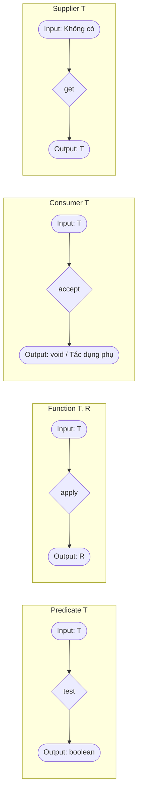

# Interface Chức Năng - Phần 2 (Functional Interface - Part 2)

## Mục Tiêu Học Tập (Learning Goal)

Tài liệu này đề cập đến một phần trọng tâm của **Interface Chức Năng**. Hãy nghiên cứu từng khái niệm như một quy tắc Java thực tế, chứ không phải là những thuật ngữ riêng lẻ.

## Phạm Vi Outline (Outline Coverage)

| Khái niệm (Concept) | Những điều cần biết (What to know) |
| --- | --- |
| `What is the output?` | Đầu ra là gì (What is the output) là một câu hỏi then chốt để hiểu về Interface chức năng. |
| `When to use which interface?` | Khi nào sử dụng interface nào? là một khái niệm cụ thể trong Interface chức năng; hãy tìm hiểu quy tắc Java, các trường hợp sử dụng hợp lệ và lỗi thường gặp của nó thay vì chỉ biết mỗi tên gọi. |

## Ghi Chú Chi Tiết (Detailed Notes)

### Đầu ra là gì? (What is the output?)

Đầu ra là gì (What is the output) là một câu hỏi then chốt để hiểu về Interface chức năng.

Sử dụng nó để dự đoán quy tắc Java chính xác, dạng được cho phép và lỗi thường gặp. Hãy ôn tập nó với một ví dụ nhỏ thay vì chỉ ghi nhớ nhãn tên.

Kiểm tra thực tế:
- Định nghĩa `What is the output?` trong một câu.
- Nhận biết `What is the output?` trong mã nguồn, câu lệnh, tài liệu hoặc câu hỏi phỏng vấn.
- Giải thích một lỗi, hạn chế hoặc đánh đổi liên quan đến `What is the output?`.

Ví dụ nhỏ hoặc mô hình tư duy:
- Khi đọc mã nguồn, hãy hỏi: `What is the output?` thay đổi, cho phép, từ chối hoặc làm rõ điều gì?

#### Giải thích chi tiết và Ví dụ mã nguồn
Kiểu trả về (đầu ra) của phương thức trừu tượng trong interface chức năng xác định cách nó có thể được sử dụng trong mã nguồn.
- `void`: Được sử dụng cho các tác dụng phụ (ví dụ: `Consumer`).
- `boolean`: Được sử dụng để lọc và kiểm tra các điều kiện (ví dụ: `Predicate`).
- Một kiểu generic/nguyên thủy: Được sử dụng cho các phép ánh xạ và tính toán (ví dụ: `Function`, `Supplier`).

```java
import java.util.function.*;

public class OutputExample {
    public static void main(String[] args) {
        // Đầu ra là void: chỉ thực hiện các tác dụng phụ
        Consumer<String> consumer = s -> System.out.println("Đang xử lý " + s);
        
        // Đầu ra là boolean: kiểm tra các điều kiện
        Predicate<Integer> isPositive = n -> n > 0;
        
        // Đầu ra là một kiểu cụ thể: trả về một giá trị
        Supplier<String> supplier = () -> "Hello World";
        Function<String, Integer> lengthMapper = String::length;
    }
}
```

---

### Khi nào sử dụng interface nào? (When to use which interface?)

Khi nào sử dụng interface nào? là một khái niệm cụ thể trong Interface chức năng; hãy tìm hiểu quy tắc Java, các trường hợp sử dụng hợp lệ và lỗi thường gặp của nó thay vì chỉ biết mỗi tên gọi.

Sử dụng nó để dự đoán quy tắc Java chính xác, dạng được cho phép và lỗi thường gặp. Hãy ôn tập nó với một ví dụ nhỏ thay vì chỉ ghi nhớ nhãn tên.

Kiểm tra thực tế:
- Định nghĩa `Khi nào sử dụng interface nào?` trong một câu.
- Nhận biết `Khi nào sử dụng interface nào?` trong mã nguồn, câu lệnh, tài liệu hoặc câu hỏi phỏng vấn.
- Giải thích một lỗi, hạn chế hoặc đánh đổi liên quan đến `Khi nào sử dụng interface nào?`.

Ví dụ nhỏ hoặc mô hình tư duy:
- Khi đọc mã nguồn, hãy hỏi: `Khi nào sử dụng interface nào?` thay đổi, cho phép, từ chối hoặc làm rõ điều gì?

#### Ma Trận Quyết Định (Decision Matrix)
Sử dụng hướng dẫn này để chọn interface chức năng phù hợp dựa trên số lượng đầu vào và kiểu đầu ra:

| Đầu vào (Inputs) | Đầu ra (Output) | Interface Tiêu chuẩn | Ví dụ Kiểu Nguyên Thủy | Biến thể Kép (Bi) |
|--------|--------|--------------------|-------------------|------------|
| 0 | Kiểu `T` | `Supplier<T>` | `IntSupplier` | N/A |
| 1 (`T`) | `void` | `Consumer<T>` | `DoubleConsumer` | `BiConsumer<T, U>` |
| 1 (`T`) | `boolean`| `Predicate<T>` | `LongPredicate` | `BiPredicate<T, U>`|
| 1 (`T`) | Kiểu `R` | `Function<T, R>` | `ToIntFunction<T>` | `BiFunction<T, U, R>`|
| 1 (`T`) | Kiểu `T` | `UnaryOperator<T>`| `IntUnaryOperator` | N/A |
| 2 (`T`, `T`)| Kiểu `T` | `BinaryOperator<T>`| `IntBinaryOperator`| N/A |

---

## Tại Sao Các Kiểu Hợp Đồng Chức Năng Lại Khác Nhau (Why Functional Contract Styles Differ)

Các interface chức năng tiêu chuẩn của JDK trong gói `java.util.function` được cấu trúc thành các kiểu hợp đồng (contract style) khác nhau dựa trên các đầu vào và đầu ra toán học của chúng. `Predicate` được thiết kế để kiểm tra điều kiện và lọc, nhận một đối số và trả về một giá trị boolean. `Function` hoạt động như một bộ chuyển đổi, ánh xạ một đầu vào của kiểu này sang một đầu ra của kiểu khác. `Consumer` hoạt động như một điểm đích cuối cùng hoặc bộ thực thi hành động, nhận một đầu vào và không trả về gì (void), điều này thường kích hoạt một tác dụng phụ như ghi log hoặc cập nhật cơ sở dữ liệu. Cuối cùng, `Supplier` đại diện cho một nhà máy hoặc nguồn cung cấp, không nhận đầu vào nào và tạo ra một giá trị một cách lười biếng khi được yêu cầu. Các hợp đồng tường minh này cho phép lập trình viên tuyên bố ý định ngữ nghĩa rõ ràng cho các phương thức, cho phép các đường ống xử lý sạch sẽ như các đường ống trong Stream API.



### Ví dụ mã nguồn: Các hợp đồng chức năng (Code Example: Functional Contracts)

```java
import java.util.function.*;

public class ContractDemo {
    public static void main(String[] args) {
        // Predicate: Đầu vào T, Đầu ra boolean
        Predicate<String> isShort = s -> s.length() < 5;
        
        // Function: Đầu vào T, Đầu ra R
        Function<String, Integer> parseToInt = Integer::parseInt;
        
        // Consumer: Đầu vào T, Đầu ra void
        Consumer<String> logger = msg -> System.out.println("LOG: " + msg);
        
        // Supplier: Đầu vào void, Đầu ra T
        Supplier<Double> randomNum = Math::random;
        
        System.out.println(isShort.test("Java"));   // Kết quả: true
        System.out.println(parseToInt.apply("123")); // Kết quả: 123
        logger.accept("Đang kiểm thử đường ống");     // Kết quả: LOG: Đang kiểm thử đường ống
        System.out.println(randomNum.get() != null); // Kết quả: true
    }
}
```

### Chuỗi nguyên nhân - kết quả (Cause-Effect Chain)
- **Các hợp đồng chức năng riêng biệt được định nghĩa** $\rightarrow$ Các API chỉ định chính xác các đối số interface (ví dụ: Stream.filter yêu cầu Predicate, Stream.map yêu cầu Function) $\rightarrow$ Trình biên dịch bắt buộc cấu trúc lambda phải khớp với các hợp đồng này $\rightarrow$ Đảm bảo các đường ống xử lý khai báo an toàn về kiểu và dễ đọc.

---

### Case Study: Thiết kế một interface chức năng tùy chỉnh cho đường ống xử lý với các phương thức liên kết chuỗi mặc định (Case Study: Designing a custom functional interface for a processing pipeline with default chaining methods)

Trong các ứng dụng thực tế, bạn có thể cần một đường ống xử lý tùy chỉnh vượt ra ngoài các interface chức năng tiêu chuẩn của JDK. Dưới đây là một triển khai hoàn chỉnh của interface chức năng tùy chỉnh `DataProcessor<T>` có các phương thức liên kết chuỗi mặc định (`andThen` và `compose`).

```java
import java.util.Objects;

@FunctionalInterface
public interface DataProcessor<T> {
    
    /**
     * Xử lý dữ liệu đầu vào và trả về kết quả đã xử lý.
     */
    T process(T data);

    /**
     * Trả về một DataProcessor liên kết chuỗi áp dụng bộ xử lý này trước,
     * sau đó áp dụng bộ xử lý 'after' cho kết quả.
     */
    default DataProcessor<T> andThen(DataProcessor<T> after) {
        Objects.requireNonNull(after);
        return (T data) -> after.process(this.process(data));
    }

    /**
     * Trả về một DataProcessor liên kết chuỗi áp dụng bộ xử lý 'before' trước,
     * sau đó áp dụng bộ xử lý này cho kết quả.
     */
    default DataProcessor<T> compose(DataProcessor<T> before) {
        Objects.requireNonNull(before);
        return (T data) -> this.process(before.process(data));
    }
}
```

#### Minh họa Đường Ống Xử Lý (Pipeline Demonstration)
Dưới đây là cách chúng ta sử dụng `DataProcessor` tùy chỉnh để làm sạch, chuẩn hóa và định dạng một văn bản đầu vào thô:

```java
public class PipelineDemo {
    public static void main(String[] args) {
        // Định nghĩa các giai đoạn riêng lẻ của đường ống xử lý
        DataProcessor<String> stripWhitespace = String::strip;
        DataProcessor<String> toLowerCase = String::toLowerCase;
        DataProcessor<String> sanitize = s -> s.replaceAll("[^a-zA-Z0-9 ]", "");
        DataProcessor<String> formatOutput = s -> "[" + s.replace(" ", "_") + "]";

        // Liên kết các bộ xử lý lại với nhau bằng andThen
        DataProcessor<String> textPipeline = stripWhitespace
                .andThen(toLowerCase)
                .andThen(sanitize)
                .andThen(formatOutput);

        String rawInput = "   Hello, World! Java 21 is great.   ";
        String processed = textPipeline.process(rawInput);
        
        System.out.println("Thô: '" + rawInput + "'");
        System.out.println("Đã xử lý: " + processed);
        // Kết quả đầu ra -> Đã xử lý: [hello_world_java_21_is_great]
    }
}
```

---

## Tại Sao Các Interface Chức Năng Tận Dụng Các Phương thức Mặc Định Để Liên Kết Chuỗi (Why Functional Interfaces Leverage Default Methods for Chaining)

Các interface chức năng được phép chứa các phương thức `default` và `static` bên cạnh phương thức trừu tượng duy nhất của chúng mà không vi phạm hợp đồng chức năng. Tính năng JLS này được Java tận dụng để triển khai kết hợp hàm (functional composition), cho phép các lập trình viên liên kết chuỗi các hoạt động lại với nhau một cách linh hoạt tại thời điểm chạy. Ví dụ, `Predicate` chứa các phương thức mặc định như `and()`, `or()`, và `negate()`, trả về một `Predicate` kết hợp mới đại diện cho liên kết logic của các predicate ban đầu. Tương tự, `Function` bao gồm `andThen()` và `compose()` để chạy các bước chuyển đổi tuần tự. Bởi vì các phương thức mặc định cung cấp các triển khai cụ thể, chúng không được tính là trừu tượng, cho phép các interface chức năng vẫn là đích đến của biểu thức lambda trong khi cung cấp các API khai báo mạnh mẽ.

```mermaid
flowchart LR
    Input([Đầu vào x]) --> P1[Predicate A: test x]
    P1 -->|true| P2[Predicate B: test x]
    P1 -->|false| False([false])
    P2 -->|true| True([true])
    P2 -->|false| False
    style P1 fill:#f9f,stroke:#333,stroke-width:2px
    style P2 fill:#bbf,stroke:#333,stroke-width:2px
    subgraph ComposedPredicate [a.and(b)]
    P1
    P2
    end
```

### Ví dụ mã nguồn: Liên kết chuỗi các Predicate (Code Example: Composed Predicates)

```java
import java.util.function.Predicate;

public class ChainingDemo {
    public static void main(String[] args) {
        Predicate<String> hasLetterA = s -> s.contains("a");
        Predicate<String> isLongerThan3 = s -> s.length() > 3;
        
        // Kết hợp bằng phương thức mặc định and()
        Predicate<String> composed = hasLetterA.and(isLongerThan3);
        
        // Kết hợp bằng phương thức mặc định negate()
        Predicate<String> negated = composed.negate();
        
        System.out.println(composed.test("apple")); // Kết quả: true
        System.out.println(composed.test("art"));   // Kết quả: false (độ dài <= 3)
        System.out.println(negated.test("art"));    // Kết quả: true
    }
}
```

### Chuỗi nguyên nhân - kết quả (Cause-Effect Chain)
- **Phương thức mặc định cụ thể được khai báo trong interface** $\rightarrow$ Trình biên dịch cho phép triển khai mà không yêu cầu tạo lớp con hoặc phá vỡ trạng thái SAM $\rightarrow$ Các lambda có thể gọi trực tiếp các phương thức mặc định $\rightarrow$ Các hàm kết hợp có thể được xây dựng động tại thời điểm chạy.

---

## Các Lỗi Thường Gặp (Common Mistakes)

### 1. Mơ hồ về thứ tự liên kết chuỗi
Nhầm lẫn giữa `andThen` với `compose` có thể dẫn đến việc đường ống xử lý thực hiện sai trình tự, dẫn đến kết quả dữ liệu bị hỏng hoặc không mong muốn. Hãy luôn ghi nhớ:
- `a.andThen(b)` thực thi `a` trước, sau đó đến `b`.
- `a.compose(b)` thực thi `b` trước, sau đó đến `a`.

### 2. Truyền null vào phương thức liên kết chuỗi mặc định
Các phương thức liên kết chuỗi trong cả interface chức năng tùy chỉnh và của JDK (như `Function.andThen`) sẽ ném ra `NullPointerException` tại thời điểm kết hợp (chứ không phải lúc thực thi) nếu `null` được truyền vào dưới dạng đối số liên kết chuỗi.

---

## Các Câu Hỏi Ôn Tập Thường Gặp (Common Review Prompts)

- Những khái niệm nào ở đây là quy tắc tại thời điểm biên dịch (compile-time)?
- Những khái niệm nào ở đây ảnh hưởng đến hành vi tại thời điểm chạy (runtime)?
- Những khái niệm nào ở đây có khả năng là bẫy khi phỏng vấn?
