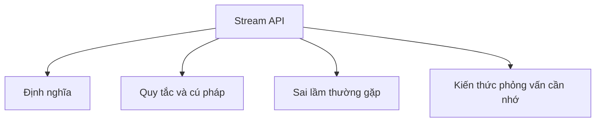

# 23 - Stream API

Chủ đề này bám sát đề cương chính trong [outline.md](../outline.md). Mục tiêu là hiểu sâu sắc từng khái niệm để có thể giải thích, nhận biết trong mã nguồn và trả lời các câu hỏi phỏng vấn.

## Thứ Tự Học Tập

- [Khái niệm Stream là gì](theory/01-what-is-stream-concepts.md)
- [Khái niệm LongStream](theory/02-longstream-concepts.md)
- [Khái niệm Peek](theory/03-peek-concepts.md)
- [Khái niệm Min](theory/04-min-concepts.md)
- [Khái niệm Đánh giá lười biếng (Lazy Evaluation)](theory/05-lazy-evaluation-concepts.md)
- [Khái niệm PartitioningBy](theory/06-partitioningby-concepts.md)
- [Thuật Ngữ Khóa](terms/01-key-terms.md)

## Danh Sách Nội Dung

- Stream là gì?
- Stream so với Collection
- Tạo Stream:
  - từ List
  - từ Mảng (Array)
  - từ Map
  - Stream.of
- IntStream
- LongStream
- DoubleStream
- Các hoạt động trung gian (Intermediate operations):
  - filter
  - map
  - flatMap
  - distinct
  - sorted
  - peek
  - limit
  - skip
- Các hoạt động kết thúc (Terminal operations):
  - forEach
  - collect
  - toList
  - count
  - min
  - max
  - reduce
  - anyMatch
  - allMatch
  - noneMatch
  - findFirst
  - findAny
- Đánh giá lười biếng (Lazy evaluation)
- Xử lý ngắn mạch (Short-circuiting)
- Luồng song song (Parallel stream)
- Các bộ thu gom (Collectors):
  - toSet
  - toMap
  - joining
  - groupingBy
  - partitioningBy
  - counting
  - summarizingInt
  - mapping
  - reducing

## Tự Kiểm Tra

Trước khi chuyển sang chủ đề tiếp theo, hãy xác nhận rằng bạn có thể trả lời các câu hỏi sau:
1. Tại sao các Stream trong Java lại được đánh giá lười biếng (lazily evaluated), và đường ống xử lý phân tách các hoạt động trung gian (như `filter`, `map`) khỏi các hoạt động kết thúc (như `collect`, `forEach`) ở cấp độ JVM như thế nào?
   &rarr; Xem [Why Streams Are Lazily Evaluated](theory/05-lazy-evaluation-concepts.md#why-streams-are-lazily-evaluated)
2. Tại sao bạn nên tránh sử dụng `peek()` cho việc thay đổi trạng thái ở mức độ môi trường sản xuất (production-level state mutation), và sự khác biệt giữa thực thi `peek()` trong ngữ cảnh trung gian so với ngữ cảnh kết thúc là gì?
   &rarr; Xem [Why peek() Should Not Be Used for State Mutation](theory/03-peek-concepts.md#why-peek-should-not-be-used-for-state-mutation)
3. Tại sao `flatMap()` lại khác biệt so với `map()`, và nó làm phẳng (flatten) các bộ sưu tập lồng nhau thành một luồng phần tử duy nhất như thế nào?
   &rarr; Xem [Why flatMap() Differs from map()](theory/02-longstream-concepts.md#why-flatmap-differs-from-map)
4. Tại sao các luồng nguyên thủy (primitive stream - như `IntStream`, `LongStream`, `DoubleStream`) tồn tại, và chúng tránh chi phí hiệu năng của việc tự động đóng hộp (auto-boxing) và mở hộp (unboxing) như thế nào?
   &rarr; Xem [Why Primitive Streams Exist and Avoid Autoboxing](theory/01-what-is-stream-concepts.md#why-primitive-streams-exist-and-avoid-autoboxing)
5. Tại sao luồng song song (parallel stream) không phải là giải pháp mặc định để mở rộng hiệu năng, và đặc tính của bể luồng (thread pool - ForkJoinPool) cùng việc chia tách dữ liệu xác định hiệu năng của luồng song song như thế nào?
   &rarr; Xem [Why Parallel Streams Are Not a Default Solution](theory/05-lazy-evaluation-concepts.md#why-parallel-streams-are-not-a-default-solution)
6. Tại sao các bộ thu gom như `groupingBy` và `partitioningBy` phục vụ các mục đích tổng hợp khác nhau, và cách chúng phân nhóm các giá trị vào các cấu trúc Map nội bộ như thế nào?
   &rarr; Xem [Why groupingBy and partitioningBy Serve Different Purposes](theory/06-partitioningby-concepts.md#why-groupingby-and-partitioningby-serve-different-purposes)

## Thẻ Anki

- [Basic](anki/basic.tsv)
- [Basic Extra](anki/basic-extra.tsv)
- [Cloze](anki/cloze.tsv)
- [Code Question](anki/code-question.tsv)

## Sơ Đồ Mermaid Tổng Quan

## Liên Kết Tham Khảo

- https://docs.oracle.com/en/java/javase/21/docs/api/java.base/java/util/stream/package-summary.html
- https://docs.oracle.com/javase/tutorial/collections/streams/
