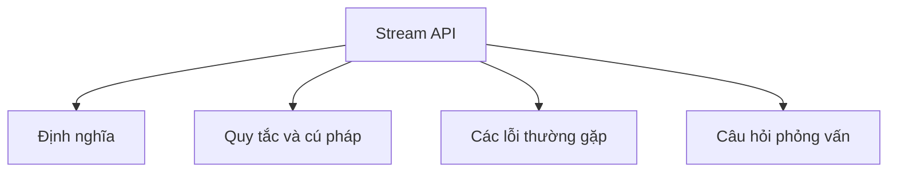

# 23 - Stream API

Chủ đề này tuân theo đề cương chính trong [outline.md](../outline.md). Mục tiêu là hiểu sâu sắc từng khái niệm để có thể giải thích, nhận biết trong mã nguồn và trả lời các câu hỏi phỏng vấn.

## Thứ Tự Học Tập (Study Order)

- [Khái niệm Stream (What Is Stream Concepts)](theory/01-what-is-stream-concepts.md)
- [Khái niệm Longstream (Longstream Concepts)](theory/02-longstream-concepts.md)
- [Khái niệm Peek (Peek Concepts)](theory/03-peek-concepts.md)
- [Khái niệm Min (Min Concepts)](theory/04-min-concepts.md)
- [Khái niệm Đánh giá lười biếng (Lazy Evaluation Concepts)](theory/05-lazy-evaluation-concepts.md)
- [Khái niệm Partitioningby (Partitioningby Concepts)](theory/06-partitioningby-concepts.md)
- [Thuật ngữ chính (Key Terms)](terms/01-key-terms.md)

## Danh Sách Kiểm Tra Đề Cương (Outline Checklist)

- Stream là gì? (What is Stream?)
- Stream so với Collection (Stream vs Collection)
- Tạo Stream (Create Stream):
  - từ List (from List)
  - từ Mảng (from Array)
  - từ Map (from Map)
  - `Stream.of`
- `IntStream`
- `LongStream`
- `DoubleStream`
- Các thao tác trung gian (Intermediate operations):
  - `filter`
  - `map`
  - `flatMap`
  - `distinct`
  - `sorted`
  - `peek`
  - `limit`
  - `skip`
- Các thao tác cuối (Terminal operations):
  - `forEach`
  - `collect`
  - `toList`
  - `count`
  - `min`
  - `max`
  - `reduce`
  - `anyMatch`
  - `allMatch`
  - `noneMatch`
  - `findFirst`
  - `findAny`
- Đánh giá lười biếng (Lazy evaluation)
- Ngắn mạch (Short-circuiting)
- Stream song song (Parallel stream)
- Các bộ thu gom (Collectors):
  - `toSet`
  - `toMap`
  - `joining`
  - `groupingBy`
  - `partitioningBy`
  - `counting`
  - `summarizingInt`
  - `mapping`
  - `reducing`

## Tự Kiểm Tra (Self-Check)

Trước khi chuyển sang chủ đề tiếp theo, hãy xác minh rằng bạn có thể trả lời các câu hỏi sau:
1. Tại sao các Stream trong Java lại được đánh giá lười biếng (lazily evaluated), và làm thế nào đường ống phân tách các thao tác trung gian (như `filter`, `map`) khỏi các thao tác cuối (như `collect`, `forEach`) ở cấp độ JVM?
   &rarr; Xem [Tại Sao Stream Được Đánh Giá Lười Biếng](theory/05-lazy-evaluation-concepts.md#why-streams-are-lazily-evaluated)
2. Tại sao bạn nên tránh sử dụng `peek()` cho việc thay đổi trạng thái trong môi trường production, và sự khác biệt giữa việc thực thi `peek()` trong ngữ cảnh trung gian so với ngữ cảnh cuối là gì?
   &rarr; Xem [Tại Sao Không Nên Sử Dụng peek() Để Thay Đổi Trạng Thái](theory/03-peek-concepts.md#why-peek-should-not-be-used-for-state-mutation)
3. Tại sao `flatMap()` lại khác với `map()`, và làm thế nào nó làm phẳng (flatten) các collection lồng nhau thành một stream phần tử duy nhất?
   &rarr; Xem [Tại Sao flatMap() Khác Với map()](theory/02-longstream-concepts.md#why-flatmap-differs-from-map)
4. Tại sao các primitive stream (như `IntStream`, `LongStream`, `DoubleStream`) lại tồn tại, và làm thế nào chúng tránh được chi phí hiệu năng của việc tự động đóng hộp và mở hộp?
   &rarr; Xem [Tại Sao Primitive Stream Tồn Tại Và Tránh Autoboxing](theory/01-what-is-stream-concepts.md#why-primitive-streams-exist-and-avoid-autoboxing)
5. Tại sao parallel stream (stream song song) không phải là giải pháp mặc định để mở rộng hiệu năng, và đặc điểm của luồng (Thread) (ForkJoinPool) cùng việc phân tách dữ liệu nào quyết định hiệu năng của parallel stream?
   &rarr; Xem [Tại Sao Parallel Stream Không Phải Giải Pháp Mặc Định](theory/05-lazy-evaluation-concepts.md#why-parallel-streams-are-not-a-default-solution)
6. Tại sao các collector như `groupingBy` và `partitioningBy` lại phục vụ các mục đích tổng hợp dữ liệu khác nhau, và cách chúng phân nhóm các giá trị vào các cấu trúc Map ở bên dưới là gì?
   &rarr; Xem [Tại Sao groupingBy Và partitioningBy Phục Vụ Các Mục Đích Khác Nhau](theory/06-partitioningby-concepts.md#why-groupingby-and-partitioningby-serve-different-purposes)

## Thẻ Anki (Anki Cards)

- [Cơ bản (Basic)](anki/basic.tsv)
- [Cơ bản Mở rộng (Basic Extra)](anki/basic-extra.tsv)
- [Điền vào chỗ trống (Cloze)](anki/cloze.tsv)
- [Câu hỏi code (Code Question)](anki/code-question.tsv)

## Biểu Đồ Tổng Quan Mermaid (Mermaid Overview)

## Liên Kết Tham Khảo (Reference Links)

- https://docs.oracle.com/en/java/javase/21/docs/api/java.base/java/util/stream/package-summary.html
- https://docs.oracle.com/javase/tutorial/collections/streams/
