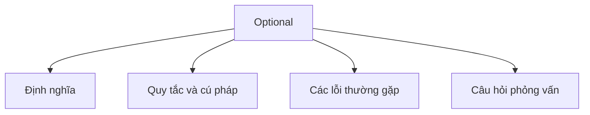

# 24 - Optional

Chủ đề này tuân theo đề cương chính trong [outline.md](../outline.md). Mục tiêu là hiểu sâu sắc từng khái niệm để có thể giải thích, nhận biết trong mã nguồn và trả lời các câu hỏi phỏng vấn.

## Thứ Tự Học Tập (Study Order)

- [Khái niệm Optional T (What Is Optional T Concepts)](theory/01-what-is-optional-t-concepts.md)
- [Khái niệm Map (Map Concepts)](theory/02-map-concepts.md)
- [Thuật ngữ chính (Key Terms)](terms/01-key-terms.md)

## Danh Sách Kiểm Tra Đề Cương (Outline Checklist)

- `Optional<T>` là gì? (What is Optional<T>?)
- Tránh ngoại lệ NullPointerException (Avoid NullPointerException)
- `Optional.of`
- `Optional.ofNullable`
- `Optional.empty`
- `isPresent`
- `ifPresent`
- `orElse`
- `orElseGet`
- `orElseThrow`
- `map`
- `flatMap`
- `filter`
- Không lạm dụng Optional (Do not overuse Optional)
- Optional trong kiểu trả về (Optional in return type)

## Tự Kiểm Tra (Self-Check)

1. Tại sao `Optional` được thiết kế dưới dạng lớp bao bọc (wrapper) chứ không phải là sự thay thế cho null trong các thuộc tính trường (field) hoặc tham số?
2. Chi phí hiệu năng của việc sử dụng `Optional` trong các vòng lặp hoặc các trường thuộc tính là gì?
3. Sự khác biệt giữa `orElse()` và `orElseGet()` xét về mặt đánh giá chủ động (eager evaluation) so với đánh giá lười biếng (lazy evaluation) là gì?
4. Tại sao việc trả về null từ một phương thức có kiểu trả về là `Optional` lại vi phạm hợp đồng thiết kế API của nó?
5. Sự khác biệt chính giữa các phương thức `map()` và `flatMap()` của `Optional` xét về mặt chữ ký phương thức và hành vi bao bọc (wrapping) là gì?
6. Tại sao `flatMap()` có thể ném ra ngoại lệ `NullPointerException` khi hàm ánh xạ trả về null, trong khi `map()` thì không?
7. Tại sao `Optional` không triển khai `Serializable`, và ý nghĩa của điều này đối với thiết kế lớp trong Java là gì?

## Thẻ Anki (Anki Cards)

- [Cơ bản (Basic)](anki/basic.tsv)
- [Cơ bản Mở rộng (Basic Extra)](anki/basic-extra.tsv)
- [Điền vào chỗ trống (Cloze)](anki/cloze.tsv)
- [Câu hỏi code (Code Question)](anki/code-question.tsv)

## Biểu Đồ Tổng Quan Mermaid (Mermaid Overview)

## Liên Kết Tham Khảo (Reference Links)

- https://docs.oracle.com/en/java/javase/21/docs/api/java.base/java/util/Optional.html
