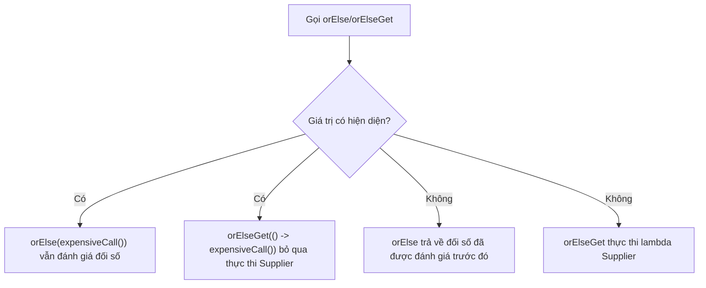

# Optional - Phần 1 (Optional - Part 1)

## Mục tiêu học tập (Learning Goal)

Tài liệu này bao gồm một phần tập trung của **Optional**. Hãy nghiên cứu từng khái niệm như một quy tắc Java thực tế, chứ không phải như các từ vựng rời rạc.

## Phạm vi đề cương (Outline Coverage)

| Khái niệm (Concept) | Điều cần biết (What to know) |
| --- | --- |
| `What is Optional<T>?` | Optional là một bộ chứa (container) có thể chứa hoặc không chứa một giá trị không null (non-null value). |
| `Avoid NullPointerException` | Một ngoại lệ (exception) đại diện cho một điều kiện bất thường mà chương trình có thể bắt lấy (catch) hoặc lan truyền (propagate). |
| `Optional.of` | Optional là một bộ chứa có thể chứa hoặc không chứa một giá trị không null. |
| `Optional.ofNullable` | Optional là một bộ chứa có thể chứa hoặc không chứa một giá trị không null. |
| `Optional.empty` | Optional là một bộ chứa có thể chứa hoặc không chứa một giá trị không null. |
| `isPresent` | `isPresent` là một khái niệm cụ thể trong Optional; hãy tìm hiểu quy tắc Java, các trường hợp sử dụng hợp lệ và chế độ lỗi (failure mode) của nó thay vì chỉ nhớ tên gọi. |
| `ifPresent` | `ifPresent` là một khái niệm cụ thể trong Optional; hãy tìm hiểu quy tắc Java, các trường hợp sử dụng hợp lệ và chế độ lỗi của nó thay vì chỉ nhớ tên gọi. |
| `orElse` | `orElse` là một khái niệm cụ thể trong Optional; hãy tìm hiểu quy tắc Java, các trường hợp sử dụng hợp lệ và chế độ lỗi của nó thay vì chỉ nhớ tên gọi. |
| `orElseGet` | `orElseGet` là một khái niệm cụ thể trong Optional; hãy tìm hiểu quy tắc Java, các trường hợp sử dụng hợp lệ và chế độ lỗi của nó thay vì chỉ nhớ tên gọi. |
| `orElseThrow` | `orElseThrow` trả về giá trị được bao bọc hoặc ném ra một ngoại lệ nếu giá trị đó vắng mặt. |

## Ghi chú chi tiết (Detailed Notes)

### Optional là gì? (What is Optional<T>?)

Optional là một bộ chứa có thể chứa hoặc không chứa một giá trị không null.

Sử dụng nó để dự đoán quy tắc Java chính xác, dạng được cho phép và chế độ lỗi. Hãy xem lại nó với một ví dụ nhỏ thay vì chỉ ghi nhớ nhãn của nó.

Kiểm tra thực tế (Practical check):

- Định nghĩa `What is Optional<T>?` trong một câu.
- Nhận biết `What is Optional<T>?` trong code, câu lệnh, tài liệu hoặc các câu hỏi phỏng vấn.
- Giải thích một lỗi, hạn chế hoặc sự đánh đổi liên quan đến `What is Optional<T>?`.

Ví dụ nhỏ hoặc mô hình tư duy (Tiny example or mental model):

- `Optional.ofNullable(value)` xử lý một giá trị có khả năng bị null.

#### Giải thích chi tiết (Detailed Explanation)
`Optional<T>` là một class `final` dựa trên giá trị (value-based class) trong package `java.util`. Nó bao bọc một tham chiếu kiểu `T` có thể là hiện diện (non-null) hoặc trống rỗng (empty). Bằng cách trả về `Optional<T>` từ một phương thức, bạn biến sự vắng mặt tiềm ẩn của một giá trị thành một phần của chữ ký phương thức (method signature), cảnh báo các API gọi phương thức (caller APIs) rằng họ phải xử lý trường hợp trống rỗng một cách rõ ràng.

#### Ví dụ code có thể chạy được (Runnable Code Example)
```java
import java.util.Optional;

public class OptionalIntroduction {
    public static void main(String[] args) {
        // Creating an Optional that contains a value
        Optional<String> optionalValue = Optional.of("Hello, Java!");
        
        // Checking and consuming the value
        if (optionalValue.isPresent()) {
            System.out.println("Value is: " + optionalValue.get()); // Prints: Value is: Hello, Java!
        }
    }
}
```

#### Lỗi thường gặp (Common Mistake)
Coi `Optional` như một sự thay thế trực tiếp cho tất cả các tham chiếu null hoặc sử dụng nó để bao bọc các biến cục bộ. Điều này gây ra chi phí cấp phát đối tượng bao bọc (wrapper allocation overhead) không cần thiết.

### Tránh NullPointerException (Avoid NullPointerException)

Một ngoại lệ đại diện cho một điều kiện bất thường mà chương trình có thể bắt lấy hoặc lan truyền.

Nó quan trọng vì hành vi của ngoại lệ quyết định xem các lỗi được xử lý cục bộ, lan truyền hay được phép dừng chương trình. Một sự nhầm lẫn phổ biến là coi mọi ngoại lệ đều giống nhau thay vì tách biệt các điều kiện có thể phục hồi khỏi lỗi lập trình.

Kiểm tra thực tế (Practical check):

- Định nghĩa `Avoid NullPointerException` trong một câu.
- Nhận biết `Avoid NullPointerException` trong code, câu lệnh, tài liệu hoặc các câu hỏi phỏng vấn.
- Giải thích một lỗi, hạn chế hoặc sự đánh đổi liên quan đến `Avoid NullPointerException`.

Ví dụ nhỏ hoặc mô hình tư duy (Tiny example or mental model):

- Khi đọc code, hãy hỏi: `Avoid NullPointerException` thay đổi, cho phép, từ chối hoặc làm rõ điều gì?

#### Giải thích chi tiết (Detailed Explanation)
Trong Java truyền thống, `null` thường được trả về để biểu thị sự vắng mặt của một giá trị. Nếu người gọi quên thực hiện kiểm tra null trước khi giải tham chiếu (dereferencing), một ngoại lệ `NullPointerException` (NPE) sẽ bị ném ra tại thời điểm chạy (runtime). `Optional` giúp tránh NPE bằng cách chuyển việc kiểm tra sự hiện diện từ mối nguy hiểm tại runtime sang một kiểm tra có cấu trúc, được trình biên dịch khuyến khích.

#### Ví dụ code có thể chạy được (Runnable Code Example)
```java
import java.util.Optional;

public class AvoidNPEExample {
    // Bad approach: returns null
    public static String getLegacyName(boolean exists) {
        return exists ? "Alice" : null;
    }

    // Good approach: returns Optional
    public static Optional<String> getOptionalName(boolean exists) {
        return exists ? Optional.of("Alice") : Optional.empty();
    }

    public static void main(String[] args) {
        // Bad: Can cause NullPointerException if not checked
        String name = getLegacyName(false);
        // System.out.println(name.toUpperCase()); // Throws NPE!

        // Good: Caller is forced to address the empty possibility
        Optional<String> optName = getOptionalName(false);
        String upperName = optName.map(String::toUpperCase).orElse("UNKNOWN");
        System.out.println(upperName); // Prints: UNKNOWN
    }
}
```

#### Lỗi thường gặp (Common Mistake)
Gọi `.get()` ngay lập tức trên một `Optional` mà không xác minh sự hiện diện. Nếu `Optional` trống rỗng, nó sẽ ném ra một `NoSuchElementException`, làm mất đi mục đích của việc tránh lỗi thời gian chạy.

### Optional.of

Optional là một bộ chứa có thể chứa hoặc không chứa một giá trị không null.

Sử dụng nó để dự đoán quy tắc Java chính xác, dạng được cho phép và chế độ lỗi. Hãy xem lại nó với một ví dụ nhỏ thay vì chỉ ghi nhớ nhãn của nó.

Kiểm tra thực tế (Practical check):

- Định nghĩa `Optional.of` trong một câu.
- Nhận biết `Optional.of` trong code, câu lệnh, tài liệu hoặc các câu hỏi phỏng vấn.
- Giải thích một lỗi, hạn chế hoặc sự đánh đổi liên quan đến `Optional.of`.

Ví dụ nhỏ hoặc mô hình tư duy (Tiny example or mental model):

- `Optional.ofNullable(value)` xử lý một giá trị có khả năng bị null.

#### Giải thích chi tiết (Detailed Explanation)
`Optional.of(T value)` là một phương thức factory tĩnh (static factory method) được sử dụng để tạo một `Optional` chứa một giá trị không null. Nếu giá trị được truyền vào là null, nó sẽ ngay lập tức ném ra một `NullPointerException` tại thời điểm tạo, ngăn không cho tham chiếu null lan truyền xa hơn.

#### Ví dụ code có thể chạy được (Runnable Code Example)
```java
import java.util.Optional;

public class OptionalOfExample {
    public static void main(String[] args) {
        // Creating with a valid non-null value
        Optional<String> valid = Optional.of("Java");
        System.out.println(valid.isPresent()); // true

        // Throws NullPointerException immediately at the creation line
        try {
            Optional<String> invalid = Optional.of(null);
        } catch (NullPointerException e) {
            System.out.println("NPE caught: Value cannot be null!");
        }
    }
}
```

#### Lỗi thường gặp (Common Mistake)
Truyền một tham chiếu có thể null vào `Optional.of(value)`. Nếu một tham chiếu có thể null, hãy luôn sử dụng `Optional.ofNullable(value)` thay thế.

### Optional.ofNullable

Optional là một bộ chứa có thể chứa hoặc không chứa một giá trị không null.

Sử dụng nó để dự đoán quy tắc Java chính xác, dạng được cho phép và chế độ lỗi. Hãy xem lại nó với một ví dụ nhỏ thay vì chỉ ghi nhớ nhãn của nó.

Kiểm tra thực tế (Practical check):

- Định nghĩa `Optional.ofNullable` trong một câu.
- Nhận biết `Optional.ofNullable` trong code, câu lệnh, tài liệu hoặc các câu hỏi phỏng vấn.
- Giải thích một lỗi, hạn chế hoặc sự đánh đổi liên quan đến `Optional.ofNullable`.

Ví dụ nhỏ hoặc mô hình tư duy (Tiny example or mental model):

- `Optional.ofNullable(value)` xử lý một giá trị có khả năng bị null.

#### Giải thích chi tiết (Detailed Explanation)
`Optional.ofNullable(T value)` là một phương thức factory tĩnh trả về một `Optional` mô tả giá trị nếu không null, ngược lại trả về một `Optional` trống rỗng (`Optional.empty()`). Đây là cách an toàn nhất để bao bọc các API cũ hoặc dữ liệu bên ngoài có thể trả về `null`.

#### Ví dụ code có thể chạy được (Runnable Code Example)
```java
import java.util.Optional;

public class OptionalOfNullableExample {
    public static void main(String[] args) {
        String name1 = "Bob";
        String name2 = null;

        // ofNullable with non-null wraps the value
        Optional<String> opt1 = Optional.ofNullable(name1);
        System.out.println(opt1.isPresent()); // true

        // ofNullable with null safely returns an empty Optional
        Optional<String> opt2 = Optional.ofNullable(name2);
        System.out.println(opt2.isPresent()); // false
        System.out.println(opt2 == Optional.empty()); // true
    }
}
```

#### Lỗi thường gặp (Common Mistake)
Lạm dụng `ofNullable` trên các giá trị được đảm bảo là không null. Nếu một giá trị được đảm bảo là không null, việc sử dụng `Optional.of()` hoạt động như một kiểm tra xác thực tự tài liệu hóa (self-documenting validation).

### Optional.empty

Optional là một bộ chứa có thể chứa hoặc không chứa một giá trị không null.

Sử dụng nó để dự đoán quy tắc Java chính xác, dạng được cho phép và chế độ lỗi. Hãy xem lại nó với một ví dụ nhỏ thay vì chỉ ghi nhớ nhãn của nó.

Kiểm tra thực tế (Practical check):

- Định nghĩa `Optional.empty` trong một câu.
- Nhận biết `Optional.empty` trong code, câu lệnh, tài liệu hoặc các câu hỏi phỏng vấn.
- Giải thích một lỗi, hạn chế hoặc sự đánh đổi liên quan đến `Optional.empty`.

Ví dụ nhỏ hoặc mô hình tư duy (Tiny example or mental model):

- `Optional.ofNullable(value)` xử lý một giá trị có khả năng bị null.

#### Giải thích chi tiết (Detailed Explanation)
`Optional.empty()` là một phương thức factory tĩnh trả về một thể hiện (instance) `Optional` trống rỗng. Java lưu trữ ẩn (cache) một thực thể đơn lẻ (singleton instance) trống rỗng duy nhất bên dưới, vì vậy nhiều lệnh gọi đến `Optional.empty()` sẽ trả về cùng một tham chiếu chính xác.

#### Ví dụ code có thể chạy được (Runnable Code Example)
```java
import java.util.Optional;

public class OptionalEmptyExample {
    public static void main(String[] args) {
        Optional<Integer> empty1 = Optional.empty();
        Optional<String> empty2 = Optional.empty();

        // They are reference-equal because Optional.empty() is cached
        System.out.println(empty1 == empty2); // true
    }
}
```

#### Lỗi thường gặp (Common Mistake)
Trả về `null` thay vì `Optional.empty()` từ một phương thức được thiết kế để trả về một `Optional`. Điều này buộc người gọi phải kiểm tra null trên chính bộ chứa `Optional`, gây ra các kiểm tra null lồng nhau và bỏ qua tính an toàn ở cấp độ kiểu dữ liệu.

### isPresent

`isPresent` là một khái niệm cụ thể trong Optional; hãy tìm hiểu quy tắc Java, các trường hợp sử dụng hợp lệ và chế độ lỗi của nó thay vì chỉ nhớ tên gọi.

Sử dụng nó để dự đoán quy tắc Java chính xác, dạng được cho phép và chế độ lỗi. Hãy xem lại nó với một ví dụ nhỏ thay vì chỉ ghi nhớ nhãn của nó.

Kiểm tra thực tế (Practical check):

- Định nghĩa `isPresent` trong một câu.
- Nhận biết `isPresent` trong code, câu lệnh, tài liệu hoặc các câu hỏi phỏng vấn.
- Giải thích một lỗi, hạn chế hoặc sự đánh đổi liên quan đến `isPresent`.

Ví dụ nhỏ hoặc mô hình tư duy (Tiny example or mental model):

- Khi đọc code, hãy hỏi: `isPresent` thay đổi, cho phép, từ chối hoặc làm rõ điều gì?

#### Giải thích chi tiết (Detailed Explanation)
`isPresent()` trả về `true` nếu có một giá trị hiện diện, ngược lại trả về `false`. Java 11 cũng giới thiệu `isEmpty()`, trả về `true` nếu trống rỗng. Cả hai đều là các phương thức truy vấn trạng thái (state-querying methods).

#### Ví dụ code có thể chạy được (Runnable Code Example)
```java
import java.util.Optional;

public class IsPresentExample {
    public static void main(String[] args) {
        Optional<String> opt = Optional.of("Hello");

        if (opt.isPresent()) {
            System.out.println("Length: " + opt.get().length()); // Length: 5
        }

        Optional<String> emptyOpt = Optional.empty();
        if (emptyOpt.isEmpty()) {
            System.out.println("Optional is indeed empty");
        }
    }
}
```

#### Lỗi thường gặp (Common Mistake)
Quay lại các kiểm tra kiểu dòng lệnh (imperative null-like checks) bằng cách sử dụng `if (opt.isPresent()) { ... opt.get() ... }`. Đây được gọi là "phản mô hình (anti-pattern) isPresent/get". Bất cứ khi nào có thể, hãy thay thế nó bằng các phương thức chức năng (functional methods) như `ifPresent`, `orElse`, hoặc `map`.

### ifPresent

`ifPresent` là một khái niệm cụ thể trong Optional; hãy tìm hiểu quy tắc Java, các trường hợp sử dụng hợp lệ và chế độ lỗi của nó thay vì chỉ nhớ tên gọi.

Sử dụng nó để dự đoán quy tắc Java chính xác, dạng được cho phép và chế độ lỗi. Hãy xem lại nó với một ví dụ nhỏ thay vì chỉ ghi nhớ nhãn của nó.

Kiểm tra thực tế (Practical check):

- Định nghĩa `ifPresent` trong một câu.
- Nhận biết `ifPresent` trong code, câu lệnh, tài liệu hoặc các câu hỏi phỏng vấn.
- Giải thích một lỗi, hạn chế hoặc sự đánh đổi liên quan đến `ifPresent`.

Ví dụ nhỏ hoặc mô hình tư duy (Tiny example or mental model):

- Khi đọc code, hãy hỏi: `ifPresent` thay đổi, cho phép, từ chối hoặc làm rõ điều gì?

#### Giải thích chi tiết (Detailed Explanation)
`ifPresent(Consumer<? super T> action)` nhận một lambda consumer và chỉ thực thi nó nếu có một giá trị hiện diện. Nếu Optional trống rỗng, nó không làm gì cả. Trong Java 9, `ifPresentOrElse(Consumer<? super T> action, Runnable emptyAction)` đã được giới thiệu để xử lý cả trường hợp hiện diện và vắng mặt.

#### Ví dụ code có thể chạy được (Runnable Code Example)
```java
import java.util.Optional;

public class IfPresentExample {
    public static void main(String[] args) {
        Optional<String> opt = Optional.of("Alice");

        // safe consumption without calling get()
        opt.ifPresent(name -> System.out.println("Hello, " + name));

        // Handling both paths with ifPresentOrElse
        Optional<String> emptyOpt = Optional.empty();
        emptyOpt.ifPresentOrElse(
            name -> System.out.println("Hello, " + name),
            () -> System.out.println("No name provided")
        ); // Prints: No name provided
    }
}
```

#### Lỗi thường gặp (Common Mistake)
Thực thi các khối code có tác dụng phụ (side effects) bên trong `ifPresent` khi cần một giá trị trả về. Nếu bạn muốn biến đổi giá trị và nhận về một kết quả, hãy sử dụng `map()` hoặc `flatMap()` thay vì thực hiện các tác dụng phụ bên trong `ifPresent`.

### orElse

`orElse` là một khái niệm cụ thể trong Optional; hãy tìm hiểu quy tắc Java, các trường hợp sử dụng hợp lệ và chế độ lỗi của nó thay vì chỉ nhớ tên gọi.

Sử dụng nó để dự đoán quy tắc Java chính xác, dạng được cho phép và chế độ lỗi. Hãy xem lại nó với một ví dụ nhỏ thay vì chỉ ghi nhớ nhãn của nó.

Kiểm tra thực tế (Practical check):

- Định nghĩa `orElse` trong một câu.
- Nhận biết `orElse` trong code, câu lệnh, tài liệu hoặc các câu hỏi phỏng vấn.
- Giải thích một lỗi, hạn chế hoặc sự đánh đổi liên quan đến `orElse`.

Ví dụ nhỏ hoặc mô hình tư duy (Tiny example or mental model):

- Khi đọc code, hãy hỏi: `orElse` thay đổi, cho phép, từ chối hoặc làm rõ điều gì?

#### Giải thích chi tiết (Detailed Explanation)
`orElse(T other)` trả về giá trị được bao bọc nếu hiện diện, ngược lại trả về giá trị mặc định `other`.
**Quy tắc hiệu năng quan trọng (Crucial Performance Rule)**: Biểu thức được truyền vào `orElse` được đánh giá nôn nóng (eagerly evaluated) tại thời điểm gọi phương thức, bất kể `Optional` có trống rỗng hay không.

#### Ví dụ code có thể chạy được (Runnable Code Example)
```java
import java.util.Optional;

public class OrElseExample {
    public static String getDefault() {
        System.out.println("getDefault() executed!");
        return "DefaultValue";
    }

    public static void main(String[] args) {
        Optional<String> presentOpt = Optional.of("Java");

        // Even though presentOpt is present, getDefault() IS still executed!
        String value = presentOpt.orElse(getDefault());
        System.out.println("Returned: " + value);
        // Output:
        // getDefault() executed!
        // Returned: Java
    }
}
```

#### Lỗi thường gặp (Common Mistake)
Sử dụng `orElse` để gọi các hàm khởi tạo (constructors), các phương thức có tác dụng phụ hoặc truy vấn cơ sở dữ liệu. Điều này dẫn đến suy giảm hiệu năng và các tác dụng phụ không mong muốn vì giá trị dự phòng được đánh giá ngay cả khi không cần thiết. Hãy sử dụng `orElseGet` để đánh giá giá trị dự phòng một cách lười (lazy evaluation).

### orElseGet

`orElseGet` là một khái niệm cụ thể trong Optional; hãy tìm hiểu quy tắc Java, các trường hợp sử dụng hợp lệ và chế độ lỗi của nó thay vì chỉ nhớ tên gọi.

Sử dụng nó để dự đoán quy tắc Java chính xác, dạng được cho phép và chế độ lỗi. Hãy xem lại nó với một ví dụ nhỏ thay vì chỉ ghi nhớ nhãn của nó.

Kiểm tra thực tế (Practical check):

- Định nghĩa `orElseGet` trong một câu.
- Nhận biết `orElseGet` trong code, câu lệnh, tài liệu hoặc các câu hỏi phỏng vấn.
- Giải thích một lỗi, hạn chế hoặc sự đánh đổi liên quan đến `orElseGet`.

Ví dụ nhỏ hoặc mô hình tư duy (Tiny example or mental model):

- Khi đọc code, hãy hỏi: `orElseGet` thay đổi, cho phép, từ chối hoặc làm rõ điều gì?

#### Giải thích chi tiết (Detailed Explanation)
`orElseGet(Supplier<? super T> supplier)` nhận một lambda `Supplier`. Nếu giá trị hiện diện, nó sẽ trả về trực tiếp giá trị đó. Nếu giá trị trống rỗng, nó sẽ đánh giá supplier và trả về kết quả. Việc này đánh giá giá trị dự phòng một cách lười (trì hoãn), tránh tổn thất hiệu năng khi giá trị mặc định là không cần thiết.

#### Ví dụ code có thể chạy được (Runnable Code Example)
```java
import java.util.Optional;

public class OrElseGetExample {
    public static String getDefault() {
        System.out.println("getDefault() executed lazily!");
        return "DefaultValue";
    }

    public static void main(String[] args) {
        Optional<String> presentOpt = Optional.of("Java");

        // getDefault() is NOT executed because presentOpt is present
        String value = presentOpt.orElseGet(() -> getDefault());
        System.out.println("Returned: " + value);
        
        Optional<String> emptyOpt = Optional.empty();
        // getDefault() IS executed because emptyOpt is empty
        String value2 = emptyOpt.orElseGet(() -> getDefault());
        System.out.println("Returned: " + value2);
    }
}
```

#### Lỗi thường gặp (Common Mistake)
Sử dụng `orElse` khi yêu cầu đánh giá lười, hoặc sử dụng `orElseGet` với một lambda trả về một hằng số tĩnh được phân bổ trước (điều này tạo ra chi phí không cần thiết cho đối tượng bao bọc lambda). Đối với các hằng số tĩnh, hãy sử dụng `orElse`.

## Tại sao orElse() và orElseGet() khác nhau về cơ chế đánh giá (Why orElse() and orElseGet() Differ in Evaluation Mechanics)

Sự khác biệt cơ bản giữa `orElse()` và `orElseGet()` nằm ở chiến lược đánh giá (evaluation strategy) của chúng: `orElse()` đánh giá đối số của nó một cách nôn nóng (tại thời điểm gọi phương thức), trong khi `orElseGet()` đánh giá lambda `Supplier` của nó một cách lười (chỉ khi `Optional` trống rỗng). Khi một lệnh gọi phương thức được truyền trực tiếp vào `orElse(expensiveCall())`, trình biên dịch Java sẽ đánh giá `expensiveCall()` trước để lấy giá trị trả về của nó, sau đó giá trị này được truyền dưới dạng đối số cho `orElse()`. Việc thực thi nôn nóng này xảy ra ngay cả khi `Optional` có chứa giá trị và giá trị dự phòng hoàn toàn bị loại bỏ. Ngược lại, `orElseGet(() -> expensiveCall())` chấp nhận một functional interface (`Supplier`), nghĩa là Java chỉ gọi phương thức chức năng `get()` bên trong `orElseGet()` nếu giá trị được bao bọc vắng mặt, tránh tiêu thụ tài nguyên vô ích.

### Mô hình tư duy: Phép so sánh với máy bán nước tự động (Mental Model: The Vending Machine Analogy)

Hãy tưởng tượng một máy bán nước tự động (vending machine):
- **Đánh giá nôn nóng (`orElse`)**: Mỗi lần bạn yêu cầu một đồ uống, chiếc máy sẽ chủ động mở và rót một cốc nước dự phòng trước, ngay cả khi đồ uống chính hoàn toàn có sẵn. Nếu đồ uống chính được phân phối, nó sẽ ném cốc nước dự phòng đã rót vào thùng rác.
- **Đánh giá lười (`orElseGet`)**: Chiếc máy chỉ bắt đầu rót cốc nước dự phòng nếu và khi vòi phun đồ uống chính đã hết hoàn toàn.



### Ví dụ code có thể chạy được (Runnable Code Example)

```java
import java.util.Optional;

public class OrElseEvaluationDemo {
    public static String fetchBackupFromDatabase() {
        System.out.println("Database queried for fallback!"); // Side effect!
        return "DatabaseBackup";
    }

    public static void main(String[] args) {
        Optional<String> optionalValue = Optional.of("PrimaryValue");

        System.out.println("--- Testing orElse (Eager) ---");
        // Eager evaluation: method is called even though optionalValue is present!
        String res1 = optionalValue.orElse(fetchBackupFromDatabase());
        System.out.println("Result: " + res1);
        // Output:
        // Database queried for fallback!
        // Result: PrimaryValue

        System.out.println("\n--- Testing orElseGet (Lazy) ---");
        // Lazy evaluation: Supplier is not triggered because optionalValue is present!
        String res2 = optionalValue.orElseGet(() -> fetchBackupFromDatabase());
        System.out.println("Result: " + res2);
        // Output:
        // Result: PrimaryValue
    }
}
```

### Chuỗi nhân quả (Cause-Effect Chain)
Đối số phương thức được truyền vào `orElse()` $\rightarrow$ Java Runtime đánh giá biểu thức đối số một cách nôn nóng trước khi đi vào phạm vi thực thi của `orElse()` $\rightarrow$ Phương thức phụ thực thi và phát sinh chi phí CPU/IO/Memory $\rightarrow$ Giá trị chính hiện diện $\rightarrow$ Đối số đã được đánh giá bị loại bỏ $\rightarrow$ Lãng phí hiệu năng và xảy ra các tác dụng phụ ngoài ý muốn.

### orElseThrow

`orElseThrow` trả về giá trị chứa bên trong nếu hiện diện, hoặc ném ra một ngoại lệ nếu trống rỗng.

Nó quan trọng vì nó cho phép các lập trình viên mở gói (unwrap) các `Optional` một cách an toàn trong các ngữ cảnh mà sự vắng mặt của giá trị là một điều kiện ngoại lệ. Một sự nhầm lẫn phổ biến là sử dụng `.get()` hoạt động tương tự nhưng thiếu đi mục đích tự tài liệu hóa và đã bị phản đối (deprecated)/được đánh dấu là ít được ưa chuộng hơn.

Kiểm tra thực tế (Practical check):

- Định nghĩa `orElseThrow` trong một câu.
- Nhận biết `orElseThrow` trong code, câu lệnh, tài liệu hoặc các câu hỏi phỏng vấn.
- Giải thích một lỗi, hạn chế hoặc sự đánh đổi liên quan đến `orElseThrow`.

Ví dụ nhỏ hoặc mô hình tư duy (Tiny example or mental model):

- `opt.orElseThrow(() -> new IllegalArgumentException("Required value missing"))`


#### Giải thích chi tiết (Detailed Explanation)
`orElseThrow()` trả về giá trị chứa bên trong nếu hiện diện. Nếu trống rỗng, nó sẽ ném ra một ngoại lệ `NoSuchElementException`. Trong Java 10, phương thức không tham số `orElseThrow()` đã được thêm vào như một giải pháp thay thế được ưu tiên cho `.get()`.
Bạn cũng có thể sử dụng `orElseThrow(Supplier<? extends X> exceptionSupplier)` để ném ra các ngoại lệ tùy chỉnh có kiểm tra (checked) hoặc không kiểm tra (unchecked).

#### Ví dụ code có thể chạy được (Runnable Code Example)
```java
import java.util.Optional;

public class OrElseThrowExample {
    public static void main(String[] args) {
        Optional<String> opt = Optional.empty();

        // Custom exception
        try {
            opt.orElseThrow(() -> new IllegalArgumentException("Missing parameter"));
        } catch (IllegalArgumentException e) {
            System.out.println("Caught: " + e.getMessage()); // Caught: Missing parameter
        }

        // Default NoSuchElementException (preferred over get())
        try {
            opt.orElseThrow();
        } catch (java.util.NoSuchElementException e) {
            System.out.println("Caught default NoSuchElementException");
        }
    }
}
```

#### Lỗi thường gặp (Common Mistake)
Sử dụng `.get()` thay vì `.orElseThrow()`. Mặc dù chúng hoạt động giống hệt nhau trong việc ném `NoSuchElementException` trên các optional trống rỗng, nhưng `orElseThrow()` tự tài liệu hóa và báo hiệu rõ ràng rằng hành vi ném ngoại lệ được mong đợi và xử lý.

## Liên kết tham khảo (Reference Links)

- https://docs.oracle.com/en/java/javase/21/docs/api/java.base/java/util/Optional.html#orElse(T) (Optional.orElse API Documentation)
- https://docs.oracle.com/en/java/javase/21/docs/api/java.base/java/util/Optional.html#orElseGet(java.util.function.Supplier) (Optional.orElseGet API Documentation)

## Các câu hỏi ôn tập thường gặp (Common Review Prompts)

- Khái niệm nào ở đây là quy tắc thời gian biên dịch (compile-time rules)?
- Khái niệm nào ở đây ảnh hưởng đến hành vi thời gian chạy (runtime behavior)?
- Khái niệm nào ở đây có khả năng là bẫy phỏng vấn?
