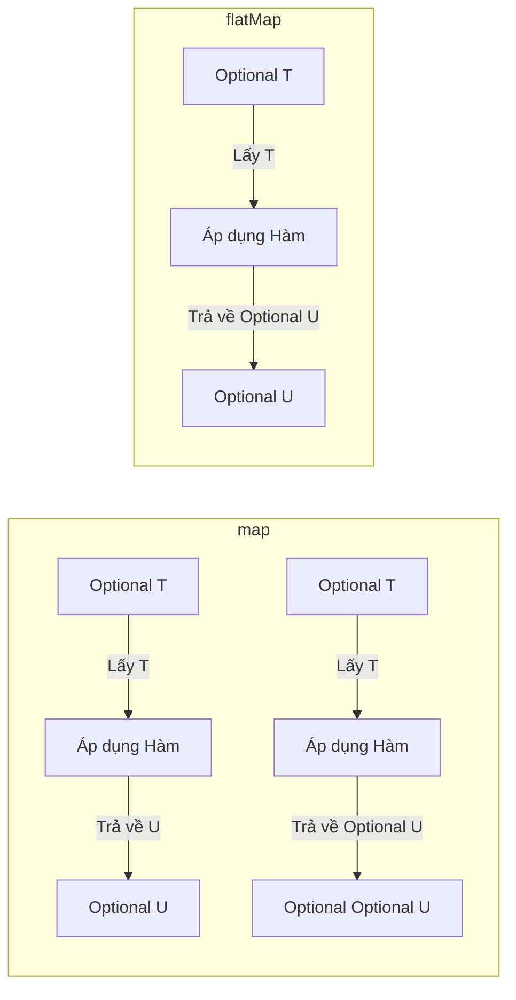
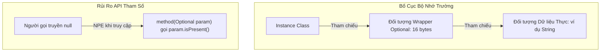

# Optional - Phần 2

## Mục Tiêu Học Tập

File này bao quát một phần tập trung của **Optional** (lớp tùy chọn). Hãy học từng khái niệm như một quy tắc Java thực tế, không phải từ vựng đơn độc.

## Phạm Vi Đề Cương

| Khái Niệm | Cần biết |
| --- | --- |
| `map` | `map` biến đổi giá trị được bọc nếu hiện diện và bọc kết quả trở lại thành Optional. |
| `flatMap` | `flatMap` biến đổi giá trị được bọc bằng hàm ánh xạ trả về Optional, tránh lồng nhau. |
| `filter` | `filter` là khái niệm cụ thể trong Optional; hãy học quy tắc Java, trường hợp dùng hợp lệ và chế độ thất bại. |
| `Do not overuse Optional` | Optional là container có thể chứa hoặc không chứa một giá trị khác null. |
| `Optional in return type` | Optional là container có thể chứa hoặc không chứa một giá trị khác null. |

## Ghi Chú Chi Tiết

### map

`map` biến đổi giá trị bên trong Optional nếu hiện diện, bọc kiểu thô được trả về trở lại thành Optional.

Điều này quan trọng vì nó cho phép xây dựng các pipeline hàm sạch mà không cần kiểm tra null thủ công ở từng bước. Một điểm nhầm lẫn thường gặp là dùng `map` khi hàm ánh xạ bản thân trả về Optional, dẫn đến `Optional<Optional<T>>` lồng nhau.

Kiểm tra thực tế:

- Định nghĩa `map` trong một câu.
- Nhận diện `map` trong code, lệnh, tài liệu hoặc câu hỏi phỏng vấn.
- Giải thích một lỗi, hạn chế hoặc đánh đổi liên quan đến `map`.

Ví dụ nhỏ hoặc mô hình tư duy:

- `opt.map(String::toUpperCase)`


#### Giải Thích Chi Tiết
`map(Function<? super T, ? extends U> mapper)` dùng để biến đổi giá trị bên trong `Optional`. Nếu giá trị hiện diện, nó áp dụng hàm ánh xạ lên giá trị đó. Nếu hàm ánh xạ trả về giá trị khác null, nó trả về `Optional` chứa kết quả đó. Nếu `Optional` rỗng hoặc mapper trả về `null`, nó trả về `Optional` rỗng.
Điều quan trọng: hàm ánh xạ trả về kiểu thô `U`, và `map` tự động bọc nó vào `Optional<U>`.

#### Ví Dụ Code Chạy Được
```java
import java.util.Optional;

public class OptionalMapExample {
    public static void main(String[] args) {
        Optional<String> opt = Optional.of("Hello");

        // Biến đổi chuỗi thành độ dài của nó
        Optional<Integer> length = opt.map(String::length);
        System.out.println(length.orElse(0)); // In ra: 5

        // Nếu mapper trả về null, map() trả về Optional rỗng
        Optional<String> nullResult = opt.map(val -> (String) null);
        System.out.println(nullResult.isPresent()); // In ra: false
    }
}
```

#### Lỗi Thường Gặp
Dùng `map` khi hàm ánh xạ bản thân trả về `Optional`. Điều này dẫn đến `Optional<Optional<U>>` lồng nhau. Trong trường hợp đó, hãy dùng `flatMap`.

### flatMap

`flatMap` biến đổi giá trị bên trong Optional nếu hiện diện, trong đó hàm ánh xạ trả về Optional trực tiếp.

Điều này quan trọng vì nó tránh bọc kết quả của hàm ánh xạ vào Optional lồng nhau (ví dụ: `Optional<Optional<T>>`), trả về Optional đơn đã làm phẳng thay thế. Một điểm nhầm lẫn thường gặp là `flatMap` sẽ ném `NullPointerException` nếu hàm ánh xạ trả về null, trong khi `map` trả về Optional rỗng một cách an toàn.

Kiểm tra thực tế:

- Định nghĩa `flatMap` trong một câu.
- Nhận diện `flatMap` trong code, lệnh, tài liệu hoặc câu hỏi phỏng vấn.
- Giải thích một lỗi, hạn chế hoặc đánh đổi liên quan đến `flatMap`.

Ví dụ nhỏ hoặc mô hình tư duy:

- `optUser.flatMap(User::getEmail)`


#### Giải Thích Chi Tiết
`flatMap(Function<? super T, ? extends Optional<? extends U>> mapper)` tương tự `map`, nhưng dùng khi hàm ánh xạ trả về `Optional`. Thay vì bọc `Optional` trả về vào một `Optional` khác, `flatMap` làm phẳng kết quả bằng cách trả về trực tiếp `Optional` của mapper.
**Lưu ý quan trọng**: Nếu hàm ánh xạ trả về `null`, `flatMap` ném `NullPointerException` (khác với `map` sẽ trả về Optional rỗng).

#### Ví Dụ Code Chạy Được
```java
import java.util.Optional;

class User {
    private final String name;
    private final Optional<String> email;

    public User(String name, String email) {
        this.name = name;
        this.email = Optional.ofNullable(email);
    }

    public Optional<String> getEmail() {
        return email;
    }
}

public class OptionalFlatMapExample {
    public static void main(String[] args) {
        Optional<User> userOpt = Optional.of(new User("Alice", "alice@example.com"));

        // Dùng map() trả về Optional<Optional<String>>
        Optional<Optional<String>> nested = userOpt.map(User::getEmail);

        // Dùng flatMap() trả về Optional<String> trực tiếp
        Optional<String> flattened = userOpt.flatMap(User::getEmail);
        System.out.println(flattened.orElse("Không có Email")); // alice@example.com
    }
}
```

#### Lỗi Thường Gặp
Nhầm lẫn giữa `map` và `flatMap` khi hàm ánh xạ trả về `Optional`. Nếu bạn thấy kiểu như `Optional<Optional<T>>` trong code, tức là bạn đã dùng `map` khi nên dùng `flatMap`.

## Tại Sao map() và flatMap() Khác Nhau Về Chữ Ký và Hành Vi Bao Bọc

Sự khác biệt cốt lõi giữa `map()` và `flatMap()` là cách chúng xử lý kiểu trả về của hàm ánh xạ. `map()` được thiết kế cho các hàm ánh xạ trả về giá trị thô; nó tự động bọc bất kỳ giá trị thô nào mapper trả về vào Optional mới. Nếu bạn truyền hàm ánh xạ bản thân trả về `Optional`, `map()` vẫn bọc nó lại, dẫn đến cấu trúc `Optional<Optional<T>>` lồng nhau. Ngược lại, `flatMap()` được thiết kế đặc biệt cho các hàm ánh xạ đã trả về `Optional`; nó trả về `Optional` đó trực tiếp mà không thêm lớp bao bọc. Thêm vào đó, một khác biệt cơ chế quan trọng: nếu hàm ánh xạ trả về `null`, `map()` bắt điều này và trả về `Optional.empty()` an toàn, trong khi `flatMap()` kiểm tra null rõ ràng và ném `NullPointerException` để ngăn optional lồng không hợp lệ.

### Mô Hình Tư Duy: Phép Ẩn Dụ Hộp Lồng Nhau

- **`map` (Tự Động Bọc)**: Bạn mở một hộp (Optional gốc), lấy vật phẩm ra, áp dụng thay đổi, và trình biên dịch tự động đặt vật phẩm đã thay đổi vào hộp mới. Nếu vật phẩm bạn lấy ra đã nằm trong hộp nhỏ hơn, bạn sẽ có hộp bên trong hộp.
- **`flatMap` (Làm Phẳng Thủ Công)**: Bạn mở hộp, lấy vật phẩm (đã nằm trong hộp nhỏ riêng của nó), áp dụng thay đổi, và trả về hộp nhỏ đó trực tiếp. Hộp ngoài bị loại bỏ, vì vậy bạn chỉ có một cấp độ bao bọc duy nhất.



### Ví Dụ Code Chạy Được

```java
import java.util.Optional;

public class MapVsFlatMapDemo {
    public static void main(String[] args) {
        Optional<String> optionalWord = Optional.of("Hello");

        // map() tự động bọc kết quả vào Optional
        Optional<Integer> optLen = optionalWord.map(s -> s.length()); // trả về Integer, bọc thành Optional<Integer>
        System.out.println("Độ dài map: " + optLen.orElse(0)); // Kết quả: Độ dài map: 5

        // Nếu hàm trả về Optional:
        // Dùng map() gây lồng nhau:
        Optional<Optional<String>> nested = optionalWord.map(s -> Optional.of(s + " World"));
        
        // Dùng flatMap() tránh lồng nhau:
        Optional<String> flattened = optionalWord.flatMap(s -> Optional.of(s + " World"));
        System.out.println("Kết quả flatMap: " + flattened.orElse("")); // Kết quả: Kết quả flatMap: Hello World

        // Khác biệt quan trọng khi trả về null:
        try {
            // map() trả về null → Optional.empty() an toàn
            Optional<String> mapNull = optionalWord.map(s -> null);
            System.out.println("mapNull có giá trị: " + mapNull.isPresent()); // Kết quả: mapNull có giá trị: false
        } catch (Exception e) {
            System.out.println("map ném ngoại lệ");
        }

        try {
            // flatMap() trả về null → ném NullPointerException ngay lập tức!
            Optional<String> flatMapNull = optionalWord.flatMap(s -> null);
        } catch (NullPointerException e) {
            System.out.println("flatMap null ném NullPointerException!"); // Kết quả: flatMap null ném NullPointerException!
        }
    }
}
```

### Chuỗi Nguyên Nhân-Kết Quả
Hàm ánh xạ truyền vào `flatMap()` trả về `null` thay vì instance `Optional` → Cài đặt nội bộ của `flatMap()` kiểm tra kết quả mapper có null không → Kết quả là null → JVM ném `NullPointerException` → Thực thi dừng lại, cảnh báo lập trình viên rằng hàm ánh xạ vi phạm hợp đồng API.

### filter

`filter` là khái niệm cụ thể trong Optional; hãy học quy tắc Java, trường hợp dùng hợp lệ và chế độ thất bại thay vì chỉ nhớ tên.

Dùng nó để dự đoán chính xác quy tắc Java, dạng hợp lệ và chế độ thất bại. Ôn với ví dụ nhỏ thay vì chỉ ghi nhớ nhãn.

Kiểm tra thực tế:

- Định nghĩa `filter` trong một câu.
- Nhận diện `filter` trong code, lệnh, tài liệu hoặc câu hỏi phỏng vấn.
- Giải thích một lỗi, hạn chế hoặc đánh đổi liên quan đến `filter`.

Ví dụ nhỏ hoặc mô hình tư duy:

- Khi đọc code, hỏi: `filter` thay đổi, cho phép, từ chối hoặc làm rõ điều gì?

#### Giải Thích Chi Tiết
`filter(Predicate<? super T> predicate)` cho phép bạn có điều kiện loại bỏ một giá trị. Nếu giá trị hiện diện và khớp với vị từ (predicate) đã cho, `Optional` được trả về nguyên vẹn. Nếu giá trị không khớp hoặc `Optional` rỗng, trả về `Optional` rỗng.

#### Ví Dụ Code Chạy Được
```java
import java.util.Optional;

public class OptionalFilterExample {
    public static void main(String[] args) {
        Optional<String> opt = Optional.of("apple");

        // Predicate khớp
        Optional<String> matched = opt.filter(s -> s.startsWith("a"));
        System.out.println(matched.isPresent()); // true

        // Predicate không khớp
        Optional<String> unmatched = opt.filter(s -> s.startsWith("b"));
        System.out.println(unmatched.isPresent()); // false
    }
}
```

#### Lỗi Thường Gặp
Kiểm tra `isPresent()` rồi thực hiện câu lệnh if trên giá trị được mở bọc, thay vì dùng `filter()`.
*Trước (Mệnh lệnh):*
```java
if (opt.isPresent() && opt.get().length() > 5) {
    System.out.println(opt.get());
}
```
*Sau (Đặc trưng):*
```java
opt.filter(s -> s.length() > 5).ifPresent(System.out::println);
```

### Không Lạm Dụng Optional

Optional là container có thể chứa hoặc không chứa một giá trị khác null.

Dùng nó để dự đoán chính xác quy tắc Java, dạng hợp lệ và chế độ thất bại. Ôn với ví dụ nhỏ thay vì chỉ ghi nhớ nhãn.

Kiểm tra thực tế:

- Định nghĩa `Không Lạm Dụng Optional` trong một câu.
- Nhận diện `Không Lạm Dụng Optional` trong code, lệnh, tài liệu hoặc câu hỏi phỏng vấn.
- Giải thích một lỗi, hạn chế hoặc đánh đổi liên quan đến `Không Lạm Dụng Optional`.

Ví dụ nhỏ hoặc mô hình tư duy:

- `Optional.ofNullable(value)` xử lý giá trị có thể null.

#### Giải Thích Chi Tiết
`Optional` được thiết kế nghiêm ngặt như kiểu trả về để xử lý sự vắng mặt của giá trị một cách sạch sẽ mà không ném NPE. Không nên dùng nó như:
- Trường của class (tốn bộ nhớ, và `Optional` không `Serializable`).
- Tham số phương thức (buộc người gọi phải bọc tham số, tăng rủi ro NPE nếu họ truyền `Optional` null).
- Bọc phần tử collection hay kiểu trả về của cấu trúc collection (ví dụ: trả về collection rỗng thay vì Optional bọc collection).

#### Ví Dụ Code Chạy Được
```java
import java.util.Optional;
import java.util.List;
import java.util.Collections;

public class OveruseExample {
    // ANTI-PATTERN: Optional làm tham số
    public static void printUser(Optional<String> username) {
        // Nguy hiểm! Người gọi có thể truyền null thay vì Optional.empty(), gây NPE ở đây
        if (username.isPresent()) {
            System.out.println(username.get());
        }
    }

    // ĐẶCTRƯNG: Dùng nạp chồng phương thức hoặc tham số nullable
    public static void printUser(String username) {
        if (username != null) {
            System.out.println(username);
        }
    }

    // ANTI-PATTERN: Optional của List
    public static Optional<List<String>> getNames(boolean exists) {
        return exists ? Optional.of(List.of("Alice")) : Optional.empty();
    }

    // ĐẶCTRƯNG: Trả về list rỗng
    public static List<String> getNamesIdiomatic(boolean exists) {
        return exists ? List.of("Alice") : Collections.emptyList();
    }
}
```

#### Lỗi Thường Gặp
Thiết kế đối tượng domain hay entity với trường kiểu `Optional<T>`. Điều này phá vỡ các framework tuần tự hóa đối tượng (ví dụ: Jackson, tuần tự hóa Java tiêu chuẩn) và lãng phí bộ nhớ (thêm một tham chiếu đối tượng cho mỗi trường).

## Tại Sao Optional Không Nên Dùng Cho Trường Hoặc Tham Số

Dùng `Optional` cho trường hoặc tham số gây ra chi phí đáng kể về bộ nhớ, tuần tự hóa và khả năng sử dụng API. Thứ nhất, `Optional` là một đối tượng wrapper: mỗi instance `Optional` tiêu thụ 16 byte header và bộ nhớ căn chỉnh trên JVM 64-bit tiêu chuẩn, cộng thêm 8 byte cho tham chiếu. Nếu bạn định nghĩa trường kiểu `Optional` trong các mô hình domain được khởi tạo hàng triệu lần (ví dụ: trong collection người dùng hay sản phẩm), chi phí wrapper đối tượng này nhanh chóng làm giảm hiệu năng thu gom rác (garbage collection) và tăng sử dụng heap. Thứ hai, `Optional` không cài đặt `java.io.Serializable`; cố gắng tuần tự hóa entity có trường `Optional` ném `NotSerializableException`, phá vỡ tích hợp với framework enterprise, JPA provider, tầng cache, hay JSON serializer. Cuối cùng, dùng `Optional` làm tham số phương thức đánh bại mục đích hợp đồng API: người gọi bị buộc phải viết wrapper bọc dài dòng, và gây rủi ro `NullPointerException` lồng nếu người gọi truyền `null` Java thực sự thay vì `Optional.empty()`.

### Mô Hình Tư Duy: Quà Bọc Đôi Lớp

- **Trường Entity**: Lưu `Optional` như trường giống như đặt mỗi công cụ nhỏ trong hộp công cụ vào hộp quà bọc riêng. Không những hộp công cụ chiếm gấp đôi không gian, mà còn mất nhiều thời gian hơn để mở và dọn dẹp.
- **Tham Số Phương Thức**: Truyền `Optional` vào phương thức giống như tặng quà bọc hai lớp hộp, người nhận phải kiểm tra hộp ngoài có null không, rồi kiểm tra hộp trong có rỗng không, thay vì chỉ xử lý món quà trực tiếp.



### Ví Dụ Code Chạy Được

```java
import java.io.ByteArrayOutputStream;
import java.io.ObjectOutputStream;
import java.io.Serializable;
import java.util.Optional;

// Class này sẽ ném ngoại lệ trong quá trình tuần tự hóa Java tiêu chuẩn!
class BadEmployee implements Serializable {
    private String name;
    private Optional<String> middleName; // Anti-pattern: Không Serializable!

    public BadEmployee(String name, String middleName) {
        this.name = name;
        this.middleName = Optional.ofNullable(middleName);
    }
}

// Cài đặt đặc trưng
class GoodEmployee implements Serializable {
    private String name;
    private String middleName; // Đúng: Tham chiếu thô nullable

    public GoodEmployee(String name, String middleName) {
        this.name = name;
        this.middleName = middleName;
    }

    // Trả về Optional trong getter để thông báo tính tùy chọn cho người gọi
    public Optional<String> getMiddleName() {
        return Optional.ofNullable(middleName);
    }
}

public class OptionalFieldDemo {
    public static void main(String[] args) {
        BadEmployee bad = new BadEmployee("John", "Doe");
        try {
            ByteArrayOutputStream baos = new ByteArrayOutputStream();
            ObjectOutputStream oos = new ObjectOutputStream(baos);
            oos.writeObject(bad); // Ném NotSerializableException!
        } catch (Exception e) {
            System.out.println("BadEmployee thất bại tuần tự hóa: " + e.toString());
            // Kết quả: BadEmployee thất bại tuần tự hóa: java.io.NotSerializableException: java.util.Present
        }

        GoodEmployee good = new GoodEmployee("John", "Doe");
        try {
            ByteArrayOutputStream baos = new ByteArrayOutputStream();
            ObjectOutputStream oos = new ObjectOutputStream(baos);
            oos.writeObject(good); // Hoạt động hoàn hảo!
            System.out.println("GoodEmployee tuần tự hóa thành công!");
        } catch (Exception e) {
            System.out.println("GoodEmployee thất bại tuần tự hóa");
        }
    }
}
```

### Chuỗi Nguyên Nhân-Kết Quả
Mô hình domain định nghĩa với trường `Optional<T>` → Ứng dụng khởi tạo hàng triệu mô hình này → JVM heap cấp phát thêm 16-24 byte wrapper object cho mỗi trường → Garbage collector phải xử lý tần suất cao promotion và compaction pause → Thông lượng bộ nhớ ứng dụng giảm.

### Optional Trong Kiểu Trả Về

Optional là container có thể chứa hoặc không chứa một giá trị khác null.

Dùng nó để dự đoán chính xác quy tắc Java, dạng hợp lệ và chế độ thất bại. Ôn với ví dụ nhỏ thay vì chỉ ghi nhớ nhãn.

Kiểm tra thực tế:

- Định nghĩa `Optional trong Kiểu Trả Về` trong một câu.
- Nhận diện `Optional trong Kiểu Trả Về` trong code, lệnh, tài liệu hoặc câu hỏi phỏng vấn.
- Giải thích một lỗi, hạn chế hoặc đánh đổi liên quan đến `Optional trong Kiểu Trả Về`.

Ví dụ nhỏ hoặc mô hình tư duy:

- `Optional.ofNullable(value)` xử lý giá trị có thể null.

#### Giải Thích Chi Tiết
Mục đích chính của `Optional` là phục vụ như kiểu trả về cho các phương thức có thể không có kết quả. Điều này buộc client/người gọi phải xử lý rõ ràng trạng thái rỗng.
**Quy tắc Trả Về**:
- Không bao giờ trả về `null` từ phương thức được khai báo trả về `Optional<T>`. Luôn trả về `Optional.empty()`. Trả về `null` đánh bại thiết kế và gây `NullPointerException` trên container khi người gọi cố gắng xâu chuỗi thao tác.

#### Ví Dụ Code Chạy Được
```java
import java.util.Optional;

public class OptionalReturnExample {
    // ANTI-PATTERN: Trả về null cho Optional
    public static Optional<String> findUserBad(int id) {
        if (id == 0) return null; // Tệ! Người gọi gặp NPE trên container Optional.
        return Optional.of("User" + id);
    }

    // ĐẶCTRƯNG: Trả về Optional.empty()
    public static Optional<String> findUserGood(int id) {
        if (id == 0) return Optional.empty();
        return Optional.of("User" + id);
    }

    public static void main(String[] args) {
        try {
            findUserBad(0).orElse("Mặc định"); // Ném NullPointerException!
        } catch (NullPointerException e) {
            System.out.println("Bắt NPE do trả về null!");
        }

        String user = findUserGood(0).orElse("Mặc định"); // An toàn và hoạt động!
        System.out.println("Người dùng: " + user); // Người dùng: Mặc định
    }
}
```

#### Lỗi Thường Gặp
Trả về `Optional` từ getter khi tham chiếu nullable thô được kỳ vọng bởi thư viện tuần tự hóa hoặc ORM (như Hibernate). Với trường entity, hãy dùng trường nullable tiêu chuẩn và viết getter trả về nullable thô hoặc xây dựng `Optional` ngay lập tức.

## Ví Dụ Thực Tế: Anti-Pattern Optional vs Code Đặc Trưng

Để đảm bảo thiết kế sạch, hiệu năng và code Java tuân thủ tiêu chuẩn, lập trình viên phải tránh lạm dụng `Optional` trong các tình huống thông thường.

### Anti-Pattern 1: Optional Làm Trường Class
```java
// XẤU: Trường Optional (lãng phí bộ nhớ, không Serializable)
public class Employee {
    private String name;
    private Optional<String> middleName; // Anti-pattern
}
```
**Tại sao xấu:**
1. `Optional` không `Serializable`. Nếu class này được tuần tự hóa (ví dụ: trong session state, distributed cache, hoặc qua RMI), `NotSerializableException` sẽ bị ném.
2. Mỗi instance `Optional` thêm 16 byte chi phí bộ nhớ trên JVM 64-bit (cộng tham chiếu), làm giảm hiệu năng khi hàng triệu entity được tải.

**Giải Pháp Đặc Trưng:**
Giữ trường nullable và trả về `Optional` trong getter nếu cần.
```java
// TỐT: Trường nullable, Optional trả về trong getter
public class Employee {
    private String name;
    private String middleName; // Có thể null

    public Optional<String> getMiddleName() {
        return Optional.ofNullable(middleName);
    }
}
```

### Anti-Pattern 2: Optional Làm Tham Số Phương Thức
```java
// XẤU: Tham số Optional buộc tạo wrapper
public void updateAddress(int employeeId, Optional<String> street) {
    if (street.isPresent()) {
        // cập nhật
    }
}
```
**Tại sao xấu:**
1. Buộc người gọi phải bọc tham số (ví dụ: `updateAddress(1, Optional.of("Main St"))` hoặc `updateAddress(1, Optional.empty())`), tạo ra boilerplate.
2. Người gọi có thể truyền `null` vào phương thức thay vì `Optional.empty()`, dẫn đến `NullPointerException` bên trong phương thức khi gọi `street.isPresent()`.

**Giải Pháp Đặc Trưng:**
Dùng nạp chồng phương thức hoặc xử lý tham số nullable tiêu chuẩn.
```java
// TỐT: Phương thức nạp chồng hoặc tham số nullable thô
public void updateAddress(int employeeId, String street) {
    if (street != null) {
        // cập nhật
    }
}
```

### Anti-Pattern 3: Optional Bọc Collection
```java
// XẤU: Optional của List
public Optional<List<Order>> getOrders(int customerId) {
    List<Order> orders = orderDb.find(customerId);
    if (orders.isEmpty()) {
        return Optional.empty(); // Anti-pattern
    }
    return Optional.of(orders);
}
```
**Tại sao xấu:**
Collection (List, Set, Map) đã có cách biểu diễn sự vắng mặt tiêu chuẩn: collection rỗng (`Collections.emptyList()`, `List.of()`). Bọc chúng trong `Optional` buộc người gọi phải kiểm tra kép (kiểm tra Optional có rỗng không, rồi kiểm tra list có rỗng không).

**Giải Pháp Đặc Trưng:**
Luôn trả về collection rỗng trực tiếp.
```java
// TỐT: Trả về list rỗng trực tiếp
public List<Order> getOrders(int customerId) {
    List<Order> orders = orderDb.find(customerId);
    return orders != null ? orders : Collections.emptyList();
}
```

### Anti-Pattern 4: Pattern `isPresent()` + `get()` (Optional Mệnh Lệnh)
```java
// XẤU: Kiểm tra mệnh lệnh đánh bại mục đích hàm
Optional<User> userOpt = findUser(123);
if (userOpt.isPresent()) {
    System.out.println(userOpt.get().getName());
}
```
**Tại sao xấu:**
Nó bắt chước kiểm tra null truyền thống và không đạt được lợi ích lập trình hàm nào. Nếu lập trình viên quên kiểm tra `isPresent()` và gọi `get()`, họ gặp ngoại lệ runtime.

**Giải Pháp Đặc Trưng:**
Dùng `ifPresent`, `map`, `orElseGet`, hoặc `orElseThrow`.
```java
// TỐT: Biến đổi và tiêu thụ khai báo
findUser(123)
    .map(User::getName)
    .ifPresent(System.out::println);
```

## Liên Kết Tham Khảo

- https://docs.oracle.com/en/java/javase/21/docs/api/java.base/java/util/Optional.html#map(java.util.function.Function) (Tài liệu API Optional.map)
- https://docs.oracle.com/en/java/javase/21/docs/api/java.base/java/util/Optional.html#flatMap(java.util.function.Function) (Tài liệu API Optional.flatMap)
- https://docs.oracle.com/en/java/javase/21/docs/api/java.base/java/util/Optional.html (Đặc tả API Optional)

## Câu Hỏi Ôn Tập Thường Gặp

- Khái niệm nào ở đây là quy tắc compile-time?
- Khái niệm nào ở đây ảnh hưởng đến hành vi runtime?
- Khái niệm nào ở đây dễ là bẫy trong phỏng vấn?
