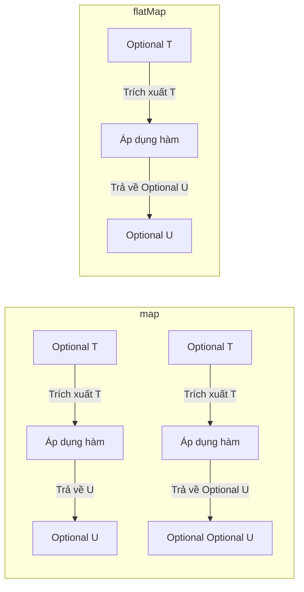

# Optional - Phần 2 (Optional - Part 2)

## Mục tiêu học tập (Learning Goal)

Tài liệu này bao gồm một phần tập trung của **Optional**. Hãy nghiên cứu từng khái niệm như một quy tắc Java thực tế, chứ không phải như các từ vựng rời rạc.

## Phạm vi đề cương (Outline Coverage)

| Khái niệm (Concept) | Điều cần biết (What to know) |
| --- | --- |
| `map` | `map` biến đổi giá trị được bao bọc nếu hiện diện và bao bọc kết quả trở lại vào một Optional. |
| `flatMap` | `flatMap` biến đổi giá trị được bao bọc bằng cách sử dụng một mapper trả về một Optional, tránh cấu trúc lồng nhau. |
| `filter` | `filter` là một khái niệm cụ thể trong Optional; hãy tìm hiểu quy tắc Java, các trường hợp sử dụng hợp lệ và chế độ lỗi (failure mode) của nó thay vì chỉ nhớ tên gọi. |
| `Do not overuse Optional` | Optional là một bộ chứa (container) có thể chứa hoặc không chứa một giá trị không null (non-null value). |
| `Optional in return type` | Optional là một bộ chứa có thể chứa hoặc không chứa một giá trị không null. |

## Ghi chú chi tiết (Detailed Notes)

### map

`map` biến đổi giá trị bên trong `Optional` nếu hiện diện, bao bọc kiểu dữ liệu thô (raw type) được trả về trở lại vào một `Optional`.

Nó quan trọng vì nó cho phép các lập trình viên xây dựng các đường ống chức năng (functional pipelines) sạch sẽ mà không cần kiểm tra null thủ công ở mỗi bước. Một sự nhầm lẫn phổ biến là sử dụng `map` khi chính hàm mapper trả về một `Optional`, dẫn đến cấu trúc lồng nhau `Optional<Optional<T>>`.

Kiểm tra thực tế (Practical check):

- Định nghĩa `map` trong một câu.
- Nhận biết `map` trong code, câu lệnh, tài liệu hoặc các câu hỏi phỏng vấn.
- Giải thích một lỗi, hạn chế hoặc sự đánh đổi liên quan đến `map`.

Ví dụ nhỏ hoặc mô hình tư duy (Tiny example or mental model):

- `opt.map(String::toUpperCase)`

#### Giải thích chi tiết (Detailed Explanation)
`map(Function<? super T, ? extends U> mapper)` được sử dụng để biến đổi giá trị bên trong `Optional`. Nếu một giá trị hiện diện, nó sẽ áp dụng hàm ánh xạ (mapping function) cho giá trị đó. Nếu hàm ánh xạ trả về một giá trị không null, nó sẽ trả về một `Optional` chứa kết quả đó. Nếu `Optional` trống rỗng hoặc nếu mapper trả về `null`, nó sẽ trả về một `Optional` trống rỗng.
Quan trọng là, hàm ánh xạ trả về một kiểu dữ liệu thô `U`, và `map` sẽ tự động bao bọc nó vào `Optional<U>`.

#### Ví dụ code có thể chạy được (Runnable Code Example)
```java
import java.util.Optional;

public class OptionalMapExample {
    public static void main(String[] args) {
        Optional<String> opt = Optional.of("Hello");

        // Transform string to its length
        Optional<Integer> length = opt.map(String::length);
        System.out.println(length.orElse(0)); // Prints: 5

        // If mapper returns null, map() returns empty Optional
        Optional<String> nullResult = opt.map(val -> (String) null);
        System.out.println(nullResult.isPresent()); // Prints: false
    }
}
```

#### Lỗi thường gặp (Common Mistake)
Sử dụng `map` khi chính hàm ánh xạ trả về một `Optional`. Điều này dẫn đến một cấu trúc lồng nhau `Optional<Optional<U>>`. Trong những trường hợp như vậy, hãy sử dụng `flatMap` thay thế.

### flatMap

`flatMap` biến đổi giá trị bên trong `Optional` nếu hiện diện, trong đó hàm mapper trả về một `Optional` trực tiếp.

Nó quan trọng vì nó tránh việc bao bọc kết quả của hàm ánh xạ trong một Optional lồng nhau (ví dụ: `Optional<Optional<T>>`), thay vào đó trả về một Optional phẳng (flattened) duy nhất. Một sự nhầm lẫn phổ biến là `flatMap` sẽ ném ra một ngoại lệ `NullPointerException` nếu hàm ánh xạ trả về null, trong khi `map` sẽ trả về một `Optional` trống rỗng một cách an toàn.

Kiểm tra thực tế (Practical check):

- Định nghĩa `flatMap` trong một câu.
- Nhận biết `flatMap` trong code, câu lệnh, tài liệu hoặc các câu hỏi phỏng vấn.
- Giải thích một lỗi, hạn chế hoặc sự đánh đổi liên quan đến `flatMap`.

Ví dụ nhỏ hoặc mô hình tư duy (Tiny example or mental model):

- `optUser.flatMap(User::getEmail)`

#### Giải thích chi tiết (Detailed Explanation)
`flatMap(Function<? super T, ? extends Optional<? extends U>> mapper)` tương tự như `map`, nhưng được sử dụng khi hàm ánh xạ trả về một `Optional`. Thay vì bao bọc `Optional` được trả về vào một `Optional` khác, `flatMap` làm phẳng (flatten) kết quả bằng cách trả về trực tiếp `Optional` của mapper.
**Điểm cần lưu ý (Gotcha)**: Nếu hàm ánh xạ trả về `null`, `flatMap` sẽ ném ra ngoại lệ `NullPointerException` (không giống như `map`, phương thức sẽ trả về một `Optional` trống rỗng).

#### Ví dụ code có thể chạy được (Runnable Code Example)
```java
import java.util.Optional;

class User {
    private final String name;
    private final Optional<String> email;

    public User(String name, String email) {
        this.name = name;
        this.email = Optional.ofNullable(email);
    }

    public Optional<String> getEmail() {
        return email;
    }
}

public class OptionalFlatMapExample {
    public static void main(String[] args) {
        Optional<User> userOpt = Optional.of(new User("Alice", "alice@example.com"));

        // Using map() would return Optional<Optional<String>>
        Optional<Optional<String>> nested = userOpt.map(User::getEmail);

        // Using flatMap() returns Optional<String> directly
        Optional<String> flattened = userOpt.flatMap(User::getEmail);
        System.out.println(flattened.orElse("No Email")); // alice@example.com
    }
}
```

#### Lỗi thường gặp (Common Mistake)
Nhầm lẫn giữa `map` và `flatMap` khi hàm ánh xạ trả về `Optional`. Nếu bạn thấy một kiểu như `Optional<Optional<T>>` in your code, bạn đã sử dụng `map` trong khi đáng lẽ phải sử dụng `flatMap`.

## Tại sao map() và flatMap() khác nhau về chữ ký phương thức và cách bao bọc (Why map() and flatMap() Differ in Signature and Wrapping)

Sự khác biệt cốt lõi giữa `map()` và `flatMap()` là cách chúng xử lý kiểu trả về của hàm ánh xạ. Phương thức `map()` được thiết kế cho các hàm ánh xạ trả về các giá trị thô; nó tự động bao bọc bất kỳ giá trị thô nào mà mapper trả về vào một `Optional` mới. Nếu bạn truyền một hàm mapper tự trả về một `Optional`, `map()` vẫn sẽ bao bọc nó, dẫn đến cấu trúc lồng nhau `Optional<Optional<T>>`. Ngược lại, `flatMap()` được thiết kế đặc biệt cho các hàm ánh xạ đã trả về sẵn một `Optional`; nó trả về `Optional` đó trực tiếp mà không áp dụng thêm một lớp bao bọc nào khác. Ngoài ra, một sự khác biệt quan trọng về cơ chế là nếu hàm ánh xạ trả về `null`, `map()` sẽ bắt lấy điều này và trả về `Optional.empty()` một cách an toàn, trong khi `flatMap()` kiểm tra rõ ràng giá trị null và ném ra một ngoại lệ `NullPointerException` để ngăn chặn các optional lồng nhau không hợp lệ.

### Mô hình tư duy: Phép so sánh hộp lồng nhau (Mental Model: The Nested Box Analogy)

- **`map` (Bao bọc tự động)**: Bạn mở một chiếc hộp (chính là `Optional` ban đầu), lấy vật phẩm ra, áp dụng thay đổi, và trình biên dịch tự động đặt vật phẩm đã thay đổi trở lại vào một chiếc hộp mới. If the item you extracted was already inside a smaller box, you end up with a box inside a box.
- **`flatMap` (Làm phẳng thủ công)**: Bạn mở một chiếc hộp, lấy vật phẩm ra (vốn đã nằm trong chiếc hộp nhỏ hơn của chính nó), áp dụng thay đổi và trả về trực tiếp chiếc hộp nhỏ hơn đó. Chiếc hộp bên ngoài bị bỏ đi, vì vậy bạn chỉ có một lớp hộp duy nhất.



### Ví dụ code có thể chạy được (Runnable Code Example)

```java
import java.util.Optional;

public class MapVsFlatMapDemo {
    public static void main(String[] args) {
        Optional<String> optionalWord = Optional.of("Hello");

        // map() wraps the result in an Optional automatically
        Optional<Integer> optLen = optionalWord.map(s -> s.length()); // returns Integer, wrapped to Optional<Integer>
        System.out.println("map length: " + optLen.orElse(0)); // Output: map length: 5

        // If the function returns an Optional:
        // Using map() nesting occurs:
        Optional<Optional<String>> nested = optionalWord.map(s -> Optional.of(s + " World"));
        
        // Using flatMap() avoids nesting:
        Optional<String> flattened = optionalWord.flatMap(s -> Optional.of(s + " World"));
        System.out.println("flatMap output: " + flattened.orElse("")); // Output: flatMap output: Hello World

        // Critical difference on null returns:
        try {
            // map() returning null returns Optional.empty() safely
            Optional<String> mapNull = optionalWord.map(s -> null);
            System.out.println("mapNull is present: " + mapNull.isPresent()); // Output: mapNull is present: false
        } catch (Exception e) {
            System.out.println("map threw exception");
        }

        try {
            // flatMap() returning null throws NullPointerException immediately!
            Optional<String> flatMapNull = optionalWord.flatMap(s -> null);
        } catch (NullPointerException e) {
            System.out.println("flatMap null threw NullPointerException!"); // Output: flatMap null threw NullPointerException!
        }
    }
}
```

### Chuỗi nhân quả (Cause-Effect Chain)
Hàm ánh xạ được truyền vào `flatMap()` trả về `null` thay vì một thực thể `Optional` $\rightarrow$ Triển khai nội bộ của `flatMap()` kiểm tra xem kết quả của mapper có null hay không $\rightarrow$ kết quả là null $\rightarrow$ JVM ném ra ngoại lệ `NullPointerException` $\rightarrow$ Việc thực thi dừng lại, cảnh báo lập trình viên rằng hàm ánh xạ đã vi phạm ràng buộc của API.

### filter

`filter` là một khái niệm cụ thể trong Optional; hãy tìm hiểu quy tắc Java, các trường hợp sử dụng hợp lệ và chế độ lỗi của nó thay vì chỉ nhớ tên gọi.

Sử dụng nó để dự đoán quy tắc Java chính xác, dạng được cho phép và chế độ lỗi. Hãy xem lại nó với một ví dụ nhỏ thay vì chỉ ghi nhớ nhãn của nó.

Kiểm tra thực tế (Practical check):

- Định nghĩa `filter` trong một câu.
- Nhận biết `filter` trong code, câu lệnh, tài liệu hoặc các câu hỏi phỏng vấn.
- Giải thích một lỗi, hạn chế hoặc sự đánh đổi liên quan đến `filter`.

Ví dụ nhỏ hoặc mô hình tư duy (Tiny example or mental model):

- Khi đọc code, hãy hỏi: `filter` thay đổi, cho phép, từ chối hoặc làm rõ điều gì?

#### Giải thích chi tiết (Detailed Explanation)
`filter(Predicate<? super T> predicate)` cho phép bạn loại bỏ một giá trị có điều kiện. Nếu một giá trị hiện diện và khớp với predicate được cung cấp, `Optional` được trả về nguyên trạng. Nếu giá trị không khớp với predicate, hoặc nếu `Optional` trống rỗng, một `Optional` trống rỗng sẽ được trả về.

#### Ví dụ code có thể chạy được (Runnable Code Example)
```java
import java.util.Optional;

public class OptionalFilterExample {
    public static void main(String[] args) {
        Optional<String> opt = Optional.of("apple");

        // Predicate matches
        Optional<String> matched = opt.filter(s -> s.startsWith("a"));
        System.out.println(matched.isPresent()); // true

        // Predicate does not match
        Optional<String> unmatched = opt.filter(s -> s.startsWith("b"));
        System.out.println(unmatched.isPresent()); // false
    }
}
```

#### Lỗi thường gặp (Common Mistake)
Kiểm tra `isPresent()` và sau đó thực hiện kiểm tra câu lệnh if trên giá trị đã mở gói, thay vì sử dụng `filter()`.
*Trước (Dạng lệnh):*
```java
if (opt.isPresent() && opt.get().length() > 5) {
    System.out.println(opt.get());
}
```
*Sau (Dạng khai báo):*
```java
opt.filter(s -> s.length() > 5).ifPresent(System.out::println);
```

### Không lạm dụng Optional (Do not overuse Optional)

Optional là một bộ chứa có thể chứa hoặc không chứa một giá trị không null.

Sử dụng nó để dự đoán quy tắc Java chính xác, dạng được cho phép và chế độ lỗi. Hãy xem lại nó với một ví dụ nhỏ thay vì chỉ ghi nhớ nhãn của nó.

Kiểm tra thực tế (Practical check):

- Định nghĩa `Do not overuse Optional` trong một câu.
- Nhận biết `Do not overuse Optional` trong code, câu lệnh, tài liệu hoặc các câu hỏi phỏng vấn.
- Giải thích một lỗi, hạn chế hoặc sự đánh đổi liên quan đến `Do not overuse Optional`.

Ví dụ nhỏ hoặc mô hình tư duy (Tiny example or mental model):

- `Optional.ofNullable(value)` xử lý một giá trị có khả năng bị null.

#### Giải thích chi tiết (Detailed Explanation)
`Optional` được thiết kế nghiêm ngặt như một kiểu trả về để xử lý sự vắng mặt của một giá trị một cách sạch sẽ mà không ném ra NPE. Nó không nên được sử dụng như:
- Các trường (fields) của class (tăng chi phí bộ nhớ và `Optional` không thực thi `Serializable`).
- Các tham số phương thức (method parameters) (buộc người gọi phải bao bọc tham số, tăng nguy cơ NPE nếu họ truyền một `Optional` null).
- Bao bọc các phần tử của collection hoặc kiểu trả về của cấu trúc collection (ví dụ: trả về các collection trống thay vì một Optional bao bọc một collection).

#### Ví dụ code có thể chạy được (Runnable Code Example)
```java
import java.util.Optional;
import java.util.List;
import java.util.Collections;

public class OveruseExample {
    // ANTI-PATTERN: Optional as a parameter
    public static void printUser(Optional<String> username) {
        // Bad! Caller might pass null instead of Optional.empty(), causing NPE here
        if (username.isPresent()) {
            System.out.println(username.get());
        }
    }

    // IDIOMATIC: Use method overloading or nullable parameter
    public static void printUser(String username) {
        if (username != null) {
            System.out.println(username);
        }
    }

    // ANTI-PATTERN: Optional of List
    public static Optional<List<String>> getNames(boolean exists) {
        return exists ? Optional.of(List.of("Alice")) : Optional.empty();
    }

    // IDIOMATIC: Return empty list
    public static List<String> getNamesIdiomatic(boolean exists) {
        return exists ? List.of("Alice") : Collections.emptyList();
    }
}
```

#### Lỗi thường gặp (Common Mistake)
Thiết kế các đối tượng domain hoặc thực thể (entities) có các trường kiểu `Optional<T>`. Điều này sẽ làm hỏng các thư viện tuần tự hóa đối tượng (ví dụ: Jackson, tuần tự hóa Java tiêu chuẩn) và gây lãng phí bộ nhớ (thêm một tham chiếu đối tượng cho mỗi trường).

## Tại sao Optional không nên được sử dụng cho các trường hoặc tham số (Why Optional Should Not Be Used for Fields or Parameters)

Việc sử dụng `Optional` cho các trường hoặc tham số làm phát sinh đáng kể chi phí bộ nhớ, tuần tự hóa và khả năng sử dụng API. Đầu tiên, `Optional` là một đối tượng bao bọc (object wrapper): mỗi thực thể `Optional` tiêu tốn 16 bytes bộ nhớ header và alignment trên một JVM 64-bit tiêu chuẩn, cộng thêm 8 bytes cho chính tham chiếu đó. Nếu bạn định nghĩa các trường có kiểu `Optional` trong các mô hình domain được khởi tạo hàng triệu lần (ví dụ: trong danh sách người dùng hoặc sản phẩm), chi phí bao bọc đối tượng này sẽ nhanh chóng làm suy giảm hiệu suất dọn rác (garbage collection) và tăng mức sử dụng heap. Thứ hai, `Optional` không triển khai `java.io.Serializable`; cố gắng tuần tự hóa một thực thể có trường `Optional` sẽ ném ra ngoại lệ `NotSerializableException`, làm hỏng việc tích hợp với các enterprise framework, JPA provider, lớp cache hoặc JSON serializer. Cuối cùng, việc sử dụng `Optional` làm tham số phương thức làm mất đi mục đích của ràng buộc API: người gọi bị buộc phải viết các dòng code bao bọc rườm rà, và nó tạo ra nguy cơ xảy ra ngoại lệ `NullPointerException` lồng nhau nếu người gọi truyền một giá trị `null` Java thực tế thay vì `Optional.empty()`.

### Mô hình tư duy: Món quà được gói hai lần (The Double-Wrapped Present)

- **Trường thực thể (Entity Field)**: Lưu trữ `Optional` dưới dạng một trường giống như việc đặt từng công cụ nhỏ trong hộp công cụ của bạn vào bên trong hộp quà được gói riêng. Hộp công cụ không chỉ chiếm không gian gấp đôi mà còn mất nhiều thời gian hơn để mở và dọn dẹp.
- **Tham số phương thức (Method Parameter)**: Truyền `Optional` vào một phương thức giống như việc tặng một món quà được bọc trong hai lớp hộp, trong đó người nhận trước tiên phải kiểm tra xem hộp bên ngoài có null hay không, sau đó kiểm tra xem hộp bên trong có trống rỗng hay không, thay vì chỉ xử lý chính món quà đó.

```mermaid
flowchart TD
    subgraph Sắp xếp bộ nhớ trường (Field Memory Layout)
        A[Class Instance] -->|Tham chiếu| B["Optional Wrapper Object: 16 bytes"]
        B -->|Tham chiếu| C[Đối tượng dữ liệu thực tế: ví dụ String]
    end
    subgraph Rủi ro API của tham số (Parameter API Risk)
        D[Người gọi truyền null] -->|NPE khi giải tham chiếu| E["method(Optional<T> param) gọi param.isPresent()"]
    end
```

### Ví dụ code có thể chạy được (Runnable Code Example)

```java
import java.io.ByteArrayOutputStream;
import java.io.ObjectOutputStream;
import java.io.Serializable;
import java.util.Optional;

// This class will throw an exception during standard Java serialization!
class BadEmployee implements Serializable {
    private String name;
    private Optional<String> middleName; // Anti-pattern: Not serializable!

    public BadEmployee(String name, String middleName) {
        this.name = name;
        this.middleName = Optional.ofNullable(middleName);
    }
}

// Idiomatic implementation
class GoodEmployee implements Serializable {
    private String name;
    private String middleName; // Correct: Nullable raw reference

    public GoodEmployee(String name, String middleName) {
        this.name = name;
        this.middleName = middleName;
    }

    // Return Optional in getter to notify callers about optionality
    public Optional<String> getMiddleName() {
        return Optional.ofNullable(middleName);
    }
}

public class OptionalFieldDemo {
    public static void main(String[] args) {
        BadEmployee bad = new BadEmployee("John", "Doe");
        try {
            ByteArrayOutputStream baos = new ByteArrayOutputStream();
            ObjectOutputStream oos = new ObjectOutputStream(baos);
            oos.writeObject(bad); // Throws NotSerializableException!
        } catch (Exception e) {
            System.out.println("BadEmployee failed serialization: " + e.toString());
            // Output: BadEmployee failed serialization: java.io.NotSerializableException: java.util.Present
        }

        GoodEmployee good = new GoodEmployee("John", "Doe");
        try {
            ByteArrayOutputStream baos = new ByteArrayOutputStream();
            ObjectOutputStream oos = new ObjectOutputStream(baos);
            oos.writeObject(good); // Works perfectly!
            System.out.println("GoodEmployee serialized successfully!");
        } catch (Exception e) {
            System.out.println("GoodEmployee failed serialization");
        }
    }
}
```

### Chuỗi nhân quả (Cause-Effect Chain)
Mô hình domain được định nghĩa với các trường `Optional<T>` $\rightarrow$ Ứng dụng khởi tạo hàng triệu mô hình này $\rightarrow$ JVM heap cấp phát thêm một đối tượng bao bọc 16-24 bytes cho mỗi trường $\rightarrow$ Garbage collector chịu tần suất tạm dừng thu gom (compaction) cao $\rightarrow$ Thông lượng bộ nhớ của ứng dụng giảm.

### Optional trong kiểu trả về (Optional in return type)

Optional là một bộ chứa có thể chứa hoặc không chứa một giá trị không null.

Sử dụng nó để dự đoán quy tắc Java chính xác, dạng được cho phép và chế độ lỗi. Hãy xem lại nó với một ví dụ nhỏ thay vì chỉ ghi nhớ nhãn của nó.

Kiểm tra thực tế (Practical check):

- Định nghĩa `Optional in return type` trong một câu.
- Nhận biết `Optional in return type` trong code, câu lệnh, tài liệu hoặc các câu hỏi phỏng vấn.
- Giải thích một lỗi, hạn chế hoặc sự đánh đổi liên quan đến `Optional in return type`.

Ví dụ nhỏ hoặc mô hình tư duy (Tiny example or mental model):

- `Optional.ofNullable(value)` xử lý một giá trị có khả năng bị null.

#### Giải thích chi tiết (Detailed Explanation)
Mục đích chính của `Optional` là phục vụ như một kiểu trả về cho các phương thức có thể không có kết quả. Điều này buộc client/người gọi phải xử lý rõ ràng trạng thái trống rỗng.
**Quy tắc đối với giá trị trả về**:
- Không bao giờ trả về `null` từ một phương thức được khai báo trả về `Optional<T>`. Hãy luôn trả về `Optional.empty()`. Việc trả về `null` làm mất đi mục đích thiết kế và gây ra ngoại lệ `NullPointerException` trên chính bộ chứa khi người gọi cố gắng chuỗi hóa các thao tác.

#### Ví dụ code có thể chạy được (Runnable Code Example)
```java
import java.util.Optional;

public class OptionalReturnExample {
    // ANTI-PATTERN: Returning null for Optional
    public static Optional<String> findUserBad(int id) {
        if (id == 0) return null; // Horrible! Caller gets NPE on the Optional container.
        return Optional.of("User" + id);
    }

    // IDIOMATIC: Return Optional.empty()
    public static Optional<String> findUserGood(int id) {
        if (id == 0) return Optional.empty();
        return Optional.of("User" + id);
    }

    public static void main(String[] args) {
        try {
            findUserBad(0).orElse("Default"); // Throws NullPointerException!
        } catch (NullPointerException e) {
            System.out.println("NPE caught due to returning null!");
        }

        String user = findUserGood(0).orElse("Default"); // Safe and works!
        System.out.println("User: " + user); // User: Default
    }
}
```

#### Lỗi thường gặp (Common Mistake)
Trả về `Optional` từ các getter nơi mà một tham chiếu thô có thể null được mong đợi bởi các thư viện tuần tự hóa hoặc ORM (như Hibernate). Đối với các trường thực thể, hãy sử dụng các trường có thể null tiêu chuẩn và viết một getter trả về một kiểu thô có thể null hoặc khởi tạo `Optional` ngay tức thì.

## Nghiên cứu tình huống: Các phản mô hình Optional so với Code chuẩn (Case Study: Optional Anti-Patterns vs Idiomatic Code)

Để đảm bảo thiết kế sạch sẽ, hiệu suất và code Java tuân thủ tiêu chuẩn, các lập trình viên phải tránh lạm dụng `Optional` trong các tình huống phổ biến.

### Phản mô hình 1: Optional dưới dạng các trường của Class (Optional as Class Fields)
```java
// BAD: Optional field (wastes memory, not Serializable)
public class Employee {
    private String name;
    private Optional<String> middleName; // Anti-pattern
}
```
**Tại sao nó tệ:**
1. `Optional` không triển khai `Serializable`. Nếu class này được tuần tự hóa (ví dụ: trong trạng thái session, cache phân tán hoặc thông qua RMI), ngoại lệ `NotSerializableException` sẽ bị ném ra.
2. Mỗi thực thể `Optional` thêm 16 bytes chi phí bộ nhớ trên các JVM 64-bit (cộng với các tham chiếu), làm giảm hiệu năng khi hàng triệu thực thể được tải lên.

**Giải pháp chuẩn:**
Giữ trường đó có thể null và trả về `Optional` trong getter nếu cần.
```java
// GOOD: Nullable field, Optional returned in getter
public class Employee {
    private String name;
    private String middleName; // Can be null

    public Optional<String> getMiddleName() {
        return Optional.ofNullable(middleName);
    }
}
```

### Phản mô hình 2: Optional dưới dạng tham số phương thức (Optional as Method Parameters)
```java
// BAD: Optional parameter forces wrapper creation
public void updateAddress(int employeeId, Optional<String> street) {
    if (street.isPresent()) {
        // update
    }
}
```
**Tại sao nó tệ:**
1. Nó buộc người gọi phải bao bọc các đối số của họ (ví dụ: `updateAddress(1, Optional.of("Main St"))` or `updateAddress(1, Optional.empty())`), tạo ra code lặp thừa.
2. Người gọi có thể truyền `null` vào phương thức thay vì `Optional.empty()`, dẫn đến ngoại lệ `NullPointerException` bên trong phương thức khi gọi `street.isPresent()`.

**Giải pháp chuẩn:**
Sử dụng nạp chồng phương thức (method overloading) hoặc xử lý các tham số có thể null tiêu chuẩn.
```java
// GOOD: Overloaded methods or raw nullable parameter
public void updateAddress(int employeeId, String street) {
    if (street != null) {
        // update
    }
}
```

### Phản mô hình 3: Optional bao bọc các Collection (Optional wrapping Collections)
```java
// BAD: Optional of List
public Optional<List<Order>> getOrders(int customerId) {
    List<Order> orders = orderDb.find(customerId);
    if (orders.isEmpty()) {
        return Optional.empty(); // Anti-pattern
    }
    return Optional.of(orders);
}
```
**Tại sao nó tệ:**
Các bộ sưu tập (Lists, Sets, Maps) đã có một cách tiêu chuẩn để biểu thị sự vắng mặt: collection trống (`Collections.emptyList()`, `List.of()`). Việc bao bọc chúng trong `Optional` buộc người gọi phải thực hiện kiểm tra kép (kiểm tra xem Optional có trống hay không, và sau đó kiểm tra xem danh sách có trống hay không).

**Giải pháp chuẩn:**
Luôn trả về trực tiếp một collection trống.
```java
// GOOD: Return empty list directly
public List<Order> getOrders(int customerId) {
    List<Order> orders = orderDb.find(customerId);
    return orders != null ? orders : Collections.emptyList();
}
```

### Phản mô hình 4: Mô hình `isPresent()` + `get()` (Optional dạng dòng lệnh) (The `isPresent()` + `get()` Pattern - Imperative Optional)
```java
// BAD: Imperative check defeats functional purpose
Optional<User> userOpt = findUser(123);
if (userOpt.isPresent()) {
    System.out.println(userOpt.get().getName());
}
```
**Tại sao nó tệ:**
Nó bắt chước cách kiểm tra null truyền thống và không mang lại bất kỳ lợi ích lập trình chức năng nào. Nếu lập trình viên quên kiểm tra `isPresent()` và gọi `get()`, họ sẽ gặp lỗi thời gian chạy.

**Giải pháp chuẩn:**
Sử dụng `ifPresent`, `map`, `orElseGet`, hoặc `orElseThrow`.
```java
// GOOD: Declarative transformation and consumption
findUser(123)
    .map(User::getName)
    .ifPresent(System.out::println);
```

## Liên kết tham khảo (Reference Links)

- https://docs.oracle.com/en/java/javase/21/docs/api/java.base/java/util/Optional.html#map(java.util.function.Function) (Optional.map API Documentation)
- https://docs.oracle.com/en/java/javase/21/docs/api/java.base/java/util/Optional.html#flatMap(java.util.function.Function) (Optional.flatMap API Documentation)
- https://docs.oracle.com/en/java/javase/21/docs/api/java.base/java/util/Optional.html (Optional API Specification)

## Các câu hỏi ôn tập thường gặp (Common Review Prompts)

- Khái niệm nào ở đây là quy tắc thời gian biên dịch (compile-time rules)?
- Khái niệm nào ở đây ảnh hưởng đến hành vi thời gian chạy (runtime behavior)?
- Khái niệm nào ở đây có khả năng là bẫy phỏng vấn?
