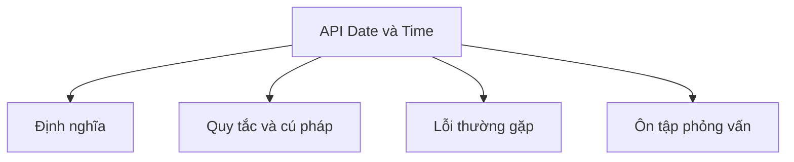

# 25 - API Date và Time (Date and Time API)

Chủ đề này tuân theo đề cương chính trong [outline.md](../outline.md). Mục tiêu là hiểu sâu từng khái niệm đủ để giải thích, nhận diện trong code, và trả lời các câu hỏi phỏng vấn.

## Thứ Tự Học

- [Khái Niệm Date](theory/01-date-concepts.md)
- [Khái Niệm Period](theory/02-period-concepts.md)
- [Thuật Ngữ Chính](terms/01-key-terms.md)

## Danh Sách Kiểm Tra Theo Đề Cương

- Date
- Calendar
- SimpleDateFormat
- LocalDate
- LocalTime
- LocalDateTime
- ZonedDateTime
- OffsetDateTime
- Instant
- Duration
- Period
- DateTimeFormatter
- ZoneId
- Phân tích (parse) ngày/giờ
- Định dạng (format) ngày/giờ
- So sánh ngày/giờ
- Cộng/trừ ngày/giờ
- Múi giờ (Timezone)

## Tự Kiểm Tra

- Tại sao API date và calendar cũ (`java.util.Date`, `java.util.Calendar`, `java.text.SimpleDateFormat`) có nhiều khiếm khuyết (ví dụ: tính khả biến, lệch chỉ số, vấn đề thread-safety)?
- Tại sao các đối tượng ngày giờ Java 8 hiện đại (như `LocalDate`, `LocalTime`, `ZonedDateTime`) được thiết kế bất biến và thread-safe, và mẫu nào được dùng để lấy instance đã sửa đổi?
- Sự khác biệt về biểu diễn múi giờ và quy tắc giữa `OffsetDateTime`, `ZonedDateTime`, và `Instant` là gì?
- Tại sao `java.time.format.DateTimeFormatter` tránh được lỗi đồng thời (concurrency bug) của `SimpleDateFormat`?
- `Period` và `Duration` khác nhau thế nào về biểu diễn và hành vi, đặc biệt khi cộng vào đối tượng thời gian có múi giờ như `ZonedDateTime` qua các chuyển tiếp DST (Daylight Saving Time)?
- `ZonedDateTime` xử lý như thế nào các thời gian cục bộ không hợp lệ hoặc chồng lấp từ các chuyển tiếp DST?

## Thẻ Anki

- [Basic](anki/basic.tsv)
- [Basic Extra](anki/basic-extra.tsv)
- [Cloze](anki/cloze.tsv)
- [Code Question](anki/code-question.tsv)

## Sơ Đồ Tổng Quan (Mermaid)

## Liên Kết Tham Khảo

- https://docs.oracle.com/javase/tutorial/datetime/
- https://docs.oracle.com/en/java/javase/21/docs/api/java.base/java/time/package-summary.html
