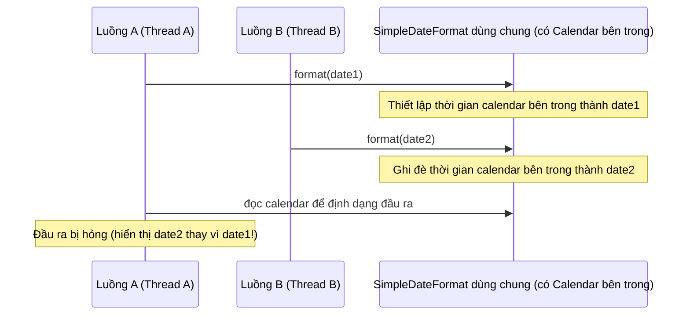
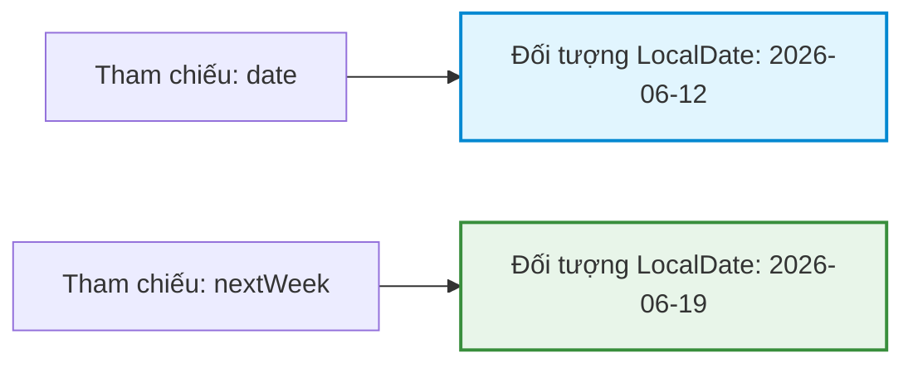
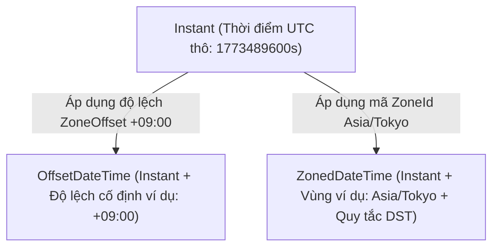

# API Ngày và Giờ (Date and Time API) - Phần 1

## Mục tiêu học tập (Learning Goal)

Tài liệu này bao gồm một phần trọng tâm của **API Ngày và Giờ (Date and Time API)**. Hãy nghiên cứu từng khái niệm như một quy tắc Java thực tế, thay vì chỉ là từ vựng rời rạc.

## Phạm vi đề mục (Outline Coverage)

| Khái niệm (Concept) | Điều cần biết (What to know) |
| --- | --- |
| `Date` | Lớp cũ có tính khả biến (mutable) biểu diễn một thời điểm với độ chính xác mili giây; gặp các vấn đề về an toàn luồng (thread-safety), chỉ mục tháng bắt đầu từ 0 (0-indexed months) và cách xử lý múi giờ (timezone) gây nhầm lẫn. |
| `Calendar` | Lớp trừu tượng cũ có tính khả biến để thao tác với ngày tháng; thiếu an toàn kiểu dữ liệu (type safety) (sử dụng các hằng số số nguyên), không an toàn luồng (not thread-safe), và vẫn giữ chỉ mục tháng bắt đầu từ 0. |
| `SimpleDateFormat` | Lớp cũ dùng để định dạng và phân tích cú pháp (formatting and parsing) ngày tháng; không an toàn luồng và không được chia sẻ giữa các luồng nếu không có đồng bộ hóa từ bên ngoài. |
| `LocalDate` | Lớp bất biến (immutable), an toàn luồng (thread-safe) biểu diễn ngày không có giờ hoặc múi giờ (ví dụ: `2026-06-12`) sử dụng chỉ mục tháng bắt đầu từ 1. |
| `LocalTime` | Lớp bất biến, an toàn luồng biểu diễn giờ không có ngày hoặc múi giờ (ví dụ: `13:45:00`) với độ chính xác đến nano giây. |
| `LocalDateTime` | Lớp bất biến, an toàn luồng kết hợp ngày và giờ không có múi giờ (ví dụ: `2026-06-12T13:45:00`). |
| `ZonedDateTime` | Lớp bất biến, an toàn luồng biểu diễn ngày và giờ với bối cảnh múi giờ địa lý đầy đủ (xử lý giờ mùa hè (Daylight Saving Time - DST) và độ lệch múi giờ). |
| `OffsetDateTime` | Lớp bất biến, an toàn luồng biểu diễn ngày và giờ với độ lệch cố định (fixed offset) so với giờ UTC, không có các quy tắc giờ mùa hè. |
| `Instant` | Lớp bất biến, an toàn luồng biểu diễn một thời điểm duy nhất trên dòng thời gian UTC (giây và nano giây tính từ Kỷ nguyên (Epoch)). |
| `Duration` | Biểu diễn bất biến của một lượng thời gian dựa trên thời gian (giây và nano giây) dùng để so sánh giữa các thời điểm hoặc thời gian. |

## Ghi chú chi tiết (Detailed Notes)

### Date
`java.util.Date` là một lớp cũ (legacy class) biểu diễn một thời điểm cụ thể trong thời gian, với độ chính xác tính bằng mili giây so với Kỷ nguyên (Epoch - ngày 1 tháng 1 năm 1970, 00:00:00 GMT).

#### Các vấn đề cũ và chế độ lỗi (Legacy Issues & Failure Modes):
* **Tính khả biến (Mutability)**: `java.util.Date` là khả biến. Các phương thức như `setTime(long time)` trực tiếp thay đổi chính đối tượng đó, gây ra rủi ro hỏng dữ liệu trong các ngữ cảnh đa luồng (multi-threaded) và vi phạm tính đóng gói (encapsulation).
* **Biểu diễn múi giờ gây nhầm lẫn (Confusing Timezone Representation)**: Nó lưu trữ thời gian theo giờ UTC nhưng phương thức `toString()` lại định dạng nó bằng múi giờ mặc định của JVM, khiến lập trình viên hiểu lầm rằng đối tượng này có chứa thông tin múi giờ.
* **Tháng bắt đầu từ 0 & Năm bắt đầu từ 1900**: Các giá trị tháng có chỉ mục bắt đầu từ 0 (Tháng Một là `0`, Tháng Mười Hai là `11`), và các đối số truyền vào hàm khởi tạo (constructor) cho năm yêu cầu trừ đi 1900 (ví dụ: `new Date(126, 5, 12)` biểu diễn ngày 12 tháng 6 năm 2026).

```java
// Bản thử nghiệm lỗi khả biến (mutability bug)
java.util.Date sharedDate = new java.util.Date();
System.out.println("Initial Date: " + sharedDate);

// Người gọi có thể thay đổi ngày này, ảnh hưởng đến tất cả các thành phần khác dùng chung tham chiếu
sharedDate.setTime(0L); // Thay đổi thành ngày 1 tháng 1 năm 1970
System.out.println("Mutated Date: " + sharedDate);
```

### Calendar
`java.util.Calendar` được giới thiệu trong JDK 1.1 để thay thế cho `Date` trong việc định dạng và thao tác ngày tháng, nhưng nó cũng kế thừa nhiều vấn đề tương tự.

#### Hạn chế và điểm cần lưu ý (Limitations & Gotchas):
* **Tính khả biến (Mutability)**: Nó là khả biến, cho phép thay đổi trạng thái thông qua `set(int field, int value)` làm cho việc đảm bảo an toàn luồng trở nên cực kỳ khó khăn.
* **Vấn đề an toàn kiểu dữ liệu (Type Safety Issues)**: Nó dựa vào các hằng số số nguyên tùy ý (ví dụ: `Calendar.MONTH`, `Calendar.YEAR`) để truy cập trường dữ liệu, điều mà trình kiểm tra kiểu thời gian biên dịch (compile-time type checkers) không thể xác thực.
* **Chỉ mục tháng (Month indexing)**: Giống như `Date`, nó giữ chỉ mục tháng bắt đầu từ 0 (`Calendar.JUNE` là `5`).

```java
// Sửa đổi ngày bằng Calendar (Khả biến và dài dòng)
java.util.Calendar cal = java.util.Calendar.getInstance();
cal.set(2026, java.util.Calendar.JUNE, 12); // Tháng Sáu là 5
cal.add(java.util.Calendar.DAY_OF_MONTH, 5); // Cộng thêm 5 ngày
System.out.println("Calendar after modification: " + cal.getTime());
```

### SimpleDateFormat
`java.text.SimpleDateFormat` là lớp cũ được dùng để phân tích cú pháp (parsing) và định dạng (formatting) ngày tháng.

#### Chế độ lỗi nghiêm trọng (Critical Failure Mode):
* **Không an toàn luồng (Not Thread-Safe)**: Lớp này duy trì trạng thái nội bộ (một thể hiện của calendar). Việc định dạng hoặc phân tích cú pháp đồng thời từ nhiều luồng (threads) có thể tạo ra đầu ra ngày bị hỏng hoặc ném ra ngoại lệ `NumberFormatException`.

```java
// Định dạng đồng thời nguy hiểm
java.text.SimpleDateFormat sdf = new java.text.SimpleDateFormat("yyyy-MM-dd");
// Nếu sdf được chia sẻ giữa các luồng:
// Luồng 1: sdf.format(date1)
// Luồng 2: sdf.format(date2) -> Có thể dẫn đến kết quả ngày bị hỏng/trộn lẫn!
```

### Tại sao các API Date, Calendar và SimpleDateFormat cũ lại bị lỗi thiết kế (Why the Legacy Date, Calendar, and SimpleDateFormat APIs Are Flawed)

Các lớp cũ `java.util.Date` và `java.util.Calendar` biểu diễn ngày tháng và các trường lịch bằng trạng thái khả biến (mutable state), điều này gây ra rủi ro nghiêm trọng về hỏng dữ liệu trong các ứng dụng đồng thời (concurrent). Vì bất kỳ luồng nào có tham chiếu đến một thể hiện `Date` hoặc `Calendar` đều có thể gọi các phương thức thay đổi trạng thái như `setTime()` hoặc `set()`, các lập trình viên phải viết các bản sao phòng thủ (defensive copies) rất dài dòng để bảo vệ tính đóng gói. Ngoài ra, thiết kế API của chúng rất dễ xảy ra lỗi: chỉ mục tháng bắt đầu từ 0 (Tháng Một là `0`), năm bị lệch đi `1900` trong các hàm khởi tạo cũ, và hành vi múi giờ rất mờ mịt và phụ thuộc vào định dạng. Hơn thế nữa, các lớp như `java.text.SimpleDateFormat` không an toàn luồng vì chúng duy trì trạng thái lịch khả biến bên trong; việc chia sẻ một thể hiện giữa các luồng mà không có đồng bộ hóa từ bên ngoài sẽ dẫn đến chuỗi ngày bị hỏng hoặc lỗi phân tích cú pháp.

#### Mô hình tư duy: Xung đột đồng thời trong SimpleDateFormat (Mental Model: SimpleDateFormat Concurrency Conflict)


#### Ví dụ mã nguồn: Lỗi khả biến và chỉ mục (Code Example: Mutability and Indexing Bugs)
```java
// Tháng bắt đầu từ 0 (5 = Tháng Sáu) và năm lệch 1900 (126 = 2026)
java.util.Date legacyDate = new java.util.Date(126, 5, 12); 
System.out.println(legacyDate); // Fri Jun 12 00:00:00 UTC 2026 (định dạng với múi giờ JVM)

// Lỗi khả biến
legacyDate.setTime(0L); // Sửa đổi thành Kỷ nguyên Epoch (Jan 1, 1970)
System.out.println(legacyDate); // Thu Jan 01 00:00:00 UTC 1970
```

#### Chuỗi nguyên nhân - kết quả (Cause-Effect Chain)

```text
`Chia sẻ SimpleDateFormat khả biến`
  → `Nhiều luồng đồng thời phân tích/định dạng`
  → `Trạng thái Calendar nội bộ bị ghi đè giữa chừng`
  → `Đầu ra bị hỏng hoặc xảy ra ngoại lệ không mong muốn`
```


### LocalDate
`java.time.LocalDate` biểu diễn một ngày không có giờ hoặc múi giờ trong hệ thống lịch ISO-8601 (ví dụ: `2026-06-12`). Nó là bất biến, an toàn luồng và triển khai giao diện `Temporal`.

```java
// Tạo và thao tác với LocalDate
LocalDate date = LocalDate.of(2026, 6, 12); // Rõ ràng, tháng bắt đầu từ 1!
LocalDate nextWeek = date.plusDays(7); // Trả về một thể hiện mới

System.out.println("Original: " + date);   // 2026-06-12
System.out.println("Next Week: " + nextWeek); // 2026-06-19
```

### LocalTime
`java.time.LocalTime` biểu diễn giờ không có ngày hoặc múi giờ (ví dụ: `13:45:00`). Nó là bất biến và an toàn luồng.

```java
LocalTime time = LocalTime.of(13, 45, 0); // 1:45 PM
LocalTime halfHourLater = time.plusMinutes(30);

System.out.println("Start Time: " + time);          // 13:45
System.out.println("End Time: " + halfHourLater); // 14:15
```

### LocalDateTime
`java.time.LocalDateTime` kết hợp ngày và giờ thành một lớp duy nhất không có múi giờ (ví dụ: `2026-06-12T13:45:00`). Nó rất lý tưởng cho các sự kiện cục bộ (ví dụ: "Cửa hàng mở cửa hàng ngày lúc 9:00 sáng giờ địa phương") nhưng không ánh xạ tới một thời điểm cụ thể trên dòng thời gian toàn cầu nếu không có bối cảnh múi giờ.

```java
LocalDate date = LocalDate.of(2026, 6, 12);
LocalTime time = LocalTime.of(13, 45, 0);
LocalDateTime ldt = LocalDateTime.of(date, time);

System.out.println("LocalDateTime: " + ldt); // 2026-06-12T13:45
```

### Tại sao các đối tượng ngày-giờ Java 8 hiện đại lại bất biến và an toàn luồng (Why Modern Java 8 Date-Time Objects Are Immutable and Thread-Safe)

Các lớp trong gói `java.time` (chẳng hạn như `LocalDate`, `LocalTime` và `LocalDateTime`) được thiết kế dưới dạng các kiểu giá trị bất biến (immutable value types): chúng được khai báo là `final`, và trạng thái nội bộ của chúng được lưu trữ trong các trường `private final`. Vì trạng thái của một đối tượng bất biến không thể thay đổi sau khi nó được xây dựng, nó vốn dĩ đã an toàn luồng (thread-safe) và có thể được chia sẻ tự do giữa các luồng mà không cần khóa (locks) hoặc bản sao phòng thủ (defensive copies). Thay vì sửa đổi thể hiện ban đầu, các phương thức như `plusDays()` hoặc `with()` sử dụng mẫu sao chép để tạo và trả về một thể hiện hoàn toàn mới đại diện cho trạng thái mới. Thiết kế này đảm bảo rằng mã ở những nơi khác trong chương trình của bạn khi giữ tham chiếu đến đối tượng ngày-giờ ban đầu sẽ không bao giờ gặp phải những thay đổi ngoài ý muốn.

#### Mô hình tư duy: Chuyển đổi trạng thái bất biến (Mental Model: Immutable State Transition)


#### Ví dụ mã nguồn: Sửa đổi bất biến (Code Example: Immutable Modification)
```java
LocalDate date = LocalDate.of(2026, 6, 12);
LocalDate nextWeek = date.plusDays(7); // Trả về thể hiện LocalDate mới

System.out.println(date);     // 2026-06-12 (đối tượng gốc vẫn không đổi)
System.out.println(nextWeek); // 2026-06-19 (thể hiện mới được tạo ra)
```

#### Chuỗi nguyên nhân - kết quả (Cause-Effect Chain)

```text
`Gọi plusDays()`
  → `Lấy giá trị từ các trường final`
  → `Tính toán các giá trị mới`
  → `Khởi dựng và trả về một thể hiện hoàn toàn mới`
  → `Thể hiện gốc không thay đổi`
```


### ZonedDateTime
`java.time.ZonedDateTime` biểu diễn ngày và giờ với bối cảnh múi giờ đầy đủ (ví dụ: `2026-06-12T13:45:00+09:00[Asia/Tokyo]`). Nó tích hợp các quy tắc giờ mùa hè (Daylight Saving Time - DST) và các chuyển đổi độ lệch múi giờ từ một đối tượng `ZoneId`.

```java
LocalDateTime ldt = LocalDateTime.of(2026, 6, 12, 13, 45);
ZonedDateTime tokyoTime = ZonedDateTime.of(ldt, ZoneId.of("Asia/Tokyo"));

System.out.println("Tokyo ZonedDateTime: " + tokyoTime);
```

### OffsetDateTime
`java.time.OffsetDateTime` biểu diễn ngày và giờ với một độ lệch UTC/Greenwich cố định (ví dụ: `2026-06-12T13:45:00+09:00`), nhưng không có quy tắc giờ mùa hè hoặc các điều chỉnh lịch sử. Nó thường được sử dụng để tuần tự hóa (serialize) ngày tháng trong cơ sở dữ liệu hoặc các API XML/JSON.

```java
LocalDateTime ldt = LocalDateTime.of(2026, 6, 12, 13, 45);
ZoneOffset offset = ZoneOffset.ofHours(9);
OffsetDateTime odt = OffsetDateTime.of(ldt, offset);

System.out.println("OffsetDateTime: " + odt); // 2026-06-12T13:45:00+09:00
```

### Instant
`java.time.Instant` biểu diễn một thời điểm tức thời trên dòng thời gian UTC (ví dụ: `2026-06-12T04:45:00Z`). Nó đo lường giây và nano giây tính từ Kỷ nguyên Epoch `1970-01-01T00:00:00Z` và không chứa thông tin về độ lệch múi giờ cục bộ.

```java
Instant instant = Instant.now();
System.out.println("Current Instant (UTC): " + instant);

// ZonedDateTime có thể chuyển đổi thành Instant
ZonedDateTime zdt = ZonedDateTime.now(ZoneId.of("America/New_York"));
Instant fromZdt = zdt.toInstant();
System.out.println("Instant from ZonedDateTime: " + fromZdt);
```

### Tại sao chúng ta phân biệt Instant, OffsetDateTime và ZonedDateTime (Why We Distinguish Instant, OffsetDateTime, and ZonedDateTime)

Java phân tách các mô hình thời gian để phản ánh cách các hệ thống khác nhau theo dõi thời gian. Một `Instant` biểu diễn một thời điểm thô, độc lập với múi giờ trên dòng thời gian tính bằng giây và nano giây từ kỷ nguyên Unix, làm cho nó trở thành biểu diễn lý tưởng cho nhật ký máy (machine logs), nhãn thời gian cơ sở dữ liệu (database timestamps) và giao tiếp máy chủ (server communication). Một `OffsetDateTime` thêm một độ lệch cố định (như `+09:00`) vào các trường ngày-giờ, cho phép biểu diễn thời gian cục bộ tương ứng với giờ UTC nhưng không có các quy tắc chuyển đổi giờ mùa hè (DST). Một `ZonedDateTime` bao gồm một định danh múi giờ địa lý đầy đủ (như `Europe/London`), tự động xử lý các thay đổi lịch sử và điều chỉnh giờ mùa hè cho khu vực cụ thể đó bằng cách tra cứu các quy tắc đang hoạt động.

#### Mô hình tư duy: Mối quan hệ giữa các cách biểu diễn thời gian (Mental Model: Time Representation Relationship)


#### Ví dụ mã nguồn: Chuyển đổi giữa các kiểu dữ liệu (Code Example: Converting Between Types)
```java
Instant instant = Instant.ofEpochSecond(1773489600L); // 2026-03-12T12:00:00Z

// Chuyển đổi sang OffsetDateTime
OffsetDateTime odt = instant.atOffset(ZoneOffset.ofHours(9));
System.out.println(odt); // 2026-03-12T21:00:00+09:00

// Chuyển đổi sang ZonedDateTime (tự động dịch chuyển dựa trên quy tắc DST/độ lệch múi giờ cục bộ)
ZonedDateTime zdt = instant.atZone(ZoneId.of("America/New_York"));
System.out.println(zdt); // 2026-03-12T07:00:00-05:00[America/New_York]
```

#### Chuỗi nguyên nhân - kết quả (Cause-Effect Chain)

```text
`Lấy Instant`
  → `Áp dụng ZoneId địa lý (ví dụ: Europe/London)`
  → `Tra cứu quy tắc DST đang hoạt động cho nhãn thời gian đó`
  → `Xác định ZoneOffset chính xác`
  → `Khởi dựng ZonedDateTime chứa Instant, ZoneId, và ZoneOffset đã tính toán`
```


### Duration
`java.time.Duration` biểu diễn một lượng thời gian dựa trên thời gian máy (ví dụ: "34.5 giây" hoặc "2 giờ"). Nó được tính bằng giây và nano giây và hoạt động với các đối tượng thời gian dựa trên thời gian (`Instant`, `LocalTime`, `LocalDateTime`).

```java
Instant start = Instant.now();
// Giả lập công việc
Instant end = start.plusSeconds(120);

Duration duration = Duration.between(start, end);
System.out.println("Duration in seconds: " + duration.getSeconds()); // 120
System.out.println("Duration in minutes: " + duration.toMinutes()); // 2
```

## Các lỗi thường gặp (Common Mistakes)

### 1. Bỏ qua các đối tượng ngày-giờ bất biến đã được sửa đổi (Discarding Modified Immutable Date-Time Objects)
Các đối tượng ngày-giờ Java 8 là **bất biến**. Việc gọi `.plusDays()`, `.minusHours()`, hoặc `.with()` sẽ trả về một đối tượng *mới*. Các thay đổi sẽ bị mất nếu bạn bỏ qua giá trị trả về.
```java
// SAI: Cố gắng sửa đổi trực tiếp đối tượng và mong đợi nó thay đổi trạng thái
LocalDate date = LocalDate.of(2026, 6, 12);
date.plusDays(5); // Phương thức này không thay đổi gì trên 'date'!
System.out.println(date); // In ra 2026-06-12

// ĐÚNG: Gán lại giá trị trả về
date = date.plusDays(5);
System.out.println(date); // In ra 2026-06-17
```

### 2. Nhầm lẫn giữa Period và Duration (Confusing Period and Duration)
* `Period` biểu diễn lượng thời gian dựa trên ngày tháng (năm, tháng, ngày).
* `Duration` biểu diễn lượng thời gian dựa trên thời gian máy (giây, nano giây).
Truyền một `Instant` vào `Period.between()` hoặc một `LocalDate` vào `Duration.between()` sẽ ném ra ngoại lệ thời gian chạy `UnsupportedTemporalTypeException`.
```java
// SAI: Dùng Duration với LocalDate (ném ra UnsupportedTemporalTypeException: Unsupported unit: Seconds)
LocalDate d1 = LocalDate.of(2026, 6, 12);
LocalDate d2 = LocalDate.of(2026, 6, 15);
// Duration.between(d1, d2); // Lỗi thời gian chạy!

// ĐÚNG: Dùng Period với LocalDate
Period period = Period.between(d1, d2);
System.out.println("Days between: " + period.getDays()); // 3
```

### 3. Chia sẻ SimpleDateFormat (Sharing SimpleDateFormat)
Sử dụng một thể hiện static hoặc dùng chung của `SimpleDateFormat` giữa các luồng sẽ gây ra lỗi hỏng giá trị phân tích/định dạng hoặc các lỗi crash. Hãy sử dụng `java.time.format.DateTimeFormatter` thay thế, lớp này hoàn toàn an toàn luồng.


## Các câu hỏi ôn tập phổ biến (Common Review Prompts)

- Khái niệm nào ở đây là quy tắc trong thời gian biên dịch (compile-time)?
- Khái niệm nào ở đây ảnh hưởng đến hành vi thời gian chạy (runtime)?
- Khái niệm nào ở đây có khả năng là bẫy phỏng vấn?

## Liên kết tham khảo (Reference Links)

- https://docs.oracle.com/javase/tutorial/datetime/ (Tài liệu Hướng dẫn Java Date-Time của Oracle)
- https://docs.oracle.com/en/java/javase/21/docs/api/java.base/java/time/package-summary.html (Tổng quan gói java.time trong Java 21)
- https://docs.oracle.com/en/java/javase/21/docs/api/java.base/java/time/format/DateTimeFormatter.html (Tài liệu JavaDoc của DateTimeFormatter)
- https://docs.oracle.com/en/java/javase/21/docs/api/java.base/java/time/ZonedDateTime.html (Tài liệu JavaDoc của ZonedDateTime)
- https://docs.oracle.com/en/java/javase/21/docs/api/java.base/java/time/OffsetDateTime.html (Tài liệu JavaDoc của OffsetDateTime)
- https://docs.oracle.com/en/java/javase/21/docs/api/java.base/java/time/Instant.html (Tài liệu JavaDoc của Instant)
