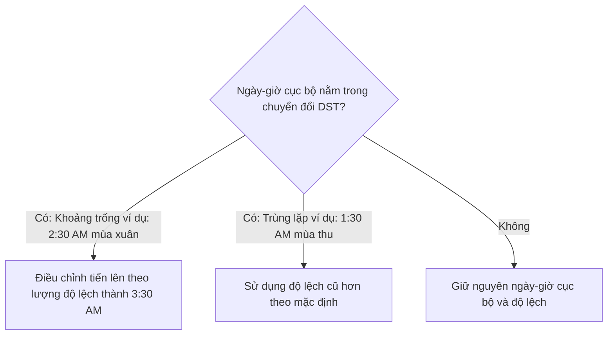

# API Ngày và Giờ (Date and Time API) - Phần 2

## Mục tiêu học tập (Learning Goal)

Tài liệu này bao gồm một phần trọng tâm của **API Ngày và Giờ (Date and Time API)**. Hãy nghiên cứu từng khái niệm như một quy tắc Java thực tế, thay vì chỉ là từ vựng rời rạc.

## Phạm vi đề mục (Outline Coverage)

| Khái niệm (Concept) | Điều cần biết (What to know) |
| --- | --- |
| `Period` | Biểu diễn bất biến (immutable), an toàn luồng (thread-safe) của một lượng thời gian dựa trên ngày tháng tính bằng năm, tháng và ngày. |
| `DateTimeFormatter` | Lớp hiện đại, bất biến, an toàn luồng dùng để định dạng và phân tích cú pháp các giá trị ngày-giờ. |
| `ZoneId` | Định danh múi giờ (timezone) (ví dụ: `Asia/Tokyo`) được sử dụng để giải quyết các quy tắc giờ mùa hè (Daylight Saving Time - DST) và các chuyển đổi vùng địa lý. |
| `Parse date/time` | Chuyển đổi một chuỗi văn bản thành một đối tượng thời gian bằng cách sử dụng một bộ định dạng; ném ra ngoại lệ thời gian chạy `DateTimeParseException` khi thất bại. |
| `Format date/time` | Chuyển đổi một đối tượng thời gian thành một chuỗi được định dạng; ném ra `UnsupportedTemporalTypeException` nếu các trường định dạng không được hỗ trợ. |
| `Compare date/time` | So sánh trình tự thời gian bằng cách sử dụng `isBefore()`, `isAfter()`, `isEqual()`, và `compareTo()`. |
| `Add/subtract date/time` | Thực hiện tính toán số học bằng cách sử dụng các phương thức bất biến (plus/minus) hoặc các điều chỉnh (with/TemporalAdjusters). |
| `Timezone` | Độ lệch thời gian địa lý được chuẩn hóa; được giải quyết bằng cách sử dụng `ZoneId` và `ZoneOffset`. |

## Ghi chú chi tiết (Detailed Notes)

### Period
`java.time.Period` biểu diễn một lượng thời gian dựa trên ngày tháng (tính bằng năm, tháng và ngày), chẳng hạn như "2 năm, 3 tháng và 6 ngày". Nó hoạt động trên các kiểu dữ liệu thời gian dựa trên ngày như `LocalDate`.

#### Định dạng & Biểu diễn Chuỗi (Formatting & String Representation):
* Định dạng tuân theo chuẩn định dạng khoảng thời gian ISO-8601: `PnYnMnD` (trong đó `P` là viết tắt của period - khoảng thời gian, `Y` là năm, `M` là tháng và `D` là ngày). Ví dụ: `P2Y3M6D`.

#### Cảnh báo về chuỗi gọi các phương thức tạo dựng (Warning about factory methods chaining):
* Các phương thức của `Period` không cộng dồn khi gọi dưới dạng chuỗi (chaining). Việc gọi `Period.ofYears(2).ofMonths(3)` chỉ trả về một khoảng thời gian là *3 tháng* (các phương thức tĩnh sẽ ghi đè thay vì kết hợp chúng lại). Thay vào đó, hãy sử dụng `Period.of(2, 3, 0)`.

```java
// Khởi tạo Period đúng cách
Period period = Period.of(1, 2, 3); // 1 năm, 2 tháng, 3 ngày
System.out.println(period); // P1Y2M3D

// Bẫy chuỗi gọi phương thức static:
Period badPeriod = Period.ofYears(1).ofDays(5); // Chỉ biểu diễn 5 ngày!
System.out.println(badPeriod); // P5D
```

### Tại sao Period và Duration có hành vi khác nhau khi chuyển đổi giờ mùa hè (Why Period and Duration Behave Differently (Daylight Saving Time Transitions))

Một `Period` biểu diễn lượng thời gian dựa trên ngày tháng (ví dụ: 1 ngày) trong các đơn vị lịch, trong khi một `Duration` biểu diễn lượng thời gian dựa trên thời gian máy đo bằng số giây vật lý chính xác (ví dụ: 86.400 giây). Khi cộng các đại lượng này vào một đối tượng `ZonedDateTime` có nhận biết múi giờ, chúng có thể mang lại các kết quả khác nhau nếu quá trình cộng này đi qua thời điểm thay đổi giờ mùa hè (Daylight Saving Time - DST). Ví dụ, trong quá trình chuyển đổi giờ mùa hè tiến lên (spring-forward), một ngày chỉ dài 23 giờ vật lý; cộng một `Period` của 1 ngày sẽ cập nhật ngày trên lịch và giữ nguyên các chữ số giờ địa phương (kết quả là 23 giờ vật lý trôi qua), trong khi cộng một `Duration` của 24 giờ sẽ tạo ra kết quả giờ địa phương trễ hơn một tiếng (24 giờ vật lý trôi qua).

#### Mô hình tư duy: Period so với Duration dưới tác động của DST (Mental Model: Period vs Duration under DST)
```text
Dòng thời gian khi chuyển đổi tiến lên vào mùa xuân (2:00 AM trở thành 3:00 AM):

Thời gian gốc: 2026-03-08T01:30-05:00[America/New_York]

Cộng Period.ofDays(1):
[01:30] ---------------- (Ngày tăng thêm 1) ---------------> [01:30 ngày tiếp theo] (23 giờ trôi qua)

Cộng Duration.ofDays(1) / Duration.ofHours(24):
[01:30] ---------------- (Chính xác 24 giờ trôi qua) -------------> [02:30 ngày tiếp theo] (Thời gian lệch đi +1 giờ)
```

#### Ví dụ mã nguồn: Tính toán số học DST (Code Example: DST Arithmetic)
```java
ZonedDateTime zdt = ZonedDateTime.of(2026, 3, 8, 1, 30, 0, 0, ZoneId.of("America/New_York"));

ZonedDateTime plusPeriod = zdt.plus(Period.ofDays(1));
ZonedDateTime plusDuration = zdt.plus(Duration.ofDays(1));

System.out.println("Base:     " + zdt);          // 2026-03-08T01:30-05:00[America/New_York]
System.out.println("Period:   " + plusPeriod);   // 2026-03-09T01:30-04:00[America/New_York]
System.out.println("Duration: " + plusDuration); // 2026-03-09T02:30-04:00[America/New_York]
```

#### Chuỗi nguyên nhân - kết quả (Cause-Effect Chain)

```text
`Chuyển đổi giờ mùa hè DST tiến lên xảy ra`
  → `Đồng hồ cục bộ nhảy từ 02:00 sang 03:00`
  → `Cộng Period của 1 ngày bảo toàn giờ cục bộ (01:30
  → 01:30 ngày tiếp theo, 23 giờ thực tế)`
  → `Cộng Duration của 1 ngày thêm chính xác 24 giờ thực tế (01:30
  → 02:30 ngày tiếp theo)`
```


### DateTimeFormatter
`java.time.format.DateTimeFormatter` là lớp hiện đại, bất biến và an toàn luồng để định dạng và phân tích cú pháp các đối tượng ngày-giờ. Nó thay thế cho `SimpleDateFormat`.

#### Cách sử dụng (Usage):
* Nó có các hằng số được định nghĩa sẵn như `ISO_LOCAL_DATE` (`2026-06-12`) và cho phép các mẫu định dạng tùy chỉnh bằng cách sử dụng các chữ cái định dạng như `yyyy`, `MM`, `dd`, `HH`, `mm`, `ss`.

```java
DateTimeFormatter formatter = DateTimeFormatter.ofPattern("dd/MM/yyyy");
LocalDate date = LocalDate.of(2026, 6, 12);
String formatted = date.format(formatter);
System.out.println(formatted); // 12/06/2026
```

### Tại sao DateTimeFormatter hoàn toàn an toàn luồng (Why DateTimeFormatter Is Completely Thread-Safe)

Khác với lớp cũ `java.text.SimpleDateFormat`, `java.time.format.DateTimeFormatter` được thiết kế bất biến (immutable) và không lưu trạng thái (stateless). Nó không duy trì bất kỳ trường trạng thái khả biến nào (chẳng hạn như calendar nội bộ trong `SimpleDateFormat`) trong quá trình thực hiện phân tích cú pháp hoặc định dạng. Thay vào đó, tất cả các trạng thái tạm thời của quá trình định dạng và phân tích cú pháp được duy trì hoàn toàn trên ngăn xếp thực thi (execution stack) của luồng đang gọi, bên trong các biến cục bộ. Do đó, một thể hiện tĩnh (static instance) duy nhất của `DateTimeFormatter` có thể được chia sẻ toàn cục trên tất cả các luồng trong một hệ thống đa luồng mà không gặp phải tranh chấp khóa (lock contention), tranh chấp dữ liệu (data race) hay overhead.

#### Mô hình tư duy: Thực thi ngăn xếp không lưu trạng thái (Mental Model: Stateless Stack Execution)
```mermaid
graph TD
    subgraph DateTimeFormatter an toàn luồng (Thread-Safe DateTimeFormatter)
        T1[Luồng 1 (Thread 1)] -->|gọi format| DF[DateTimeFormatter dùng chung - Bất biến]
        T2[Luồng 2 (Thread 2)] -->|gọi format| DF
        DF -->|định dạng trên ngăn xếp| O1[Đầu ra 1 (Output 1)]
        DF -->|định dạng trên ngăn xếp| O2[Đầu ra 2 (Output 2)]
    end
```

#### Ví dụ mã nguồn: Sử dụng đồng thời an toàn (Code Example: Safe Concurrent Usage)
```java
// Hoàn toàn an toàn khi chia sẻ bộ định dạng tĩnh trên nhiều luồng
public static final DateTimeFormatter FORMATTER = DateTimeFormatter.ofPattern("yyyy-MM-dd");

Runnable task = () -> {
    String result = FORMATTER.format(LocalDate.now());
    System.out.println(result);
};
new Thread(task).start();
new Thread(task).start();
```

#### Chuỗi nguyên nhân - kết quả (Cause-Effect Chain)

```text
`DateTimeFormatter không lưu trạng thái và bất biến`
  → `Trạng thái tạm thời được giữ trên các ngăn xếp cuộc gọi riêng của từng luồng`
  → `Không tồn tại biến khả biến dùng chung giữa các luồng`
  → `Không có tình trạng tranh chấp dữ liệu (race conditions) hoặc tranh chấp khóa trong quá trình format/parse`
```


### ZoneId
`java.time.ZoneId` đại diện cho một định danh múi giờ (ví dụ: `Europe/Paris`, `Asia/Tokyo`, `America/New_York`). Nó cung cấp các quy tắc để chuyển đổi các thời điểm (instants) thành ngày-giờ cục bộ và xử lý động các quá trình chuyển đổi giờ mùa hè.

```java
ZoneId tokyo = ZoneId.of("Asia/Tokyo");
ZoneId ny = ZoneId.of("America/New_York");
System.out.println("Tokyo Zone Rules: " + tokyo.getRules());
```

### Phân tích cú pháp ngày/giờ (Parse date/time)
Phân tích cú pháp chuyển đổi một chuỗi văn bản thành một đối tượng thời gian. Nếu chuỗi không khớp với mẫu dự kiến, nó sẽ ném ra ngoại lệ thời gian chạy `DateTimeParseException`.

#### Lỗi định dạng thời gian biên dịch so với thời gian chạy (Compile vs Runtime Formatter Errors):
* Sử dụng các chữ cái định dạng không hợp lệ (như `Y` thay vì `y` cho năm, hoặc `m` thay vì `M` cho tháng, hoặc gọi `.parse()` trên bộ định dạng đang mong đợi các trường thời gian nhưng lại truyền chuỗi chỉ chứa ngày) sẽ dẫn đến thất bại.
* Ví dụ: `LocalDate.parse("2026-06-12", DateTimeFormatter.ofPattern("yyyy-MM-dd HH:mm"))` ném ra `DateTimeParseException` vì thiếu các trường thời gian trong chuỗi đầu vào.

```java
// Phân tích cú pháp chuỗi tiêu chuẩn ISO-8601 trực tiếp
LocalDate parsedDate = LocalDate.parse("2026-06-12"); 

// Phân tích cú pháp định dạng tùy chỉnh
DateTimeFormatter formatter = DateTimeFormatter.ofPattern("dd-MM-yyyy");
LocalDate customParsed = LocalDate.parse("12-06-2026", formatter);
System.out.println(customParsed); // 2026-06-12
```

### Định dạng ngày/giờ (Format date/time)
Định dạng chuyển đổi một đối tượng thời gian thành một biểu diễn chuỗi văn bản có định dạng.

```java
LocalDateTime now = LocalDateTime.of(2026, 6, 12, 15, 30);
DateTimeFormatter formatter = DateTimeFormatter.ofPattern("EEEE, MMMM dd, yyyy 'at' hh:mm a");
System.out.println(now.format(formatter)); // Friday, June 12, 2026 at 03:30 PM
```

### So sánh ngày/giờ (Compare date/time)
Java cung cấp các phương thức chuyên dụng để so sánh các đối tượng thời gian theo trình tự thời gian:
* `isBefore(ChronoLocalDate)` / `isAfter(ChronoLocalDate)`
* `isEqual(ChronoLocalDate)` kiểm tra xem chúng có biểu diễn cùng một ngày/giờ hay không, bỏ qua các hệ thống lịch hoặc độ lệch múi giờ (khác với phương thức `equals()`).
* `compareTo(ChronoLocalDate)` trả về một số nguyên âm, số không hoặc số dương.

```java
LocalDate date1 = LocalDate.of(2026, 6, 12);
LocalDate date2 = LocalDate.of(2026, 6, 15);

System.out.println(date1.isBefore(date2)); // true
System.out.println(date1.isAfter(date2));  // false
```

### Cộng/trừ ngày/giờ (Add/subtract date/time)
Các phép tính toán số học thời gian được thực hiện bằng cách sử dụng các phương thức có giao diện trôi chảy (fluent) và bất biến:
* `plus(long, TemporalUnit)` / `minus(long, TemporalUnit)`
* Các phương thức tiện ích cụ thể như `plusDays()`, `minusMonths()`.
* `with(TemporalField, long)` / `with(TemporalAdjuster)` để điều chỉnh các trường cụ thể hoặc tìm các ngày động (ví dụ: thứ Hai tới).

```java
import java.time.DayOfWeek;
import java.time.temporal.TemporalAdjusters;

LocalDate date = LocalDate.of(2026, 6, 12); // Thứ Sáu
LocalDate nextMonday = date.with(TemporalAdjusters.next(DayOfWeek.MONDAY));
LocalDate lastDayOfMonth = date.with(TemporalAdjusters.lastDayOfMonth());

System.out.println("Next Monday: " + nextMonday);        // 2026-06-15
System.out.println("Last Day of Month: " + lastDayOfMonth); // 2026-06-30
```

### Múi giờ (Timezone)
Độ lệch múi giờ (timezone offset) là sự khác biệt giữa thời gian địa phương và Giờ phối hợp quốc tế (UTC). Java hiện đại biểu diễn độ lệch này bằng `ZoneOffset` (ví dụ: `+05:30`), trong khi các múi giờ khu vực (với các quy tắc DST lịch sử) được quản lý bằng `ZoneId`.

### Cách ZonedDateTime giải quyết thời gian không hợp lệ và trùng lặp khi chuyển đổi DST (How ZonedDateTime Resolves Invalid and Overlapping Times (DST Shifts))

Trong quá trình chuyển đổi giờ mùa hè, hai hiện tượng bất thường có thể xảy ra: khoảng trống (gaps - khi đồng hồ chạy tiến lên, để lại các giờ cục bộ không hợp lệ) và trùng lặp (overlaps - khi đồng hồ lùi lại, lặp lại một giờ cục bộ). Nếu một thời gian không hợp lệ được chỉ định trong khoảng trống, `ZonedDateTime` sẽ tự động điều chỉnh thời gian tiến lên bằng lượng chuyển đổi độ lệch (thường là 1 giờ) sang thời gian hợp lệ đầu tiên. Nếu một thời gian trùng lặp được chỉ định, `ZonedDateTime` sẽ mặc định giữ lại độ lệch sớm hơn (trước khi chuyển đổi) để duy trì tiến trình thời gian logic. Tuy nhiên, lập trình viên có thể ghi đè hành vi này và chọn độ lệch muộn hơn bằng phương thức `.withLaterOffsetAtOverlap()`.

#### Mô hình tư duy: Logic giải quyết DST của ZonedDateTime (Mental Model: ZonedDateTime DST Resolution Logic)


#### Ví dụ mã nguồn: Giải quyết khoảng trống và khoảng trùng lặp (Code Example: Gap and Overlap Resolution)
```java
ZoneId ny = ZoneId.of("America/New_York");

// 1. Khoảng trống: Tiến lên mùa xuân ngày 08-03-2026 (bỏ qua từ 02:00 đến 03:00)
// Cố gắng khởi tạo lúc 02:30 AM
ZonedDateTime gapTime = ZonedDateTime.of(2026, 3, 8, 2, 30, 0, 0, ny);
System.out.println("Gap (02:30): " + gapTime); // 2026-03-08T03:30-04:00[America/New_York] (Đã điều chỉnh)

// 2. Trùng lặp: Lùi lại mùa thu ngày 01-11-2026 (02:00 trở thành 01:00, lặp lại lúc 01:30)
ZonedDateTime overlapTime = ZonedDateTime.of(2026, 11, 1, 1, 30, 0, 0, ny);
System.out.println("Overlap Default: " + overlapTime); // 2026-11-01T01:30-04:00 (EDT)

ZonedDateTime laterOffset = overlapTime.withLaterOffsetAtOverlap();
System.out.println("Overlap Later:   " + laterOffset);  // 2026-11-01T01:30-05:00 (EST)
```

#### Chuỗi nguyên nhân - kết quả (Cause-Effect Chain)

```text
`Tạo ZonedDateTime trong khoảng trống DST`
  → `Kiểm tra các quy tắc vùng`
  → `Xác định thời gian không tồn tại ở địa phương`
  → `Dịch chuyển tiến lên theo khoảng trống chuyển đổi (thường là +1 giờ)`
  → `Khởi dựng ZonedDateTime hợp lệ trong độ lệch mới`
```


---

## Nghiên cứu tình huống: Lên lịch cuộc họp giữa các múi giờ New York và Tokyo (Case Study: Scheduling a Meeting Across Timezones (New York and Tokyo))

### Mô tả bài toán (Problem Description)
Một công ty muốn lên lịch cho một cuộc họp trực tuyến đồng bộ giữa các văn phòng của mình tại New York (`America/New_York`) và Tokyo (`Asia/Tokyo`). Cuộc họp được đề xuất diễn ra vào **ngày 15 tháng 10 năm 2026, lúc 9:00 sáng giờ địa phương New York**.
Chúng ta cần tính toán:
1. Đội ngũ ở Tokyo phải tham gia cuộc họp vào giờ và ngày địa phương nào.
2. Độ lệch và thời gian thay đổi như thế nào nếu cuộc họp được đổi lịch sang **ngày 15 tháng 12 năm 2026, lúc 9:00 sáng giờ địa phương New York** (khi New York chuyển sang Giờ chuẩn miền Đông (EST), trong khi Tokyo không áp dụng giờ mùa hè).

### Triển khai (Implementation)

```java
import java.time.LocalDateTime;
import java.time.ZoneId;
import java.time.ZonedDateTime;

public class TimeZoneCaseStudy {
    public static void main(String[] args) {
        ZoneId nyZone = ZoneId.of("America/New_York");
        ZoneId tokyoZone = ZoneId.of("Asia/Tokyo");

        // Tình huống 1: Cuộc họp vào tháng 10 (Giờ mùa hè ở New York)
        LocalDateTime octoberTime = LocalDateTime.of(2026, 10, 15, 9, 0); // 9:00 AM
        ZonedDateTime nyMeetingOct = ZonedDateTime.of(octoberTime, nyZone);
        ZonedDateTime tokyoMeetingOct = nyMeetingOct.withZoneSameInstant(tokyoZone);

        System.out.println("--- Scenario 1 (October Meeting) ---");
        System.out.println("New York Time: " + nyMeetingOct); 
        // Đầu ra: 2026-10-15T09:00-04:00[America/New_York]
        System.out.println("Tokyo Time:    " + tokyoMeetingOct); 
        // Đầu ra: 2026-10-15T22:00+09:00[Asia/Tokyo] (Chênh lệch 13 giờ)

        // Tình huống 2: Cuộc họp vào tháng 12 (Giờ tiêu chuẩn ở New York)
        LocalDateTime decemberTime = LocalDateTime.of(2026, 12, 15, 9, 0); // 9:00 AM
        ZonedDateTime nyMeetingDec = ZonedDateTime.of(decemberTime, nyZone);
        ZonedDateTime tokyoMeetingDec = nyMeetingDec.withZoneSameInstant(tokyoZone);

        System.out.println("\n--- Scenario 2 (December Meeting) ---");
        System.out.println("New York Time: " + nyMeetingDec); 
        // Đầu ra: 2026-12-15T09:00-05:00[America/New_York] (Độ lệch chuyển thành -05:00)
        System.out.println("Tokyo Time:    " + tokyoMeetingDec); 
        // Đầu ra: 2026-12-16T23:00+09:00[Asia/Tokyo] (Chênh lệch 14 giờ, chuyển sang ngày hôm sau)
    }
}
```

### Điểm rút ra quan trọng (Key Takeaways)
1. **Giải quyết độ lệch động (Dynamic Offset Resolution)**: Java giải quyết các độ lệch giờ mùa hè một cách linh hoạt dựa trên ngày được chỉ định. Đối với New York, nó áp dụng `-04:00` vào tháng 10 (EDT) và `-05:00` vào tháng 12 (EST).
2. **`withZoneSameInstant` so với `withZoneSameLocal`**:
   * `withZoneSameInstant()` bảo toàn thời điểm tuyệt đối trên dòng thời gian, trả về thời gian tương đương trong múi giờ mục tiêu (được sử dụng ở đây).
   * `withZoneSameLocal()` thay đổi múi giờ nhưng giữ nguyên các chữ số ngày và giờ địa phương (ví dụ: 9:00 AM giờ NY trở thành 9:00 AM giờ Tokyo).

---

## Các lỗi thường gặp (Common Mistakes)

### 1. Bẫy chuỗi phương thức tạo dựng tĩnh trên các đối tượng Period (Static Factory Chaining Trap on Periods)
Các phương thức tạo dựng tĩnh (static factory methods) trên `Period` không tích lũy. Phương thức cuối cùng được gọi trong chuỗi sẽ ghi đè lên các giá trị trước đó.
```java
// SAI: Kỳ vọng khoảng thời gian 1 năm, 2 tháng, và 3 ngày
Period p = Period.ofYears(1).ofMonths(2).ofDays(3); // Kết quả: 3 ngày (P3D)

// ĐÚNG: Sử dụng phương thức tạo dựng có nhiều đối số
Period pCorrect = Period.of(1, 2, 3); // Kết quả: P1Y2M3D
```

### 2. Sự phân biệt chữ hoa chữ thường trong mẫu định dạng thời gian của DateTimeFormatter (Time Pattern Case Sensitivity in DateTimeFormatter)
Chữ hoa và chữ thường rất quan trọng đối với các ký tự mẫu định dạng. Sử dụng chữ `m` viết thường thay vì chữ `M` viết hoa sẽ dẫn đến định dạng phút thay vì định dạng tháng.
* `M` = Tháng trong năm (ví dụ: `06`)
* `m` = Phút trong giờ (ví dụ: `30`)
* `y` = Năm của kỷ nguyên (ví dụ: `2026`)
* `Y` = Năm dựa trên tuần (thường hoạt động khác với năm dương lịch xung quanh thời điểm chuyển giao năm mới)

```java
// SAI: Định dạng tháng bằng phút
DateTimeFormatter badFormatter = DateTimeFormatter.ofPattern("yyyy-mm-dd"); 
// Đầu ra có thể trông giống như "2026-30-12" trong đó 30 là phút!
```

## Các câu hỏi ôn tập phổ biến (Common Review Prompts)

- Khái niệm nào ở đây là quy tắc trong thời gian biên dịch (compile-time)?
- Khái niệm nào ở đây ảnh hưởng đến hành vi thời gian chạy (runtime)?
- Khái niệm nào ở đây có khả năng là bẫy phỏng vấn?

## Liên kết tham khảo (Reference Links)

- https://docs.oracle.com/en/java/javase/21/docs/api/java.base/java/time/Period.html (Tài liệu JavaDoc của Period)
- https://docs.oracle.com/en/java/javase/21/docs/api/java.base/java/time/Duration.html (Tài liệu JavaDoc của Duration)
- https://docs.oracle.com/en/java/javase/21/docs/api/java.base/java/time/ZoneId.html (Tài liệu JavaDoc của ZoneId)
- https://docs.oracle.com/en/java/javase/21/docs/api/java.base/java/time/format/DateTimeFormatter.html (Tài liệu JavaDoc của DateTimeFormatter)
- https://docs.oracle.com/en/java/javase/21/docs/api/java.base/java/time/ZonedDateTime.html (Tài liệu JavaDoc của ZonedDateTime)
