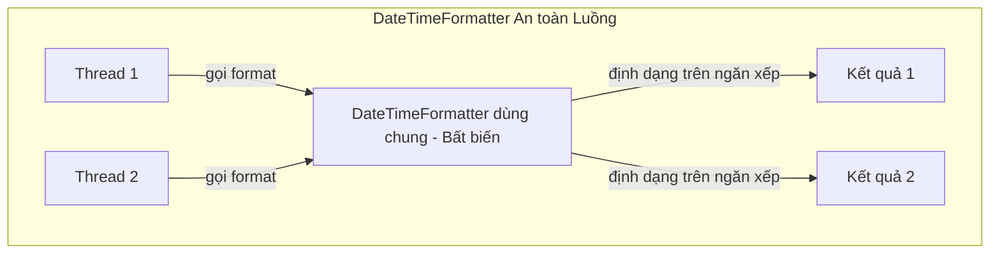
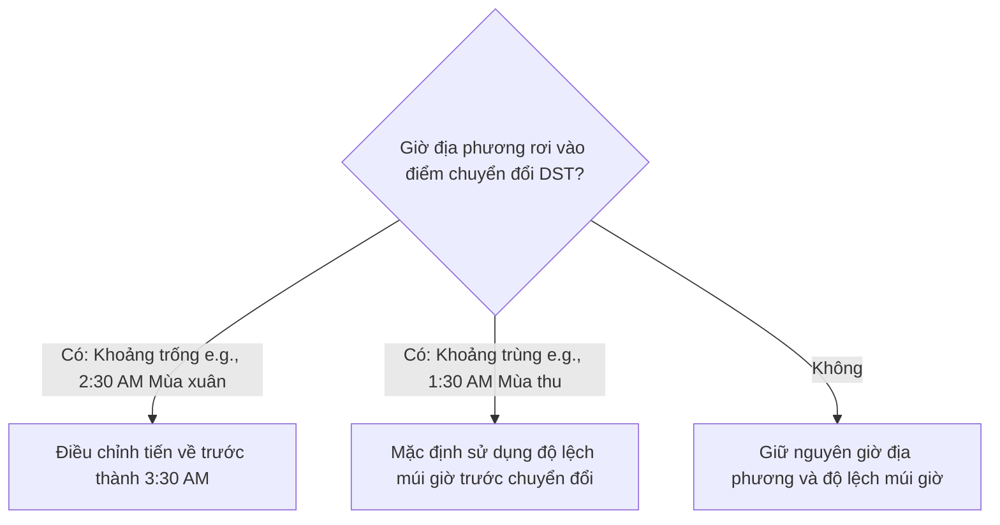

# API Ngày và Giờ (Date and Time API) - Phần 2

## Mục Tiêu Học Tập

Tài liệu này tập trung vào một phần chuyên sâu của **API Ngày và Giờ (Date and Time API)**. Hãy nghiên cứu từng khái niệm dưới dạng quy tắc thực tế trong Java, không chỉ đơn thuần là lý thuyết từ vựng.

## Tóm Tắt Nội Dung (Outline Coverage)

| Khái niệm (Concept) | Điều cần biết (What to know) |
| --- | --- |
| `Period` | Biểu diễn bất biến, an toàn luồng của một lượng thời gian dựa trên ngày tính theo năm, tháng và ngày. |
| `DateTimeFormatter` | Lớp hiện đại, bất biến, an toàn luồng để định dạng và phân tích cú pháp các giá trị ngày giờ. |
| `ZoneId` | Trình nhận dạng múi giờ (ví dụ: `Asia/Tokyo`) được sử dụng để giải quyết các quy tắc giờ mùa hè và các chuyển đổi vùng. |
| `Parse date/time` | Chuyển đổi một chuỗi thành một đối tượng thời gian bằng cách sử dụng bộ định dạng; ném ra ngoại lệ `DateTimeParseException` tại thời điểm chạy nếu thất bại. |
| `Format date/time` | Chuyển đổi một đối tượng thời gian thành một chuỗi được định dạng; ném ra ngoại lệ `UnsupportedTemporalTypeException` nếu các trường định dạng không được hỗ trợ. |
| `Compare date/time` | So sánh theo thứ tự thời gian bằng cách sử dụng `isBefore()`, `isAfter()`, `isEqual()`, và `compareTo()`. |
| `Add/subtract date/time` | Thực hiện các phép toán số học bằng cách sử dụng các phương thức bất biến (plus/minus) hoặc điều chỉnh (with/TemporalAdjusters). |
| `Timezone` | Lượng lệch thời gian địa lý được chuẩn hóa; được giải quyết bằng `ZoneId` và `ZoneOffset`. |

## Ghi Chú Chi Tiết

### Period
`java.time.Period` đại diện cho một lượng thời gian dựa trên lịch ngày (tính theo năm, tháng và ngày), ví dụ như "2 năm, 3 tháng và 6 ngày". Nó hoạt động trên các kiểu dữ liệu thời gian dựa trên ngày như `LocalDate`.

#### Định dạng & Biểu diễn Chuỗi:
* Định dạng tuân theo định dạng thời lượng ISO-8601 cho các khoảng thời gian: `PnYnMnD` (trong đó `P` đại diện cho Period - khoảng thời gian, `Y` cho năm, `M` cho tháng, và `D` cho ngày). Ví dụ: `P2Y3M6D`.

#### Cảnh báo về việc nối chuỗi các phương thức nhà máy (factory method):
* Các phương thức tạo của `Period` không tích lũy khi gọi nối chuỗi. Việc gọi `Period.ofYears(2).ofMonths(3)` sẽ chỉ trả về một khoảng thời gian là *3 tháng* (các phương thức tĩnh sẽ ghi đè giá trị cũ thay vì kết hợp chúng). Thay vào đó, hãy sử dụng `Period.of(2, 3, 0)`.

```java
// Khởi tạo Period đúng cách
Period period = Period.of(1, 2, 3); // 1 năm, 2 tháng, 3 ngày
System.out.println(period); // P1Y2M3D

// Bẫy nối chuỗi phương thức nhà máy tĩnh:
Period badPeriod = Period.ofYears(1).ofDays(5); // Chỉ đại diện cho 5 ngày!
System.out.println(badPeriod); // P5D
```

### Tại sao Period và Duration cư xử khác nhau (Chuyển đổi giờ mùa hè - Daylight Saving Time)

Một `Period` đại diện cho một lượng thời gian dựa trên ngày lịch (ví dụ: 1 ngày), trong khi một `Duration` đại diện cho một lượng thời gian đo bằng giây vật lý chính xác (ví dụ: 86,400 giây). Khi cộng các lượng thời gian này vào một đối tượng `ZonedDateTime` có nhận thức về múi giờ, chúng có thể mang lại các kết quả khác nhau nếu quá trình cộng đi qua thời điểm chuyển đổi Giờ mùa hè (Daylight Saving Time - DST). Ví dụ, trong quá trình chuyển đổi giờ mùa hè tiến lên vào mùa xuân, một ngày chỉ dài 23 giờ vật lý; cộng một `Period` của 1 ngày sẽ tăng ngày lịch lên 1 đơn vị và giữ nguyên các chữ số giờ địa phương (tương đương với 23 giờ vật lý trôi qua), trong khi cộng một `Duration` của 24 giờ sẽ tạo ra một thời điểm có giờ địa phương muộn hơn 1 tiếng (tương đương với 24 giờ vật lý trôi qua).

#### Mô hình tư duy: Period so với Duration dưới tác động của DST
```text
Trục thời gian của việc chuyển đổi tiến lên vào mùa xuân (2:00 AM trở thành 3:00 AM):

Thời gian gốc: 2026-03-08T01:30-05:00[America/New_York]

Cộng thêm Period.ofDays(1):
[01:30] ---------------- (Ngày lịch tăng thêm 1) --------------> [01:30 ngày hôm sau] (23 giờ thực tế trôi qua)

Cộng thêm Duration.ofDays(1) / Duration.ofHours(24):
[01:30] ---------------- (Chính xác 24 giờ trôi qua) -----------> [02:30 ngày hôm sau] (Giờ địa phương lệch +1h)
```

#### Ví dụ Code: Phép toán thời gian với DST
```java
ZonedDateTime zdt = ZonedDateTime.of(2026, 3, 8, 1, 30, 0, 0, ZoneId.of("America/New_York"));

ZonedDateTime plusPeriod = zdt.plus(Period.ofDays(1));
ZonedDateTime plusDuration = zdt.plus(Duration.ofDays(1));

System.out.println("Base:     " + zdt);          // 2026-03-08T01:30-05:00[America/New_York]
System.out.println("Period:   " + plusPeriod);   // 2026-03-09T01:30-04:00[America/New_York]
System.out.println("Duration: " + plusDuration); // 2026-03-09T02:30-04:00[America/New_York]
```

#### Chuỗi Nguyên nhân - Kết quả
`Thời điểm chuyển đổi giờ mùa hè DST diễn ra` &rarr; `Đồng hồ địa phương nhảy từ 02:00 lên 03:00` &rarr; `Cộng thêm Period 1 ngày sẽ bảo toàn giờ địa phương (01:30 → 01:30 ngày hôm sau, 23 giờ thực tế)` &rarr; `Cộng thêm Duration 1 ngày sẽ cộng chính xác 24 giờ thực tế (01:30 → 02:30 ngày hôm sau)`.

### DateTimeFormatter
`java.time.format.DateTimeFormatter` là lớp hiện đại, bất biến và an toàn luồng dùng để định dạng và phân tích cú pháp các đối tượng ngày giờ. Lớp này thay thế hoàn toàn cho `SimpleDateFormat`.

#### Cách dùng:
* Nó định nghĩa sẵn các hằng số như `ISO_LOCAL_DATE` (`2026-06-12`) và cho phép tạo các mẫu tùy chỉnh sử dụng các ký tự mẫu như `yyyy`, `MM`, `dd`, `HH`, `mm`, `ss`.

```java
DateTimeFormatter formatter = DateTimeFormatter.ofPattern("dd/MM/yyyy");
LocalDate date = LocalDate.of(2026, 6, 12);
String formatted = date.format(formatter);
System.out.println(formatted); // 12/06/2026
```

### Tại sao DateTimeFormatter An Toàn Luồng Tuyệt Đối

Không giống như lớp cũ `java.text.SimpleDateFormat`, `java.time.format.DateTimeFormatter` được thiết kế bất biến (Immutable) và không có trạng thái (Stateless). Nó không duy trì bất kỳ trường trạng thái có thể thay đổi nào (như lịch nội bộ trong `SimpleDateFormat`) trong quá trình thực hiện các thao tác phân tích cú pháp hoặc định dạng. Thay vào đó, toàn bộ trạng thái định dạng và phân tích cú pháp tạm thời được duy trì hoàn toàn trên ngăn xếp thực thi (Execution stack) của luồng đang gọi, bên trong các biến cục bộ. Do đó, một thể hiện tĩnh duy nhất của `DateTimeFormatter` có thể được chia sẻ toàn cục giữa tất cả các luồng trong một hệ thống đa luồng mà không gặp bất kỳ tranh chấp khóa (Lock contention), tranh chấp dữ liệu (Data race) hay chi phí quản lý phụ trội nào.

#### Mô hình tư duy: Thực thi trên ngăn xếp không trạng thái


#### Ví dụ Code: Sử dụng đồng thời an toàn
```java
// Hoàn toàn an toàn khi chia sẻ formatter tĩnh giữa nhiều luồng
public static final DateTimeFormatter FORMATTER = DateTimeFormatter.ofPattern("yyyy-MM-dd");

Runnable task = () -> {
    String result = FORMATTER.format(LocalDate.now());
    System.out.println(result);
};
new Thread(task).start();
new Thread(task).start();
```

#### Chuỗi Nguyên nhân - Kết quả
`DateTimeFormatter không trạng thái và bất biến` &rarr; `Trạng thái tạm thời được lưu trên ngăn xếp cuộc gọi riêng của từng luồng` &rarr; `Không tồn tại biến thay đổi được chia sẻ giữa các luồng` &rarr; `Không xảy ra tranh chấp dữ liệu hoặc tranh chấp khóa trong quá trình định dạng/phân tích cú pháp`.

### ZoneId
`java.time.ZoneId` đại diện cho một bộ định danh múi giờ (ví dụ: `Europe/Paris`, `Asia/Tokyo`, `America/New_York`). Nó cung cấp các quy tắc để chuyển đổi các thời điểm (Instant) thành ngày giờ địa phương và xử lý động các lần chuyển đổi giờ mùa hè.

```java
ZoneId tokyo = ZoneId.of("Asia/Tokyo");
ZoneId ny = ZoneId.of("America/New_York");
System.out.println("Tokyo Zone Rules: " + tokyo.getRules());
```

### Phân tích cú pháp ngày/giờ (Parse date/time)
Phân tích cú pháp chuyển đổi một chuỗi văn bản thành một đối tượng thời gian. Nếu chuỗi không khớp với mẫu mong đợi, hệ thống sẽ ném ra ngoại lệ `DateTimeParseException` tại thời điểm chạy.

#### Lỗi Formatter lúc Biên dịch so với lúc Chạy:
* Việc sử dụng các ký tự mẫu không hợp lệ (như sử dụng `Y` thay vì `y` cho năm, hoặc `m` thay vì `M` cho tháng, hoặc gọi phương thức `.parse()` trên một formatter yêu cầu các trường giờ phút nhưng lại chỉ truyền vào chuỗi ngày) sẽ gây ra lỗi thất bại.
* Ví dụ: `LocalDate.parse("2026-06-12", DateTimeFormatter.ofPattern("yyyy-MM-dd HH:mm"))` ném ra lỗi `DateTimeParseException` vì thiếu thông tin giờ phút trong chuỗi đầu vào.

```java
// Phân tích cú pháp các chuỗi chuẩn ISO-8601 trực tiếp
LocalDate parsedDate = LocalDate.parse("2026-06-12"); 

// Phân tích cú pháp với định dạng tùy chỉnh
DateTimeFormatter formatter = DateTimeFormatter.ofPattern("dd-MM-yyyy");
LocalDate customParsed = LocalDate.parse("12-06-2026", formatter);
System.out.println(customParsed); // 2026-06-12
```

### Định dạng ngày/giờ (Format date/time)
Định dạng chuyển đổi một đối tượng thời gian thành một chuỗi biểu diễn văn bản theo mẫu mong muốn.

```java
LocalDateTime now = LocalDateTime.of(2026, 6, 12, 15, 30);
DateTimeFormatter formatter = DateTimeFormatter.ofPattern("EEEE, MMMM dd, yyyy 'at' hh:mm a");
System.out.println(now.format(formatter)); // Friday, June 12, 2026 at 03:30 PM
```

### So sánh ngày/giờ (Compare date/time)
Java cung cấp các phương thức chuyên dụng để so sánh các đối tượng thời gian theo trật tự thời gian tuyến tính:
* `isBefore(ChronoLocalDate)` / `isAfter(ChronoLocalDate)`
* `isEqual(ChronoLocalDate)` kiểm tra xem chúng có đại diện cho cùng một ngày/giờ hay không, bỏ qua các hệ lịch hoặc độ lệch múi giờ (khác với `equals()`).
* `compareTo(ChronoLocalDate)` trả về số nguyên âm, số không, hoặc số nguyên dương.

```java
LocalDate date1 = LocalDate.of(2026, 6, 12);
LocalDate date2 = LocalDate.of(2026, 6, 15);

System.out.println(date1.isBefore(date2)); // true
System.out.println(date1.isAfter(date2));  // false
```

### Cộng/trừ ngày/giờ (Add/subtract date/time)
Các phép toán số học thời gian được thực hiện thông qua các phương thức bất biến, thiết kế trôi chảy (fluent API):
* `plus(long, TemporalUnit)` / `minus(long, TemporalUnit)`
* Các phương thức tiện ích cụ thể như `plusDays()`, `minusMonths()`.
* `with(TemporalField, long)` / `with(TemporalAdjuster)` để điều chỉnh các trường cụ thể hoặc tìm các ngày biến động (ví dụ: Thứ Hai tuần tới).

```java
import java.time.DayOfWeek;
import java.time.temporal.TemporalAdjusters;

LocalDate date = LocalDate.of(2026, 6, 12); // A Friday
LocalDate nextMonday = date.with(TemporalAdjusters.next(DayOfWeek.MONDAY));
LocalDate lastDayOfMonth = date.with(TemporalAdjusters.lastDayOfMonth());

System.out.println("Next Monday: " + nextMonday);        // 2026-06-15
System.out.println("Last Day of Month: " + lastDayOfMonth); // 2026-06-30
```

### Múi giờ (Timezone)
Độ lệch múi giờ là sự chênh lệch giữa giờ địa phương và Giờ phối hợp quốc tế (UTC). Java hiện đại biểu diễn độ lệch này bằng `ZoneOffset` (ví dụ: `+05:30`), trong khi các múi giờ khu vực địa lý (với các quy tắc DST lịch sử) được quản lý bằng `ZoneId`.

### Cách ZonedDateTime Giải quyết các Khoảng thời gian Không Hợp lệ và Trùng lặp (Chuyển đổi DST)

Trong quá trình chuyển đổi giờ mùa hè, có hai hiện tượng bất thường có thể xảy ra: khoảng trống (Gap - khi đồng hồ nhảy tiến về phía trước, để lại các mốc giờ địa phương không tồn tại) và khoảng trùng (Overlap - khi đồng hồ lùi lại, lặp lại một giờ địa phương hai lần). Nếu một giờ không hợp lệ nằm trong khoảng trống được chỉ định, `ZonedDateTime` sẽ tự động điều chỉnh giờ tiến về phía trước một khoảng tương ứng (thường là 1 giờ) sang mốc giờ hợp lệ đầu tiên. Nếu một giờ nằm trong khoảng trùng lặp được chỉ định, `ZonedDateTime` sẽ mặc định giữ nguyên độ lệch múi giờ trước đó (trước khi chuyển đổi) để đảm bảo tiến trình thời gian diễn ra logic. Tuy nhiên, lập trình viên có thể thay đổi hành vi này để chọn độ lệch múi giờ sau chuyển đổi bằng phương thức `.withLaterOffsetAtOverlap()`.

#### Mô hình tư duy: Logic giải quyết DST của ZonedDateTime


#### Ví dụ Code: Gap và Overlap Resolution
```java
ZoneId ny = ZoneId.of("America/New_York");

// 1. Gap: Spring forward 2026-03-08 (02:00 to 03:00 is skipped)
// Attempting to construct 02:30 AM
ZonedDateTime gapTime = ZonedDateTime.of(2026, 3, 8, 2, 30, 0, 0, ny);
System.out.println("Gap (02:30): " + gapTime); // 2026-03-08T03:30-04:00[America/New_York] (Adjusted)

// 2. Overlap: Fall back 2026-11-01 (02:00 becomes 01:00, 01:30 is repeated)
ZonedDateTime overlapTime = ZonedDateTime.of(2026, 11, 1, 1, 30, 0, 0, ny);
System.out.println("Overlap Default: " + overlapTime); // 2026-11-01T01:30-04:00 (EDT)

ZonedDateTime laterOffset = overlapTime.withLaterOffsetAtOverlap();
System.out.println("Overlap Later:   " + laterOffset);  // 2026-11-01T01:30-05:00 (EST)
```

#### Chuỗi Nguyên nhân - Kết quả
`Tạo ZonedDateTime trong khoảng trống DST` &rarr; `Tra cứu quy tắc múi giờ` &rarr; `Nhận diện giờ địa phương không tồn tại` &rarr; `Dịch chuyển tiến về trước một khoảng tương ứng (thường là +1 giờ)` &rarr; `Tạo đối tượng ZonedDateTime hợp lệ với độ lệch múi giờ mới`.

---

## Ví Dụ Thực Tế: Lên lịch Cuộc họp xuyên múi giờ (New York và Tokyo)

### Mô tả Bài toán
Một công ty muốn lên lịch cho một cuộc họp trực tuyến đồng bộ giữa các văn phòng của mình tại New York (`America/New_York`) và Tokyo (`Asia/Tokyo`). Cuộc họp được đề xuất diễn ra vào ngày **15 tháng 10 năm 2026, lúc 9:00 AM theo giờ địa phương New York**.
Chúng ta cần tính toán:
1. Giờ địa phương và ngày tháng mà đội ngũ tại Tokyo phải tham gia họp.
2. Độ lệch múi giờ và thời gian họp thay đổi như thế nào nếu cuộc họp được đổi lịch sang ngày **15 tháng 12 năm 2026, lúc 9:00 AM theo giờ địa phương New York** (khi New York đã chuyển về Giờ chuẩn miền Đông (EST), trong khi Tokyo không áp dụng Giờ mùa hè).

### Triển khai Mã nguồn

```java
import java.time.LocalDateTime;
import java.time.ZoneId;
import java.time.ZonedDateTime;

public class TimeZoneCaseStudy {
    public static void main(String[] args) {
        ZoneId nyZone = ZoneId.of("America/New_York");
        ZoneId tokyoZone = ZoneId.of("Asia/Tokyo");

        // Kịch bản 1: Cuộc họp vào tháng 10 (Giờ mùa hè tại New York)
        LocalDateTime octoberTime = LocalDateTime.of(2026, 10, 15, 9, 0); // 9:00 AM
        ZonedDateTime nyMeetingOct = ZonedDateTime.of(octoberTime, nyZone);
        ZonedDateTime tokyoMeetingOct = nyMeetingOct.withZoneSameInstant(tokyoZone);

        System.out.println("--- Scenario 1 (October Meeting) ---");
        System.out.println("New York Time: " + nyMeetingOct); 
        // Output: 2026-10-15T09:00-04:00[America/New_York]
        System.out.println("Tokyo Time:    " + tokyoMeetingOct); 
        // Output: 2026-10-15T22:00+09:00[Asia/Tokyo] (Chênh lệch 13 tiếng)

        // Kịch bản 2: Cuộc họp vào tháng 12 (Giờ chuẩn tại New York)
        LocalDateTime decemberTime = LocalDateTime.of(2026, 12, 15, 9, 0); // 9:00 AM
        ZonedDateTime nyMeetingDec = ZonedDateTime.of(decemberTime, nyZone);
        ZonedDateTime tokyoMeetingDec = nyMeetingDec.withZoneSameInstant(tokyoZone);

        System.out.println("\n--- Scenario 2 (December Meeting) ---");
        System.out.println("New York Time: " + nyMeetingDec); 
        // Output: 2026-12-15T09:00-05:00[America/New_York] (Độ lệch chuyển thành -05:00)
        System.out.println("Tokyo Time:    " + tokyoMeetingDec); 
        // Output: 2026-12-16T23:00+09:00[Asia/Tokyo] (Chênh lệch 14 tiếng, nhảy sang ngày tiếp theo)
    }
}
```

### Điểm mấu chốt rút ra
1. **Giải quyết Độ lệch múi giờ Động**: Java tự động tính toán các độ lệch múi giờ dựa trên ngày được nhắm mục tiêu. Đối với New York, nó áp dụng `-04:00` vào tháng 10 (EDT) và `-05:00` vào tháng 12 (EST).
2. **`withZoneSameInstant` so với `withZoneSameLocal`**:
   * `withZoneSameInstant()` bảo toàn thời điểm vật lý tuyệt đối trên trục thời gian, trả về thời gian tương đương ở múi giờ đích (được sử dụng trong ví dụ này).
   * `withZoneSameLocal()` thay đổi múi giờ nhưng giữ nguyên các chữ số ngày giờ địa phương (ví dụ: 9:00 AM giờ NY trở thành 9:00 AM giờ Tokyo).

---

## Các lỗi thường gặp

### 1. Bẫy nối chuỗi phương thức nhà máy tĩnh của Period
Các phương thức nhà máy tĩnh của `Period` không tích lũy dồn. Phương thức được gọi sau cùng sẽ ghi đè lên các giá trị trước đó.
```java
// SAI: Kỳ vọng khoảng thời gian là 1 năm, 2 tháng và 3 ngày
Period p = Period.ofYears(1).ofMonths(2).ofDays(3); // Kết quả: 3 ngày (P3D)

// ĐÚNG: Sử dụng phương thức nhà máy nhận nhiều đối số
Period pCorrect = Period.of(1, 2, 3); // Kết quả: P1Y2M3D
```

### 2. Sự phân biệt hoa thường của mẫu ký tự trong `DateTimeFormatter`
Ký tự viết hoa và viết thường đại diện cho các giá trị khác nhau. Việc sử dụng chữ thường `m` thay vì chữ hoa `M` sẽ định dạng phút thay vì tháng.
* `M` = Tháng trong năm (ví dụ: `06`)
* `m` = Phút trong giờ (ví dụ: `30`)
* `y` = Năm trong kỷ nguyên (ví dụ: `2026`)
* `Y` = Năm dựa trên số tuần (thường cư xử khác với năm lịch thông thường tại các thời điểm chuyển giao năm mới)

```java
// SAI: Định dạng tháng bằng ký tự biểu diễn phút
DateTimeFormatter badFormatter = DateTimeFormatter.ofPattern("yyyy-mm-dd"); 
// Đầu ra có thể trông giống như "2026-30-12" với 30 là số phút hiện tại!
```

## Các Câu Hỏi Ôn Tập Thường Gặp

- Những khái niệm nào ở đây là các quy tắc tại thời điểm biên dịch?
- Những khái niệm nào ở đây ảnh hưởng đến hành vi tại thời điểm chạy?
- Những khái niệm nào ở đây dễ trở thành bẫy khi phỏng vấn?

## Liên kết Tham khảo

- https://docs.oracle.com/en/java/javase/21/docs/api/java.base/java/time/Period.html (Tài liệu Period JavaDoc)
- https://docs.oracle.com/en/java/javase/21/docs/api/java.base/java/time/Duration.html (Tài liệu Duration JavaDoc)
- https://docs.oracle.com/en/java/javase/21/docs/api/java.base/java/time/ZoneId.html (Tài liệu ZoneId JavaDoc)
- https://docs.oracle.com/en/java/javase/21/docs/api/java.base/java/time/format/DateTimeFormatter.html (Tài liệu DateTimeFormatter JavaDoc)
- https://docs.oracle.com/en/java/javase/21/docs/api/java.base/java/time/ZonedDateTime.html (Tài liệu ZonedDateTime JavaDoc)
