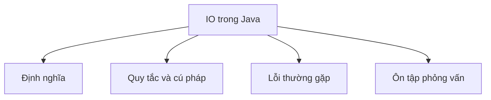

# 26 - IO trong Java

Chủ đề này bám sát đề cương chính trong [outline.md](../outline.md). Mục tiêu là hiểu sâu sắc từng khái niệm để có thể giải thích, nhận biết trong mã nguồn và trả lời các câu hỏi phỏng vấn.

## Thứ Tự Học Tập

- [Khái Niệm về File](theory/01-file-concepts.md)
- [Khái Niệm về BufferedInputStream](theory/02-bufferedinputstream-concepts.md)
- [Khái Niệm về Tuần Tự Hóa](theory/03-serialization-concepts.md)
- [Thuật Ngữ Khóa](terms/01-key-terms.md)

## Danh Sách Kiểm Tra Theo Đề Cương

- File
- Tạo file
- Xóa file
- Kiểm tra sự tồn tại
- Đọc metadata của file
- Tạo thư mục
- InputStream
- OutputStream
- FileInputStream
- FileOutputStream
- BufferedInputStream
- BufferedOutputStream
- Reader
- Writer
- FileReader
- FileWriter
- BufferedReader
- BufferedWriter
- ObjectInputStream
- ObjectOutputStream
- Tuần tự hóa (Serialization)
- Giải tuần tự hóa (Deserialization)
- Serializable
- serialVersionUID
- transient
- Scanner
- System.in
- System.out
- System.err

## Thẻ Anki

- [Basic](anki/basic.tsv)
- [Basic Extra](anki/basic-extra.tsv)
- [Cloze](anki/cloze.tsv)
- [Code Question](anki/code-question.tsv)

## Tự Kiểm Tra

Trước khi chuyển sang chủ đề tiếp theo, hãy xác nhận bạn có thể trả lời các câu hỏi sau:
1. Tại sao Java phân biệt giữa luồng byte (byte stream) và luồng ký tự (character stream), và bộ ký tự mã hóa (encoding charset) được ánh xạ như thế nào ở tầng bên dưới?
2. Tại sao `BufferedInputStream` / `BufferedOutputStream` vượt trội hẳn so với thao tác luồng thô (raw stream), và kích thước buffer của JVM tương tác như thế nào với bộ nhớ đệm trang đĩa (disk page caching) của hệ điều hành?
3. Tại sao tuần tự hóa (serialization) Java yêu cầu `serialVersionUID`, và những vấn đề tương thích nào xảy ra ở thời gian biên dịch hoặc thời gian chạy nếu nó bị thiếu hoặc không khớp trong quá trình phát triển lớp?
4. Tại sao các trường `transient` bị loại trừ khỏi quá trình tuần tự hóa, và điều gì xảy ra với chúng trong quá trình giải tuần tự hóa (deserialization) (có áp dụng quy tắc constructor hay khởi tạo giá trị mặc định)?
5. Tại sao cơ chế tuần tự hóa mặc định của Java bị coi là rủi ro bảo mật, và đâu là các phương án thay thế hiện đại hay chiến lược giảm thiểu?

## Sơ Đồ Mermaid Tổng Quan

## Liên Kết Tham Khảo

- https://docs.oracle.com/javase/tutorial/essential/io/
- https://docs.oracle.com/en/java/javase/21/docs/api/java.base/java/io/package-summary.html
