# Vào/Ra trong Java (IO in Java) - Phần 1

## Mục tiêu học tập (Learning Goal)

Tài liệu này bao gồm một phần trọng tâm của **Vào/Ra trong Java (IO in Java)**. Hãy nghiên cứu từng khái niệm như một quy tắc Java thực tế, thay vì chỉ là từ vựng rời rạc.

## Phạm vi đề mục (Outline Coverage)

| Khái niệm (Concept) | Điều cần biết (What to know) |
| --- | --- |
| `File` | Biểu diễn một đường dẫn file hoặc thư mục trong bộ nhớ (in memory); không mở hoặc đọc trực tiếp nội dung thực tế của một file. |
| `Create file` | Được xử lý thông qua `file.createNewFile()`, trả về `true` nếu thành công, hoặc ném ra một ngoại lệ `IOException` nếu đường dẫn không hợp lệ hoặc thiếu quyền truy cập. |
| `Delete file` | Được xử lý thông qua `file.delete()`, trả về một giá trị boolean. Nó thất bại (trả về `false`) nếu file không tồn tại hoặc nếu mục tiêu là một thư mục không trống. |
| `Check existence` | Được xác thực bằng cách sử dụng `file.exists()`, cùng với các phương thức tiện ích `file.isFile()` và `file.isDirectory()` để xác định kiểu dữ liệu. |
| `Read file metadata` | Truy cập các thuộc tính như kích thước file (`file.length()`), tên (`file.getName()`), đường dẫn (`file.getAbsolutePath()`), và quyền truy cập (`file.canRead()`, `file.canWrite()`). |
| `Create directory` | Được tạo thông qua `file.mkdir()` (thất bại nếu các thư mục cha không tồn tại) hoặc `file.mkdirs()` (tạo đệ quy tất cả các thư mục cha còn thiếu). |
| `InputStream` | Lớp cơ sở trừu tượng đại diện cho một luồng đầu vào của các byte; được sử dụng để đọc dữ liệu nhị phân thô (raw binary data). |
| `OutputStream` | Lớp cơ sở trừu tượng đại diện cho một luồng đầu ra của các byte; được sử dụng để ghi dữ liệu nhị phân thô. |
| `FileInputStream` | Một lớp con cụ thể của `InputStream` đọc các byte một cách tuần tự từ một file. |
| `FileOutputStream` | Một lớp con cụ thể của `OutputStream` ghi các byte một cách tuần tự vào một file. |

## Ghi chú chi tiết (Detailed Notes)

### File
Lớp `java.io.File` biểu diễn một tên đường dẫn (pathname) dẫn đến một tập tin hoặc thư mục trên hệ thống tập tin. Việc tạo một đối tượng `File` **không** tự động tạo ra một tập tin trên đĩa hoặc mở bất kỳ luồng hệ thống tập tin nào. Nó chỉ đơn giản là một biểu diễn trừu tượng của một đường dẫn.

```java
// Việc này CHỈ tạo ra một biểu diễn trong bộ nhớ
File file = new File("example.txt");
System.out.println("Exists: " + file.exists()); // In ra false nếu file chưa có trên đĩa
```

### Tạo, Xóa và Kiểm tra sự tồn tại (Create, Delete, and Check Existence)
Để thực sự thao tác trên các file ở đĩa cứng, `File` cung cấp các phương thức tương tác với hệ điều hành cơ sở:
* `createNewFile()`: Tạo một tập tin mới, trống nếu nó chưa tồn tại. Nó trả về `true` nếu tập tin được tạo thành công, và `false` nếu tập tin đã tồn tại.
* `delete()`: Xóa tập tin hoặc thư mục. Lưu ý rằng các thư mục chỉ có thể bị xóa nếu chúng hoàn toàn trống.
* `exists()`: Trả về một giá trị boolean cho biết tập tin hoặc thư mục có tồn tại hay không.
* `isFile()` / `isDirectory()`: Xác thực kiểu của nút (node) trên đĩa.

```java
import java.io.File;
import java.io.IOException;

public class FileBasics {
    public static void main(String[] args) {
        File file = new File("test.txt");
        try {
            if (file.createNewFile()) {
                System.out.println("File created successfully.");
            } else {
                System.out.println("File already exists.");
            }
            
            System.out.println("Is File: " + file.isFile());
            System.out.println("Is Directory: " + file.isDirectory());
            
            if (file.delete()) {
                System.out.println("File deleted successfully.");
            }
        } catch (IOException e) {
            e.printStackTrace();
        }
    }
}
```

### Tạo thư mục và Đọc siêu dữ liệu (Create Directory and Read Metadata)
* `mkdir()`: Tạo thư mục được đặt tên bởi đường dẫn trừu tượng này. Thất bại nếu bất kỳ thư mục cha nào trong đường dẫn không tồn tại.
* `mkdirs()`: Tạo thư mục này, bao gồm cả bất kỳ thư mục cha cần thiết nào chưa tồn tại.
* Các phương thức siêu dữ liệu (metadata):
  * `length()`: Trả về kích thước tập tin bằng byte. Trả về `0L` nếu tập tin không tồn tại.
  * `getName()`: Trả về tên của tập tin hoặc thư mục (phần cuối cùng của đường dẫn).
  * `getAbsolutePath()`: Trả về chuỗi đường dẫn tuyệt đối.

```java
File nestedDir = new File("parent/child/grandchild");
boolean dirsCreated = nestedDir.mkdirs(); // Tạo các thư mục parent, child, và grandchild
System.out.println("Directories created: " + dirsCreated);
System.out.println("Directory name: " + nestedDir.getName());
System.out.println("Absolute Path: " + nestedDir.getAbsolutePath());
```

### InputStream & OutputStream (Luồng Byte - Byte Streams)
`InputStream` và `OutputStream` là các lớp trừu tượng đại diện cho các luồng byte tuần tự. Chúng được thiết kế cho dữ liệu nhị phân thô (chẳng hạn như hình ảnh, tệp zip hoặc âm thanh).
* `read()`: Đọc byte dữ liệu tiếp theo. Trả về `-1` khi đạt đến cuối luồng (end of the stream).
* `write(int b)`: Ghi byte được chỉ định vào luồng.
* **Quan trọng**: Các luồng byte phải được đóng sau khi sử dụng để giải phóng tài nguyên hệ thống (như các thẻ quản lý file - file handles).

### FileInputStream & FileOutputStream
Đây là các cài đặt cụ thể (concrete implementations) được sử dụng để đọc và ghi các byte từ/vào một tập tin trên đĩa.

```java
import java.io.FileInputStream;
import java.io.FileOutputStream;
import java.io.IOException;

public class ByteFileCopy {
    public static void main(String[] args) {
        // Sử dụng try-with-resources để đảm bảo các luồng được đóng
        try (FileInputStream in = new FileInputStream("source.bin");
             FileOutputStream out = new FileOutputStream("dest.bin")) {
             
            int byteData;
            // Đọc từng byte
            while ((byteData = in.read()) != -1) {
                out.write(byteData);
            }
            System.out.println("Copy completed successfully.");
        } catch (IOException e) {
            System.err.println("File copy failed: " + e.getMessage());
        }
    }
}
```

## Tại sao các luồng ký tự dịch chuyển byte và làm hỏng dữ liệu nhị phân (Why Character Streams Translate Bytes and Corrupt Binary Data)

Các luồng ký tự (`Reader` và `Writer`) được thiết kế để xử lý dữ liệu văn bản bằng cách chuyển đổi các byte 8-bit thô thành các ký tự Unicode 16-bit. Quá trình chuyển dịch này được điều khiển bởi một bảng mã hóa ký tự (encoding charset) (chẳng hạn như UTF-8 hoặc UTF-16) nhằm ánh xạ các mẫu byte cụ thể thành các điểm mã Unicode (Unicode code points). Khi các tập tin nhị phân (như hình ảnh, tệp zip hoặc các lớp đã được biên dịch) được đọc bằng luồng ký tự, các byte cơ sở đại diện cho dữ liệu thô tùy ý chứ không phải các ký tự được mã hóa. Bộ giải mã (decoder) của luồng ký tự cố gắng phân tích các byte này dưới dạng các ký tự hợp lệ; nếu nó gặp một chuỗi byte không tuân thủ bảng mã mong muốn, nó sẽ tự động thay thế nó bằng một ký tự thay thế (replacement character) (thường là `\uFFFD` hoặc `?`) hoặc loại bỏ hoàn toàn. Khi dữ liệu được ghi ngược trở lại, bộ mã hóa (encoder) sẽ ghi ra chuỗi byte của ký tự thay thế đó, thay đổi vĩnh viễn và làm hỏng cấu trúc tập tin gốc.

### Xử lý luồng nhị phân so với luồng ký tự (Binary vs. Character Stream Processing)

```mermaid
flowchart TD
    subgraph ByteStream [Luồng Byte - Byte Stream: An toàn cho nhị phân]
        B1[Byte nhị phân thô: ví dụ 0xFF] -->|FileInputStream| B2[Không dịch nghĩa] -->|FileOutputStream| B3[Byte giống hệt: 0xFF]
    end
    subgraph CharStream [Luồng ký tự - Character Stream: Làm hỏng nhị phân]
        C1[Byte nhị phân thô: ví dụ 0xFF] -->|FileReader| C2[Bộ giải mã Charset: byte UTF-8 không hợp lệ]
        C2 -->|Được thay thế bằng| C3[Ký tự thay thế Unicode: \uFFFD]
        C3 -->|FileWriter| C4[Bộ mã hóa Charset: ghi chuỗi UTF-8]
        C4 -->|Các byte đầu ra bị hỏng| C5[0xEF 0xBF 0xBD]
    end
```



### Ví dụ mã nguồn: Làm hỏng dữ liệu nhị phân bằng Reader (Code Example: Corrupting Binary Data with Readers)

Ví dụ sau đây minh họa cách đọc dữ liệu nhị phân tùy ý (cụ thể là byte `0xFF`) bằng luồng ký tự sử dụng mã hóa UTF-8 chuyển đổi dữ liệu thành chuỗi đa byte (`0xEF 0xBF 0xBD`), gây ra hư hỏng dữ liệu.

```java
import java.io.*;
import java.nio.charset.StandardCharsets;

public class BinaryCorruptionDemo {
    public static void main(String[] args) {
        byte[] binaryData = { (byte) 0xFF }; // Byte nhị phân thô tùy ý
        
        // 1. Cố gắng xử lý như dữ liệu ký tự
        try {
            // Ghi bằng bộ ghi ký tự (character writer)
            ByteArrayOutputStream out = new ByteArrayOutputStream();
            OutputStreamWriter writer = new OutputStreamWriter(out, StandardCharsets.UTF_8);
            
            // Giải nghĩa lại byte 0xFF dưới dạng một ký tự. Trong UTF-8, riêng lẻ 0xFF là không hợp lệ.
            writer.write(new String(binaryData, StandardCharsets.UTF_8));
            writer.flush();
            
            byte[] corruptedData = out.toByteArray();
            System.out.println("Original size: " + binaryData.length); // 1
            System.out.println("Corrupted size: " + corruptedData.length); // 3
            
            for (byte b : corruptedData) {
                System.out.format("0x%02X ", b);
            }
            // Đầu ra: 0xEF 0xBF 0xBD (Đây là biểu diễn UTF-8 của \uFFFD)
        } catch (IOException e) {
            e.printStackTrace();
        }
    }
}
```

### Chuỗi nguyên nhân - kết quả (Cause-Effect Chain)

```
Byte nhị phân tùy ý (0xFF) được đọc dưới dạng văn bản
  ↳ Bộ giải mã diễn giải 0xFF là chuỗi UTF-8 không hợp lệ
    ↳ Bộ giải mã thay thế chuỗi không hợp lệ bằng ký tự thay thế Unicode \uFFFD
      ↳ Bộ ghi mã hóa \uFFFD ngược lại thành biểu diễn byte UTF-8 (0xEF 0xBF 0xBD)
        ↳ Kích thước file nhị phân tăng lên và cấu trúc vật lý thay đổi (Tập tin bị hỏng)
```

---

## Các lỗi thường gặp (Common Mistakes)

### 1. Quên đóng luồng (Rò rỉ tài nguyên - Resource Leak)
Việc không đóng các luồng sẽ giữ cho các khóa tập tin (file locks) hoặc thẻ quản lý file (handles) mở trong hệ điều hành, điều này có thể dẫn đến lỗi "Too many open files".
* **Tệ**: Đóng luồng thủ công trong khối try (nếu có ngoại lệ xảy ra, việc đóng luồng bị bỏ qua).
* **Tốt**: Sử dụng **try-with-resources** (được giới thiệu từ Java 7). Bất kỳ lớp nào triển khai `AutoCloseable` đều tự động được đóng ở cuối khối.

### 2. Giả định new File("path") sẽ tạo một file trên đĩa (Assuming new File("path") Creates a File on Disk)
Việc tạo một đối tượng `File` không tác động đến đĩa. Bạn phải gọi `createNewFile()`, `mkdir()`, hoặc khởi tạo một `FileOutputStream` để thực sự ghi dữ liệu.

### 3. Xóa một thư mục không trống (Deleting a Non-Empty Directory)
Gọi `directory.delete()` trả về `false` nếu thư mục chứa các tập tin hoặc thư mục con khác. Bạn phải xóa đệ quy tất cả các mục con trước khi xóa thư mục cha.

```java
// SAI: Kỳ vọng thư mục bị xóa dù nó có nội dung
File folder = new File("myFolder");
folder.delete(); // Trả về false nếu thư mục không trống!
```

## Liên kết tham khảo (Reference Links)

- https://docs.oracle.com/javase/tutorial/essential/io/charstreams.html (Luồng Ký tự - Hướng dẫn Oracle Java)
- https://docs.oracle.com/en/java/javase/21/docs/api/java.base/java/io/Reader.html (Tài liệu API của Reader)
- https://docs.oracle.com/en/java/javase/21/docs/api/java.base/java/io/InputStreamReader.html (Tài liệu API của InputStreamReader)
