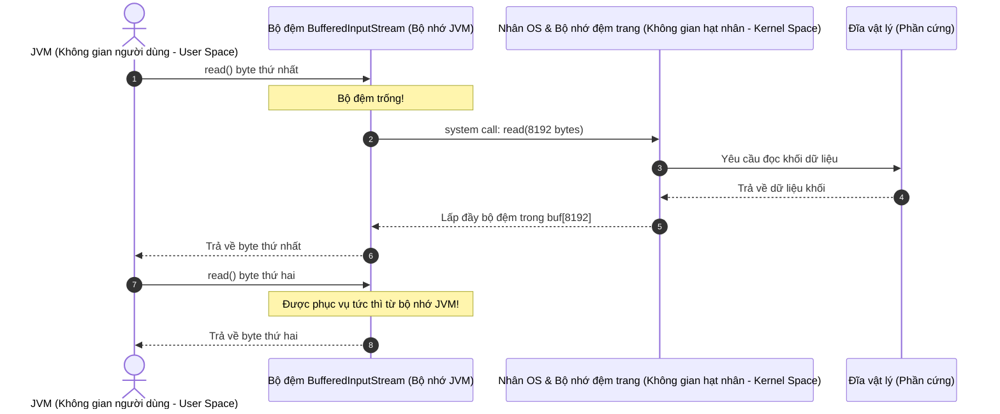

# Vào/Ra trong Java (IO in Java) - Phần 2

## Mục tiêu học tập (Learning Goal)

Tài liệu này bao gồm một phần trọng tâm của **Vào/Ra trong Java (IO in Java)**. Hãy nghiên cứu từng khái niệm như một quy tắc Java thực tế, thay vì chỉ là từ vựng rời rạc.

## Phạm vi đề mục (Outline Coverage)

| Khái niệm (Concept) | Điều cần biết (What to know) |
| --- | --- |
| `BufferedInputStream` | Một luồng đầu vào bộ lọc (filter input stream) thực hiện đệm đầu vào bằng cách đọc các khối byte lớn vào một bộ nhớ đệm nội bộ (mặc định 8KB) nhằm giảm thiểu truy cập đĩa trực tiếp của hệ điều hành. |
| `BufferedOutputStream` | Một luồng đầu ra bộ lọc thực hiện đệm đầu ra bằng cách lưu trữ các byte đã ghi vào một bộ nhớ đệm nội bộ (internal buffer) trước khi đẩy (flush) chúng vào luồng cơ sở. |
| `Reader` | Lớp cơ sở trừu tượng đại diện cho một luồng đầu vào của các ký tự; được thiết kế để đọc dữ liệu văn bản với bảng mã hóa ký tự phù hợp. |
| `Writer` | Lớp cơ sở trừu tượng đại diện cho một luồng đầu ra của các ký tự; được thiết kế để ghi dữ liệu văn bản với bảng mã hóa ký tự phù hợp. |
| `FileReader` | Lớp con cụ thể của `Reader` được sử dụng để đọc dữ liệu ký tự từ một tập tin. |
| `FileWriter` | Lớp con cụ thể của `Writer` được sử dụng để ghi dữ liệu ký tự vào một tập tin. |
| `BufferedReader` | Một luồng đầu vào ký tự có đệm giúp đọc hiệu quả các ký tự, mảng và dòng văn bản thông qua phương thức `readLine()`. |
| `BufferedWriter` | Một luồng đầu ra ký tự có đệm giúp ghi hiệu quả các ký tự, mảng và dòng văn bản thông qua phương thức `newLine()`. |
| `ObjectInputStream` | Một luồng đầu vào được sử dụng để giải tuần tự hóa (deserialize) các dữ liệu nguyên thủy và đồ thị đối tượng được ghi trước đó bởi `ObjectOutputStream`. |
| `ObjectOutputStream` | Một luồng đầu ra được sử dụng để tuần tự hóa (serialize) các đối tượng và dữ liệu nguyên thủy thành một luồng byte để lưu trữ hoặc truyền tải. |

## Ghi chú chi tiết (Detailed Notes)

### Các luồng đệm (Đệm Byte - Buffered Streams (Byte Buffering))
Việc trực tiếp đọc hoặc ghi một file từng byte một thông qua `FileInputStream` hoặc `FileOutputStream` gây ra chi phí quản lý (overhead) rất cao do các cuộc gọi hệ thống (system calls) thường xuyên đến hệ điều hành.
* `BufferedInputStream` bọc một `InputStream` đã có sẵn và đọc các khối byte lớn (mặc định là 8KB) vào một bộ nhớ đệm nội bộ. Các lượt đọc tiếp theo sẽ lấy dữ liệu trực tiếp từ bộ nhớ đệm này.
* `BufferedOutputStream` tích lũy các byte đã ghi vào một bộ nhớ đệm và chỉ đẩy (flush) chúng xuống đĩa khi bộ đệm đầy, khi luồng bị đóng lại, hoặc khi phương thức `flush()` được gọi một cách tường minh.

## Tại sao các luồng đệm mang lại hiệu năng vượt trội hơn đáng kể so với các luồng thô (Why Buffered Streams Significantly Outperform Raw Streams)

Các thao tác I/O trực tiếp (như `FileInputStream.read()` hoặc `FileOutputStream.write()`) cực kỳ chậm vì mỗi cuộc gọi đọc/ghi sẽ kích hoạt một quá trình chuyển đổi ngữ cảnh (context switch) từ không gian người dùng (user space) sang không gian hạt nhân (kernel space), yêu cầu một cuộc gọi hệ thống (system call - `read(2)` hoặc `write(2)`) để tương tác với bộ điều khiển đĩa vật lý hoặc hệ thống file. Các cuộc gọi hệ thống yêu cầu CPU phải lưu các thanh ghi (registers), chuyển đổi bảng trang (page tables), và thực thi mã trình xử lý hạt nhân (kernel handler code), vốn tiêu tốn rất nhiều chu kỳ CPU (CPU cycles). `BufferedInputStream` bọc một luồng thô và đọc một khối byte lớn (mặc định là 8.192 byte hoặc 8KB) trong một cuộc gọi hệ thống duy nhất vào một mảng byte nội bộ (`buf`). Các cuộc gọi `read()` tiếp theo được phục vụ trực tiếp từ bộ đệm bộ nhớ này, loại bỏ đến 99.9% số lần chuyển đổi ngữ cảnh chế độ người dùng sang hạt nhân. Kích thước bộ đệm 8KB được lựa chọn vì nó phù hợp với kích thước trang đĩa của các hệ điều hành hiện đại (thường là 4KB hoặc 8KB), đảm bảo một lượt đọc bộ đệm của JVM khớp chính xác với một yêu cầu đọc khối của hệ điều hành từ ổ cứng vật lý, giúp tối ưu hóa việc sử dụng bộ nhớ đệm trang của hệ điều hành (OS page cache utilization).

### Cơ chế đệm không gian người dùng/hạt nhân (User/Kernel Space Buffering Mechanics)



### Bản thử nghiệm mã nguồn: So sánh hiệu năng giữa luồng thô và luồng đệm (Code Demo: Benchmarking Raw vs. Buffered Streams)

```java
import java.io.*;

public class BufferingPerformanceDemo {
    public static void main(String[] args) throws IOException {
        File tempFile = File.createTempFile("benchmark", ".bin");
        tempFile.deleteOnExit();
        
        // Tạo một file thử nghiệm có kích thước 1MB
        try (FileOutputStream fos = new FileOutputStream(tempFile)) {
            byte[] data = new byte[1024 * 1024]; // 1MB
            fos.write(data);
        }

        // Thử nghiệm 1: FileInputStream thô (Đọc từng byte)
        long start = System.nanoTime();
        try (FileInputStream fis = new FileInputStream(tempFile)) {
            int b;
            while ((b = fis.read()) != -1) {
                // Xử lý byte
            }
        }
        long rawDuration = System.nanoTime() - start;

        // Thử nghiệm 2: BufferedInputStream (Đọc từng byte từ bộ đệm)
        start = System.nanoTime();
        try (BufferedInputStream bis = new BufferedInputStream(new FileInputStream(tempFile))) {
            int b;
            while ((b = bis.read()) != -1) {
                // Xử lý byte
            }
        }
        long bufferedDuration = System.nanoTime() - start;

        System.out.println("Raw FileInputStream Duration: " + (rawDuration / 1_000_000.0) + " ms");
        System.out.println("BufferedInputStream Duration: " + (bufferedDuration / 1_000_000.0) + " ms");
    }
}
```

### Chuỗi nguyên nhân - kết quả của chuyển đổi ngữ cảnh và I/O đĩa (Context Switch and Disk I/O Cause-Effect Chain)

```
Gọi fis.read()
  ↳ CPU lưu trạng thái không gian người dùng & chuyển đổi ngữ cảnh sang không gian hạt nhân
    ↳ OS thực hiện lời gọi hệ thống read(2) & nạp khối vật lý từ đĩa
      ↳ Dữ liệu được nạp vào bộ nhớ đệm trang của OS & sao chép sang bộ nhớ JVM
        ↳ CPU chuyển đổi ngữ cảnh ngược lại không gian người dùng (chi phí hiệu năng cực kỳ lớn)

Gọi bis.read()
  ↳ Kiểm tra mảng bộ nhớ nội bộ (buf)
    ↳ Nếu có sẵn, trả về byte ngay lập tức (bỏ qua các cuộc gọi hệ thống và chuyển đổi ngữ cảnh nhân OS)
```


```java
// Bọc luồng file bằng luồng đệm
try (BufferedInputStream bis = new BufferedInputStream(new FileInputStream("input.dat"));
     BufferedOutputStream bos = new BufferedOutputStream(new FileOutputStream("output.dat"))) {
    int data;
    while ((data = bis.read()) != -1) {
        bos.write(data);
    }
} catch (IOException e) {
    e.printStackTrace();
}
```

### Reader & Writer (Luồng ký tự - Character Streams)
Trong khi các luồng byte làm việc với các byte thô (`8-bit`), các luồng ký tự được thiết kế đặc biệt cho dữ liệu ký tự (`16-bit` Unicode). Chúng tự động chuyển đổi các byte thành các ký tự bằng cách sử dụng các bảng mã hóa ký tự (như UTF-8).
* `Reader` và `Writer` là các lớp cơ sở trừu tượng.
* `FileReader` và `FileWriter` đọc/ghi trực tiếp ký tự từ/vào các tập tin.

### BufferedReader & BufferedWriter
* `BufferedReader` thực hiện đệm một luồng ký tự và cung cấp phương thức `readLine()`, giúp đọc một dòng văn bản được kết thúc bởi ký tự xuống dòng (`\n`) hoặc về đầu dòng (`\r`).
* `BufferedWriter` thực hiện đệm đầu ra ký tự và cung cấp phương thức `newLine()`, giúp ghi ký tự phân tách dòng tùy thuộc vào hệ điều hành.

```java
import java.io.BufferedReader;
import java.io.BufferedWriter;
import java.io.FileReader;
import java.io.FileWriter;
import java.io.IOException;

public class CharacterFileCopy {
    public static void main(String[] args) {
        try (BufferedReader reader = new BufferedReader(new FileReader("input.txt"));
             BufferedWriter writer = new BufferedWriter(new FileWriter("output.txt"))) {
              
            String line;
            while ((line = reader.readLine()) != -1) {
                writer.write(line);
                writer.newLine(); // Xuống dòng độc lập với nền tảng hệ điều hành
            }
            System.out.println("Text file copied.");
        } catch (IOException e) {
            e.printStackTrace();
        }
    }
}
```

---

## Nghiên cứu tình huống: So sánh hiệu năng của bộ đệm (Case Study: Buffering Performance Comparison)

### Bài toán (Problem)
Đọc một tệp lớn (ví dụ: 5MB) từng byte một bằng cách sử dụng `FileInputStream` thô so với `BufferedInputStream`. Chúng ta muốn quan sát lý do tại sao bộ đệm lại thiết yếu đối với hiệu năng I/O.

### Thử nghiệm hiệu năng giả lập & cơ chế (Mock Benchmark & Mechanism)
* **Không dùng bộ đệm**: Mỗi cuộc gọi đến `FileInputStream.read()` kích hoạt một cuộc gọi hệ thống (`read(2)`) để yêu cầu 1 byte từ hệ điều hành. Điều này làm cho CPU phải chuyển đổi ngữ cảnh giữa không gian người dùng và không gian hạt nhân 5.000.000 lần.
* **Có dùng bộ đệm**: `BufferedInputStream` yêu cầu 8.192 byte từ hệ điều hành trong một cuộc gọi hệ thống duy nhất. 8.191 lượt gọi tiếp theo đến `read()` được trả lời ngay lập tức từ bộ nhớ đệm, giảm thiểu chi phí cuộc gọi hệ thống đến `99.98%`.

```java
// Mã nguồn mô phỏng kiểm tra hiệu năng
long startTime = System.currentTimeMillis();
try (FileInputStream fis = new FileInputStream("largeFile.bin")) {
    while (fis.read() != -1) {} // Đọc byte thô
}
long rawTime = System.currentTimeMillis() - startTime;

startTime = System.currentTimeMillis();
try (BufferedInputStream bis = new BufferedInputStream(new FileInputStream("largeFile.bin"))) {
    while (bis.read() != -1) {} // Đọc có đệm
}
long bufferedTime = System.currentTimeMillis() - startTime;

System.out.println("Raw stream time: " + rawTime + " ms");       // Ví dụ: 4200 ms
System.out.println("Buffered stream time: " + bufferedTime + " ms"); // Ví dụ: 15 ms
```

---

## Các lỗi thường gặp (Common Mistakes)

### 1. Sử dụng luồng ký tự cho các tập tin nhị phân (Lỗi hỏng hình ảnh - Using Character Streams for Binary Files (Image Corruption))
`FileReader` / `FileWriter` được thiết kế cho dữ liệu văn bản đọc được bởi con người. Chúng chuyển dịch dữ liệu nhị phân thành các ký tự Unicode bằng cách sử dụng bảng mã mặc định hoặc bảng mã được chỉ định. Nếu bạn cố gắng sao chép tập tin `.png` hoặc `.zip` bằng `FileReader`/`FileWriter`, bộ ánh xạ ký tự (character mapper) sẽ thay thế các chuỗi byte không hợp lệ bằng ký tự thay thế (chẳng hạn như `?` hoặc `\uFFFD`), làm hỏng tập tin đầu ra.
* **Quy tắc**: Luôn sử dụng luồng byte (`InputStream` / `OutputStream`) cho các tập tin nhị phân.

### 2. Quên gọi flush() đối với các luồng đệm (Forgetting to flush() Buffered Streams)
Dữ liệu được ghi vào `BufferedOutputStream` hoặc `BufferedWriter` được lưu trữ trong bộ nhớ đệm. Nếu chương trình bị crash hoặc luồng không được đóng đúng cách, dữ liệu được đệm đó có thể sẽ không bao giờ được ghi xuống đĩa.
* **Giải pháp**: Đảm bảo các luồng được đóng (việc đóng luồng sẽ tự động gọi flush) bằng cách sử dụng try-with-resources, hoặc gọi `flush()` thủ công nếu luồng bắt buộc phải duy trì ở trạng thái mở.

## Reference Links

- https://docs.oracle.com/en/java/javase/21/docs/api/java.base/java/io/BufferedInputStream.html (Tài liệu API của BufferedInputStream)
- https://docs.oracle.com/en/java/javase/21/docs/api/java.base/java/io/BufferedOutputStream.html (Tài liệu API của BufferedOutputStream)
