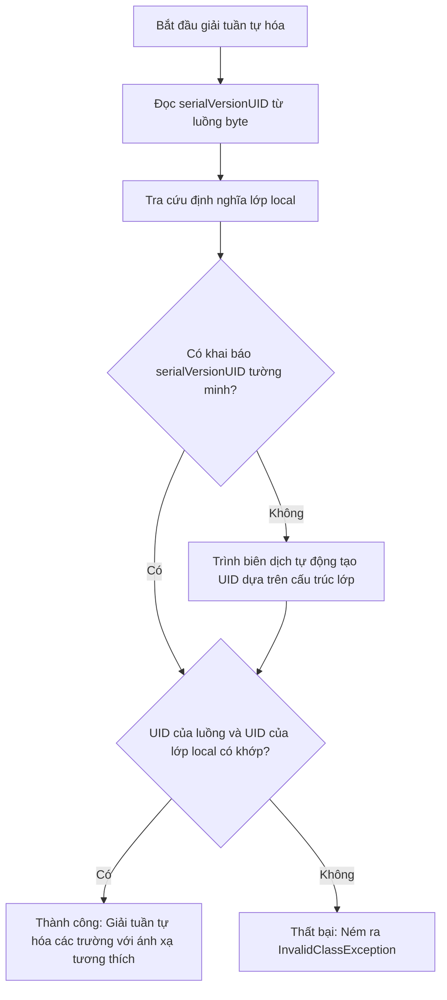
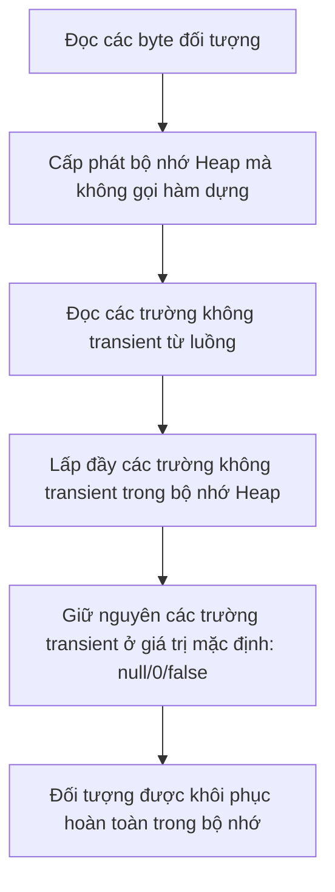
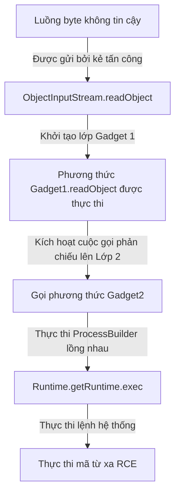

# Vào/Ra trong Java (IO in Java) - Phần 3

## Mục tiêu học tập (Learning Goal)

Tài liệu này bao gồm một phần trọng tâm của **Vào/Ra trong Java (IO in Java)**. Hãy nghiên cứu từng khái niệm như một quy tắc Java thực tế, thay vì chỉ là từ vựng rời rạc.

## Phạm vi đề mục (Outline Coverage)

| Khái niệm (Concept) | Điều cần biết (What to know) |
| --- | --- |
| `Serialization` | Quá trình chuyển đổi trạng thái của một đối tượng thành một luồng byte để có thể lưu vào một tập tin hoặc gửi qua mạng. |
| `Deserialization` | Quá trình tái dựng lại một đối tượng từ một luồng byte đã tuần tự hóa. |
| `Serializable` | Một giao diện đánh dấu (marker interface) (không có phương thức) bắt buộc phải được triển khai bởi một lớp để làm cho các thể hiện của nó đủ điều kiện để tuần tự hóa. |
| `serialVersionUID` | Một định danh 64-bit duy nhất được sử dụng trong quá trình giải tuần tự hóa để xác minh rằng bên gửi và bên nhận của một đối tượng tuần tự hóa đã tải các lớp tương thích với nó. |
| `transient` | Một từ khóa sửa đổi trường cho biết biến đó không nên được tuần tự hóa; giá trị của nó được khôi phục về giá trị mặc định (ví dụ: `null` hoặc `0`) trong quá trình giải tuần tự hóa. |
| `Scanner` | Một lớp tiện ích quét văn bản được sử dụng để phân tích cú pháp các kiểu dữ liệu nguyên thủy và chuỗi bằng cách sử dụng các biểu thức chính quy (regular expressions) từ một luồng đầu vào hoặc chuỗi. |
| `System.in` | Luồng đầu vào chuẩn (thể hiện của `InputStream`), thường được ánh xạ tới đầu vào từ bàn phím. |
| `System.out` | Luồng đầu ra chuẩn (thể hiện của `PrintStream`), thường được ánh xạ tới đầu ra màn hình console. |
| `System.err` | Luồng báo lỗi chuẩn (thể hiện của `PrintStream`), được sử dụng để in các thông báo lỗi ra console ngay lập tức. |

## Ghi chú chi tiết (Detailed Notes)

### Tuần tự hóa & Giải tuần tự hóa (Serialization & Deserialization)
Tuần tự hóa đối tượng Java cho phép lập trình viên lưu trữ trạng thái của một đồ thị đối tượng (object graph) vào một luồng byte và tái dựng lại nó sau đó.
* Để một lớp có thể tuần tự hóa được, nó bắt buộc phải triển khai `java.io.Serializable`.
* Các trường tĩnh (`static`) đại diện cho trạng thái ở cấp độ lớp, chứ không phải cấp độ đối tượng, và chúng **không** được tuần tự hóa.
* Nếu một đối tượng tham chiếu đến các đối tượng khác, toàn bộ đồ thị đối tượng sẽ được tuần tự hóa. Tất cả các lớp được tham chiếu cũng phải triển khai `Serializable`, nếu không, ngoại lệ `NotSerializableException` sẽ bị ném ra vào thời gian chạy.

```java
import java.io.Serializable;

public class User implements Serializable {
    private static final long serialVersionUID = 1L; // Khai báo rõ ràng được khuyến nghị
    
    private String username;
    private transient String password; // Sẽ không được tuần tự hóa!
    
    public User(String username, String password) {
        this.username = username;
        this.password = password;
    }
    
    @Override
    public String toString() {
        return "User{username='" + username + "', password='" + password + "'}";
    }
}
```

## Tại sao serialVersionUID lại cực kỳ quan trọng đối với khả năng tương thích phiên bản lớp (Why serialVersionUID is Critical for Class Version Compatibility)

Nếu một lớp triển khai `Serializable` không khai báo rõ ràng `serialVersionUID`, trình biên dịch Java sẽ tự động tạo ra một mã băm 64-bit tại thời điểm biên dịch bằng thuật toán SHA-1 dựa trên các thông tin mô tả lớp (như tên lớp, các giao diện triển khai, các trường, và chữ ký phương thức). Nếu sau đó nhà phát triển thực hiện bất kỳ sửa đổi nhỏ nào đối với lớp đó—chẳng hạn như thêm một phương thức tiện ích, thay đổi từ khóa sửa đổi quyền truy cập của một trường, hoặc thậm chí chỉ thay đổi phiên bản trình biên dịch—trình biên dịch sẽ tạo ra một giá trị `serialVersionUID` mặc định hoàn toàn khác cho lớp đã cập nhật. Khi JVM cố gắng giải tuần tự hóa một luồng byte đã được lưu trữ trước đó, nó sẽ so sánh mã định danh lớp của luồng byte với `serialVersionUID` của lớp cục bộ. Nếu chúng không khớp, JVM sẽ lập tức hủy bỏ quá trình và ném ra ngoại lệ `InvalidClassException`, ngay cả khi các thay đổi đó hoàn toàn tương thích ngược (backward-compatible). Bằng cách khai báo tường minh `private static final long serialVersionUID`, lập trình viên sẽ cố định phiên bản lớp, báo hiệu cho công cụ tuần tự hóa của JVM rằng các lớp này tương thích với nhau. Điều này cho phép sự tiến hóa lớp (class evolution) diễn ra bình thường, chẳng hạn như thêm các trường mới (sẽ được giải tuần tự hóa thành các giá trị mặc định của chúng) hoặc xóa bỏ các trường (sẽ bị bỏ qua một cách lặng lẽ), mà không làm hỏng các kho lưu trữ dữ liệu đã tuần tự hóa hiện có.

### Logic khớp nối khi tiến hóa lớp (Class Evolution Matching Logic)



### Ví dụ mã nguồn: Hành vi không khớp phiên bản (Code Example: Version Mismatch Behavior)

Ví dụ sau đây mô phỏng sự tiến hóa của lớp khi thiếu khai báo `serialVersionUID` tường minh dẫn đến việc không khớp phiên bản.

```java
// Phiên bản 1 của lớp (được lưu trữ vào tệp)
// public class Profile implements Serializable {
//     String name;
// } // UID tự động tạo: ví dụ, 4278198327498L

// Phiên bản 2 của lớp (cố gắng đọc dữ liệu của Phiên bản 1)
import java.io.*;

public class Profile implements Serializable {
    // Thiếu khai báo serialVersionUID tường minh!
    String name;
    String email; // Trường mới được thêm vào làm thay đổi cấu trúc lớp, thay đổi UID tự động tạo thành 983179237498L
    
    public static void main(String[] args) {
        try (ObjectInputStream ois = new ObjectInputStream(new FileInputStream("profile.ser"))) {
            Profile p = (Profile) ois.readObject(); // Ném ra InvalidClassException do lệch UID
        } catch (Exception e) {
            System.out.println("Exception: " + e.toString());
            // Đầu ra: Exception: java.io.InvalidClassException: Profile; local class incompatible: 
            // stream classdesc serialVersionUID = 4278198327498, local class serialVersionUID = 983179237498
        }
    }
}
```

### Chuỗi nguyên nhân - kết quả của việc không khớp phiên bản (Cause-Effect Chain of Version Mismatch)

```
Cấu trúc lớp bị sửa đổi (thêm trường mới)
  ↳ Trình biên dịch tính toán lại mã SHA-1 của lớp
    ↳ serialVersionUID của lớp cục bộ thay đổi so với serialVersionUID của luồng
      ↳ ObjectInputStream so sánh UID của luồng và UID của lớp cục bộ
        ↳ Phát hiện sự không khớp -> Quá trình giải tuần tự hóa bị hủy bỏ -> InvalidClassException bị ném ra
```

## Tại sao các trường transient bị loại trừ khỏi quá trình tuần tự hóa và cách giải tuần tự hóa khôi phục chúng (Why transient Fields are Excluded from Serialization and How Deserialization Restores Them)

Từ khóa `transient` là một công cụ sửa đổi trường nhằm thông báo cho công cụ tuần tự hóa bỏ qua trường đó khi chuyển đổi một đối tượng thành một luồng byte. Điều này cực kỳ quan trọng để loại trừ các thông tin bảo mật nhạy cảm (như mật khẩu hoặc khóa riêng tư) hoặc các tài nguyên ràng buộc với thời gian chạy (như các thẻ quản lý tệp đang mở, các kết nối cơ sở dữ liệu, hoặc các khóa luồng) vốn không có ý nghĩa bên ngoài phiên chạy hiện tại của JVM. Trong quá trình giải tuần tự hóa, JVM **không** gọi hàm dựng tiêu chuẩn của lớp để khởi tạo đối tượng. Thay vào đó, nó cấp phát bộ nhớ thô cho đối tượng trên Heap và trực tiếp lấp đầy các trường không transient bằng cách sử dụng các giá trị tìm thấy trong luồng byte đã tuần tự hóa. Do luồng byte không chứa bất kỳ dữ liệu hay mục nhập nào cho các trường `transient`, JVM sẽ bỏ qua chúng, để chúng khởi tạo ở giá trị mặc định của kiểu dữ liệu (chẳng hạn như `null` đối với tham chiếu đối tượng, `0` đối với kiểu nguyên thủy số, và `false` đối với kiểu boolean). Quan trọng là, các trình khởi tạo trường nội dòng (inline field initializers) và các khối thể hiện (instance blocks) sẽ bị bỏ qua trong giai đoạn bố trí bộ nhớ này, nghĩa là ngay cả khi một trường transient được khai báo với một giá trị nội dòng (ví dụ: `private transient int age = 21;`), giá trị của nó sau khi giải tuần tự hóa vẫn sẽ hoàn về `0` hoặc `null`.

### Luồng khởi tạo bộ nhớ trong quá trình giải tuần tự hóa (Memory Initialization Flow during Deserialization)



### Ví dụ mã nguồn: Bỏ qua hàm dựng và bộ khởi tạo (Code Example: Constructor and Initializer Bypass)

```java
import java.io.*;

public class TransientDemo implements Serializable {
    private static final long serialVersionUID = 1L;
    
    private String name;
    private transient int age = 21; // Bộ khởi tạo nội dòng
    private transient String status;
    
    public TransientDemo(String name) {
        System.out.println("Constructor called!");
        this.name = name;
        this.status = "Active";
    }

    public static void main(String[] args) throws Exception {
        ByteArrayOutputStream baos = new ByteArrayOutputStream();
        try (ObjectOutputStream oos = new ObjectOutputStream(baos)) {
            TransientDemo demo = new TransientDemo("Alice"); // Đầu ra: Constructor called!
            oos.writeObject(demo);
        }
        
        try (ObjectInputStream ois = new ObjectInputStream(new ByteArrayInputStream(baos.toByteArray()))) {
            TransientDemo restored = (TransientDemo) ois.readObject();
            // Hàm dựng KHÔNG được gọi trong phương thức readObject()!
            System.out.println("Restored Name: " + restored.name);     // Alice
            System.out.println("Restored Age: " + restored.age);       // 0 (Trình khởi tạo nội dòng bị bỏ qua!)
            System.out.println("Restored Status: " + restored.status); // null (Gán giá trị trong hàm dựng bị bỏ qua!)
        }
    }
}
```

### Chuỗi nguyên nhân - kết quả của việc hoàn tác trường transient (Cause-Effect Chain of Transient Field Reversion)

```
Đối tượng được giải tuần tự hóa từ luồng
  ↳ JVM khởi tạo lớp trực tiếp trên heap (bỏ qua hàm dựng, trình khởi tạo và các khối thể hiện)
    ↳ JVM đọc và ghi các trường không transient từ luồng byte
      ↳ Các trường transient không có mặt trong luồng byte
        ↳ Các trường giữ nguyên giá trị mặc định của JVM (null cho đối tượng, 0 cho số nguyên)
```

## Tại sao việc tuần tự hóa Java là một nguy cơ bảo mật và các giải pháp thay thế hiện đại giảm thiểu nó như thế nào (Why Java Serialization is a Security Liability and How Modern Alternatives Mitigate It)

Cơ chế tuần tự hóa gốc của Java là một lỗ hổng bảo mật lớn vì `ObjectInputStream.readObject()` là một bộ giải tuần tự hóa "nhìn trước" (look-ahead deserializer) xây dựng các đồ thị đối tượng tùy ý trước khi ứng dụng xác minh các kiểu dữ liệu đang được khởi tạo. Khi một ứng dụng chấp nhận và giải tuần tự hóa các luồng byte không đáng tin cậy từ các nguồn bên ngoài, kẻ tấn công có thể xây dựng một payload chứa một "chuỗi gadget" (gadget chain)—một chuỗi các đối tượng lồng nhau khai thác các lớp thư viện hiện có (gadgets) trên classpath. Trong quá trình giải tuần tự hóa, JVM tự động gọi các phương thức vòng đời như `readObject()`, `readResolve()`, hoặc `finalize()` trên các đối tượng này. Bằng cách lồng các lớp này, kẻ tấn công có thể kích hoạt các thao tác phản chiếu dẫn đến việc thực thi các lệnh shell trên hệ thống lưu trữ, gây ra lỗi Thực thi mã từ xa (Remote Code Execution - RCE). Để giảm thiểu lỗ hổng này, Java 9 đã giới thiệu các bộ lọc tuần tự hóa (`ObjectInputFilter`) để giới hạn các lớp nào có thể được giải tuần tự hóa. Tuy nhiên, thiết kế ứng dụng hiện đại ưa chuộng các định dạng tuần tự hóa chỉ truyền dữ liệu như JSON, Protocol Buffers, hoặc FlatBuffers, những định dạng này không tuần tự hóa siêu dữ liệu thực thi hoặc các lớp động, giúp cô lập quá trình phân tích dữ liệu khỏi việc thực thi mã.

### Khai thác RCE qua chuỗi giải tuần tự hóa Gadget (Gadget Chain Deserialization RCE Exploit)



### Ví dụ mã nguồn: Giải pháp thay thế an toàn (Tuần tự hóa chỉ truyền dữ liệu JSON - Safe Alternative (JSON Data-Only Serialization))

Sử dụng Jackson hoặc các bộ phân tích cú pháp chỉ truyền dữ liệu tương tự giúp loại bỏ việc thực thi gadget vì chúng chỉ đọc các trường trạng thái, không bao giờ khởi tạo các cấu hình lớp tùy ý từ luồng dữ liệu.

```java
// Biểu diễn dữ liệu an toàn
public class UserDTO {
    public String username;
    public String role;
    
    // Tuần tự hóa JSON tùy chỉnh không chứa các trình nạp lớp động hoặc siêu dữ liệu thực thi
    // Định dạng đầu vào: {"username":"alice", "role":"admin"}
}
```

### Chuỗi nguyên nhân - kết quả của lỗ hổng giải tuần tự hóa (Cause-Effect Chain of Deserialization Vulnerabilities)

```
Nhận được luồng byte không đáng tin cậy
  ↳ ObjectInputStream.readObject() khởi tạo lớp phản chiếu trước khi xác thực kiểu dữ liệu
    ↳ Phương thức vòng đời (ví dụ: readObject) được gọi tự động trên lớp thuộc classpath
      ↳ Các thuộc tính lồng nhau kích hoạt một chuỗi các cuộc gọi (Gadget Chain)
        ↳ Thực thi phương thức phản chiếu -> ProcessBuilder được tạo ra -> Hệ thống bị RCE
```


### Ví dụ mã nguồn Tuần tự hóa và Giải tuần tự hóa (Serializing and Deserializing Code Example)
Chúng ta ghi đối tượng bằng `ObjectOutputStream` và đọc lại bằng `ObjectInputStream`.

```java
import java.io.*;

public class SerializationDemo {
    public static void main(String[] args) {
        User user = new User("alice", "secret123");
        File file = new File("user.ser");
        
        // 1. Tuần tự hóa
        try (ObjectOutputStream oos = new ObjectOutputStream(new FileOutputStream(file))) {
            oos.writeObject(user);
            System.out.println("Object serialized: " + user);
        } catch (IOException e) {
            e.printStackTrace();
        }
        
        // 2. Giải tuần tự hóa
        try (ObjectInputStream ois = new ObjectInputStream(new FileInputStream(file))) {
            User deserializedUser = (User) ois.readObject();
            System.out.println("Object deserialized: " + deserializedUser);
            // In ra: User{username='alice', password='null'} (password là transient!)
        } catch (IOException | ClassNotFoundException e) {
            e.printStackTrace();
        }
    }
}
```

### Scanner & System I/O
* `System.in`, `System.out`, và `System.err` được mở bởi JVM khi ứng dụng khởi động.
* `Scanner` có thể bọc `System.in` để đọc dữ liệu đầu vào của người dùng từ console.
* **Quan trọng**: Việc đóng một `Scanner` đang bọc quanh `System.in` sẽ đóng chính luồng `System.in` cơ sở. Một khi đã đóng, bạn không thể đọc từ `System.in` được nữa trong suốt thời gian thực thi còn lại của JVM.

```java
import java.util.Scanner;

public class ConsoleInput {
    public static void main(String[] args) {
        Scanner scanner = new Scanner(System.in);
        System.out.print("Enter your name: ");
        if (scanner.hasNextLine()) {
            String name = scanner.nextLine();
            System.out.println("Hello, " + name);
        }
        // Tránh đóng scanner nếu bạn cần System.in ở những nơi khác trong ứng dụng!
    }
}
```

---

## Nghiên cứu tình huống: Tùy biến quá trình tuần tự hóa (Case Study: Customizing Serialization)

### Bài toán (Problem)
Chúng ta muốn mã hóa một trường nhạy cảm (như `password`) khi tuần tự hóa, và giải mã nó khi giải tuần tự hóa, để nó không bị lưu trữ dưới dạng văn bản thuần túy (plaintext) bên trong tập tin `.ser`.

### Triển khai (Implementation)
Chúng ta có thể định nghĩa các phương thức `private` `writeObject` và `readObject` bên trong lớp triển khai `Serializable`. Cơ chế tuần tự hóa của Java sẽ tìm các phương thức này thông qua phản chiếu (reflection) và gọi chúng thay vì cơ chế mặc định.

```java
import java.io.IOException;
import java.io.ObjectInputStream;
import java.io.ObjectOutputStream;
import java.io.Serializable;
import java.util.Base64;

public class SecureUser implements Serializable {
    private static final long serialVersionUID = 2L;
    
    private String username;
    private String password; // Sẽ được tuần tự hóa, nhưng được mã hóa!

    public SecureUser(String username, String password) {
        this.username = username;
        this.password = password;
    }

    private void writeObject(ObjectOutputStream oos) throws IOException {
        // Chạy tuần tự hóa mặc định cho các trường không tùy biến
        oos.defaultWriteObject();
        // Mã hóa mật khẩu bằng cách sử dụng Base64 đơn giản cho mục đích minh họa (dùng thuật toán mã hóa thực tế trong sản xuất)
        String encryptedPassword = Base64.getEncoder().encodeToString(password.getBytes());
        oos.writeObject(encryptedPassword);
    }

    private void readObject(ObjectInputStream ois) throws IOException, ClassNotFoundException {
        // Chạy giải tuần tự hóa mặc định
        ois.defaultReadObject();
        // Đọc mật khẩu đã mã hóa và giải mã nó
        String encryptedPassword = (String) ois.readObject();
        this.password = new String(Base64.getDecoder().decode(encryptedPassword));
    }
}
```

---

## Các lỗi thường gặp (Common Mistakes)

### 1. Thiếu serialVersionUID hiển thị (Missing Explicit serialVersionUID)
Nếu bạn không chỉ định `serialVersionUID` một cách rõ ràng, trình biên dịch Java sẽ tự động tính toán một giá trị tại thời điểm biên dịch dựa trên các chi tiết của lớp (trường, phương thức). Nếu bạn sửa đổi lớp (ví dụ: thêm một phương thức phụ), giá trị được tính toán sẽ thay đổi. Khi giải tuần tự hóa dữ liệu cũ hơn, Java sẽ ném ra ngoại lệ `InvalidClassException`.
* **Giải pháp**: Luôn định nghĩa `private static final long serialVersionUID = 1L;` một cách rõ ràng.

### 2. Bẫy hàm dựng của lớp cha không tuần tự hóa được (Parent Class Non-Serializable Constructor Pitfall)
Nếu một lớp con triển khai `Serializable` nhưng lớp cha của nó thì **không**, trạng thái của lớp cha sẽ không được tuần tự hóa. Trong quá trình giải tuần tự hóa, Java bắt đầu khởi tạo trạng thái của lớp cha bằng cách gọi **hàm dựng không đối số** (no-argument constructor) của nó. Nếu lớp cha không định nghĩa hàm dựng không đối số, quá trình giải tuần tự hóa sẽ thất bại tại thời điểm chạy với ngoại lệ `InvalidClassException`.

### 3. Đóng Scanner bọc quanh System.in (Closing Scanner wrapped around System.in)
Đóng một scanner sẽ đóng cả `System.in`.
```java
Scanner s1 = new Scanner(System.in);
s1.close(); // Đóng System.in!

Scanner s2 = new Scanner(System.in);
// s2.nextLine(); // Ném ra NoSuchElementException vì System.in đã bị đóng!
```

## Liên kết tham khảo (Reference Links)

- https://docs.oracle.com/en/java/javase/21/docs/api/java.base/java/io/Serializable.html (Tài liệu API của Serializable)
- https://docs.oracle.com/en/java/javase/21/docs/api/java.base/java/io/ObjectInputStream.html (Tài liệu API của ObjectInputStream)
- https://docs.oracle.com/javase/specs/jls/se21/html/jls-14.html#jls-14.21 (JLS Các câu lệnh không thể tiếp cận)
