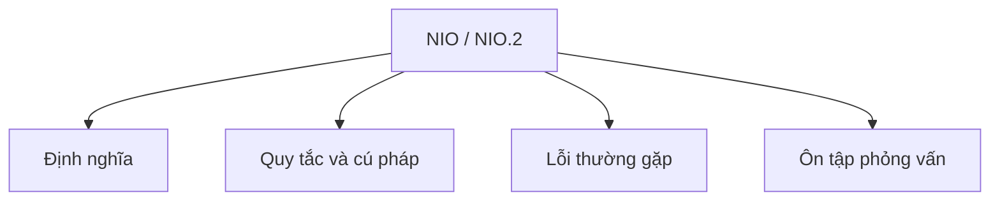

# 27 - NIO / NIO.2

Chủ đề này tuân theo đề cương chính trong [outline.md](../outline.md). Mục tiêu là hiểu từng khái niệm đủ sâu để có thể giải thích, nhận diện trong code và trả lời các câu hỏi phỏng vấn.

## Thứ Tự Học

- [Khái Niệm về Path](theory/01-path-concepts.md)
- [Khái Niệm về FileChannel](theory/02-filechannel-concepts.md)
- [Thuật Ngữ Chính](terms/01-key-terms.md)

## Danh Sách Kiểm Tra Theo Đề Cương

- Path
- Paths
- Files
- StandardOpenOption
- Đọc/ghi file bằng Files
- Duyệt cây thư mục (Walk file tree)
- Sao chép/di chuyển/xóa file
- Channel (Kênh)
- Buffer (Bộ đệm)
- ByteBuffer
- FileChannel
- Selector cơ bản
- IO bất đồng bộ cơ bản (Basic Asynchronous IO)

## Thẻ Anki

- [Basic](anki/basic.tsv)
- [Basic Extra](anki/basic-extra.tsv)
- [Cloze](anki/cloze.tsv)
- [Code Question](anki/code-question.tsv)

## Tự Kiểm Tra

Trước khi chuyển sang chủ đề tiếp theo, hãy xác nhận bạn có thể trả lời các câu hỏi sau:
1. Những khác biệt chính giữa Java Classic I/O (BIO) và Java New I/O (NIO) về chặn (blocking) so với không chặn (non-blocking), hướng luồng (stream) so với hướng buffer, và khả năng mở rộng luồng là gì?
2. `Buffer` của NIO quản lý trạng thái bằng các con trỏ `position`, `limit` và `capacity` như thế nào, và tại sao phải gọi `flip()` khi chuyển từ chế độ ghi sang chế độ đọc?
3. Tại sao file ánh xạ bộ nhớ (`FileChannel.map` trả về `MappedByteBuffer`) cực kỳ nhanh cho việc đọc/ghi file lớn, và chúng tận dụng bộ nhớ ảo (virtual memory) và bỏ qua bộ nhớ đệm trang OS (OS page cache bypass) như thế nào?
4. `Selector` cho phép I/O không chặn đa hợp (multiplexed non-blocking I/O), cho phép một luồng duy nhất giám sát nhiều kênh mạng như thế nào?
5. Tại sao `Path` và `Files` (NIO.2) cung cấp thông báo lỗi, xử lý liên kết tượng trưng (symbolic link) và truy cập metadata tốt hơn so với `java.io.File` cũ?

## Tổng Quan Mermaid

## Liên Kết Tham Khảo

- https://docs.oracle.com/en/java/javase/21/docs/api/java.base/java/nio/package-summary.html
- https://docs.oracle.com/en/java/javase/21/docs/api/java.base/java/nio/file/package-summary.html
