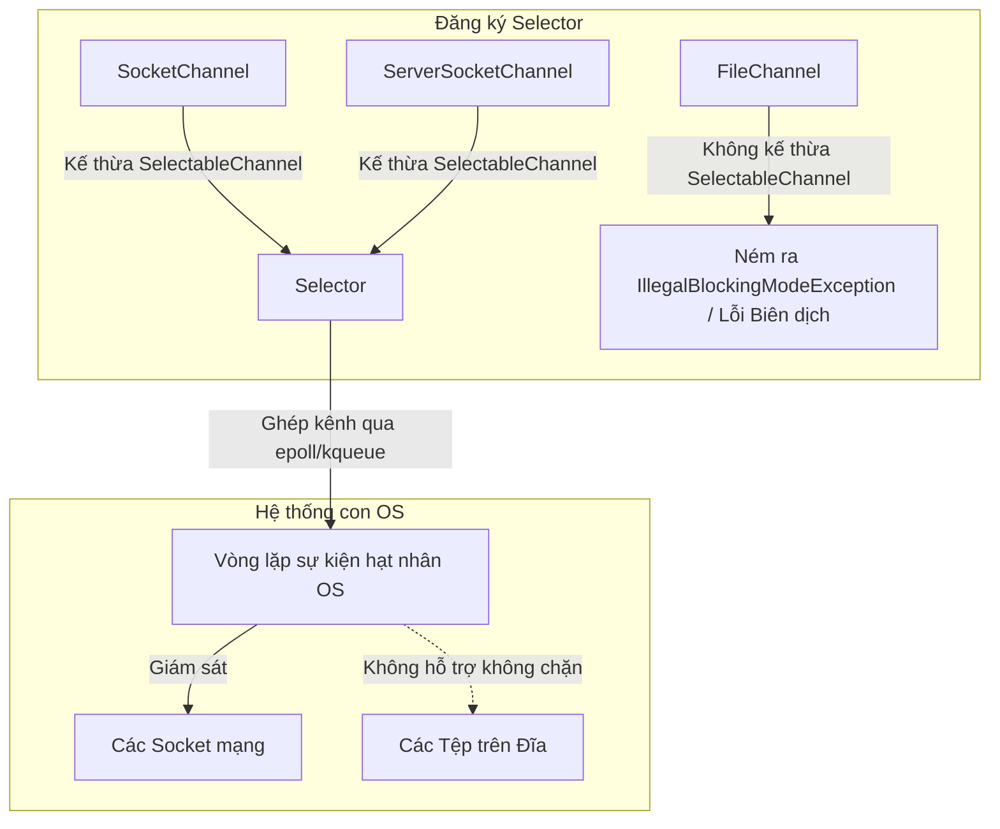

# NIO / NIO.2 - Phần 2

## Mục Tiêu Học Tập

File này đề cập đến một phần trọng tâm của **NIO / NIO.2**. Hãy nghiên cứu từng khái niệm như một quy tắc Java thực tế, chứ không phải là những từ vựng rời rạc.

## Đề Cương Khái Niệm

- **`FileChannel`** — Một kênh an toàn luồng (thread-safe), hiệu năng cao để đọc, ghi, ánh xạ và khóa các tệp; hỗ trợ các thao tác truy cập ngẫu nhiên (random access).
- **`Selector Cơ Bản (Basic Selector)`** — Một bộ dồn kênh (multiplexor) của các kênh có thể lựa chọn, cho phép một luồng duy nhất quản lý và giám sát nhiều kênh mạng không chặn (non-blocking network channel/socket).
- **`I/O Bất Đồng Bộ Cơ Bản (Basic Asynchronous IO)`** — Các hoạt động I/O tệp không chặn chạy bất đồng bộ, trả về một `Future` hoặc thực thi một hàm gọi lại (callback) `CompletionHandler` sau khi hoàn thành.

## Ghi Chú Chi Tiết

### FileChannel
`java.nio.channels.FileChannel` là một kênh để đọc, ghi, ánh xạ và thao tác với các tệp.
* **Khởi tạo FileChannel**: Bạn có thể mở trực tiếp thông qua `FileChannel.open(path, options)`, hoặc lấy từ các luồng cũ: `fileInputStream.getChannel()` hoặc `fileOutputStream.getChannel()`.
* **Truy cập ngẫu nhiên (Random Access)**: Khác với các luồng (stream) vốn có tính tuần tự, `FileChannel` cung cấp phương thức `position(long)` cho phép bạn nhảy đến bất kỳ vị trí chỉ số nào trong tệp để đọc hoặc ghi.
* **Khóa tệp (File Locking)**: `FileChannel` hỗ trợ khóa các vùng tệp thông qua `lock()` (chặn cho đến khi lấy được khóa) hoặc `tryLock()` (không chặn, trả về null nếu đã bị khóa). Các khóa có thể là chia sẻ (shared - chỉ đọc) hoặc độc quyền (exclusive - chỉ ghi).

```java
import java.io.RandomAccessFile;
import java.nio.ByteBuffer;
import java.nio.channels.FileChannel;

public class FileChannelDemo {
    public static void main(String[] args) {
        try (RandomAccessFile file = new RandomAccessFile("temp.txt", "rw");
             FileChannel channel = file.getChannel()) {
            
            // 1. Write to channel
            ByteBuffer buf = ByteBuffer.allocate(48);
            buf.clear();
            buf.put("Hello FileChannel".getBytes());
            buf.flip();
            
            while (buf.hasRemaining()) {
                channel.write(buf);
            }
            
            // 2. Read from specific position
            channel.position(6); // Jump to index 6 (skips "Hello ")
            buf.clear();
            int bytesRead = channel.read(buf);
            
            buf.flip();
            while (buf.hasRemaining()) {
                System.out.print((char) buf.get()); // Prints "FileChannel"
            }
            System.out.println();
        } catch (Exception e) {
            e.printStackTrace();
        }
    }
}
```

### Tại Sao Mô Hình Luồng BIO và NIO Khác Nhau Đối Với I/O Chặn Và Không Chặn

I/O truyền thống của Java (BIO) hoạt động trên mô hình đồng bộ và chặn (blocking), nơi mọi hoạt động I/O đều chặn luồng đang thực thi cho đến khi dữ liệu được đọc hoặc ghi hoàn toàn. Khi một máy chủ xử lý nhiều khách hàng (client) sử dụng BIO, nó phải cấp phát một luồng riêng biệt cho mỗi kết nối của client để ngăn một client chậm chạp chặn tất cả các client khác. Mô hình "mỗi kết nối một luồng" (thread-per-connection) này khả năng mở rộng rất kém vì mỗi luồng tiêu thụ bộ nhớ hệ thống đáng kể (thường là kích thước stack 1MB) và gây ra chi phí CPU lớn do việc chuyển đổi ngữ cảnh luồng diễn ra liên tục. Java NIO giải quyết hạn chế này bằng cách giới thiệu các kênh không chặn (non-blocking channel), nơi các hoạt động như `read()` hoặc `write()` trả về ngay lập tức kèm theo số byte đã được truyền tải (có thể là bằng 0) thay vì phải chờ đợi cho đến khi có dữ liệu. Thiết kế này cho phép một nhóm nhỏ các luồng đang hoạt động — hoặc thậm chí chỉ một luồng duy nhất — quản lý hiệu quả hàng ngàn kết nối hoạt động đồng thời.

```mermaid
graph TD
    subgraph BIO Chặn (Mỗi kết nối một luồng)
        Client1[Client 1] -->|Chặn| Thread1[Thread 1]
        Client2[Client 2] -->|Chặn| Thread2[Thread 2]
        Client3[Client 3] -->|Chặn| Thread3[Thread 3]
        Thread1 -->|Ngủ/Rảnh rỗi| CPU_BIO[Chuyển đổi ngữ cảnh CPU]
    end
    subgraph NIO Không Chặn (I/O Đa Luồng/Đa Hướng - Multiplexed I/O)
        ClientN1[Client 1] --> Channel1[Channel 1]
        ClientN2[Client 2] --> Channel2[Channel 2]
        ClientN3[Client 3] --> Channel3[Channel 3]
        Channel1 & Channel2 & Channel3 -->|Đăng ký| Sel[Selector]
        Sel -->|Giám sát bởi| SingleThread[Luồng duy nhất]
        SingleThread -->|Hiệu quả| CPU_NIO[Xử lý CPU]
    end
```

##### Ví Dụ Mã Nguồn: Cấu Hình Socket Chặn Với Kênh Không Chặn

```java
import java.io.IOException;
import java.net.ServerSocket;
import java.net.Socket;
import java.net.InetSocketAddress;
import java.nio.channels.ServerSocketChannel;
import java.nio.channels.SocketChannel;

public class BioVsNioSockets {
    public static void main(String[] args) throws IOException {
        // BIO: Server socket always blocks on accept()
        try (ServerSocket bioServer = new ServerSocket(8080)) {
            System.out.println("BIO Server waiting (blocking)...");
            // Socket clientSocket = bioServer.accept(); // Blocks execution here until client connects
        }

        // NIO: Server socket channel can be configured as non-blocking
        try (ServerSocketChannel nioServer = ServerSocketChannel.open()) {
            nioServer.bind(new InetSocketAddress(8081));
            nioServer.configureBlocking(false); // Enable non-blocking mode
            System.out.println("NIO Server waiting (non-blocking)...");
            
            SocketChannel clientChannel = nioServer.accept(); // Returns immediately (null if no client connected yet)
            if (clientChannel == null) {
                System.out.println("No connections yet. Thread can perform other tasks."); // Output
            }
        }
    }
}
```

##### Chuỗi Nguyên Nhân - Kết Quả Về Chặn Luồng Trong BIO So Với NIO

```text
[Xử lý kết nối BIO]
Client kết nối và ở trạng thái rảnh rỗi
  └── Luồng máy chủ gọi socket.read()
        └── Luồng bị chặn, chuyển sang trạng thái WAITING/BLOCKED của OS
              └── OS thực hiện chuyển đổi ngữ cảnh CPU để chạy các luồng khác
                    └── Tiêu thụ nhiều bộ nhớ (1MB/luồng) + Phình CPU (Context switch overhead) -> Máy chủ crash dưới tải lớn

[Xử lý kết nối NIO]
Client kết nối và ở trạng thái rảnh rỗi
  └── Luồng máy chủ gọi channel.read()
        └── Phương thức trả về 0 byte đã đọc ngay lập tức (không chặn)
              └── Luồng không bị chặn và tiếp tục sẵn sàng xử lý các kênh đang hoạt động khác
                    └── Một luồng duy nhất xử lý hàng ngàn client rảnh rỗi -> Khả năng mở rộng cao và tốn ít bộ nhớ
```

### Selector Cơ Bản - Non-blocking I/O (Basic Selector)
Một `Selector` cho phép một luồng duy nhất giám sát nhiều kênh mạng có thể lựa chọn (ví dụ: `SocketChannel`, `ServerSocketChannel`) để phát hiện các sự kiện như kết nối (`OP_ACCEPT`), sẵn sàng đọc (`OP_READ`), hoặc sẵn sàng ghi (`OP_WRITE`).
* **Ghép kênh (Multiplexing)**: Đây là nền tảng của các máy chủ web có khả năng mở rộng cao (như Netty), loại bỏ sự cần thiết của kiến trúc mỗi kết nối một luồng.
* **Quan trọng**: Các Selector **chỉ** hoạt động với các lớp kế thừa từ `SelectableChannel`. Các kênh tệp (file channel) **không** kế thừa từ `SelectableChannel` và không thể được đặt ở chế độ không chặn hoặc đăng ký với một selector.

#### Tại Sao Cơ Chế Ghép Kênh Selector Hoạt Động và Tại Sao FileChannel Không Thể Sử Dụng Nó

Cơ chế `Selector` triển khai ghép kênh I/O (I/O multiplexing) bằng cách tích hợp với hệ thống con bỏ phiếu sự kiện gốc (native event-polling subsystem) của hệ điều hành (như `epoll` trong Linux, `kqueue` trong macOS, hoặc `IOCP` trong Windows). Các hạt nhân hệ điều hành này giám sát các bộ mô tả tệp socket (socket file descriptor) để phát hiện các thay đổi bất đồng bộ trong bộ đệm mạng và chỉ đánh thức luồng selector khi một kênh đã sẵn sàng để đọc, ghi hoặc chấp nhận kết nối. Tuy nhiên, các hệ thống tệp được thiết kế khác với các socket mạng; các tệp về mặt khái niệm luôn luôn "sẵn sàng" để đọc hoặc ghi vì dữ liệu được lưu trữ tĩnh trên đĩa, và các hệ thống tệp OS tiêu chuẩn không hỗ trợ chế độ không chặn gốc cho các bộ mô tả tệp thông thường. Do một `FileChannel` không thể được đưa vào trạng thái không chặn, nó không kế thừa từ `SelectableChannel` và không thể đăng ký với một `Selector`. Việc cố gắng đăng ký hoặc cấu hình một `FileChannel` thành không chặn sẽ dẫn đến các ngoại lệ thời gian chạy (runtime exception), nghĩa là mọi hoạt động truy cập tệp không chặn thay vào đó phải được mô phỏng bằng cách sử dụng `AsynchronousFileChannel` được hỗ trợ bởi các luồng làm việc nền (background worker thread).



##### Ví Dụ Mã Nguồn: Cố Gắng Đăng Ký FileChannel

```java
import java.nio.channels.FileChannel;
import java.nio.channels.Selector;
import java.nio.channels.SelectionKey;
import java.nio.file.Path;
import java.nio.file.StandardOpenOption;

public class SelectorFileChannelFailure {
    public static void main(String[] args) {
        try (Selector selector = Selector.open();
             FileChannel fileChannel = FileChannel.open(Path.of("temp.txt"), StandardOpenOption.READ)) {
            
            // FileChannel does NOT have a configureBlocking(false) method.
            // Attempting to register it directly:
            System.out.println("Attempting to register FileChannel with Selector...");
            // fileChannel.register(selector, SelectionKey.OP_READ); // COMPILATION ERROR: register() is not defined on FileChannel
            
        } catch (Exception e) {
            e.printStackTrace();
        }
    }
}
```

##### Chuỗi Nguyên Nhân - Kết Quả Về Đăng Ký FileChannel Với Selector

```text
Thiết kế hệ thống tệp OS coi các tệp trên đĩa là luôn sẵn sàng
  └── FileChannel của Java không kế thừa từ SelectableChannel
        └── FileChannel thiếu các phương thức configureBlocking() và register()
              └── Việc cố gắng đăng ký FileChannel với một Selector thất bại ngay khi biên dịch
                    └── Nhà phát triển phải sử dụng AsynchronousFileChannel hoặc các luồng tùy chỉnh để tránh chặn luồng chính
```

```java
import java.nio.channels.*;
import java.util.Iterator;
import java.util.Set;

public class SelectorDemo {
    public static void main(String[] args) throws Exception {
        Selector selector = Selector.open();
        ServerSocketChannel serverChannel = ServerSocketChannel.open();
        serverChannel.configureBlocking(false); // Non-blocking mode is REQUIRED for Selector!
        
        // Register channel for connections
        serverChannel.register(selector, SelectionKey.OP_ACCEPT);
        
        // Non-blocking select event loop
        while (true) {
            int readyChannels = selector.select(1000); // Wait up to 1 second
            if (readyChannels == 0) continue;
            
            Set<SelectionKey> selectedKeys = selector.selectedKeys();
            Iterator<SelectionKey> keyIterator = selectedKeys.iterator();
            
            while (keyIterator.hasNext()) {
                SelectionKey key = keyIterator.next();
                if (key.isAcceptable()) {
                    // Accept connection
                } else if (key.isReadable()) {
                    // Read data
                }
                keyIterator.remove(); // Must remove handled key!
            }
            break; // Break demo
        }
        serverChannel.close();
        selector.close();
    }
}
```

### I/O Bất Đồng Bộ Cơ Bản (Basic Asynchronous IO)
NIO.2 giới thiệu các kênh bất đồng bộ (ví dụ: `AsynchronousFileChannel`) để thực thi các hoạt động trong một nhóm luồng nền (background thread pool).
* **Các phương thức nhận kết quả**:
  1. **Dựa trên Future (Future-based)**: Phương thức đọc/ghi trả về một đối tượng `Future<Integer>`. Gọi `.get()` sẽ chặn luồng cho đến khi hoàn thành.
  2. **Dựa trên Callback (Callback-based)**: Bạn truyền một `CompletionHandler<Integer, Attachment>` và nó sẽ thực thi hàm gọi lại `completed()` hoặc `failed()` khi hoàn thành.

```java
import java.nio.ByteBuffer;
import java.nio.channels.AsynchronousFileChannel;
import java.nio.file.Path;
import java.nio.file.StandardOpenOption;
import java.util.concurrent.Future;

public class AsyncFileRead {
    public static void main(String[] args) throws Exception {
        Path path = Path.of("temp.txt");
        try (AsynchronousFileChannel asyncChannel = AsynchronousFileChannel.open(path, StandardOpenOption.READ)) {
            ByteBuffer buffer = ByteBuffer.allocate(100);
            
            // Read asynchronously starting at position 0
            Future<Integer> operation = asyncChannel.read(buffer, 0);
            
            // Wait for completion (simulated wait)
            while (!operation.isDone()) {
                Thread.sleep(10);
            }
            
            buffer.flip();
            System.out.println("Bytes read: " + operation.get());
        }
    }
}
```

---

## Ví Dụ Thực Tế: I/O Tệp Hiệu Năng Cao Với Ánh Xạ Bộ Nhớ Trực Tiếp

### Vấn đề
Đọc và ghi các tệp rất lớn (ví dụ: 1GB) có thể làm cạn kiệt bộ nhớ JVM heap hoặc gây ra chi phí thu gom rác GC lớn nếu được nạp vào các mảng byte.

### Giải pháp: Các Tệp Được Ánh Xạ Bộ Nhớ
Bằng cách sử dụng `FileChannel.map()`, chúng ta ánh xạ một vùng của tệp trực tiếp vào bộ nhớ vật lý (không gian bộ nhớ ảo nằm ngoài JVM heap), trả về một `MappedByteBuffer`.
* **Zero-Copy (Không sao chép)**: Hệ điều hành ánh xạ trực tiếp các trang đĩa vào các trang bộ nhớ, bỏ qua việc phải sao chép dữ liệu giữa bộ đệm hạt nhân và bộ đệm JVM heap.
* **Truy cập trực tiếp**: Các sửa đổi đối với `MappedByteBuffer` được hệ điều hành tự động đồng bộ hóa xuống tệp bên dưới.

#### Tại Sao Ánh Xạ Bộ Nhớ Lại Nhanh và Cơ Chế Zero-Copy

Trong I/O tệp Java tiêu chuẩn (sử dụng các luồng hoặc đọc kênh tiêu chuẩn), việc đọc một khối dữ liệu yêu cầu quy trình "sao chép kép" (double-copy): hệ điều hành trước tiên đọc dữ liệu từ đĩa vào bộ đệm trang (page cache) của không gian hạt nhân, rồi sau đó sao chép nó qua ranh giới không gian người dùng vào một mảng byte bên trong JVM heap. Hoạt động sao chép thứ hai này làm phát sinh chi phí CPU lớn, băng thông bộ nhớ và áp lực thu gom rác khi đọc các tệp lớn. `FileChannel.map()` giải quyết nút thắt này bằng cách tận dụng lời gọi hệ thống `mmap()` gốc của hệ điều hành, giúp ánh xạ các khối nhị phân của tệp trực tiếp vào một vùng của không gian địa chỉ bộ nhớ ảo của ứng dụng. `MappedByteBuffer` kết quả nằm ngoài JVM heap tiêu chuẩn, cho phép chương trình Java truy cập trực tiếp các byte tệp từ page cache của hệ điều hành mà không cần bất kỳ thao tác sao chép bộ nhớ-sang-bộ nhớ nào. Việc truy cập trực tiếp này hoạt động ở tốc độ phần cứng gốc, và hệ điều hành sẽ xử lý việc đẩy các trang bộ nhớ đã sửa đổi trở lại đĩa vật lý một cách bất đồng bộ ở nền.

```mermaid
graph TD
    subgraph I/O Tiêu Chuẩn (Sao chép kép - Double-Copy)
        Disk[Ổ đĩa vật lý] -->|1. Sao chép| KernelBuf[Page Cache hạt nhân OS]
        KernelBuf -->|2. Sao chép| JVMHeap[Bộ đệm JVM Heap]
        JVMHeap -->|Đọc| UserApp[Mã nguồn ứng dụng Java]
    end
    subgraph I/O Ánh Xạ Bộ Nhớ (Không sao chép - Zero-Copy)
        Disk2[Ổ đĩa vật lý] -->|1. Lỗi Trang OS Page Fault| PageCache[OS Page Cache / RAM Vật Lý]
        PageCache <-->|Ánh xạ qua bộ nhớ ảo| MappedBuf[MappedByteBuffer trong không gian địa chỉ ảo]
        UserApp2[Mã nguồn ứng dụng Java] <-->|Đọc/Ghi trực tiếp| MappedBuf
    end
```

##### Ví Dụ Mã Nguồn: Đọc Và Ghi Ánh Xạ Bộ Nhớ

```java
import java.io.RandomAccessFile;
import java.nio.MappedByteBuffer;
import java.nio.channels.FileChannel;

public class MemoryMappedZeroCopyDemo {
    public static void main(String[] args) {
        try (RandomAccessFile file = new RandomAccessFile("mapped_temp.dat", "rw");
             FileChannel channel = file.getChannel()) {
            
            long size = 1024 * 1024; // 1MB
            
            // Map the file directly into virtual memory (READ_WRITE mode)
            MappedByteBuffer mappedBuffer = channel.map(FileChannel.MapMode.READ_WRITE, 0, size);
            
            // Write directly to the page cache
            mappedBuffer.put(0, (byte) 'Z');
            mappedBuffer.put(100, (byte) 'A');
            
            // Read directly from the page cache
            System.out.println("Byte at 0: " + (char) mappedBuffer.get(0)); // Prints: Z
            System.out.println("Byte at 100: " + (char) mappedBuffer.get(100)); // Prints: A
            
        } catch (Exception e) {
            e.printStackTrace();
        }
    }
}
```

##### Chuỗi Nguyên Nhân - Kết Quả Về Truy Cập Tệp Ánh Xạ Bộ Nhớ

```text
Gọi FileChannel.map()
  └── OS ánh xạ các byte tệp vào địa chỉ bộ nhớ ảo thông qua lời gọi hệ thống mmap()
        └── Đối tượng MappedByteBuffer được tạo ra trỏ đến địa chỉ ảo bên ngoài JVM heap
              └── Ứng dụng truy cập các phần tử bộ đệm (ví dụ: mappedBuffer.get())
                    └── Lỗi trang (Page Fault) được kích hoạt nếu trang chưa được cache trong RAM vật lý
                          └── OS tải trang từ đĩa trực tiếp vào OS Page Cache
                                └── Luồng JVM đọc bộ nhớ trực tiếp từ Page Cache không cần sao chép vào JVM heap
```

```java
import java.io.RandomAccessFile;
import java.nio.MappedByteBuffer;
import java.nio.channels.FileChannel;

public class MemoryMapCaseStudy {
    public static void main(String[] args) throws Exception {
        try (RandomAccessFile file = new RandomAccessFile("largefile.dat", "rw");
             FileChannel channel = file.getChannel()) {
             
            // Map 10MB of the file directly to memory
            long mapSize = 10 * 1024 * 1024; // 10MB
            MappedByteBuffer out = channel.map(FileChannel.MapMode.READ_WRITE, 0, mapSize);
            
            // Write directly to memory map
            for (int i = 0; i < mapSize; i++) {
                out.put((byte) 'A');
            }
            System.out.println("Finished writing 10MB to mapped file.");
        }
    }
}
```

---

## Các Lỗi Thường Gặp

### 1. Cố Gắng Đăng Ký FileChannel Với Selector

`FileChannel` không triển khai `SelectableChannel`. Nó không thể đặt sang chế độ không chặn (`configureBlocking(false)`) và việc cố gắng đăng ký nó với một selector sẽ ném ra ngoại lệ `IllegalBlockingModeException`.
* **Quy tắc**: Các Selector chỉ dành riêng cho các kiểu kênh dựa trên mạng và có thể lựa chọn (như Sockets).

### 2. Giả Định Khóa Tệp Có Thể Chặn Giữa Các JVM

Khóa tệp trong Java (`FileChannel.lock()`) có phạm vi toàn JVM. Các luồng khác nhau trong **cùng một** JVM vẫn có thể truy cập tệp đồng thời bất kể có khóa, và một số hệ điều hành coi các khóa này chỉ mang tính khuyến nghị (advisory), nghĩa là các tiến trình không hợp tác trên cùng hệ điều hành vẫn có thể vượt qua chúng.
* **Cách khắc phục**: Không dựa vào khóa tệp để đồng bộ hóa luồng trong cùng một JVM; hãy sử dụng các khóa đồng thời tiêu chuẩn để thay thế.

---

## Liên Kết Tham Khảo (Reference Links)

- [Tài liệu chính thức về Java FileChannel](https://docs.oracle.com/en/java/javase/21/docs/api/java.base/java/nio/channels/FileChannel.html)
- [Tài liệu chính thức về Java Selector](https://docs.oracle.com/en/java/javase/21/docs/api/java.base/java/nio/channels/Selector.html)
- [Tài liệu chính thức về Java AsynchronousFileChannel](https://docs.oracle.com/en/java/javase/21/docs/api/java.base/java/nio/channels/AsynchronousFileChannel.html)
