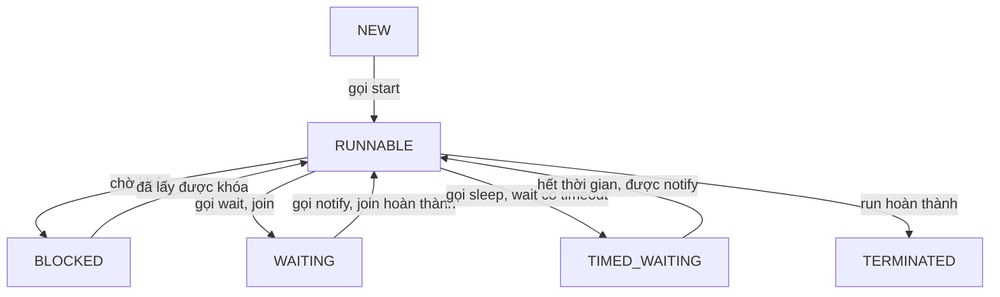

# Đa luồng - Phần 2 (Multithreading - Part 2)

## Mục tiêu học tập

Tài liệu này tập trung vào các trạng thái thực thi luồng, lập lịch, và các thao tác cơ bản như khởi chạy, chạy và tạm dừng. Hãy nghiên cứu từng khái niệm dưới dạng quy tắc Java thực tế, thay vì chỉ học các từ vựng rời rạc.

## Đề cương chi tiết

- **`Runnable` (Thread State)** — Trạng thái có thể chạy (Runnable): Trạng thái mà một luồng (thread) đang thực thi hoặc sẵn sàng/đủ điều kiện để thực thi, chờ trình lập lịch luồng (thread scheduler) của hệ điều hành phân phối thời gian CPU.
- **`Running`** — Đang chạy (Running): Trạng thái con mang tính khái niệm của `RUNNABLE`, nơi các lệnh của luồng đang thực sự được thực thi trên một nhân CPU. Java ánh xạ cả hai trạng thái sẵn sàng và đang chạy vào `Thread.State.RUNNABLE`.
- **`Blocked`** — Bị chặn (Blocked): Trạng thái của một luồng đang chờ để lấy khóa giám sát đối tượng (object monitor lock) (cho một khối/phương thức `synchronized`).
- **`Waiting`** — Chờ (Waiting): Trạng thái của một luồng đang chờ vô thời hạn để một luồng khác thực hiện một hành động cụ thể (thông qua `Object.wait()` hoặc `Thread.join()`).
- **`Timed Waiting`** — Chờ có thời hạn (Timed Waiting): Trạng thái của một luồng đang chờ trong một khoảng thời gian giới hạn (thông qua `Thread.sleep()`, `Object.wait(timeout)`, hoặc `Thread.join(timeout)`).
- **`Terminated`** — Bị hủy/Kết thúc (Terminated): Trạng thái của một luồng đã hoàn thành việc thực thi (hoặc bình thường hoặc bằng cách ném ra một ngoại lệ không được xử lý).
- **`start() vs run()`** — start() so với run(): `start()` cấp phát các tài nguyên hệ điều hành và lập lịch cho luồng thực thi bất đồng bộ; `run()` thực thi mã nhiệm vụ một cách đồng bộ trong luồng hiện tại.
- **`sleep`** — sleep: Một phương thức tĩnh (`Thread.sleep()`) tạm dừng thực thi luồng hiện tại trong một khoảng thời gian được chỉ định, giải phóng CPU nhưng **giữ nguyên** bất kỳ khóa nào đã lấy được.

## Ghi chú chi tiết

### Chi tiết các trạng thái luồng

Java định nghĩa các trạng thái luồng trong enum `Thread.State`. Chúng ta có thể truy vấn trạng thái của một luồng thông qua `thread.getState()`.



#### 1. RUNNABLE
Luồng đang chạy hoặc đủ điều kiện để chạy.
```java
Thread t = new Thread(() -> {
    while (true) {
        // Active execution
    }
});
t.start();
System.out.println("State: " + t.getState()); // Prints RUNNABLE
```

#### 2. BLOCKED
Xảy ra khi một luồng cố gắng đi vào một khối `synchronized` nhưng một luồng khác đã giữ khóa giám sát (monitor lock).
```java
public class BlockedDemo {
    private static final Object lock = new Object();

    public static void main(String[] args) throws InterruptedException {
        Runnable r = () -> {
            synchronized (lock) {
                try { Thread.sleep(5000); } catch (InterruptedException e) {}
            }
        };

        Thread t1 = new Thread(r);
        Thread t2 = new Thread(r);

        t1.start();
        Thread.sleep(100); // Ensure t1 gets the lock first
        t2.start();
        Thread.sleep(100);

        System.out.println("t2 state: " + t2.getState()); // Prints BLOCKED
    }
}
```

#### 3. WAITING và TIMED_WAITING
* `WAITING` được kích hoạt bằng cách gọi `Object.wait()` không có thời gian chờ (timeout) hoặc `Thread.join()`.
* `TIMED_WAITING` được kích hoạt bằng cách gọi `Thread.sleep(millis)`, `Object.wait(millis)`, hoặc `Thread.join(millis)`.
```java
Thread sleeper = new Thread(() -> {
    try { Thread.sleep(1000); } catch (InterruptedException e) {}
});
sleeper.start();
Thread.sleep(100); // Give it time to sleep
System.out.println("Sleeper state: " + sleeper.getState()); // Prints TIMED_WAITING
```

---

## Ví Dụ Thực Tế: Phân tích trạng thái luồng khi xảy ra tranh chấp khóa (Lock Contention)

### Vấn đề
Một hệ thống thương mại điện tử đang gặp phải thời gian phản hồi cực kỳ chậm ở bước thanh toán. Các bản kết xuất luồng (thread dump) cho thấy nhiều luồng đang xử lý thanh toán.

### Phân tích
Bằng cách in ra các trạng thái luồng, nhà phát triển phát hiện ra:
* Luồng A (Thread-A) giữ khóa trên màn giám sát `Inventory` dùng chung và đang ở trạng thái `TIMED_WAITING` (tạm dừng khi gọi cơ sở dữ liệu bên trong khối synchronized).
* Các luồng B, C, và D đang ở trạng thái `BLOCKED`, chờ để đi vào phương thức thanh toán.

### Ví dụ mã nguồn
```java
class Inventory {
    public synchronized void update() {
        try {
            // Simulated slow database write
            Thread.sleep(3000); 
        } catch (InterruptedException e) {}
    }
}
```
**Bài học rút ra**: Các khối synchronized không nên bao bọc các thao tác chặn I/O (blocking I/O) (như các cuộc gọi mạng hoặc cơ sở dữ liệu) bởi vì bất kỳ luồng nào bị chặn sẽ giữ khóa, tạo ra hiệu ứng chặn dây chuyền đến các luồng khác.

---

## Các lỗi thường gặp

### 1. Giả định Thread.sleep() sẽ giải phóng khóa
Một luồng đang tạm dừng (sleep) KHÔNG giải phóng các khóa giám sát của nó. Nếu một luồng sleep bên trong một khối synchronized, không luồng nào khác có thể đi vào khối synchronized đó.
```java
synchronized(lock) {
    Thread.sleep(5000); // BUG: Holds lock for 5 seconds while doing nothing
}
```
**Khắc phục**: Nếu bạn cần đợi một điều kiện và giải phóng khóa, hãy sử dụng `lock.wait()` thay vì `sleep()`.

### 2. Quên xử lý InterruptedException
`Thread.sleep()` ném ra ngoại lệ `InterruptedException` là một ngoại lệ được kiểm tra (checked exception). Nếu một luồng đang sleep bị ngắt, việc sleep sẽ kết thúc ngay lập tức. Không bao giờ nuốt ngoại lệ này mà không đặt lại trạng thái ngắt hoặc ném lại nó.
```java
// BAD
try {
    Thread.sleep(1000);
} catch (InterruptedException e) {
    // Swallowed!
}

// GOOD
try {
    Thread.sleep(1000);
} catch (InterruptedException e) {
    Thread.currentThread().interrupt(); // Restore interrupted status
}
```

## Tại sao triển khai Runnable/Callable được ưu tiên hơn kế thừa Thread

Việc Java thực thi mô hình đơn kế thừa lớp tạo ra một hạn chế nghiêm trọng về mặt kiến trúc khi kế thừa lớp `Thread`. Nếu một lớp kế thừa từ `Thread`, nó không thể kế thừa từ bất kỳ lớp cơ sở nào khác, điều này hạn chế khả năng mở rộng và tái sử dụng logic nghiệp vụ trong các framework doanh nghiệp. Hơn nữa, việc tạo lớp con của `Thread` vi phạm Nguyên lý đơn nhiệm (Single Responsibility Principle) bằng cách kết hợp ngữ cảnh thực thi (luồng vật lý được quản lý bởi hệ điều hành) với chính nhiệm vụ tính toán. Bằng cách triển khai `Runnable` hoặc `Callable`, bạn tách biệt một cách rõ ràng định nghĩa nhiệm vụ cốt lõi khỏi framework thực thi. Sự tách biệt này cho phép các nhiệm vụ được gửi đến các framework thực thi hiện đại như các nhóm luồng (thread pool) của `ExecutorService`, tái sử dụng trên các công cụ thực thi khác nhau, và dễ dàng tạo đối tượng giả lập (mock) hoặc kiểm thử độc lập. Giao diện `Callable` đặc biệt nâng cao mô hình này bằng cách cho phép các nhiệm vụ trả về kết quả tính toán bất đồng bộ và lan truyền các ngoại lệ được kiểm tra (checked exception) lên trên ngăn xếp, điều mà phương thức `run()` tiêu chuẩn của lớp `Thread` không thể thực hiện.

### Mô hình tư duy
```text
[Liên kết chặt chẽ (Kế thừa)]
+-----------------------------+
| CustomTask extends Thread   | ---> Khe kế thừa duy nhất đã bị chiếm!
|  - Logic Điều khiển Luồng   |
|  - Logic Nhiệm vụ (run())   |
+-----------------------------+

[Liên kết lỏng lẻo (Thành phần)]
+----------------------+     +-----------------------+
|  Nhiệm vụ (Runnable) |     | Luồng / Nhóm luồng    |
|  - Logic nhiệm vụ    |===> | - Cơ chế Thực thi     |
+----------------------+     +-----------------------+
```

### Ví dụ mã nguồn
```java
import java.util.concurrent.*;

public class TaskDecoupling {
    public static void main(String[] args) throws Exception {
        Callable<String> task = () -> "Task executed by: " + Thread.currentThread().getName();
        
        ExecutorService executor = Executors.newSingleThreadExecutor();
        Future<String> future = executor.submit(task);
        
        System.out.println(future.get());
        executor.shutdown();
    }
}
/*
Output:
Task executed by: pool-1-thread-1
*/
```

### Chuỗi nguyên nhân - kết quả
1. Mã nguồn triển khai Runnable/Callable &rarr; Logic nhiệm vụ được tách biệt khỏi cơ chế thực thi.
2. Khe đơn kế thừa lớp vẫn mở &rarr; Lớp có thể kế thừa các tiện ích cơ sở dữ liệu, mạng hoặc framework.
3. Các nhiệm vụ được tách biệt được gửi đến ExecutorService &rarr; JVM tránh được chi phí tạo luồng thủ công.
4. Callable lan truyền kết quả và ngoại lệ được kiểm tra &rarr; Luồng gọi xử lý các kết quả bất đồng bộ một cách an toàn.

## Tại sao start() là bắt buộc để sinh ra một luồng

Gọi trực tiếp phương thức `run()` trên một thực thể `Thread` sẽ thực thi các lệnh nhiệm vụ một cách đồng bộ bên trong ngăn xếp cuộc gọi (call stack) của luồng gọi, không thể sinh ra một luồng đồng thời. Để đạt được việc thực thi đa luồng thực tế, bạn phải gọi `start()`, vốn kích hoạt một chuỗi các thao tác gốc (native) của JVM và hệ điều hành. Gọi `start()` thực hiện một kiểm tra trạng thái để đảm bảo luồng ở trạng thái `NEW`, sau đó gọi phương thức gốc nội bộ của JVM `start0()`. Móc nối gốc này yêu cầu trình lập lịch luồng của hệ điều hành cấp phát cấu trúc luồng cấp nền tảng mới và thiết lập ngăn xếp thực thi riêng tư của nó. Khi hệ điều hành lên lịch cho luồng mới này, JVM sẽ gọi phương thức `run()` một cách bất đồng bộ bên trong ngữ cảnh luồng mới được tạo. Cố gắng gọi `start()` nhiều lần là bất hợp pháp vì máy trạng thái nội bộ của luồng đã chuyển ra khỏi trạng thái `NEW`; làm như vậy sẽ ngay lập tức ném ra ngoại lệ `IllegalThreadStateException`.

### Mô hình tư duy
```text
[Gọi trực tiếp run()]
Ngăn xếp luồng gọi: [main()] -> [run()]   (Đồng bộ, cùng ngăn xếp)

[Gọi phương thức start()]
Ngăn xếp luồng gọi: [main()] -> [start()] -> [start0() gốc]
                                                    |
                                                    v (Sinh luồng của HĐH)
Ngăn xếp luồng mới:                              [run()] (Bất đồng bộ)
```

### Ví dụ mã nguồn
```java
public class StartVsRun {
    public static void main(String[] args) {
        Thread thread = new Thread(() -> {
            System.out.println("Executing inside: " + Thread.currentThread().getName());
        });

        System.out.println("Calling run() directly:");
        thread.run(); // Executed synchronously on main stack

        System.out.println("Calling start():");
        thread.start(); // Spawns new thread asynchronously
    }
}
/*
Output:
Calling run() directly:
Executing inside: main
Calling start():
Executing inside: Thread-0
*/
```

### Chuỗi nguyên nhân - kết quả
1. Trình gọi kích hoạt start() trên một Thread &rarr; JVM thực hiện kiểm tra trạng thái để đảm bảo luồng là NEW.
2. JVM gọi phương thức gốc start0() &rarr; Trình lập lịch luồng của HĐH cấp phát cấu trúc luồng nền tảng.
3. HĐH cấu hình một ngăn xếp cuộc gọi riêng tư mới &rarr; Trạng thái luồng chuyển từ NEW sang RUNNABLE.
4. HĐH lập lịch cho luồng chạy trên CPU &rarr; Phương thức run() của JVM thực thi bất đồng bộ trên ngăn xếp mới.
