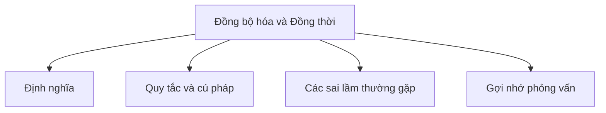

# 29 - Đồng bộ hóa và Đồng thời (Synchronization and Concurrency)

Chủ đề này tuân theo đề cương tổng thể trong [outline.md](../outline.md). Mục tiêu là hiểu sâu sắc từng khái niệm để có thể giải thích, nhận biết trong mã nguồn và trả lời các câu hỏi phỏng vấn.

## Thứ tự học tập (Study Order)

- [Khái niệm phương thức Synchronized (Synchronized Method Concepts)](theory/01-synchronized-method-concepts.md)
- [Khái niệm bế tắc (Deadlock Concepts)](theory/02-deadlock-concepts.md)
- [Khái niệm AtomicReference (AtomicReference Concepts)](theory/03-atomicreference-concepts.md)
- [Khái niệm CyclicBarrier (CyclicBarrier Concepts)](theory/04-cyclicbarrier-concepts.md)
- [Khái niệm Executor (Executor Concepts)](theory/05-executor-concepts.md)
- [Khái niệm ForkJoinPool (ForkJoinPool Concepts)](theory/06-forkjoinpool-concepts.md)
- [Thuật ngữ khóa (Key Terms)](terms/01-key-terms.md)

## Danh sách kiểm tra đề cương (Outline Checklist)

- synchronized method
- synchronized block
- Object lock
- Class lock
- Monitor
- wait
- notify
- notifyAll
- Deadlock
- Livelock
- Starvation
- Volatile
- Atomic classes:
  - AtomicInteger
  - AtomicLong
  - AtomicBoolean
  - AtomicReference
- Lock API:
  - Lock
  - ReentrantLock
  - ReadWriteLock
  - StampedLock
  - Semaphore
  - CountDownLatch
  - CyclicBarrier
  - Phaser
  - BlockingQueue
- Concurrent collections:
  - ConcurrentHashMap
  - CopyOnWriteArrayList
  - ConcurrentLinkedQueue
- Executor Framework:
  - Executor
  - ExecutorService
  - ScheduledExecutorService
  - ThreadPoolExecutor
  - Executors
  - Future
  - Callable
  - CompletableFuture
  - ForkJoinPool
  - Parallel Stream

## Tự kiểm tra (Self-Check)

Trước khi chuyển sang chủ đề tiếp theo, hãy xác minh rằng bạn có thể trả lời các câu hỏi sau:
1. Tại sao từ khóa `synchronized` ngăn chặn điều kiện tranh đua (race conditions), và các bộ giám sát đối tượng (object monitors) cũng như việc giành/giải phóng khóa hoạt động như thế nào bên dưới?
   &rarr; Xem [Tại sao các khối synchronized ngăn chặn điều kiện tranh đua (Why synchronized Blocks Prevent Race Conditions)](theory/01-synchronized-method-concepts.md#why-synchronized-blocks-prevent-race-conditions)
2. Tại sao bế tắc (deadlock) xảy ra trong Java, và chuỗi giành tài nguyên cụ thể nào tạo ra bốn điều kiện cần thiết của deadlock?
   &rarr; Xem [Tại sao Deadlock xảy ra và cách tránh chúng (Why Deadlocks Occur and How to Avoid Them)](theory/02-deadlock-concepts.md#why-deadlocks-occur-and-how-to-avoid-them)
3. Tại sao các biến nguyên tử (như `AtomicReference` hoặc `AtomicInteger`) tránh được đồng bộ hóa dựa trên khóa, và cơ chế CAS (Compare-And-Swap) ở cấp độ phần cứng đảm bảo tính nguyên tử như thế nào?
   &rarr; Xem [Tại sao các biến nguyên tử tránh đồng bộ hóa dựa trên khóa (Why Atomic Variables Avoid Lock-Based Synchronization)](theory/03-atomicreference-concepts.md#why-atomic-variables-avoid-lock-based-synchronization)
4. Tại sao `CyclicBarrier` khác với `CountDownLatch`, và cơ chế chờ khóa/điều kiện (lock/condition await) bên trong thiết lập lại barrier để tái sử dụng như thế nào?
   &rarr; Xem [Tại sao CyclicBarrier và CountDownLatch khác nhau (Why CyclicBarrier and CountDownLatch Differ)](theory/04-cyclicbarrier-concepts.md#why-cyclicbarrier-and-count-down-latch-differ)
5. Tại sao bạn nên sử dụng `ExecutorService` (và các nhóm luồng — thread pools) thay vì tạo thủ công các luồng mới cho mỗi tác vụ, và các chính sách giới hạn hàng đợi luồng bảo vệ JVM như thế nào?
   &rarr; Xem [Tại sao ExecutorService và nhóm luồng là cần thiết (Why ExecutorService and Thread Pools Are Required)](theory/05-executor-concepts.md#why-executorservice-and-thread-pools-are-required)
6. Tại sao `ForkJoinPool` sử dụng thuật toán trộm công việc (work-stealing algorithm), và hàng đợi hai đầu (deques) của nó cải thiện hiệu suất sử dụng CPU cho các tác vụ chia để trị (divide-and-conquer) như thế nào?
   &rarr; Xem [Tại sao ForkJoinPool sử dụng cơ chế trộm công việc (Why ForkJoinPool Uses Work-Stealing)](theory/06-forkjoinpool-concepts.md#why-forkjoinpool-uses-work-stealing)

## Thẻ Anki (Anki Cards)

- [Cơ bản (Basic)](anki/basic.tsv)
- [Cơ bản mở rộng (Basic Extra)](anki/basic-extra.tsv)
- [Điền vào chỗ trống (Cloze)](anki/cloze.tsv)
- [Câu hỏi mã nguồn (Code Question)](anki/code-question.tsv)

## Sơ đồ Mermaid tổng quan (Mermaid Overview)

## Liên kết tham khảo (Reference Links)

- https://docs.oracle.com/javase/tutorial/essential/concurrency/sync.html
- https://docs.oracle.com/en/java/javase/21/docs/api/java.base/java/util/concurrent/package-summary.html
