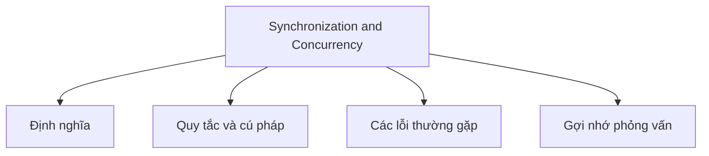

# 29 - Đồng bộ hóa và Tính đồng thời (Synchronization and Concurrency)

Chủ đề này tuân theo đề cương chính trong [outline.md](../outline.md). Mục tiêu là hiểu sâu sắc từng khái niệm để có thể giải thích, nhận biết chúng trong mã nguồn và trả lời các câu hỏi phỏng vấn.

## Thứ Tự Học Tập

- [Khái niệm Phương thức Đồng bộ hóa (Synchronized Method)](theory/01-synchronized-method-concepts.md)
- [Khái niệm Bế tắc (Deadlock)](theory/02-deadlock-concepts.md)
- [Khái niệm Biến tham chiếu Nguyên tử (AtomicReference)](theory/03-atomicreference-concepts.md)
- [Khái niệm Thanh chắn Vòng lặp (CyclicBarrier)](theory/04-cyclicbarrier-concepts.md)
- [Khái niệm Bộ thực thi (Executor)](theory/05-executor-concepts.md)
- [Khái niệm ForkJoinPool](theory/06-forkjoinpool-concepts.md)
- [Các Thuật Ngữ Khóa](terms/01-key-terms.md)

## Danh Sách Khái Niệm

- phương thức synchronized
- khối synchronized
- Khóa đối tượng (Object lock)
- Khóa lớp (Class lock)
- Bộ giám sát (Monitor)
- wait
- notify
- notifyAll
- Bế tắc (Deadlock)
- Bế tắc hoạt động (Livelock)
- Đói tài nguyên (Starvation)
- Volatile
- Các lớp nguyên tử (Atomic classes):
  - AtomicInteger
  - AtomicLong
  - AtomicBoolean
  - AtomicReference
- API Khóa (Lock API):
  - Lock
  - ReentrantLock
  - ReadWriteLock
  - StampedLock
- Semaphore
- CountDownLatch
- CyclicBarrier
- Phaser
- BlockingQueue
- Các tập hợp đồng thời (Concurrent collections):
  - ConcurrentHashMap
  - CopyOnWriteArrayList
  - ConcurrentLinkedQueue
- Khung công tác Executor (Executor Framework):
  - Executor
  - ExecutorService
  - ScheduledExecutorService
  - ThreadPoolExecutor
  - Executors
- Future
- Callable
- CompletableFuture
- ForkJoinPool
- Dòng chảy song song (Parallel Stream)

## Tự Kiểm Tra

Trước khi chuyển sang chủ đề tiếp theo, hãy đảm bảo bạn có thể trả lời các câu hỏi sau:
1. Tại sao từ khóa `synchronized` ngăn chặn tình trạng tranh chấp (race condition), và các bộ giám sát đối tượng (object monitor) cùng việc chiếm giữ/giải phóng khóa hoạt động như thế nào dưới nền tảng?
   &rarr; Xem [Tại sao Khối synchronized Ngăn chặn Tình trạng Tranh chấp](theory/01-synchronized-method-concepts.md#why-synchronized-blocks-prevent-race-conditions)
2. Tại sao bế tắc (deadlock) xảy ra trong Java, và chuỗi chiếm giữ tài nguyên cụ thể nào tạo ra bốn điều kiện cần thiết để xảy ra bế tắc?
   &rarr; Xem [Tại sao Bế tắc Xảy ra và Cách Tránh Chúng](theory/02-deadlock-concepts.md#why-deadlocks-occur-and-how-to-avoid-them)
3. Tại sao các biến nguyên tử (như `AtomicReference` hoặc `AtomicInteger`) tránh được đồng bộ hóa dựa trên khóa, và cơ chế CAS (Compare-And-Swap) ở cấp độ phần cứng đảm bảo tính nguyên tử như thế nào?
   &rarr; Xem [Tại sao Biến Nguyên tử Tránh Đồng bộ hóa Dựa trên Khóa](theory/03-atomicreference-concepts.md#why-atomic-variables-avoid-lock-based-synchronization)
4. Tại sao `CyclicBarrier` khác với `CountDownLatch`, và cơ chế khóa/điều kiện chờ (lock/condition await) nội bộ của nó đặt lại thanh chắn để tái sử dụng như thế nào?
   &rarr; Xem [Tại sao CyclicBarrier và CountDownLatch Khác nhau](theory/04-cyclicbarrier-concepts.md#why-cyclicbarrier-and-count-down-latch-differ)
5. Tại sao bạn nên sử dụng `ExecutorService` (và các nhóm luồng) thay vì tạo luồng mới thủ công cho mỗi tác vụ, và các chính sách giới hạn hàng đợi luồng bảo vệ JVM như thế nào?
   &rarr; Xem [Tại sao Cần Sử dụng ExecutorService và Nhóm Luồng](theory/05-executor-concepts.md#why-executorservice-and-thread-pools-are-required)
6. Tại sao `ForkJoinPool` sử dụng thuật toán trộm công việc (work-stealing), và các hàng đợi hai đầu (deque) của nó cải thiện hiệu suất sử dụng CPU cho các tác vụ chia để trị (divide-and-conquer) như thế nào?
   &rarr; Xem [Tại sao ForkJoinPool Sử dụng Cơ chế Trộm Công việc](theory/06-forkjoinpool-concepts.md#why-forkjoinpool-uses-work-stealing)

## Thẻ Anki

- [Basic](anki/basic.tsv)
- [Basic Extra](anki/basic-extra.tsv)
- [Cloze](anki/cloze.tsv)
- [Code Question](anki/code-question.tsv)

## Sơ Đồ Mermaid Tổng Quan

## Liên Kết Tham Khảo

- https://docs.oracle.com/javase/tutorial/essential/concurrency/sync.html
- https://docs.oracle.com/en/java/javase/21/docs/api/java.base/java/util/concurrent/package-summary.html
