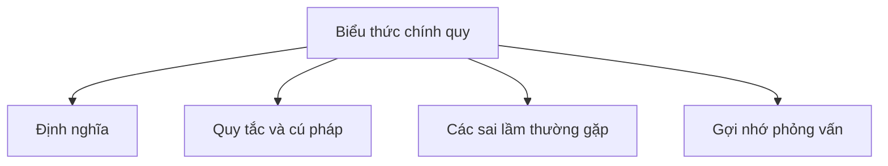

# 30 - Biểu thức chính quy (Regular Expression)

Chủ đề này tuân theo đề cương tổng thể trong [outline.md](../outline.md). Mục tiêu là hiểu sâu sắc từng khái niệm để có thể giải thích, nhận biết trong mã nguồn và trả lời các câu hỏi phỏng vấn.

## Thứ tự học tập (Study Order)

- [Khái niệm Biểu thức chính quy (What Is Regex Concepts)](theory/01-what-is-regex-concepts.md)
- [Khái niệm Lookahead Lookbehind cơ bản (Basic Lookahead Lookbehind Concepts)](theory/02-basic-lookahead-lookbehind-concepts.md)
- [Thuật ngữ khóa (Key Terms)](terms/01-key-terms.md)

## Danh sách kiểm tra đề cương (Outline Checklist)

- Biểu thức chính quy (Regex) là gì?
- Pattern
- Matcher
- matches
- find
- group
- Character classes
- Quantifiers
- Capturing group
- Non-capturing group
- Basic lookahead / lookbehind
- Xác thực email, số điện thoại, mật khẩu
- Thay thế bằng bộ lọc regex (Replace using regex)
- Phân tách bằng bộ lọc regex (Split using regex)

## Tự kiểm tra (Self-Check)

- Tại sao việc biên dịch một `Pattern` tốn kém tài nguyên tính toán, và tại sao nên lưu đệm (cache) `Pattern.compile()` thay vì gọi `String.matches()` lặp đi lặp lại trong một vòng lặp có tần suất cao (hot loop)?
  &rarr; Xem [Tại sao việc biên dịch Pattern lại tốn kém (Why Pattern Compilation Is Expensive)](theory/01-what-is-regex-concepts.md#why-pattern-compilation-is-expensive)
- Các điểm khác biệt chính giữa các nhóm thu giữ (capturing groups) `(group)` và các nhóm không thu giữ (non-capturing groups) `(?:group)` về mặt cấp phát bộ nhớ heap và hiệu suất là gì?
  &rarr; Xem [Tại sao các nhóm không thu giữ giúp tiết kiệm cấp phát bộ nhớ Heap (Why Non-Capturing Groups Save Heap Allocations)](theory/01-what-is-regex-concepts.md#why-non-capturing-groups-save-heap-allocations)
- Các khẳng định nhìn trước (lookahead) và nhìn sau (lookbehind) hoạt động như thế nào về mặt khái niệm mà không tiêu thụ bất kỳ ký tự đầu vào nào, và bản chất "độ rộng bằng không" (zero-width) của chúng là gì?
  &rarr; Xem [Tại sao Lookarounds là các khẳng định độ rộng bằng không (Why Lookarounds are Zero-Width Assertions)](theory/02-basic-lookahead-lookbehind-concepts.md#why-lookarounds-are-zero-width-assertions)
- Giới hạn kỹ thuật về độ rộng của các khẳng định nhìn sau (lookbehind) trong công cụ regex của Java so với nhìn trước (lookahead) là gì, và tại sao nó lại tồn tại?
  &rarr; Xem [Tại sao Lookbehinds trong Java có giới hạn độ rộng (Why Java Lookbehinds Have Width Limitations)](theory/02-basic-lookahead-lookbehind-concepts.md#why-java-lookbehinds-have-width-limitations)
- Tại sao việc quay lui (backtracking) xảy ra trong quá trình thực thi regex, và làm thế nào các bộ định lượng tham lam (greedy) so với miễn cưỡng (reluctant) so với sở hữu (possessive) có thể ngăn chặn quay lui thảm khốc (ReDoS)?
  &rarr; Xem [Tại sao việc quay lui xảy ra và làm thế nào các bộ định lượng ngăn chặn ReDoS (Why Backtracking Occurs and How Quantifiers Prevent ReDoS)](theory/01-what-is-regex-concepts.md#why-backtracking-occurs-and-how-quantifiers-prevent-redos)
- Tại sao phương thức `String.split(regex)` mặc định loại bỏ các chuỗi trống ở cuối, và làm thế nào việc truyền một tham số giới hạn (limit) âm có thể ngăn chặn hành vi này?
  &rarr; Xem [Tại sao String.split loại bỏ các chuỗi trống ở cuối (Why String.split Discards Trailing Empty Strings)](theory/02-basic-lookahead-lookbehind-concepts.md#why-stringsplit-discards-trailing-empty-strings)

## Thẻ Anki (Anki Cards)

- [Cơ bản (Basic)](anki/basic.tsv)
- [Cơ bản mở rộng (Basic Extra)](anki/basic-extra.tsv)
- [Điền vào chỗ trống (Cloze)](anki/cloze.tsv)
- [Câu hỏi mã nguồn (Code Question)](anki/code-question.tsv)

## Sơ đồ Mermaid tổng quan (Mermaid Overview)

## Liên kết tham khảo (Reference Links)

- https://docs.oracle.com/javase/tutorial/essential/regex/
- https://docs.oracle.com/en/java/javase/21/docs/api/java.base/java/util/regex/Pattern.html
