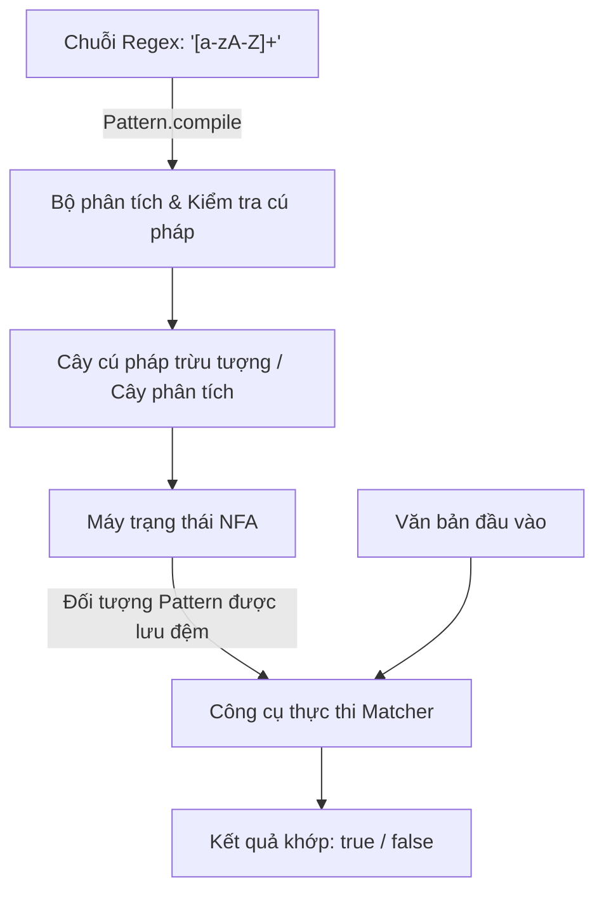

# Biểu thức chính quy (Regular Expression) - Phần 1

## Mục tiêu học tập (Learning Goal)

Tệp này bao gồm một phần tập trung của **Biểu thức chính quy (Regular Expression)**. Hãy nghiên cứu từng khái niệm như một quy tắc Java thực tế, không phải là từ vựng cô lập.

## Đề cương chi tiết (Outline Coverage)

| Khái niệm (Concept) | Những điều cần biết (What to know) |
| --- | --- |
| `What is Regex?` | Một biểu thức chính quy (regular expression) là một ngôn ngữ mẫu dùng để khớp văn bản. |
| `Pattern` | Pattern là biểu diễn đã biên dịch của một biểu thức chính quy. |
| `Matcher` | Matcher áp dụng một `Pattern` vào văn bản đầu vào và cung cấp các thao tác khớp. |
| `matches` | matches kiểm tra xem toàn bộ đầu vào có thỏa mãn mẫu hay không. |
| `find` | find tìm kiếm chuỗi con tiếp theo khớp với mẫu. |
| `group` | group trả về văn bản được thu giữ bởi toàn bộ kết quả khớp hoặc bởi một nhóm thu giữ (capturing group). |
| `Character classes` | Các lớp ký tự (Character classes) định nghĩa các tập hợp ký tự được phép như chữ số, chữ cái, hoặc các phạm vi tùy chỉnh. |
| `Quantifiers` | Các bộ định lượng (Quantifiers) xác định số lần mã thông báo (token) đứng trước có thể lặp lại. |
| `Capturing group` | Một nhóm thu giữ (capturing group) lưu trữ một biểu thức con đã khớp để lấy lại sau này. |
| `Non-capturing group` | Một nhóm không thu giữ (non-capturing group) nhóm logic mẫu mà không lưu trữ kết quả được thu giữ. |

---

## Chi tiết tài liệu học tập (Detailed Notes)

### Biểu thức chính quy là gì? (What is Regex?)

Một biểu thức chính quy (regular expression — gọi tắt là regex) là một ngôn ngữ mẫu để khớp, tìm kiếm và thao tác trên văn bản. Trong Java, biểu thức chính quy được hỗ trợ nguyên bản thông qua gói `java.util.regex`, chủ yếu thông qua các lớp `Pattern` và `Matcher`, và thông qua các phương thức trợ giúp trong lớp `java.lang.String` (như `matches`, `replaceAll`, và `split`).

#### Ví dụ mã nguồn: Xác thực Regex cơ bản (Code Example: Basic Regex Verification)
```java
public class RegexIntro {
    public static void main(String[] args) {
        String input = "Java17";
        // Check if the input starts with word characters and ends with digits
        boolean isMatch = input.matches("[a-zA-Z]+\\d+");
        System.out.println("Matches: " + isMatch); // Prints true
    }
}
```

---

### Pattern

`java.util.regex.Pattern` là biểu diễn đã biên dịch của một biểu thức chính quy. Biên dịch một biểu thức chính quy là một thao tác tốn kém vì nó phân tích chuỗi regex thành một cây cú pháp và xây dựng một máy trạng thái (state machine).

- **Tính bất biến và an toàn luồng (Immutability and Thread Safety)**: Các thực thể `Pattern` hoàn toàn bất biến và an toàn luồng. Bạn nên biên dịch một mẫu một lần và lưu trữ nó trong một trường `static final` để tái sử dụng giữa các luồng.
- **Cờ biên dịch (Compilation Flags)**: Bạn có thể truyền các cờ vào `Pattern.compile(regex, flags)`, chẳng hạn như `Pattern.CASE_INSENSITIVE`, `Pattern.MULTILINE`, hoặc `Pattern.DOTALL`.

#### Ví dụ mã nguồn: Lưu đệm Pattern (Code Example: Cached Pattern Pattern)
```java
import java.util.regex.Pattern;

public class UserValidator {
    // Compile once and reuse to avoid performance overhead in loops or concurrent threads
    private static final Pattern USERNAME_PATTERN = 
        Pattern.compile("^[a-z0-9_-]{3,16}$", Pattern.CASE_INSENSITIVE);

    public static boolean isValidUsername(String username) {
        if (username == null) return false;
        return USERNAME_PATTERN.matcher(username).matches();
    }
}
```

#### Sai lầm thường gặp (Common Mistake)
Biên dịch lại `Pattern` bên trong một phương thức được gọi thường xuyên (ví dụ: bên trong một vòng lặp hoặc bộ xử lý dịch vụ). Điều này làm giảm đáng kể thông lượng vì JVM phải phân tích lại biểu thức chính quy trên mỗi lần gọi.
```java
// BAD: Compiles the pattern on every call!
public boolean badValidate(String email) {
    return Pattern.compile("^[A-Z0-9._%+-]+@[A-Z0-9.-]+\\.[A-Z]{2,6}$", Pattern.CASE_INSENSITIVE)
                  .matcher(email)
                  .matches();
}
```

## Tại sao việc biên dịch Pattern lại tốn kém (Why Pattern Compilation Is Expensive)

Biên dịch một biểu thức chính quy không phải là việc kiểm tra từng ký tự đơn giản. Cơ chế hoạt động bên dưới khi `Pattern.compile(regex)` được gọi là: công cụ regex sẽ phân tích chuỗi regex thành một cây cú pháp trừu tượng (Abstract Syntax Tree — AST) để xác thực cú pháp của nó. Tiếp theo, nó biên dịch cây này thành một biểu diễn nội bộ của một tự động giới hạn trạng thái (finite state automaton), cụ thể là Tự động giới hạn trạng thái không đơn trị (Non-deterministic Finite Automaton — NFA). Quá trình biên dịch này là một hoạt động tiêu tốn nhiều CPU và bộ nhớ liên quan đến việc cấp phát nhiều đối tượng nút (node), xây dựng các chuyển đổi trạng thái và tối ưu hóa cấu trúc máy trạng thái kết quả. Do chi phí biên dịch cao này, việc biên dịch lại một mẫu bên trong một vòng lặp có tần suất cao (hot loop) hoặc một phương thức được gọi thường xuyên sẽ làm giảm hiệu suất nghiêm trọng; mẫu nên được biên dịch một lần và lưu đệm làm một trường `static final`.

### Mô hình tư duy: Biên dịch Regex so với Thực thi (Mental Model: Regex Compilation vs. Execution)



### Ví dụ mã nguồn: Lưu đệm Pattern so với Biên dịch tức thời (Code Example: Caching Patterns vs. On-the-Fly Compilation)

```java
import java.util.regex.*;

public class PatternCompilationCost {
    // GOOD: Pattern is compiled once during class loading and reused
    private static final Pattern CACHED_PATTERN = Pattern.compile("^[a-zA-Z]+$");

    // BAD: Re-compiles the pattern on every single method invocation
    public static boolean badValidate(String text) {
        return Pattern.compile("^[a-zA-Z]+$").matcher(text).matches();
    }

    public static boolean goodValidate(String text) {
        return CACHED_PATTERN.matcher(text).matches(); // Reuses NFA state machine
    }

    public static void main(String[] args) {
        System.out.println("Good result: " + goodValidate("Java")); // true
        System.out.println("Bad result: " + badValidate("Java"));   // true
    }
}
```

### Chuỗi nguyên nhân - kết quả (Cause-Effect Chain)


```text
Gọi `String.matches("regex")` hoặc `Pattern.compile("regex")` trong vòng lặp
  → Công cụ phải phân tích chuỗi mẫu và cấp phát các nút AST
  → JVM biên dịch AST thành máy trạng thái NFA trên bộ nhớ heap
  → Thực thi khớp trên đầu vào
  → Máy trạng thái đã biên dịch bị loại bỏ và được thu gom rác
  → Việc thực thi lặp lại gây ra mức sử dụng CPU cao và hiện tượng dồn ép GC (GC thrashing).
```


---

### Matcher

`java.util.regex.Matcher` là công cụ có trạng thái (stateful engine) thực hiện các thao tác khớp trên một chuỗi ký tự bằng cách diễn giải `Pattern` đã biên dịch.

- **Tính có trạng thái (Statefulness)**: Khác với `Pattern`, `Matcher` có trạng thái rất cao (theo dõi các ranh giới vùng khớp, chỉ số tìm kiếm, và các nhóm thu giữ).
- **An toàn luồng (Thread Safety)**: Các thực thể `Matcher` **không** an toàn luồng. Không chia sẻ thực thể `Matcher` giữa các luồng.

#### Ví dụ mã nguồn: Tạo một Matcher (Code Example: Creating a Matcher)
```java
import java.util.regex.Pattern;
import java.util.regex.Matcher;

public class MatcherUsage {
    public static void main(String[] args) {
        Pattern pattern = Pattern.compile("id=\\d+");
        Matcher matcher = pattern.matcher("user: id=4082, role=admin");
        
        if (matcher.find()) {
            System.out.println("Found match: " + matcher.group()); // Prints "id=4082"
        }
    }
}
```

---

### matches

`Matcher.matches()` cố gắng khớp **toàn bộ** chuỗi đầu vào với mẫu.

- **Khớp toàn bộ nghiêm ngặt (Strict Full-Match)**: Nó trả về `true` khi và chỉ khi toàn bộ chuỗi khớp với regex.
- **So sánh với String.matches()**: Phương thức `String.matches(regex)` bên trong gọi `Pattern.matches(regex, input)`, việc này biên dịch mẫu và thực hiện một thao tác `matches()` đầy đủ.
- **So sánh với lookingAt()**: `Matcher.lookingAt()` chỉ kiểm tra xem mẫu có khớp từ *đầu* của chuỗi đầu vào hay không, trong khi `Matcher.find()` tìm kiếm mẫu ở *bất kỳ đâu* trong chuỗi đầu vào.

#### Ví dụ mã nguồn: so sánh matches, lookingAt và find (Code Example: matches vs lookingAt vs find)
```java
import java.util.regex.Pattern;
import java.util.regex.Matcher;

public class MatchTypes {
    public static void main(String[] args) {
        Pattern p = Pattern.compile("\\d+"); // Matches digits
        String text = "123abc456";
        
        Matcher m1 = p.matcher(text);
        System.out.println("matches: " + m1.matches()); // false (entire string is not just digits)
        
        Matcher m2 = p.matcher(text);
        System.out.println("lookingAt: " + m2.lookingAt()); // true (starts with digits "123")
        
        Matcher m3 = p.matcher(text);
        System.out.println("find: " + m3.find()); // true (finds "123")
        System.out.println("find again: " + m3.find()); // true (finds "456")
    }
}
```

---

### find

`Matcher.find()` quét chuỗi đầu vào để tìm chuỗi con tiếp theo khớp với mẫu.

- **Lặp**: Nó trả về `true` nếu tìm thấy một kết quả khớp và di chuyển con trỏ tìm kiếm ngay sau văn bản đã khớp. Bạn có thể sử dụng nó trong vòng lặp `while (matcher.find())` để trích xuất tất cả các lần xuất hiện.
- **Thiết lập lại (Resetting)**: Gọi `matcher.reset()` sẽ khởi động lại con trỏ khớp ở đầu chuỗi đầu vào.
- **Phương thức find có tham số**: `matcher.find(int start)` thiết lập lại matcher và bắt đầu tìm kiếm từ chỉ số ký tự được chỉ định.

#### Ví dụ mã nguồn: Tìm kiếm tất cả các lần xuất hiện (Code Example: Finding All Occurrences)
```java
import java.util.regex.Pattern;
import java.util.regex.Matcher;

public class FindAll {
    public static void main(String[] args) {
        Pattern pattern = Pattern.compile("0x[0-9a-fA-F]+"); // Hex codes
        Matcher matcher = pattern.matcher("Values: 0x1A, 0xFF, and invalid 0xG1");
        
        while (matcher.find()) {
            System.out.println("Hex found: " + matcher.group() + " at [" + matcher.start() + ", " + matcher.end() + ")");
        }
        // Output:
        // Hex found: 0x1A at [8, 12)
        // Hex found: 0xFF at [14, 18)
    }
}
```

---

### group

`Matcher.group()` trả về chuỗi con đầu vào đã khớp bởi thao tác khớp trước đó.

- **Chỉ số 0**: `matcher.group(0)` hoặc `matcher.group()` trả về toàn bộ văn bản đã khớp.
- **Các nhóm con (Subgroups)**: `matcher.group(i)` trả về văn bản được thu giữ bởi nhóm thu giữ thứ $i$ (được đánh số bằng cách đếm các dấu ngoặc mở từ trái sang phải).
- **Số lượng nhóm (Group Count)**: `matcher.groupCount()` trả về số lượng nhóm thu giữ được định nghĩa trong mẫu (không bao gồm nhóm 0).

#### Ví dụ mã nguồn: Trích xuất các nhóm thu giữ (Code Example: Extracting Capturing Groups)
```java
import java.util.regex.Pattern;
import java.util.regex.Matcher;

public class ExtractGroups {
    public static void main(String[] args) {
        Pattern pattern = Pattern.compile("(\\w+):(\\d+)");
        Matcher matcher = pattern.matcher("port:8080 host:9000");
        
        while (matcher.find()) {
            System.out.println("Full match: " + matcher.group(0));
            System.out.println("  Name: " + matcher.group(1));
            System.out.println("  Port: " + matcher.group(2));
        }
    }
}
```

#### Sai lầm thường gặp (Common Mistake)
Gọi `matcher.group()` trước khi gọi `find()`, `matches()`, hoặc `lookingAt()`, hoặc sau khi một trong các phương thức này trả về `false`. Điều này sẽ ném ra `IllegalStateException` vì matcher không có trạng thái khớp đang hoạt động.
```java
// BAD: Triggers IllegalStateException!
Matcher matcher = Pattern.compile("\\d+").matcher("abc 123");
String val = matcher.group(); // Exception! Must call matcher.find() first.
```

---

### Các lớp ký tự (Character classes)

Các lớp ký tự chỉ định các tập hợp ký tự có thể khớp tại một vị trí duy nhất trong đầu vào.

- **Lớp tùy chỉnh (Custom Classes)**: `[abc]` khớp với `a`, `b`, hoặc `c`. `[^abc]` khớp với bất kỳ ký tự nào ngoại trừ `a`, `b`, hoặc `c`. `[a-z]` khớp với các chữ cái từ `a` đến `z`.
- **Lớp định nghĩa sẵn (Predefined Classes)**:
  - `.` khớp với bất kỳ ký tự nào (ngoại trừ các ký tự kết thúc dòng, trừ khi `Pattern.DOTALL` đang hoạt động).
  - `\d` khớp với một chữ số `[0-9]`.
  - `\w` khớp với một ký tự chữ/số/gạch dưới `[a-zA-Z_0-9]`.
  - `\s` khớp với một ký tự khoảng trắng `[ \t\n\x0B\f\r]`.
  - `\D`, `\W`, `\S` là các phủ định của `\d`, `\w`, `\s`.
- **Thoát ký tự kép (Double Escaping)**: Vì dấu gạch chéo ngược (`\`) có ý nghĩa đặc biệt trong các hằng chuỗi Java (String literals), chúng phải được nhân đôi khi viết một mẫu regex (ví dụ: `"\\d"` sẽ dịch thành `\d` trong regex được biên dịch).

#### Ví dụ mã nguồn: Lớp ký tự tùy chỉnh (Code Example: Custom Character Class)
```java
public class CharacterClasses {
    public static void main(String[] args) {
        // Match a vowel, followed by any non-digit character
        String regex = "[aeiouAEIOU]\\D"; 
        System.out.println("aX".matches(regex)); // true
        System.out.println("a9".matches(regex)); // false
    }
}
```

---

### Các bộ định lượng (Quantifiers)

Các bộ định lượng xác định số lần mã thông báo (token) đứng trước có thể khớp.

- **Các loại bộ định lượng**:
  - `?`: 0 hoặc 1 lần.
  - `*`: 0 hoặc nhiều lần.
  - `+`: 1 hoặc nhiều lần.
  - `{n}`: Chính xác $n$ lần.
  - `{n,}`: Ít nhất $n$ lần.
  - `{n,m}`: Từ $n$ đến $m$ lần.
- **Chiến lược khớp**:
  - **Greedy (tham lam - mặc định)**: Khớp càng nhiều ký tự càng tốt trước, sau đó quay lui (backtrack) từng ký tự một nếu việc khớp thất bại. (Ví dụ: `.*A`)
  - **Reluctant/Lazy (miễn cưỡng/lười biếng - thêm `?`)**: Khớp càng ít ký tự càng tốt trước, kiểm tra phần còn lại của mẫu ở mỗi bước. (Ví dụ: `.*?A`)
  - **Possessive (sở hữu - thêm `+`)**: Khớp càng nhiều ký tự càng tốt và **không bao giờ** quay lui. (Ví dụ: `.*+A`)

#### Ví dụ mã nguồn: Hành vi của các bộ định lượng (Code Example: Quantifier Behaviors)
```java
import java.util.regex.Pattern;
import java.util.regex.Matcher;

public class QuantifierComparison {
    public static void main(String[] args) {
        String text = "abcXdefXghi";
        
        // Greedy: matches up to the LAST 'X'
        Matcher m1 = Pattern.compile("a.*X").matcher(text);
        if (m1.find()) System.out.println("Greedy: " + m1.group()); // "abcXdefX"
        
        // Reluctant: matches up to the FIRST 'X'
        Matcher m2 = Pattern.compile("a.*?X").matcher(text);
        if (m2.find()) System.out.println("Reluctant: " + m2.group()); // "abcX"
        
        // Possessive: consumes everything, never releases 'X' for the final token 'X'
        Matcher m3 = Pattern.compile("a.*+X").matcher(text);
        System.out.println("Possessive match found: " + m3.find()); // false
    }
}
```

---

### Nhóm thu giữ (Capturing group)

Một nhóm thu giữ (capturing group) được tạo ra bằng cách bao bọc một biểu thức con bên trong dấu ngoặc đơn `(...)`. Nó báo cho công cụ regex lưu chuỗi con đã khớp vào bộ nhớ, cho phép bạn tham chiếu đến nó sau này.

- **Nhóm**: Cho phép áp dụng các bộ định lượng cho toàn bộ một mẫu con (ví dụ: `(abc)+`).
- **Trích xuất**: Cho phép trích xuất các phần của chuỗi đã khớp thông qua `matcher.group(index)`.
- **Tham chiếu ngược (Backreferences)**: Bạn có thể tham chiếu ngược lại một nhóm đã khớp trước đó bên trong cùng một mẫu regex bằng cách sử dụng `\index` (ví dụ: `(\\w)\\1` khớp với các chữ cái kép như `aa` hoặc `bb`).

#### Ví dụ mã nguồn: Tham chiếu ngược (Code Example: Backreference)
```java
import java.util.regex.Pattern;
import java.util.regex.Matcher;

public class BackreferenceExample {
    public static void main(String[] args) {
        // Matches HTML tags where tag name matches the closing tag name
        Pattern pattern = Pattern.compile("<(\\w+)>.*?</\\1>");
        
        System.out.println(pattern.matcher("<b>Bold</b>").matches()); // true
        System.out.println(pattern.matcher("<b>Wrong Tag</i>").matches()); // false
    }
}
```

---

### Nhóm không thu giữ (Non-capturing group)

Một nhóm không thu giữ (non-capturing group) được định nghĩa bằng cú pháp `(?:pattern)`. Nó nhóm các biểu thức con lại với nhau (ví dụ: để áp dụng các bộ định lượng hoặc phép tuyển/lựa chọn) nhưng không lưu văn bản đã khớp vào bộ nhớ.

- **Hiệu suất**: Tiết kiệm bộ nhớ và thời gian xử lý bằng cách tránh lưu trữ các chuỗi con đã khớp.
- **Bảo toàn chỉ số**: Ngăn ngừa việc làm xáo trộn số thứ tự nhóm của các nhóm thu giữ thực sự.

#### Ví dụ mã nguồn: Nhóm không thu giữ (Code Example: Non-Capturing Group)
```java
import java.util.regex.Pattern;
import java.util.regex.Matcher;

public class NonCapturingGroup {
    public static void main(String[] args) {
        // We want to group the prefix options "http" or "https" or "ftp"
        // but we only want to capture the actual domain name.
        Pattern pattern = Pattern.compile("(?:https?|ftp)://([a-zA-Z0-9.-]+)");
        Matcher matcher = pattern.matcher("https://google.com");
        
        if (matcher.find()) {
            System.out.println("Total groups: " + matcher.groupCount()); // 1 (prefix group is ignored)
            System.out.println("Domain: " + matcher.group(1)); // "google.com"
        }
    }
}
```

## Tại sao các nhóm không thu giữ giúp tiết kiệm cấp phát bộ nhớ Heap (Why Non-Capturing Groups Save Heap Allocations)

Trong biểu thức chính quy, các nhóm thu giữ `(group)` thực hiện nhiệm vụ kép: chúng nhóm các mã thông báo (tokens) để dùng cho các bộ định lượng hoặc phép lựa chọn, và chúng thu giữ các chuỗi con đã khớp để tham chiếu ngược hoặc lấy ra sử dụng. Để lưu trữ các chuỗi con được thu giữ này, công cụ regex phải cấp phát và duy trì các bộ đệm thu giữ nội bộ (cấu trúc dạng mảng hoặc danh sách) nhằm theo dõi các vị trí bù bắt đầu và kết thúc (start and end offsets) của mỗi nhóm. Ngược lại, các nhóm không thu giữ `(?:group)` chỉ nhóm các mã thông báo và báo cho công cụ bỏ qua việc theo dõi vị trí bù. Bằng cách tránh việc phải ghi lại chỉ số chuỗi con, các nhóm không thu giữ loại bỏ việc cấp phát bộ nhớ heap để theo dõi trạng thái khớp và tránh chạm tới giới hạn tham chiếu ngược của matcher.

### Mô hình tư duy: Bộ đệm thu giữ so với Nhóm logic (Mental Model: Capture Buffers vs. Logic Grouping)

```
Nhóm thu giữ: (\\d+)
[Đầu vào: "123"] ---> [Công cụ Regex] ---> [Cấp phát Heap: Bộ đệm thu giữ #1 (start=0, end=3)]

Nhóm không thu giữ: (?:\\d+)
[Đầu vào: "123"] ---> [Công cụ Regex] ---> [Không cấp phát Heap cho vị trí bù (chỉ xử lý logic)]
```

### Ví dụ mã nguồn: Khác biệt hiệu suất giữa các nhóm (Code Example: Performance Difference of Groups)

```java
import java.util.regex.*;

public class GroupAllocationExample {
    public static void main(String[] args) {
        // Captures each group, allocating capture buffers on the heap
        Pattern capturing = Pattern.compile("(\\w+)-(\\d+)");
        Matcher m1 = capturing.matcher("item-4082");
        if (m1.find()) {
            System.out.println(m1.group(1)); // "item"
            System.out.println(m1.group(2)); // "4082"
        }

        // Non-capturing: groups without tracking offset states
        Pattern nonCapturing = Pattern.compile("(?:\\w+)-(?:\\d+)");
        Matcher m2 = nonCapturing.matcher("item-4082");
        if (m2.find()) {
            System.out.println(m2.groupCount()); // 0 (saves heap tracking buffers)
        }
    }
}
```

### Chuỗi nguyên nhân - kết quả (Cause-Effect Chain)


```text
Sử dụng `(pattern)`
  → Công cụ dành riêng vị trí thu giữ
  → Ghi lại chỉ số bắt đầu/kết thúc khi khớp
  → Cấp phát lưu trữ heap cho trạng thái nhóm
  → Chuỗi con được trích xuất khi có yêu cầu.
```


Sử dụng `(?:pattern)` &rarr; Công cụ nhóm logic mà không cần dành riêng vị trí &rarr; Bỏ qua ghi lại vị trí bù &rarr; Tiết kiệm cấp phát heap và giảm áp lực GC.

---

## Tình huống nghiên cứu: Quay lui Regex và phòng ngừa ReDoS (Case Study: Regex Backtracking and ReDoS Prevention)

Tấn công từ chối dịch vụ bằng biểu thức chính quy (Regular Expression Denial of Service — ReDoS) xảy ra khi một biểu thức chính quy chứa các bộ định lượng lồng nhau hoặc các nhóm khớp chồng chéo, khiến công cụ regex thực hiện quay lui theo cấp số mũ khi gặp phải một chuỗi đầu vào *gần như* khớp nhưng lại thất bại ở ký tự cuối cùng.

### Mẫu dễ bị tổn thương (The Vulnerable Pattern)
Xem xét mẫu: `(a+)+b`
Khi khớp với chuỗi đầu vào `aaaaaaaaaaaaaaaaaaaaaaaaaaaX` (nhiều chữ `a` theo sau bởi một ký tự không khớp `X`), công cụ sẽ thử mọi cách có thể để nhóm các chữ `a` vào các nhóm lồng nhau trước khi trả về kết quả thất bại. Việc này tốn $2^n$ lần thử, làm đóng băng luồng thực thi và tiêu thụ 100% CPU.

```java
import java.util.regex.Pattern;

public class RedosDemo {
    public static void main(String[] args) {
        // Warning: This pattern can freeze the execution thread!
        Pattern pattern = Pattern.compile("(a+)+b");
        String longString = "aaaaaaaaaaaaaaaaaaaaaaaaaaaaaaaX"; // 31 'a's
        
        long start = System.currentTimeMillis();
        boolean matched = pattern.matcher(longString).matches();
        long duration = System.currentTimeMillis() - start;
        
        System.out.println("Match result: " + matched + " in " + duration + "ms");
    }
}
```

### Chiến lược giảm thiểu (Mitigation Strategies)
1. **Tránh lồng các bộ định lượng chồng chéo**: Không lồng các bộ định lượng khi các mẫu bên trong và bên ngoài có thể khớp với cùng một ký tự (ví dụ: thay vì `(a+)+` hãy sử dụng `a+`).
2. **Sử dụng bộ định lượng sở hữu (Possessive Quantifiers)**: Sử dụng các bộ định lượng sở hữu như `(a+)++b` hoặc `a++b` để tắt tính năng quay lui. Vì công cụ sẽ không giải phóng các ký tự đã khớp, nó sẽ thất bại ngay lập tức khi phát hiện không khớp.
3. **Sử dụng phương thức String hoặc quét ký tự**: Nếu regex trở nên quá phức tạp, hãy thay thế nó bằng các thao tác quét ký tự đơn giản (ví dụ: sử dụng `indexOf` hoặc xác thực từng ký tự một).

## Tại sao việc quay lui xảy ra và làm thế nào các bộ định lượng ngăn chặn ReDoS (Why Backtracking Occurs and How Quantifiers Prevent ReDoS)

Hiện tượng quay lui (backtracking) xảy ra khi công cụ biểu thức chính quy sử dụng Tự động giới hạn trạng thái không đơn trị (Non-deterministic Finite Automaton — NFA) gặp phải một sự không khớp một phần và phải quay lại điểm quyết định trước đó để thử một đường dẫn thực thi khác. Các bộ định lượng tham lam (greedy quantifiers: `*`, `+`) háo hức tiêu thụ nhiều ký tự nhất có thể trước, và quay lui từng ký tự một khi các mã thông báo tiếp theo không khớp. Các bộ định lượng miễn cưỡng (reluctant quantifiers: `*?`, `+?`) tiêu thụ ít ký tự nhất có thể trước, tiến lên chỉ khi các mã thông báo tiếp theo không khớp. Các bộ định lượng sở hữu (possessive quantifiers: `*+`, `++`) tiêu thụ nhiều nhất có thể và thất bại ngay lập tức nếu các mã thông báo tiếp theo không khớp, vô hiệu hóa hoàn toàn tính năng quay lui. Nếu không lựa chọn cẩn thận các bộ định lượng, các mẫu lồng nhau hoặc chồng chéo có thể dẫn đến hiện tượng quay lui thảm khốc (ReDoS), làm đóng băng các luồng thực thi.

### Mô hình tư duy: Luồng thực thi quay lui (Mental Model: Backtracking Execution Flow)

```
Pattern: a+b
Input: aac

Step 1: a+ matches "aa" (Greedy consumption)
Step 2: Engine tries to match 'b' against 'c' -> Fails
Step 3: Engine backtracks: a+ releases last 'a', matches "a"
Step 4: Engine tries to match 'b' against 'a' (at index 1) -> Fails
Step 5: Engine backtracks again, but no more options -> Overall Fail (fails fast)
```

### Ví dụ mã nguồn: Hành vi quay lui của bộ định lượng (Code Example: Quantifier Backtracking Behaviors)

```java
import java.util.regex.*;

public class BacktrackDemo {
    public static void main(String[] args) {
        // Greedy: Backtracks when matching 'b' fails
        Pattern greedy = Pattern.compile("a+b");
        System.out.println(greedy.matcher("aab").matches()); // true

        // Possessive: Consumes all 'a's, locks them, never backtracks to match 'b'
        Pattern possessive = Pattern.compile("a++b");
        System.out.println(possessive.matcher("aab").matches()); // true
        
        // ReDoS Prevention: possessive fails instantly instead of freezing on mismatch
        Pattern redosVulnerable = Pattern.compile("(a+)+b");
        Pattern redosSafe = Pattern.compile("(a+)++b");
        
        long start = System.currentTimeMillis();
        boolean matched = redosSafe.matcher("aaaaaaaaaaaaaaaaaX").matches(); // false (instant)
        System.out.println("Possessive matched: " + matched + " in " + (System.currentTimeMillis() - start) + "ms");
    }
}
```

### Chuỗi nguyên nhân - kết quả (Cause-Effect Chain)


```text
Các bộ định lượng lồng nhau/chồng chéo
  → Đầu vào chứa chuỗi gần khớp theo sau bởi ký tự không khớp
  → Công cụ thử các tổ hợp cấp số mũ của độ dài các nhóm
  → Luồng bị chặn ở mức 100% CPU (ReDoS)
  → Được giảm thiểu bằng các bộ định lượng sở hữu giúp khóa các ký tự đã khớp và vô hiệu hóa tính năng quay lui.
```


## Liên kết tham khảo (Reference Links)

- https://docs.oracle.com/en/java/javase/21/docs/api/java.base/java/util/regex/Pattern.html (Pattern Java Documentation)
- https://docs.oracle.com/javase/tutorial/essential/regex/ (Oracle Java Regex Tutorial)


---

## Các câu hỏi ôn tập thường gặp (Common Review Prompts)

- **Khái niệm nào ở đây là quy tắc thời gian biên dịch (compile-time)?**
  Việc kiểm tra cú pháp biên dịch `Pattern` (ví dụ: các dấu ngoặc không khớp sẽ ném ra ngoại lệ `PatternSyntaxException` tại thời điểm chạy khi gọi `Pattern.compile()`).
- **Khái niệm nào ở đây ảnh hưởng đến hành vi lúc chạy (runtime)?**
  Các trạng thái của Matcher, quay lui tham lam (greedy) so với miễn cưỡng (reluctant), treo hệ thống do ReDoS, và các ranh giới nhóm.
- **Khái niệm nào ở đây dễ là bẫy phỏng vấn?**
  - Nhầm lẫn giữa `Matcher.matches()` (khớp toàn bộ chuỗi) và `Matcher.find()` (khớp chuỗi con).
  - Chi phí biên dịch lại bên trong các vòng lặp.
  - An toàn luồng: chia sẻ các đối tượng `Matcher` có trạng thái giữa nhiều luồng.
  - Ngoại lệ `IllegalStateException` khi truy vấn các nhóm trước khi gọi `find()`.
