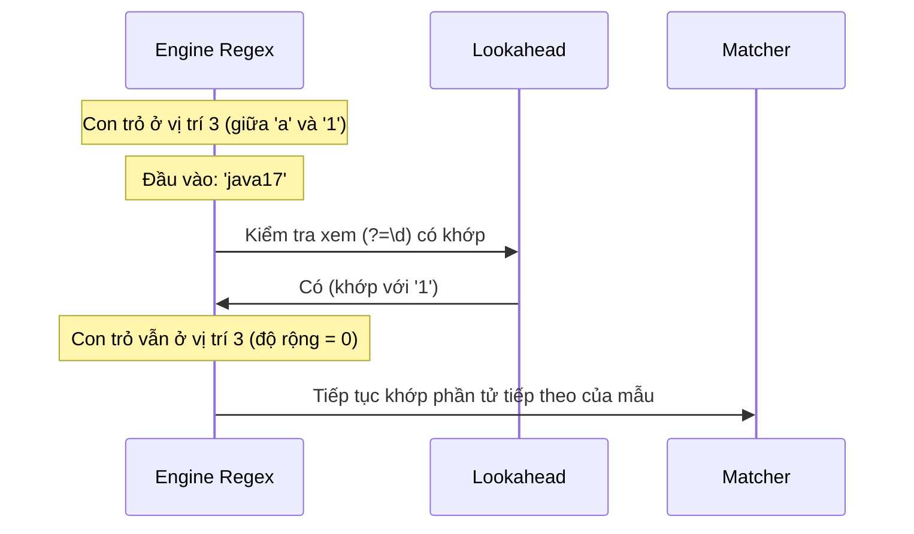

# Biểu Thức Chính Quy (Regular Expression) - Phần 2

## Mục Tiêu Học Tập

Tài liệu này tập trung vào một phần chuyên sâu của **Biểu Thức Chính Quy (Regular Expression)**. Hãy nghiên cứu từng khái niệm dưới dạng quy tắc thực tế trong Java, không chỉ đơn thuần là lý thuyết từ vựng.

## Tóm Tắt Nội Dung (Outline Coverage)

| Khái niệm (Concept) | Điều cần biết (What to know) |
| --- | --- |
| `Basic lookahead / lookbehind` | Lookahead và lookbehind là các khẳng định có độ rộng bằng không nhằm so khớp một vị trí mà không tiêu thụ các ký tự. |
| `Validate email, phone, password` | Các mẫu xác thực biểu mẫu bằng biểu thức chính quy, nhấn mạnh việc kiểm tra độ mạnh mật khẩu bằng lookaround. |
| `Replace using regex` | Thay thế chuỗi con bằng biểu thức chính quy thông qua `replaceAll()`, tham chiếu ngược (backreference) và các phương thức thay thế của Matcher. |
| `Split using regex` | Tách các chuỗi bằng biểu thức chính quy và xử lý các chuỗi rỗng ở cuối bằng cách sử dụng tham số limit. |

---

## Ghi Chú Chi Tiết

### Khái niệm Lookahead / Lookbehind Cơ bản

Lookaround (bao gồm lookahead và lookbehind) là các **khẳng định có độ rộng bằng không (Zero-width assertion)**. Chúng so khớp một vị trí cụ thể trong văn bản (giống như các biên `^` hoặc `$`), xác minh một điều kiện mà không thực sự tiêu thụ (di chuyển con trỏ qua) bất kỳ ký tự nào.

- **Lookahead (Nhìn về phía trước)**:
  - **Positive Lookahead `(?=pattern)` (Khẳng định nhìn về phía trước)**: Khẳng định rằng những gì theo sau ngay lập tức là `pattern`.
  - **Negative Lookahead `(?!pattern)` (Phủ định nhìn về phía trước)**: Khẳng định rằng những gì theo sau ngay lập tức KHÔNG phải là `pattern`.
- **Lookbehind (Nhìn về phía sau)**:
  - **Positive Lookbehind `(?<=pattern)` (Khẳng định nhìn về phía sau)**: Khẳng định rằng những gì đi trước ngay lập tức là `pattern`.
  - **Negative Lookbehind `(?<!pattern)` (Phủ định nhìn về phía sau)**: Khẳng định rằng những gì đi trước ngay lập tức KHÔNG phải là `pattern`.
- **Hạn chế của Lookbehind trong Java**: Trong công cụ regex của Java, lookbehind có hạn chế về độ dài. Không giống như lookahead có thể có độ dài tùy ý, các mẫu lookbehind phải có **độ dài tối đa** có thể xác định được tại thời điểm biên dịch (ví dụ: bạn không thể sử dụng các bộ định lượng không giới hạn như `*` hoặc `+`, nhưng bạn có thể sử dụng độ dài cố định hoặc bộ định lượng có giới hạn như `{1,5}`).

#### Ví dụ Code: Trích xuất các số có ký hiệu tiền tệ đi trước
```java
import java.util.regex.Pattern;
import java.util.regex.Matcher;

public class LookaroundExample {
    public static void main(String[] args) {
        String invoice = "Prices: $100, €50, and 20 items.";
        
        // Match digits that are preceded by $ or € (lookbehind)
        Pattern pattern = Pattern.compile("(?<=\\$|€)\\d+");
        Matcher matcher = pattern.matcher(invoice);
        
        while (matcher.find()) {
            System.out.println("Amount: " + matcher.group()); 
        }
        // Output:
        // Amount: 100
        // Amount: 50
    }
}
```

#### Lỗi thường gặp: Sử dụng bộ định lượng không giới hạn bên trong Lookbehind
```java
// SAI: Kích hoạt ngoại lệ PatternSyntaxException tại thời điểm biên dịch!
// Lookbehind không được có các bộ định lượng không giới hạn như '*' hoặc '+'
Pattern p = Pattern.compile("(?<=prefix.*)digits"); 
```

## Tại sao Lookaround là các Khẳng định có Độ rộng bằng Không (Zero-Width Assertion)

Các khẳng định lookahead và lookbehind được gọi là "độ rộng bằng không" vì chúng không tiêu thụ các ký tự trong chuỗi đầu vào trong quá trình thực thi. Thay vào đó, chúng hoạt động như các mỏ neo ảo hoặc các chốt kiểm tra logic để kiểm tra các ký tự sắp tới hoặc trước đó từ con trỏ so khớp hiện tại. Khi khẳng định thành công, con trỏ so khớp của công cụ regex vẫn giữ nguyên ở vị trí trước khi bắt đầu khẳng định. Điều này cho phép nhiều điều kiện được xác thực tại cùng một vị trí ký tự, điều này đặc biệt hữu ích cho việc kiểm tra các quy tắc phức tạp của mật khẩu.

#### Mô hình tư duy: Điều hướng Độ rộng bằng Không



#### Ví dụ Code: Khẳng định Không Tiêu thụ Ký tự

```java
import java.util.regex.*;

public class ZeroWidthDemo {
    public static void main(String[] args) {
        // (?=abc) checks for "abc" forward from start, but doesn't consume it.
        // The subsequent token 'a' then successfully matches the first character.
        Pattern p = Pattern.compile("(?=abc)a");
        Matcher m = p.matcher("abc");
        if (m.find()) {
            System.out.println("Matched: " + m.group()); // Matched: a (only 'a' is consumed)
            System.out.println("Start: " + m.start() + ", End: " + m.end()); // Start: 0, End: 1
        }
    }
}
```

#### Chuỗi Nguyên nhân - Kết quả

Công cụ regex đạt đến nhóm lookaround `(?=pattern)` &rarr; Tạm thời rẽ nhánh để đánh giá mẫu &rarr; Mẫu khớp thành công &rarr; Công cụ loại bỏ trạng thái của các ký tự đã khớp và khôi phục con trỏ &rarr; Tiếp tục so khớp regex chính từ vị trí ban đầu.

## Tại sao Lookbehind trong Java có Hạn chế về Độ rộng

Không giống như lookahead đọc về phía trước vào chuỗi chưa tiêu thụ còn lại, lookbehind yêu cầu công cụ regex phải lùi lại một bước trong bộ đệm đầu vào. Để triển khai thao tác lùi bước này một cách hiệu quả, trình biên dịch regex của Java phải tính toán trước phạm vi ký tự chính xác cần nhìn lại. Nếu mẫu lookbehind có độ rộng không giới hạn (chẳng hạn như sử dụng `*` hoặc `+`), công cụ sẽ không thể xác định tại thời điểm biên dịch số bước cần tua lại. Để ngăn ngừa hiệu năng chạy không thể đoán trước và các vấn đề điều hướng bộ đệm, công cụ regex của Java thực thi quy tắc độ dài cố định hoặc độ dài có giới hạn cho các biểu thức lookbehind, ném ra ngoại lệ `PatternSyntaxException` cho các lookbehind không giới hạn.

#### Mô hình tư duy: Hướng đi của Lookahead so với Lookbehind

```
Lookahead (?=abc)  ---> So khớp về phía trước trong chuỗi còn lại (chấp nhận độ dài tùy ý)
Đầu vào: [x][y][z][a][b][c]
               ^-- (Con trỏ đánh giá về phía trước)

Lookbehind (?<=abc) <-- Lùi lại các bước trong bộ đệm (yêu cầu độ rộng cố định hoặc có giới hạn)
Đầu vào: [a][b][c][x][y][z]
               ^-- (Con trỏ đánh giá về phía sau)
```

#### Ví dụ Code: Lookbehind Có giới hạn so với Không giới hạn

```java
import java.util.regex.*;

public class LookbehindLimitDemo {
    public static void main(String[] args) {
        // Lookbehind có giới hạn hoạt động trong Java (phạm vi độ dài đã biết: 1 đến 5)
        Pattern bounded = Pattern.compile("(?<=id=\\d{1,5})\\w+");
        System.out.println(bounded.matcher("id=123active").find()); // true
        
        try {
            // Lookbehind không giới hạn (sử dụng + hoặc *) sẽ thất bại khi biên dịch
            Pattern.compile("(?<=id=\\d+)\\w+");
        } catch (PatternSyntaxException e) {
            System.out.println("Compilation failed: " + e.getDescription()); // Look-behind group does not have an obvious maximum length
        }
    }
}
```

#### Chuỗi Nguyên nhân - Kết quả

Mẫu lookbehind được biên dịch &rarr; Công cụ kiểm tra xem độ rộng của mẫu có bị giới hạn hay không &rarr; Nếu không giới hạn (`*` hoặc `+`), kích thước bước lùi tối đa là vô hạn/không xác định &rarr; Ném ra `PatternSyntaxException` tại thời điểm biên dịch để ngăn chặn việc quét bộ nhớ không hiệu quả.

---

### Xác thực email, số điện thoại, mật khẩu

Xác thực là một trong những ứng dụng phổ biến nhất của biểu thức chính quy. Tuy nhiên, viết các mẫu quá lỏng lẻo hoặc quá nghiêm ngặt là một sai lầm kỹ thuật phổ biến.

- **Độ phức tạp của Mật khẩu**: Lookahead là lựa chọn hoàn hảo để xác thực mật khẩu vì chúng cho phép bạn kiểm tra nhiều điều kiện độc lập (ví dụ: chứa chữ hoa, chữ thường, chữ số) trên cùng một chuỗi bắt đầu từ điểm khởi đầu.
- **Xác thực Email**: Việc xác thực email thực tế (RFC 5322) quá phức tạp đối với regex tiêu chuẩn. Thông thường, các ứng dụng thực tế sử dụng các regex đơn giản hơn để kiểm tra cấu trúc `@` cơ bản, và để việc kiểm tra phân phát chính xác cho thư xác nhận.

#### Ví Dụ Thực Tế: Xác thực Độ mạnh Mật khẩu qua Lookahead
```java
import java.util.regex.Pattern;

public class PasswordValidator {
    // Quy tắc mật khẩu:
    // - Phải dài ít nhất 8 ký tự
    // - Phải chứa ít nhất một chữ số (?=.*[0-9])
    // - Phải chứa ít nhất một chữ thường (?=.*[a-z])
    // - Phải chứa ít nhất một chữ hoa (?=.*[A-Z])
    // - Phải chứa ít nhất một ký tự đặc biệt (?=.*[@#$%^&+=])
    private static final Pattern PASSWORD_PATTERN = Pattern.compile(
        "^(?=.*[0-9])(?=.*[a-z])(?=.*[A-Z])(?=.*[@#$%^&+=])(?=\\S+$).{8,}$"
    );

    public static boolean isValidPassword(String password) {
        if (password == null) return false;
        return PASSWORD_PATTERN.matcher(password).matches();
    }

    public static void main(String[] args) {
        System.out.println(isValidPassword("Weak12"));       // false (quá ngắn)
        System.out.println(isValidPassword("NoSpecial123")); // false (thiếu ký tự đặc biệt)
        System.out.println(isValidPassword("Str0ng#pass"));  // true
    }
}
```

---

### Thay thế bằng biểu thức chính quy (Replace using regex)

Java hỗ trợ thay thế các chuỗi con khớp với một regex thông qua các phương thức của String và Matcher.

- **`String.replaceAll(regex, replacement)`**: Thay thế mọi chuỗi con khớp với `regex` bằng `replacement`.
- **`String.replace(target, replacement)`**: **Không** sử dụng regex; nó thực hiện tìm kiếm và thay thế chuỗi ký tự thuần túy.
- **Tham chiếu ngược trong Thay thế**: Bạn có thể tham chiếu các nhóm đã chụp trong chuỗi thay thế bằng ký tự `$groupNumber` (ví dụ: `$1`).
- **Thay thế Nâng cao (`appendReplacement`/`appendTail`)**: Lớp `Matcher` cung cấp cơ chế thay thế dựa trên vòng lặp để tính toán động các chuỗi thay thế (ví dụ: chuyển văn bản thành chữ hoa, tính toán các biểu thức toán học).

#### Ví dụ Code: Hoán đổi từ bằng cách sử dụng Tham chiếu ngược của Nhóm chụp
```java
public class ReplaceGroup {
    public static void main(String[] args) {
        String text = "John Doe, Jane Smith";
        // Hoán đổi Ten Ho thành Ho, Ten
        String result = text.replaceAll("(\\w+)\\s+(\\w+)", "$2, $1");
        System.out.println(result); // Output: "Doe, John, Smith, Jane"
    }
}
```

#### Ví dụ Code: Thay thế Động với appendReplacement
```java
import java.util.regex.Pattern;
import java.util.regex.Matcher;

public class DynamicReplacement {
    public static void main(String[] args) {
        String text = "Double these numbers: 5 and 12";
        Pattern p = Pattern.compile("\\d+");
        Matcher m = p.matcher(text);
        
        StringBuilder sb = new StringBuilder();
        while (m.find()) {
            int val = Integer.parseInt(m.group());
            m.appendReplacement(sb, String.valueOf(val * 2));
        }
        m.appendTail(sb);
        System.out.println(sb.toString()); // Output: "Double these numbers: 10 and 24"
    }
}
```

---

### Tách chuỗi bằng biểu thức chính quy (Split using regex)

`String.split(regex)` tách chuỗi đầu vào xung quanh các kết quả khớp của biểu thức chính quy.

- **Lỗi Chuỗi rỗng ở Cuối**: Theo mặc định, `String.split(regex)` hoặc `String.split(regex, 0)` sẽ loại bỏ toàn bộ các chuỗi rỗng ở cuối.
- **Tham số Limit**:
  - `limit > 0`: Tách chuỗi tối đa `limit - 1` lần; phần tử cuối cùng chứa toàn bộ văn bản chưa tách còn lại.
  - `limit < 0`: Tách chuỗi nhiều lần nhất có thể, bảo toàn mọi chuỗi rỗng ở cuối.

#### Ví dụ Code: Các hành vi của Split Limit
```java
import java.util.Arrays;

public class SplitDemo {
    public static void main(String[] args) {
        String data = "apple,banana,,orange,,";
        
        // Tách mặc định (limit = 0): các chuỗi rỗng ở cuối bị loại bỏ
        String[] splitDefault = data.split(",");
        System.out.println("Default: " + Arrays.toString(splitDefault));
        // Output: [apple, banana, , orange] (length 4, trailing commas ignored)
        
        // Limit âm: bảo toàn tất cả các chuỗi rỗng ở cuối
        String[] splitAll = data.split(",", -1);
        System.out.println("Limit < 0: " + Arrays.toString(splitAll));
        // Output: [apple, banana, , orange, , ] (length 6)
        
        // Limit dương: tách tối đa thành 2 phần tử
        String[] splitTwo = data.split(",", 2);
        System.out.println("Limit = 2: " + Arrays.toString(splitTwo));
        // Output: [apple, banana,,orange,,] (length 2)
    }
}
```

#### Lỗi thường gặp: Tách chuỗi theo các ký tự đặc biệt của regex mà không escape
Tách chuỗi theo dấu chấm `.`, dấu gạch đứng `|`, hoặc dấu hỏi `?` trực tiếp mà không escape, vì chúng là các ký tự đặc biệt đang hoạt động của regex.
```java
String ip = "192.168.1.1";
// SAI: tách theo "bất kỳ ký tự nào", trả về mảng rỗng!
String[] bad = ip.split("."); 

// ĐÚNG: escape dấu chấm
String[] good = ip.split("\\."); 
```

## Tại sao String.split Loại bỏ các Chuỗi rỗng ở Cuối

Theo mặc định, phương thức `String.split(regex)` hoặc `String.split(regex, 0)` của Java được thiết kế để mang lại sự tiện lợi, giả định rằng các đoạn trống ở cuối do các dấu phân cách liên tiếp tạo ra là nhiễu không mong muốn (ví dụ: phân tích cú pháp danh sách phân tách bằng dấu phẩy có dấu phẩy ở cuối). Để làm điều này, công cụ regex tách chuỗi hoàn toàn, nhưng sau đó thực hiện một bước dọn dẹp hậu xử lý để cắt bỏ bất kỳ chuỗi rỗng nào ở cuối khỏi mảng kết quả. Khi bạn cần bảo toàn tất cả các trường—chẳng hạn như khi phân tích cú pháp các bản ghi CSV nơi một chuỗi rỗng ở cuối đại diện cho một ô cơ sở dữ liệu trống—bạn phải truyền một tham số giới hạn âm (chẳng hạn như `-1`). Giới hạn âm này hướng dẫn công cụ tách nhiều lần nhất có thể và bỏ qua bước cắt bỏ chuỗi trống ở cuối.

#### Mô hình tư duy: Limit Mặc định so với Limit Âm

```
Đầu vào: "A,B,,"

Tách mặc định split(",") hoặc split(",", 0):
Bước 1: Khớp các dấu phân cách -> ["A", "B", "", ""]
Bước 2: Dọn dẹp các phần tử rỗng ở cuối -> ["A", "B"]

Tách với limit âm split(",", -1):
Bước 1: Khớp các dấu phân cách -> ["A", "B", "", ""]
Bước 2: Trả về trực tiếp mảng -> ["A", "B", "", ""]
```

#### Ví dụ Code: So sánh Mảng được Tách

```java
import java.util.Arrays;

public class SplitExplanation {
    public static void main(String[] args) {
        String input = "name,age,,";
        
        // Loại bỏ các phần tử rỗng ở cuối
        String[] defaultSplit = input.split(",");
        System.out.println(Arrays.toString(defaultSplit)); // [name, age]
        
        // Bảo toàn tất cả các phần tử rỗng
        String[] rawSplit = input.split(",", -1);
        System.out.println(Arrays.toString(rawSplit)); // [name, age, , ]
    }
}
```

#### Chuỗi Nguyên nhân - Kết quả

Dấu phân cách khớp ở cuối đầu vào &rarr; Công cụ tạo phần tử mảng chuỗi rỗng &rarr; Limit mặc định (`0`) kích hoạt quét sau khi tách &rarr; Cắt bỏ các chuỗi rỗng liên tiếp ở cuối &rarr; Limit âm (`-1`) bỏ qua quét sau khi tách &rarr; Toàn bộ các phần tử mảng được bảo toàn.

---

## Liên kết Tham khảo

- https://docs.oracle.com/en/java/javase/21/docs/api/java.base/java/lang/String.html#split(java.lang.String,int) (Tài liệu String.split Java)
- https://docs.oracle.com/javase/tutorial/essential/regex/bounds.html (Tài liệu Boundary Matchers Oracle Java Tutorial)

---

## Các Câu Hỏi Ôn Tập Thường Gặp

- **Lookaround ảnh hưởng đến hiệu năng so khớp như thế nào?**
  Việc sử dụng quá nhiều lookaround lồng nhau có thể gây suy giảm hiệu năng vì công cụ phải kiểm tra các khẳng định tại mọi chỉ số ứng viên. Hãy giữ cho lookaround đơn giản.
- **Tại sao lookbehind bị giới hạn ở độ rộng có giới hạn trong Java?**
  Không giống như lookahead (tìm kiếm về phía trước trong văn bản chưa đọc), việc nhìn về phía sau yêu cầu lùi lại trong bộ đệm so khớp. Để giữ hiệu quả, trình biên dịch regex phải biết chính xác khoảng cách cần nhìn lại, ngăn chặn các bộ định lượng regex tùy ý như `*` hoặc `+`.
- **Làm thế nào chúng ta có thể bảo toàn tất cả các trường trống khi phân tích cú pháp dữ liệu CSV bằng split?**
  Truyền một số nguyên giới hạn âm (ví dụ: `-1`) làm đối số thứ hai cho `String.split(regex, limit)`.
