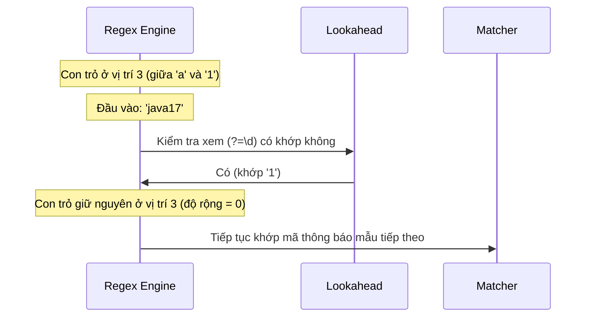

# Biểu thức chính quy (Regular Expression) - Phần 2

## Mục tiêu học tập (Learning Goal)

Tệp này bao gồm một phần tập trung của **Biểu thức chính quy (Regular Expression)**. Hãy nghiên cứu từng khái niệm như một quy tắc Java thực tế, không phải là từ vựng cô lập.

## Đề cương chi tiết (Outline Coverage)

| Khái niệm (Concept) | Những điều cần biết (What to know) |
| --- | --- |
| `Basic lookahead / lookbehind` | Lookahead (nhìn trước) và lookbehind (nhìn sau) là các khẳng định độ rộng bằng không (zero-width assertions) nhằm khớp với một vị trí mà không tiêu thụ ký tự nào. |
| `Validate email, phone, password` | Các mẫu xác thực biểu mẫu bằng regex, nhấn mạnh việc kiểm tra độ mạnh của mật khẩu với lookarounds. |
| `Replace using regex` | Thay thế các chuỗi con bằng regex thông qua `replaceAll()`, tham chiếu ngược (backreferences), và các phương thức thay thế của `Matcher`. |
| `Split using regex` | Phân tách các chuỗi bằng regex và xử lý các chuỗi trống ở cuối bằng tham số giới hạn (limit). |

---

## Chi tiết tài liệu học tập (Detailed Notes)

### Lookahead / lookbehind cơ bản

Lookarounds (gồm lookahead và lookbehind) là các **khẳng định độ rộng bằng không (zero-width assertions)**. Chúng khớp với một vị trí cụ thể trong văn bản (như ranh giới `^` hoặc `$`), xác thực một điều kiện mà không thực sự tiêu thụ (di chuyển con trỏ qua) bất kỳ ký tự nào.

- **Lookahead (Nhìn trước)**:
  - **Positive Lookahead (Nhìn trước khẳng định) `(?=pattern)`**: Khẳng định rằng phần theo sau ngay lập tức là `pattern`.
  - **Negative Lookahead (Nhìn trước phủ định) `(?!pattern)`**: Khẳng định rằng phần theo sau ngay lập tức KHÔNG phải là `pattern`.
- **Lookbehind (Nhìn sau)**:
  - **Positive Lookbehind (Nhìn sau khẳng định) `(?<=pattern)`**: Khẳng định rằng phần đi trước ngay lập tức là `pattern`.
  - **Negative Lookbehind (Nhìn sau phủ định) `(?<!pattern)`**: Khẳng định rằng phần đi trước ngay lập tức KHÔNG phải là `pattern`.
- **Giới hạn Lookbehind trong Java (Java Lookbehind Limitation)**: Trong công cụ regex của Java, lookbehinds bị hạn chế về độ dài. Không giống như lookaheads vốn có thể có độ dài tùy ý, các mẫu lookbehind phải có **độ dài tối đa** có thể xác định được tại thời điểm biên dịch (ví dụ: bạn không thể sử dụng các bộ định lượng không giới hạn như `*` hoặc `+`, nhưng bạn có thể sử dụng độ dài cố định hoặc các bộ định lượng có giới hạn như `{1,5}`).

#### Ví dụ mã nguồn: Trích xuất các số đi sau ký hiệu tiền tệ (Code Example: Extracting Numbers Preceded by Currency Symbols)
```java
import java.util.regex.Pattern;
import java.util.regex.Matcher;

public class LookaroundExample {
    public static void main(String[] args) {
        String invoice = "Prices: $100, €50, and 20 items.";
        
        // Match digits that are preceded by $ or € (lookbehind)
        Pattern pattern = Pattern.compile("(?<=\\$|€)\\d+");
        Matcher matcher = pattern.matcher(invoice);
        
        while (matcher.find()) {
            System.out.println("Amount: " + matcher.group()); 
        }
        // Output:
        // Amount: 100
        // Amount: 50
    }
}
```

#### Sai lầm thường gặp: Sử dụng các bộ định lượng không giới hạn bên trong Lookbehinds (Common Mistake: Using unbounded quantifiers inside Lookbehinds)
```java
// BAD: Triggers PatternSyntaxException at compile time!
// Lookbehinds cannot have unbounded quantifiers like '*' or '+'
Pattern p = Pattern.compile("(?<=prefix.*)digits"); 
```

## Tại sao Lookarounds là các khẳng định độ rộng bằng không (Why Lookarounds are Zero-Width Assertions)

Các khẳng định nhìn trước (lookahead) và nhìn sau (lookbehind) được gọi là "độ rộng bằng không" (zero-width) vì chúng không tiêu thụ các ký tự trong luồng đầu vào khi thực thi. Thay vào đó, chúng hoạt động như các mỏ neo ảo hoặc các điểm kiểm tra logic để kiểm tra các ký tự sắp tới hoặc đi trước từ con trỏ khớp hiện tại. Một khi khẳng định thành công, con trỏ khớp của công cụ regex vẫn giữ nguyên ở vị trí trước khi khẳng định bắt đầu. Điều này cho phép nhiều điều kiện được xác thực tại cùng một vị trí ký tự, điều này cực kỳ hữu ích cho việc kiểm tra các quy tắc phức tạp của mật khẩu.

#### Mô hình tư duy: Điều hướng độ rộng bằng không (Zero-Width Navigation)



#### Ví dụ mã nguồn: Khẳng định mà không tiêu thụ ký tự (Asserting Without Consuming)

```java
import java.util.regex.*;

public class ZeroWidthDemo {
    public static void main(String[] args) {
        // (?=abc) checks for "abc" forward from start, but doesn't consume it.
        // The subsequent token 'a' then successfully matches the first character.
        Pattern p = Pattern.compile("(?=abc)a");
        Matcher m = p.matcher("abc");
        if (m.find()) {
            System.out.println("Matched: " + m.group()); // Matched: a (only 'a' is consumed)
            System.out.println("Start: " + m.start() + ", End: " + m.end()); // Start: 0, End: 1
        }
    }
}
```

#### Chuỗi nguyên nhân - kết quả (Cause-Effect Chain)


```text
Công cụ tiếp cận nhóm lookaround `(?=pattern)`
  → Tạm thời rẽ nhánh để đánh giá mẫu
  → Mẫu khớp thành công
  → Công cụ loại bỏ trạng thái của các ký tự đã khớp và khôi phục con trỏ
  → Tiếp tục khớp regex chính từ vị trí ban đầu.
```


## Tại sao Lookbehinds trong Java có giới hạn độ rộng (Why Java Lookbehinds Have Width Limitations)

Không giống như lookaheads đọc tiếp vào phần chuỗi chưa được tiêu thụ phía trước, lookbehinds yêu cầu công cụ regex lùi lại trong bộ đệm đầu vào. Để triển khai thao tác lùi lại này một cách hiệu quả, trình biên dịch regex của Java phải tính toán trước phạm vi chính xác của các ký tự mà nó cần lùi lại để kiểm tra. Nếu mẫu lookbehind có độ rộng không giới hạn (như sử dụng `*` hoặc `+`), công cụ không thể xác định tại thời điểm biên dịch xem cần tua lại bao nhiêu bước. Để ngăn ngừa hiệu suất lúc chạy không thể dự đoán và các vấn đề điều hướng bộ đệm, công cụ regex của Java áp đặt một quy tắc độ dài cố định hoặc độ dài có giới hạn cho các biểu thức lookbehind, ném ra ngoại lệ `PatternSyntaxException` đối với các lookbehind không giới hạn.

#### Mô hình tư duy: Hướng của Lookahead so với Lookbehind (Lookahead vs. Lookbehind Directions)

```
Lookahead (?=abc)  ---> Khớp về phía trước trong luồng còn lại (độ dài tùy ý OK)
Input: [x][y][z][a][b][c]
               ^-- (Con trỏ đánh giá về phía trước)

Lookbehind (?<=abc) <-- Lùi lại trong bộ đệm (yêu cầu độ rộng cố định hoặc có giới hạn)
Input: [a][b][c][x][y][z]
               ^-- (Con trỏ đánh giá về phía sau)
```

#### Ví dụ mã nguồn: Lookbehind có giới hạn so với không giới hạn (Bounded vs. Unbounded Lookbehinds)

```java
import java.util.regex.*;

public class LookbehindLimitDemo {
    public static void main(String[] args) {
        // Bounded lookbehinds work in Java (length range is known: 1 to 5)
        Pattern bounded = Pattern.compile("(?<=id=\\d{1,5})\\w+");
        System.out.println(bounded.matcher("id=123active").find()); // true
        
        try {
            // Unbounded lookbehinds (using + or *) will fail compilation
            Pattern.compile("(?<=id=\\d+)\\w+");
        } catch (PatternSyntaxException e) {
            System.out.println("Compilation failed: " + e.getDescription()); // Look-behind group does not have an obvious maximum length
        }
    }
}
```

#### Chuỗi nguyên nhân - kết quả (Cause-Effect Chain)


```text
Mẫu lookbehind được biên dịch
  → Công cụ kiểm tra xem độ rộng mẫu có bị giới hạn không
  → Nếu không giới hạn (`*` hoặc `+`), kích thước lùi lại tối đa là vô hạn/không xác định
  → Ném ra `PatternSyntaxException` tại thời điểm biên dịch để ngăn chặn việc quét bộ nhớ kém hiệu quả.
```


---

### Xác thực email, số điện thoại, mật khẩu (Validate email, phone, password)

Xác thực là một trong những ứng dụng phổ biến nhất của biểu thức chính quy. Tuy nhiên, việc viết các mẫu quá lỏng lẻo hoặc quá nghiêm ngặt là một lỗi kỹ thuật thường gặp.

- **Độ phức tạp của mật khẩu (Password Complexity)**: Lookaheads rất hoàn hảo cho việc xác thực mật khẩu vì chúng cho phép bạn kiểm tra nhiều điều kiện độc lập (ví dụ: chứa chữ hoa, chữ thường, chữ số) trên cùng một chuỗi bắt đầu từ đầu.
- **Xác thực Email (Email Validation)**: Việc xác thực email thực tế (RFC 5322) quá phức tạp đối với regex tiêu chuẩn. Thông thường, các ứng dụng production sử dụng các regex đơn giản hơn để kiểm tra cấu trúc `@` cơ bản, để lại việc kiểm tra phân phát chính xác cho các email xác thực.

#### Tình huống nghiên cứu: Xác thực độ mạnh của mật khẩu thông qua Lookahead (Case Study: Password Strength Validation via Lookahead)
```java
import java.util.regex.Pattern;

public class PasswordValidator {
    // Password rules:
    // - Must be at least 8 characters long
    // - Must contain at least one digit (?=.*[0-9])
    // - Must contain at least one lowercase letter (?=.*[a-z])
    // - Must contain at least one uppercase letter (?=.*[A-Z])
    // - Must contain at least one special character (?=.*[@#$%^&+=])
    private static final Pattern PASSWORD_PATTERN = Pattern.compile(
        "^(?=.*[0-9])(?=.*[a-z])(?=.*[A-Z])(?=.*[@#$%^&+=])(?=\\S+$).{8,}$"
    );

    public static boolean isValidPassword(String password) {
        if (password == null) return false;
        return PASSWORD_PATTERN.matcher(password).matches();
    }

    public static void main(String[] args) {
        System.out.println(isValidPassword("Weak12"));       // false (too short)
        System.out.println(isValidPassword("NoSpecial123")); // false (no special char)
        System.out.println(isValidPassword("Str0ng#pass"));  // true
    }
}
```

---

### Thay thế bằng regex (Replace using regex)

Java hỗ trợ thay thế các chuỗi con khớp với một regex thông qua các phương thức của String và Matcher.

- **`String.replaceAll(regex, replacement)`**: Thay thế mọi chuỗi con khớp với `regex` bằng `replacement`.
- **`String.replace(target, replacement)`**: **Không** sử dụng regex; nó thực hiện tìm kiếm và thay thế chính xác (literal) trên các chuỗi ký tự.
- **Tham chiếu ngược khi thay thế (Backreferences in Replacement)**: Bạn có thể tham chiếu đến các nhóm đã thu giữ trong chuỗi thay thế bằng cách sử dụng `$groupNumber` (ví dụ: `$1`).
- **Thay thế nâng cao (`appendReplacement`/`appendTail`)**: `Matcher` cung cấp cơ chế thay thế dựa trên vòng lặp để tính toán động nội dung thay thế (ví dụ: chuyển văn bản thành chữ hoa, đánh giá các biểu thức toán học).

#### Ví dụ mã nguồn: Hoán đổi từ bằng cách sử dụng tham chiếu ngược nhóm thu giữ (Code Example: Swapping Words using Capturing Group Backreferences)
```java
public class ReplaceGroup {
    public static void main(String[] args) {
        String text = "John Doe, Jane Smith";
        // Swaps FirstName LastName to LastName, FirstName
        String result = text.replaceAll("(\\w+)\\s+(\\w+)", "$2, $1");
        System.out.println(result); // Output: "Doe, John, Smith, Jane"
    }
}
```

#### Ví dụ mã nguồn: Thay thế động với appendReplacement (Code Example: Dynamic Replacements with appendReplacement)
```java
import java.util.regex.Pattern;
import java.util.regex.Matcher;

public class DynamicReplacement {
    public static void main(String[] args) {
        String text = "Double these numbers: 5 and 12";
        Pattern p = Pattern.compile("\\d+");
        Matcher m = p.matcher(text);
        
        StringBuilder sb = new StringBuilder();
        while (m.find()) {
            int val = Integer.parseInt(m.group());
            m.appendReplacement(sb, String.valueOf(val * 2));
        }
        m.appendTail(sb);
        System.out.println(sb.toString()); // Output: "Double these numbers: 10 and 24"
    }
}
```

---

### Phân tách bằng regex (Split using regex)

`String.split(regex)` phân tách chuỗi đầu vào xung quanh các kết quả khớp của biểu thức chính quy.

- **Điểm lưu ý về chuỗi trống ở cuối (Trailing Empty Strings Gotcha)**: Theo mặc định, `String.split(regex)` hoặc `String.split(regex, 0)` loại bỏ tất cả các chuỗi trống ở cuối.
- **Tham chiếu giới hạn (Limit)**:
  - `limit > 0`: Phân tách chuỗi tối đa `limit - 1` lần; phần tử cuối cùng chứa toàn bộ văn bản chưa phân tách còn lại.
  - `limit < 0`: Phân tách chuỗi nhiều lần nhất có thể, bảo toàn tất cả các chuỗi trống ở cuối.

#### Ví dụ mã nguồn: Hành vi của tham số giới hạn Split (Code Example: Split Limit Behaviors)
```java
import java.util.Arrays;

public class SplitDemo {
    public static void main(String[] args) {
        String data = "apple,banana,,orange,,";
        
        // Default split (limit = 0): trailing empty strings are discarded
        String[] splitDefault = data.split(",");
        System.out.println("Default: " + Arrays.toString(splitDefault));
        // Output: [apple, banana, , orange] (length 4, trailing commas ignored)
        
        // Negative limit: preserves all trailing empty strings
        String[] splitAll = data.split(",", -1);
        System.out.println("Limit < 0: " + Arrays.toString(splitAll));
        // Output: [apple, banana, , orange, , ] (length 6)
        
        // Positive limit: splits into at most 2 elements
        String[] splitTwo = data.split(",", 2);
        System.out.println("Limit = 2: " + Arrays.toString(splitTwo));
        // Output: [apple, banana,,orange,,] (length 2)
    }
}
```

#### Sai lầm thường gặp: Phân tách dựa trên các ký tự đặc biệt của regex mà không thoát ký tự (Common Mistake: Splitting on regex special characters without escaping)
Phân tách dựa trên các ký tự đặc biệt như dấu chấm `.`, gạch đứng `|`, hoặc dấu chấm hỏi `?` trực tiếp mà không thoát ký tự, vì chúng là các siêu ký tự (metacharacters) regex đang hoạt động.
```java
String ip = "192.168.1.1";
// BAD: splits on "any character", returning an empty array!
String[] bad = ip.split("."); 

// CORRECT: escape the dot
String[] good = ip.split("\\."); 
```

## Tại sao String.split loại bỏ các chuỗi trống ở cuối (Why String.split Discards Trailing Empty Strings)

Theo mặc định, phương thức `String.split(regex)` hoặc `String.split(regex, 0)` của Java được thiết kế để mang lại sự tiện lợi, giả định rằng các phân đoạn trống ở cuối do các bộ phân tách liên tiếp tạo ra là các dữ liệu nhiễu không mong muốn (ví dụ: phân tích cú pháp các danh sách phân tách bằng dấu phẩy có các dấu phẩy ở cuối). Để làm được điều này, công cụ regex sẽ phân tách hoàn toàn chuỗi, nhưng sau đó thực hiện một bước dọn dẹp hậu xử lý để cắt bớt bất kỳ chuỗi trống nào ở cuối khỏi mảng kết quả. Khi bạn cần bảo toàn tất cả các trường — chẳng hạn như khi phân tích cú pháp các bản ghi CSV nơi chuỗi trống ở cuối đại diện cho một ô cơ sở dữ liệu trống — bạn phải truyền một tham số giới hạn âm (như `-1`). Giới hạn âm này hướng dẫn công cụ phân tách nhiều lần nhất có thể và bỏ qua bước cắt bớt chuỗi trống ở cuối.

#### Mô hình tư duy: Giới hạn mặc định so với Giới hạn âm (Default Limit vs. Negative Limit)

```
Input: "A,B,,"

Phân tách mặc định split(",") hoặc split(",", 0):
Bước 1: Khớp bộ phân tách -> ["A", "B", "", ""]
Bước 2: Dọn dẹp các phần tử trống ở cuối -> ["A", "B"]

Giới hạn âm split(",", -1):
Bước 1: Khớp bộ phân tách -> ["A", "B", "", ""]
Bước 2: Trả về trực tiếp mảng -> ["A", "B", "", ""]
```

#### Ví dụ mã nguồn: So sánh mảng phân tách (Split Array Comparison)

```java
import java.util.Arrays;

public class SplitExplanation {
    public static void main(String[] args) {
        String input = "name,age,,";
        
        // Discards trailing empty elements
        String[] defaultSplit = input.split(",");
        System.out.println(Arrays.toString(defaultSplit)); // [name, age]
        
        // Preserves all empty elements
        String[] rawSplit = input.split(",", -1);
        System.out.println(Arrays.toString(rawSplit)); // [name, age, , ]
    }
}
```

#### Chuỗi nguyên nhân - kết quả (Cause-Effect Chain)


```text
Bộ phân tách khớp ở cuối đầu vào
  → Công cụ tạo phần tử mảng chuỗi trống
  → Giới hạn mặc định (`0`) kích hoạt quét sau phân tách
  → Cắt bớt các chuỗi trống liên tiếp ở cuối
  → Giới hạn âm (`-1`) bỏ qua quét sau phân tách
  → Tất cả các phần tử mảng được bảo toàn.
```


## Liên kết tham khảo (Reference Links)

- https://docs.oracle.com/en/java/javase/21/docs/api/java.base/java/lang/String.html#split(java.lang.String,int) (String.split Java Documentation)
- https://docs.oracle.com/javase/tutorial/essential/regex/bounds.html (Boundary Matchers Oracle Java Tutorial)


---

## Các câu hỏi ôn tập thường gặp (Common Review Prompts)

- **Lookarounds ảnh hưởng đến hiệu suất khớp như thế nào?**
  Lạm dụng các lookaround lồng nhau có thể gây giảm hiệu suất vì công cụ phải kiểm tra các khẳng định tại mọi vị trí chỉ số tiềm năng. Hãy giữ các lookaround đơn giản.
- **Tại sao lookbehinds bị giới hạn ở độ dài cố định trong Java?**
  Khác với lookaheads (tìm kiếm về phía trước vào văn bản chưa đọc), nhìn sau yêu cầu lùi lại vào bộ đệm khớp. Để giữ điều này hiệu quả, trình biên dịch regex phải biết chính xác mức độ cần lùi lại, ngăn chặn việc sử dụng các bộ định lượng regex tùy ý như `*` hoặc `+`.
- **Làm thế nào để bảo toàn tất cả các trường trống khi phân tách dữ liệu CSV bằng split?**
  Truyền một số nguyên giới hạn âm (ví dụ: `-1`) làm đối số thứ hai cho `String.split(regex, limit)`.
