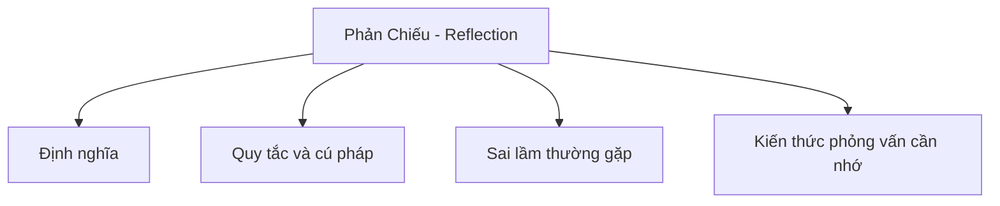

# 31 - Phản Chiếu (Reflection)

Chủ đề này bám sát đề cương chính trong [outline.md](../outline.md). Mục tiêu là hiểu sâu sắc từng khái niệm để có thể giải thích, nhận biết trong mã nguồn và trả lời các câu hỏi phỏng vấn.

## Thứ Tự Học Tập

- [Khái niệm Phản chiếu là gì](theory/01-what-is-reflection-concepts.md)
- [Khái niệm Ưu và nhược điểm của Phản chiếu](theory/02-advantages-and-disadvantages-of-reflection-concepts.md)
- [Thuật Ngữ Khóa](terms/01-key-terms.md)

## Danh Sách Nội Dung

- Phản chiếu (Reflection) là gì?
- Class<?>
- Lấy thông tin lớp
- Lấy trường (field)
- Lấy phương thức (method)
- Lấy hàm khởi tạo (constructor)
- Gọi phương thức bằng phản chiếu
- Tạo đối tượng bằng phản chiếu
- Truy cập trường/phương thức private
- Annotation + phản chiếu
- Ưu điểm và nhược điểm của phản chiếu
- Phản chiếu trong các khung công tác (framework) như Spring

## Tự Kiểm Tra

1. Tại sao phản chiếu lại bỏ qua tính an toàn kiểu dữ liệu tại thời điểm biên dịch (compile-time type safety), và các cơ chế cũng như rủi ro của việc phân giải metadata động tại thời điểm chạy (runtime) là gì?
2. Tại sao phản chiếu lại gây ra tổn thất hiệu năng đáng kể so với thực thi mã byte (bytecode) trực tiếp, và các MethodHandle hoặc kỹ thuật lưu đệm điểm gọi (call-site caching) có thể tối ưu hóa điều này như thế nào?
3. Tại sao `setAccessible(true)` có thể bỏ qua các kiểm soát khả thị truy cập của Java, và JVM Security Manager cùng Hệ thống Mô-đun Java (Jigsaw) hạn chế hành vi này như thế nào?
4. Tại sao việc tải lớp động (dynamic classloading) và khởi tạo đối tượng bằng phản chiếu lại gây ra các rủi ro nghiêm trọng về bảo mật và tính ổn định (chẳng hạn như giải tuần tự hóa không an toàn - unsafe deserialization), và làm thế nào để giảm thiểu chúng?
5. Tại sao phản chiếu là nhân tố kích hoạt quan trọng cho các khung công tác Tiêm phụ thuộc (Dependency Injection - DI) và Ánh xạ Đối tượng - Quan hệ (Object-Relational Mapping - ORM) hiện đại, và cách chúng sử dụng các chú thích (annotation) siêu dữ liệu để quản lý vòng đời đối tượng như thế nào?

## Thẻ Anki

- [Basic](anki/basic.tsv)
- [Basic Extra](anki/basic-extra.tsv)
- [Cloze](anki/cloze.tsv)
- [Code Question](anki/code-question.tsv)

## Sơ Đồ Mermaid Tổng Quan

## Liên Kết Tham Khảo

- https://docs.oracle.com/javase/tutorial/reflect/
- https://docs.oracle.com/en/java/javase/21/docs/api/java.base/java/lang/reflect/package-summary.html
