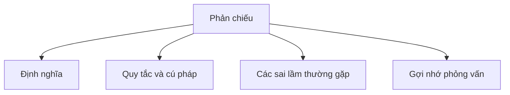

# 31 - Phản chiếu (Reflection)

Chủ đề này tuân theo đề cương tổng thể trong [outline.md](../outline.md). Mục tiêu là hiểu sâu sắc từng khái niệm để có thể giải thích, nhận biết trong mã nguồn và trả lời các câu hỏi phỏng vấn.

## Thứ tự học tập (Study Order)

- [Khái niệm Phản chiếu (What Is Reflection Concepts)](theory/01-what-is-reflection-concepts.md)
- [Ưu nhược điểm của Khái niệm Phản chiếu (Advantages And Disadvantages Of Reflection Concepts)](theory/02-advantages-and-disadvantages-of-reflection-concepts.md)
- [Thuật ngữ khóa (Key Terms)](terms/01-key-terms.md)

## Danh sách kiểm tra đề cương (Outline Checklist)

- Phản chiếu (Reflection) là gì?
- `Class<?>`
- Lấy thông tin của lớp (Get class information)
- Lấy thuộc tính (Get field)
- Lấy phương thức (Get method)
- Lấy hàm khởi tạo (Get constructor)
- Gọi phương thức bằng phản chiếu (Invoke method using reflection)
- Tạo đối tượng bằng phản chiếu (Create object using reflection)
- Truy cập thuộc tính/phương thức private (Access private field/method)
- Annotation kết hợp phản chiếu (Annotation + reflection)
- Ưu điểm và nhược điểm của phản chiếu
- Phản chiếu trong các khung công tác như Spring (Reflection in frameworks such as Spring)

## Tự kiểm tra (Self-Check)

1. Tại sao phản chiếu bỏ qua tính an toàn kiểu ở thời điểm biên dịch (compile-time type safety), và các cơ chế cũng như rủi ro của việc giải quyết siêu dữ liệu động (dynamic metadata resolution) lúc chạy là gì?
2. Tại sao phản chiếu tạo ra tổn thất hiệu suất đáng kể so với thực thi mã máy trực tiếp (direct bytecode execution), và làm thế nào `MethodHandles` hoặc lưu đệm điểm gọi (call-site caching) có thể tối ưu hóa điều này?
3. Tại sao `setAccessible(true)` có thể bỏ qua các kiểm soát hiển thị truy cập (access visibility controls) của Java, và làm thế nào Trình quản lý bảo mật JVM (JVM Security Managers) và Hệ thống mô-đun Java (Jigsaw) hạn chế hành vi này?
4. Tại sao việc tải lớp động (dynamic classloading) và khởi tạo bằng phản chiếu có thể gây ra rủi ro bảo mật và độ ổn định nghiêm trọng (như giải tuần tự hóa không an toàn — unsafe deserialization), và làm thế nào để giảm thiểu chúng?
5. Tại sao phản chiếu là yếu tố hỗ trợ cốt lõi cho các khung công tác Tiêm phụ thuộc (Dependency Injection — DI) và Ánh xạ quan hệ đối tượng (Object-Relational Mapping — ORM) hiện đại, và làm thế nào chúng sử dụng siêu dữ liệu chú thích (metadata annotations) để quản lý vòng đời đối tượng?

## Thẻ Anki (Anki Cards)

- [Cơ bản (Basic)](anki/basic.tsv)
- [Cơ bản mở rộng (Basic Extra)](anki/basic-extra.tsv)
- [Điền vào chỗ trống (Cloze)](anki/cloze.tsv)
- [Câu hỏi mã nguồn (Code Question)](anki/code-question.tsv)

## Sơ đồ Mermaid tổng quan (Mermaid Overview)

## Liên kết tham khảo (Reference Links)

- https://docs.oracle.com/javase/tutorial/reflect/
- https://docs.oracle.com/en/java/javase/21/docs/api/java.base/java/lang/reflect/package-summary.html
