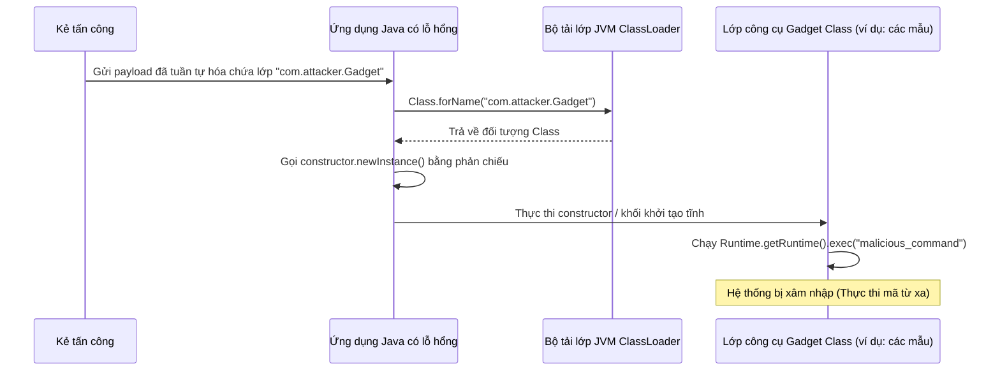

# Phản chiếu (Reflection) - Phần 2

## Mục tiêu học tập (Learning Goal)

Tệp này bao gồm một phần tập trung của **Phản chiếu (Reflection)**. Hãy nghiên cứu từng khái niệm như một quy tắc Java thực tế, không phải là từ vựng cô lập.

## Đề cương chi tiết (Outline Coverage)

| Khái niệm (Concept) | Những điều cần biết (What to know) |
| --- | --- |
| `Advantages and disadvantages of reflection` | Các sự đánh đổi quan trọng của phản chiếu liên quan đến hiệu suất, đóng gói thiết kế, và khả năng mở rộng. |
| `Reflection in frameworks such as Spring` | Cách các khung công tác doanh nghiệp (enterprise frameworks) hiện đại sử dụng phản chiếu để đạt được Tiêm phụ thuộc (Dependency Injection - DI) và hành vi động. |

---

## Chi tiết tài liệu học tập (Detailed Notes)

### Ưu điểm và nhược điểm của phản chiếu

Phản chiếu là một con dao hai lưỡi. Mặc dù nó cung cấp tính linh hoạt vô song lúc chạy, nó lại đi kèm với những chi phí rất lớn.

#### Ưu điểm
1. **Khả năng mở rộng (Extensibility)**: Các ứng dụng có thể tải động các tiện ích mở rộng (plugins) hoặc các mô-đun của bên thứ ba theo tên mà không cần biên dịch lại tĩnh.
2. **Tách biệt khung công tác (Framework Decoupling)**: Cho phép viết mã nguồn chung hoạt động trên các lớp tùy ý (ví dụ: bộ tuần tự hóa JSON, bộ dựng truy vấn JDBC).
3. **Công cụ phong phú (Rich Tooling)**: Cung cấp sức mạnh cho các tính năng của IDE, trình kiểm tra mã nguồn, các proxy động, các thư viện mô phỏng (Mockito), và các bộ chạy kiểm thử (JUnit).

#### Nhược điểm
1. **Chi phí hiệu suất lớn (Performance Overhead)**:
   - **Không có tối ưu hóa của trình biên dịch**: Trình biên dịch JIT không thể nội tuyến (inline) các lệnh gọi phương thức phản chiếu hoặc tối ưu hóa việc tra cứu thuộc tính.
   - **Kiểm tra kiểu động**: Các đối số phải được kiểm tra, ngoại lệ đã kiểm tra (checked exceptions) phải được xác thực, và quyền hiển thị truy cập phải được kiểm tra trên mỗi lệnh gọi.
   - **Bao bọc đối tượng (Object Wrapping)**: Các đối số nguyên thủy và giá trị trả về phải được chuyển đổi kiểu hộp (box/unbox), tạo ra chi phí bổ sung cho bộ thu gom rác (Garbage collection) (GC).
2. **Mất tính an toàn kiểu ở thời điểm biên dịch (Loss of Compile-time Safety)**: Các lỗi thông thường sẽ gây thất bại khi biên dịch (như viết sai chính tả tên thuộc tính hoặc tên lớp) được trì hoãn đến thời điểm chạy dưới dạng các ngoại lệ.
3. **Bỏ qua đóng gói (Bypassing Encapsulation)**: Truy cập các thuộc tính hoặc phương thức private làm phá vỡ các bất biến lớp, khiến mã nguồn trở nên vô cùng mong manh và bị liên kết chặt chẽ (tightly coupled) với các triển khai nội bộ của lớp.
4. **Hạn chế về Bảo mật/Mô-đun (Security/Module Restrictions)**: Các quy tắc đóng gói mạnh mẽ trong các mô-đun Java (từ Java 9) hoặc một `SecurityManager` được cấu hình của JVM sẽ chặn quyền truy cập phản chiếu, gây ra sự cố treo ứng dụng lúc chạy.

#### Ví dụ mã nguồn: Ý tưởng đo hiệu suất (Code Example: Performance Comparison)
```java
// Reflective method lookup and invocation is typically 10x to 100x slower
// than direct method execution because of validation, boxing, and safety checks.
public class PerformanceComparison {
    public void executeDirect() {
        // Direct method call: resolved at compile-time and optimized by JIT
    }
    
    public void executeReflective(java.lang.reflect.Method m, Object target) throws Exception {
        m.invoke(target); // Expensive validation checks and JIT bypass on every call
    }
}
```

## Tại sao Phản chiếu gây ra tổn thất hiệu suất và làm thế nào để tối ưu hóa nó (Why Reflection Introduces Performance Penalties and How to Optimize It)

Trong quá trình thực thi Java tiêu chuẩn, trình biên dịch Just-In-Time (JIT) của JVM biên dịch các đường dẫn mã máy (bytecode) thường xuyên chạy thành mã máy gốc. Nó dựa vào phân tích tĩnh để thực hiện các tối ưu hóa quan trọng như nội tuyến phương thức (method inlining — thay thế một lệnh gọi phương thức trực tiếp bằng phần thân của nó) và loại bỏ mã chết (dead code elimination). Các lệnh gọi phản chiếu bỏ qua quá trình này vì các tham chiếu lớp, phương thức, và thuộc tính được giải quyết dưới dạng các biến động lúc chạy. Điều này buộc JVM phải vô hiệu hóa tối ưu hóa biên dịch JIT cho các lệnh gọi phản chiếu, yêu cầu công cụ thực thi thực hiện tra cứu tên, xác minh quyền truy cập và kiểm tra khả năng tương thích kiểu tham số trên mỗi lần gọi. Ngoài ra, việc truyền các đối số nguyên thủy bằng phản chiếu yêu cầu cấp phát một mảng đối tượng (`Object[]`) và đóng hộp kiểu nguyên thủy (ví dụ: bao bọc `int` thành `Integer`), điều này làm tăng đáng kể việc cấp phát heap và chi phí thu gom rác. Để tối ưu hóa các hoạt động phản chiếu này, Java 7 đã giới thiệu các API `java.lang.invoke.MethodHandles` và `VarHandle` giúp tận dụng các cơ chế tra cứu khởi động (bootstrap lookup) trực tiếp của JVM và cho phép trình biên dịch JIT nội tuyến khi các tay cầm (handles) được lưu trữ trong các trường `static final`.

### Sơ đồ tư duy: Gọi trực tiếp so với Việc bỏ qua JIT của Phản chiếu (Direct Invocation vs. Reflection JIT Bypass)
```mermaid
flowchart TD
    subgraph Direct Invocation [Lệnh gọi phương thức trực tiếp]
        A[target.method()] --> B[Đã kiểm tra kiểu tĩnh]
        B --> C[Tối ưu hóa JIT: Nội tuyến phương thức]
        C --> D[Thực thi mã máy gốc trực tiếp]
    end
    subgraph Reflective Invocation [Lệnh gọi phương thức phản chiếu]
        E[method.invoke(target, args)] --> F[Tra cứu lúc chạy bằng tên chuỗi]
        F --> G[Xác minh công cụ sửa đổi & Kiểm tra truy cập]
        G --> H[Tự động đóng hộp kiểu nguyên thủy & Cấp phát Object[]]
        H --> I[Thực thi Stub JVM (Phân phát động)]
        I --> J[Mở hộp & Thực thi thực tế]
    end
```

### Ví dụ mã nguồn: So sánh hiệu suất và MethodHandles (Reflection Performance Demo)
```java
import java.lang.invoke.MethodHandle;
import java.lang.invoke.MethodHandles;
import java.lang.invoke.MethodType;
import java.lang.reflect.Method;

public class ReflectionPerformanceDemo {
    public void targetMethod() {}

    public static void main(String[] args) throws Throwable {
        ReflectionPerformanceDemo instance = new ReflectionPerformanceDemo();
        
        // 1. Standard Reflection: Slow due to lookup, access checks, and JIT bypass
        Method reflectMethod = ReflectionPerformanceDemo.class.getMethod("targetMethod");
        reflectMethod.invoke(instance); 
        
        // 2. MethodHandles: Faster because it is type-safe and optimizable by the JVM
        MethodHandles.Lookup lookup = MethodHandles.lookup();
        MethodType type = MethodType.methodType(void.class);
        MethodHandle handle = lookup.findVirtual(ReflectionPerformanceDemo.class, "targetMethod", type);
        
        // Dynamic invocation with compile-time type verification
        handle.invokeExact(instance); 
    }
}
```

### Chuỗi nguyên nhân - kết quả (Cause-Effect Chain)

```text
Tra cứu bằng phản chiếu theo tên
  → Trình biên dịch JIT không thể xác định chữ ký phương thức đích tại thời điểm biên dịch
  → Tính năng nội tuyến phương thức và các tối ưu hóa bị vô hiệu hóa
  → JVM thực hiện các kiểm tra truy cập lúc chạy, kiểm tra kiểu tham số, và đóng hộp đối số
  → Tốc độ cấp phát heap tăng và độ trễ thực thi tăng gấp 10 đến 100 lần so với các lệnh gọi trực tiếp.
```


---

## Tại sao Khởi tạo thực thể và Tải lớp bằng Phản chiếu gây ra rủi ro bảo mật và độ ổn định (Why Reflective Instantiation and Classloading Pose Security and Stability Risks)

Tải lớp động (`Class.forName()`) và khởi tạo thực thể bằng phản chiếu hàm khởi tạo (`Constructor.newInstance()`) bỏ qua các ranh giới kiểu tĩnh lúc biên dịch để giải quyết các lớp theo tên lúc chạy. Mặc dù điều này cho phép tính linh hoạt cao, nó lại gây ra các rủi ro nghiêm trọng về bảo mật và độ ổn định, đáng chú ý nhất là giải tuần tự hóa không an sau (unsafe deserialization) và thực thi mã tùy ý (Remote Code Execution — RCE). Nếu một ứng dụng chấp nhận dữ liệu không đáng tin cậy chỉ định tên lớp để tải động, kẻ tấn công có thể cung cấp tên của các "lớp công cụ (gadget classes)" (các lớp có mặt trên classpath thực hiện các hành động trong hàm khởi tạo, khối tĩnh, hoặc các phương thức giải tuần tự hóa của chúng). Khi ứng dụng khởi tạo các lớp này bằng phản chiếu, nó sẽ thực thi mã của kẻ tấn công, có khả năng xâm nhập vào hệ thống lưu trữ (host). Hơn nữa, việc tải các lớp động có thể dẫn đến rò rỉ bộ nhớ Metaspace vì các lớp được lưu trữ trong Metaspace của JVM, vốn không thể được thu gom rác miễn là `ClassLoader` tải chúng vẫn được tham chiếu.

### Sơ đồ tư duy: Luồng lỗ hổng khởi tạo động không an toàn (Unsafe Dynamic Instantiation Vulnerability Flow)


### Ví dụ mã nguồn: Rủi ro bảo mật khi khởi tạo bằng phản chiếu (Reflective Instantiation Security Risk)
```java
import java.lang.reflect.Constructor;

public class UnsafeDynamicInstantiation {
    // DANGER: Instantiates arbitrary classes by name from untrusted dynamic input
    public static Object instantiateDynamic(String className) {
        try {
            Class<?> clazz = Class.forName(className);
            Constructor<?> constructor = clazz.getDeclaredConstructor();
            constructor.setAccessible(true);
            return constructor.newInstance();
        } catch (Exception e) {
            System.out.println("Failed to instantiate: " + e.getMessage());
            return null;
        }
    }

    public static void main(String[] args) {
        // Simulating an attacker attempting to instantiate ProcessBuilder reflectively
        // which can lead to system command execution without compile-time restrictions
        instantiateDynamic("java.lang.ProcessBuilder"); 
    }
}
```

### Chuỗi nguyên nhân - kết quả (Cause-Effect Chain)

```text
Đầu vào không đáng tin cậy chỉ định tên lớp
  → `Class.forName` tải lớp từ classpath một cách động
  → Khởi tạo bằng phản chiếu thực thi hàm khởi tạo hoặc khối khởi tạo tĩnh của lớp
  → Payload độc hại thực thi các lệnh hệ điều hành thông qua phản chiếu
  → Hệ điều hành máy chủ bị xâm nhập bằng Thực thi mã từ xa (RCE).
```


---

### Phản chiếu trong các khung công tác như Spring (Reflection in frameworks such as Spring)

Các khung công tác Java doanh nghiệp dựa rất nhiều vào phản chiếu để quản lý vòng đời đối tượng, cấu hình các định nghĩa bean, và triển khai các mối quan tâm xuyên suốt (Aspect-Oriented Programming — AOP).

- **Tiêm phụ thuộc (Dependency Injection - DI)**: Spring quét các lớp trên classpath, đọc các chú thích như `@Autowired` hoặc `@Component`, và sử dụng phản chiếu để khởi tạo các bean và tiêm các phụ thuộc trực tiếp vào các trường (ngay cả các trường private) mà không cần mã nguồn hàm khởi tạo.
- **Proxy động (Dynamic Proxies)**: Spring AOP và `@Transactional` sử dụng `java.lang.reflect.Proxy` (hoặc tạo mã CGLIB) để bao bọc bean của bạn trong một đối tượng proxy. Khi một phương thức được gọi, proxy sẽ chặn lệnh gọi bằng phản chiếu, bắt đầu một giao dịch (transaction), ủy quyền cho bean của bạn, và hoàn thành/quay lui giao dịch đó.

#### Tình huống nghiên cứu: Bộ chứa Tiêm phụ thuộc (DI) đơn giản (Case Study: Simple Dependency Injection (DI) Container)
```java
import java.lang.annotation.*;
import java.lang.reflect.Field;

// Define custom dependency marker annotation
@Retention(RetentionPolicy.RUNTIME)
@Target(ElementType.FIELD)
@interface Inject {}

class Engine {
    public void start() { System.out.println("Vroom!"); }
}

class Car {
    @Inject
    private Engine engine; // Spring injects this dynamically at runtime

    public void drive() { engine.start(); }
}

// Simple Container implementation demonstrating Spring-like reflection injection
public class MiniSpringContainer {
    public static void bootstrap(Car car) throws Exception {
        Class<?> clazz = car.getClass();
        for (Field field : clazz.getDeclaredFields()) {
            if (field.isAnnotationPresent(Inject.class)) {
                // Instantiates dependency object reflectively
                Object dependency = field.getType().getDeclaredConstructor().newInstance();
                
                // Enable writing to the private engine field
                field.setAccessible(true);
                
                // Inject the dependency instance into the car instance
                field.set(car, dependency);
            }
        }
    }

    public static void main(String[] args) throws Exception {
        Car car = new Car();
        bootstrap(car);
        car.drive(); // Outputs "Vroom!"
    }
}
```

## Tại sao Phản chiếu hỗ trợ các khung công tác Dependency Injection và ORM (Why Reflection Enables Dependency Injection and ORM Frameworks)

Các khung công tác doanh nghiệp Java hiện đại, chẳng hạn như Spring và Hibernate, phải hoạt động trên các lớp do người dùng định nghĩa vốn chưa tồn tại vào thời điểm khung công tác được biên dịch. Phản chiếu đóng vai trò là cơ chế quan trọng giúp giải quyết bài toán "con gà và quả trứng" này bằng cách cho phép các khung công tác tự kiểm tra cấu trúc lớp và kiểm tra siêu dữ liệu lúc chạy. Thay vì yêu cầu các nhà phát triển viết mã nhà máy khuôn mẫu (boilerplate factory code), khởi tạo các lớp thủ công, hoặc ánh xạ thủ công các cột cơ sở dữ liệu vào các trường, khung công tác sẽ quét classpath và kiểm tra các lớp để tìm các chú thích (chẳng hạn như `@Autowired`, `@Entity`, hoặc `@Column`). Sử dụng phản chiếu, khung công tác có thể tìm thấy hàm khởi tạo phù hợp, gọi `newInstance()` để tạo các thực thể, và sử dụng `setAccessible(true)` để tiêm trực tiếp các thực thể phụ thuộc hoặc các giá trị hàng cơ sở dữ liệu vào các trường private. Sự tách biệt này cho phép các ứng dụng giữ được sự sạch sẽ khỏi mã nguồn hạ tầng, chuyển việc liên kết thành phần và ánh xạ quan hệ đối tượng sang một mô hình cấu hình mang tính khai báo (declarative) được xử lý hoàn toàn bởi bộ chứa của khung công tác.

### Sơ đồ tư duy: Quét chú thích và Liên kết dựa trên Phản chiếu (Annotation Scanning and Reflection-Based Wiring)
```mermaid
flowchart TD
    A[Khung công tác khởi động] --> B[Quét các lớp trên Classpath]
    B --> C{Lớp có chú thích @Component hoặc @Entity?}
    C -- Yes --> D[Kiểm tra các hàm khởi tạo bằng phản chiếu]
    D --> E[Khởi tạo Bean qua constructor.newInstance()]
    E --> F[Lặp qua các trường kiểm tra @Autowired hoặc @Column]
    F --> G{Tìm thấy chú thích?}
    G -- Yes --> H[Bỏ qua hiển thị private bằng setAccessible]
    H --> I[Tiêm tham chiếu phụ thuộc hoặc giá trị DB bằng phản chiếu]
    I --> J[Đăng ký Bean đã liên kết hoàn chỉnh vào Application Context]
    G -- No --> J
```

### Ví dụ mã nguồn: Ánh xạ chú thích bằng phản chiếu (Reflective Annotation Mapping)
```java
import java.lang.annotation.Retention;
import java.lang.annotation.RetentionPolicy;
import java.lang.reflect.Field;

@Retention(RetentionPolicy.RUNTIME)
@interface Column {
    String name();
}

class UserProfile {
    @Column(name = "user_email")
    private String email;
    
    public String getEmail() { return email; }
}

public class MiniOrmMapper {
    public static void populateField(Object target, String columnName, String value) throws Exception {
        Class<?> clazz = target.getClass();
        for (Field field : clazz.getDeclaredFields()) {
            if (field.isAnnotationPresent(Column.class)) {
                Column annotation = field.getAnnotation(Column.class);
                if (annotation.name().equals(columnName)) {
                    field.setAccessible(true); // Bypass encapsulation
                    field.set(target, value); // Inject value reflectively
                }
            }
        }
    }

    public static void main(String[] args) throws Exception {
        UserProfile profile = new UserProfile();
        populateField(profile, "user_email", "admin@example.com");
        System.out.println("Mapped Email: " + profile.getEmail()); // Outputs "Mapped Email: admin@example.com"
    }
}
```

### Chuỗi nguyên nhân - kết quả (Cause-Effect Chain)

```text
Khung công tác quét classpath
  → Phản chiếu động đọc cấu trúc lớp và chú thích do người dùng định nghĩa
  → Các kiểm soát truy cập thuộc tính bị bỏ qua bằng `setAccessible(true)`
  → Dữ liệu và các phụ thuộc được tiêm trực tiếp vào các trường
  → Loại bỏ mã nhà máy và ánh xạ khuôn mẫu, đạt được sự tách biệt và kiến trúc khai báo.
```


---

## Các câu hỏi ôn tập thường gặp (Common Review Prompts)

- **Tại sao phản chiếu chậm hơn mã nguồn trực tiếp?**
  Phản chiếu bỏ qua các tối ưu hóa thời điểm biên dịch (như nội tuyến phương thức bởi trình biên dịch JIT). Nó yêu cầu JVM thực hiện tra cứu tên, khớp kiểu, xác thực kiểm tra truy cập, và đóng hộp/mở hộp đối số lúc chạy.
- **Phản chiếu phá vỡ mẫu thiết kế Singleton như thế nào?**
  Một máy khách có thể lấy hàm khởi tạo private của một lớp Singleton thông qua phản chiếu (`getDeclaredConstructor()`), thay đổi khả năng truy cập của nó bằng `setAccessible(true)`, và gọi `newInstance()` để tạo thực thể thứ hai của lớp đó.
- **Sự khác biệt giữa JDK Dynamic Proxies và CGLIB là gì?**
  - **JDK Dynamic Proxies** sử dụng phản chiếu tiêu chuẩn (`java.lang.reflect.Proxy`) để tạo các thực thể proxy cho các lớp triển khai các giao diện.
  - **CGLIB** tạo ra các lớp con tại thời điểm chạy để chặn các lệnh gọi phương thức cho các lớp không triển khai bất kỳ giao diện nào.

## Liên kết tham khảo (Reference Links)

- https://docs.oracle.com/javase/specs/jls/se21/html/jls-15.html#jls-15.12 (Method Invocation Expressions)
- https://docs.oracle.com/en/java/javase/21/docs/api/java.base/java/lang/invoke/MethodHandles.html (MethodHandles Lookup)
- https://docs.oracle.com/javase/specs/jls/se21/html/jls-12.html#jls-12.2 (Class Loading)
- https://docs.oracle.com/en/java/javase/21/docs/api/java.base/java/lang/reflect/AnnotatedElement.html (AnnotatedElement Annotation Reflection)
- https://docs.oracle.com/javase/tutorial/reflect/ (Oracle Reflection Tutorial)
