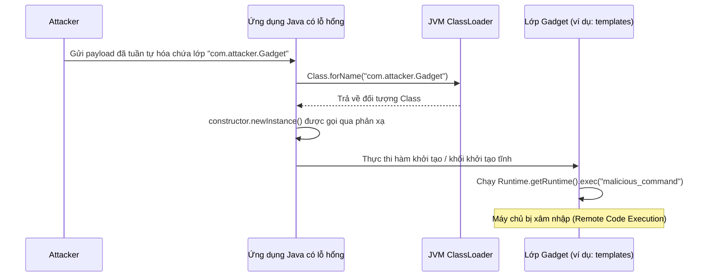

# Phản Xạ (Reflection) - Phần 2

## Mục Tiêu Học Tập

File này đề cập đến một phần trọng tâm của **Phản Xạ (Reflection)**. Hãy nghiên cứu từng khái niệm như một quy tắc Java thực tế, chứ không phải là những từ vựng rời rạc.

## Đề Cương Khái Niệm

- **`Ưu điểm và nhược điểm của phản xạ`** — Các đánh đổi quan trọng của phản xạ liên quan đến hiệu năng, tính đóng gói trong thiết kế và khả năng mở rộng.
- **`Phản xạ trong các framework như Spring`** — Cách các framework doanh nghiệp hiện đại sử dụng phản xạ để đạt được Tiêm phụ thuộc (Dependency Injection - DI) và các hành vi động.

---

## Ghi Chú Chi Tiết

### Ưu Điểm Và Nhược Điểm Của Phản Xạ

Phản xạ là một con dao hai lưỡi. Mặc dù nó mang lại sự linh hoạt vô song tại thời điểm chạy (runtime), nhưng nó cũng đi kèm với những chi phí đắt đỏ.

#### Ưu điểm
1. **Khái niệm khả năng mở rộng (Extensibility)**: Các ứng dụng có thể tải động các plugin hoặc module của bên thứ ba bằng tên mà không cần biên dịch lại tĩnh.
2. **Giảm sự phụ thuộc của Framework (Framework Decoupling)**: Cho phép viết mã generic hoạt động trên các lớp tùy ý (ví dụ: bộ tuần tự hóa JSON, bộ dựng truy vấn JDBC).
3. **Công cụ phong phú**: Cung cấp năng lượng cho các tính năng của IDE, các trình kiểm tra mã nguồn, các proxy động (dynamic proxy), các thư viện giả lập (Mockito), và các bộ khung kiểm thử (JUnit).

#### Nhược điểm
1. **Chi phí hiệu năng (Performance Overhead)**:
   - **Không có tối ưu hóa trình biên dịch**: Trình biên dịch JIT không thể thực hiện inlining đối với các lời gọi phương thức phản xạ hoặc tối ưu hóa việc tra cứu trường dữ liệu.
   - **Kiểm tra kiểu động**: Các đối số phải được kiểm tra kiểu, kiểm tra các ngoại lệ được kiểm soát, và kiểm tra quyền hiển thị trên mỗi lần gọi.
   - **Bọc đối tượng (Object Wrapping)**: Các đối số nguyên thủy và giá trị trả về phải được đóng/mở hộp, tạo ra thêm chi phí cho bộ thu gom rác.
2. **Mất an toàn tại thời điểm biên dịch (Loss of Compile-time Safety)**: Các lỗi vốn thường gây ra thất bại khi biên dịch (như viết sai tên trường hoặc tên lớp) sẽ bị trì hoãn tới thời điểm chạy dưới dạng các ngoại lệ.
3. **Vượt qua tính đóng gói (Bypassing Encapsulation)**: Việc truy cập các trường hoặc phương thức `private` sẽ phá vỡ các bất biến lớp, khiến mã nguồn trở nên cực kỳ mong manh và bị phụ thuộc chặt chẽ (tightly coupled) vào các triển khai nội bộ của lớp.
4. **Giới hạn bảo mật/Module**: Các quy tắc đóng gói nghiêm ngặt trong hệ thống module Java (từ Java 9) hoặc một cấu hình JVM `SecurityManager` sẽ chặn quyền truy cập phản xạ, gây ra lỗi crash khi chạy.

#### Ví Dụ Mã Nguồn: So Sánh Hiệu Năng
```java
// Reflective method lookup and invocation is typically 10x to 100x slower
// than direct method execution because of validation, boxing, and safety checks.
public class PerformanceComparison {
    public void executeDirect() {
        // Direct method call: resolved at compile-time and optimized by JIT
    }
    
    public void executeReflective(java.lang.reflect.Method m, Object target) throws Exception {
        m.invoke(target); // Expensive validation checks and JIT bypass on every call
    }
}
```

## Tại Sao Phản Xạ Gây Ra Suy Giảm Hiệu Năng Và Cách Tối Ưu Hóa Nó

Trong quá trình thực thi Java tiêu chuẩn, trình biên dịch Just-In-Time (JIT) của JVM sẽ biên dịch các đường dẫn bytecode nóng (hot bytecode path) thành mã máy gốc. Nó dựa vào phân tích tĩnh để thực hiện các tối ưu hóa quan trọng như inlining phương thức (thay thế lời gọi phương thức trực tiếp bằng phần thân của nó) và loại bỏ mã chết (dead code elimination). Các lời gọi phản xạ bỏ qua quá trình này vì các tham chiếu lớp, phương thức và trường được phân giải dưới dạng các biến động tại thời điểm chạy. Điều này buộc JVM phải vô hiệu hóa tối ưu hóa biên dịch JIT cho các cuộc gọi phản xạ, yêu cầu công cụ thực thi thực hiện tra cứu tên, xác minh quyền truy cập và kiểm tra khả năng tương thích kiểu tham số trên mỗi lần gọi. Ngoài ra, việc truyền các đối số nguyên thủy qua phản xạ yêu cầu cấp phát một mảng đối tượng (`Object[]`) và đóng hộp các kiểu nguyên thủy (ví dụ: bọc `int` thành `Integer`), điều này làm tăng đáng kể việc cấp phát bộ nhớ heap và chi phí thu gom rác. Để tối ưu hóa các hoạt động phản xạ này, Java 7 đã giới thiệu các API `java.lang.invoke.MethodHandles` và `VarHandle`, tận dụng cơ chế tra cứu bootstrap JVM trực tiếp và cho phép trình biên dịch JIT inlining khi các handle được lưu trữ trong các trường `static final` fields.

### Gọi trực tiếp so với Gọi phản xạ (Mental Model)
```mermaid
flowchart TD
    subgraph Direct Invocation [Gọi trực tiếp]
        A[target.method()] --> B[Kiểm tra kiểu tĩnh]
        B --> C[Tối ưu hóa JIT: Inlining phương thức]
        C --> D[Thực thi mã máy trực tiếp]
    end
    subgraph Reflective Invocation [Gọi phản xạ]
        E[method.invoke(target, args)] --> F[Tra cứu thời gian chạy bằng tên chuỗi]
        F --> G[Xác minh bổ từ & Kiểm tra truy cập]
        G --> H[Tự động đóng hộp kiểu nguyên thủy & Cấp phát Object[]]
        H --> I[Thực thi JVM Stub (Dynamic Dispatch)]
        I --> J[Mở hộp & Thực thi thực tế]
    end
```

### Ví Dụ Mã Nguồn: So Sánh Hiệu Năng và MethodHandles
```java
import java.lang.invoke.MethodHandle;
import java.lang.invoke.MethodHandles;
import java.lang.invoke.MethodType;
import java.lang.reflect.Method;

public class ReflectionPerformanceDemo {
    public void targetMethod() {}

    public static void main(String[] args) throws Throwable {
        ReflectionPerformanceDemo instance = new ReflectionPerformanceDemo();
        
        // 1. Standard Reflection: Slow due to lookup, access checks, and JIT bypass
        Method reflectMethod = ReflectionPerformanceDemo.class.getMethod("targetMethod");
        reflectMethod.invoke(instance); 
        
        // 2. MethodHandles: Faster because it is type-safe and optimizable by the JVM
        MethodHandles.Lookup lookup = MethodHandles.lookup();
        MethodType type = MethodType.methodType(void.class);
        MethodHandle handle = lookup.findVirtual(ReflectionPerformanceDemo.class, "targetMethod", type);
        
        // Dynamic invocation with compile-time type verification
        handle.invokeExact(instance); 
    }
}
```

### Chuỗi Nguyên Nhân - Kết Quả
Tra cứu phản xạ theo tên &rarr; Trình biên dịch JIT không thể xác định chữ ký phương thức đích tại thời điểm biên dịch &rarr; Việc inlining phương thức và các tối ưu hóa bị vô hiệu hóa &rarr; JVM thực hiện kiểm tra truy cập thời gian chạy, kiểm tra kiểu tham số, và đóng hộp đối số &rarr; Tốc độ cấp phát bộ nhớ heap tăng lên và độ trễ thực thi tăng gấp 10 đến 100 lần so với các cuộc gọi trực tiếp.

---

## Tại Sao Việc Khởi Tạo Đối Tượng Và Tải Lớp Qua Phản Xạ Gây Ra Nguy Cơ Bảo Mật Và Tính Ổn Định

Tải lớp động (`Class.forName()`) và khởi tạo hàm khởi tạo bằng phản xạ (`Constructor.newInstance()`) bỏ qua các ranh giới kiểu tĩnh tại thời điểm biên dịch để phân giải các lớp theo tên tại thời điểm chạy. Mặc dù điều này mang lại sự linh hoạt cao, nhưng nó lại gây ra các rủi ro nghiêm trọng về bảo mật và tính ổn định, đáng chú ý nhất là giải tuần tự hóa không an toàn (unsafe deserialization) và thực thi mã tùy ý (Remote Code Execution - RCE). Nếu một ứng dụng chấp nhận dữ liệu không đáng tin cậy chỉ định tên lớp để tải động, kẻ tấn công có thể cung cấp tên của các "lớp gadget" (các lớp có mặt trên classpath thực hiện các hành động trong hàm khởi tạo, khối static hoặc phương thức giải tuần tự hóa của chúng). Khi ứng dụng khởi tạo các lớp này thông qua phản xạ, nó sẽ thực thi mã của kẻ tấn công, có khả năng làm tổn hại đến hệ thống máy chủ. Hơn nữa, việc tải các lớp động có thể dẫn đến rò rỉ bộ nhớ Metaspace vì các lớp được lưu trữ trong Metaspace của JVM, vốn không thể được thu gom rác miễn là ClassLoader tải nó vẫn được tham chiếu.

### Luồng Lỗ Hổng Khởi Tạo Động Không An Toàn (Mental Model)


### Ví Dụ Mã Nguồn: Rủi Ro Bảo Mật Khi Khởi Tạo Phản Xạ
```java
import java.lang.reflect.Constructor;

public class UnsafeDynamicInstantiation {
    // DANGER: Instantiates arbitrary classes by name from untrusted dynamic input
    public static Object instantiateDynamic(String className) {
        try {
            Class<?> clazz = Class.forName(className);
            Constructor<?> constructor = clazz.getDeclaredConstructor();
            constructor.setAccessible(true);
            return constructor.newInstance();
        } catch (Exception e) {
            System.out.println("Failed to instantiate: " + e.getMessage());
            return null;
        }
    }

    public static void main(String[] args) {
        // Simulating an attacker attempting to instantiate ProcessBuilder reflectively
        // which can lead to system command execution without compile-time restrictions
        instantiateDynamic("java.lang.ProcessBuilder"); 
    }
}
```

### Chuỗi Nguyên Nhân - Kết Quả
Đầu vào không đáng tin cậy chỉ định tên lớp &rarr; `Class.forName` tải lớp từ classpath một cách động &rarr; Khởi tạo phản xạ thực thi hàm khởi tạo hoặc khối khởi tạo tĩnh của lớp &rarr; Payload độc hại thực thi các lệnh hệ điều hành một cách phản xạ &rarr; Hệ điều hành máy chủ bị xâm hại với lỗ hổng Thực thi mã từ xa (RCE).

---

### Phản Xạ Trong Các Framework Như Spring

Các framework Java doanh nghiệp phụ thuộc rất nhiều vào phản xạ để quản lý vòng đời đối tượng, cấu hình các định nghĩa bean và triển khai các mối quan tâm chéo động (Lập trình hướng khía cạnh - Aspect-Oriented Programming - AOP).

- **Tiêm phụ thuộc (Dependency Injection - DI)**: Spring quét các lớp trên classpath, đọc các chú thích như `@Autowired` hoặc `@Component`, và sử dụng phản xạ để khởi tạo các bean và tiêm các phụ thuộc trực tiếp vào các trường (thậm chí là các trường `private`) mà không cần mã nguồn hàm khởi tạo.
- **Proxy động (Dynamic Proxies)**: Spring AOP và `@Transactional` sử dụng `java.lang.reflect.Proxy` (hoặc tạo mã CGLIB) để bọc bean của bạn trong một đối tượng proxy. Khi một phương thức được gọi, proxy sẽ chặn cuộc gọi đó qua phản xạ, bắt đầu một giao dịch (transaction), ủy quyền cho bean của bạn, và commit/rollback giao dịch đó.

#### Ví Dụ Thực Tế: Container Tiêm Phụ Thuộc (DI) Đơn Giản
```java
import java.lang.annotation.*;
import java.lang.reflect.Field;

// Define custom dependency marker annotation
@Retention(RetentionPolicy.RUNTIME)
@Target(ElementType.FIELD)
@interface Inject {}

class Engine {
    public void start() { System.out.println("Vroom!"); }
}

class Car {
    @Inject
    private Engine engine; // Spring injects this dynamically at runtime

    public void drive() { engine.start(); }
}

// Simple Container implementation demonstrating Spring-like reflection injection
public class MiniSpringContainer {
    public static void bootstrap(Car car) throws Exception {
        Class<?> clazz = car.getClass();
        for (Field field : clazz.getDeclaredFields()) {
            if (field.isAnnotationPresent(Inject.class)) {
                // Instantiates dependency object reflectively
                Object dependency = field.getType().getDeclaredConstructor().newInstance();
                
                // Enable writing to the private engine field
                field.setAccessible(true);
                
                // Inject the dependency instance into the car instance
                field.set(car, dependency);
            }
        }
    }

    public static void main(String[] args) throws Exception {
        Car car = new Car();
        bootstrap(car);
        car.drive(); // Outputs "Vroom!"
    }
}
```

## Tại Sao Phản Xạ Cho Phép Triển Khai Dependency Injection và ORM Framework

Các framework doanh nghiệp Java hiện đại, chẳng hạn như Spring và Hibernate, phải hoạt động trên các lớp do người dùng định nghĩa vốn chưa tồn tại vào thời điểm framework được biên dịch. Phản xạ đóng vai trò là cơ chế quan trọng giúp giải quyết bài toán "con gà và quả trứng" này bằng cách cho phép các framework tự kiểm tra (introspect) cấu trúc lớp và kiểm tra siêu dữ liệu (metadata) tại thời điểm chạy. Thay vì yêu cầu các nhà phát triển viết mã nhà máy (factory) dài dòng, khởi tạo các lớp theo cách thủ công hoặc tự ánh xạ các cột cơ sở dữ liệu với các trường, framework sẽ quét classpath và kiểm tra các lớp để tìm các chú thích (chẳng hạn như `@Autowired`, `@Entity` hoặc `@Column`). Bằng cách sử dụng phản xạ, framework có thể định vị hàm khởi tạo thích hợp, gọi `newInstance()` để tạo các thực thể và sử dụng `setAccessible(true)` để trực tiếp tiêm các thực thể phụ thuộc hoặc giá trị hàng cơ sở dữ liệu vào các trường private. Sự tách biệt (decoupling) này cho phép ứng dụng luôn sạch bóng các mã nguồn hạ tầng, chuyển việc liên kết thành phần và ánh xạ quan hệ-đối tượng sang một mô hình cấu hình khai báo được xử lý hoàn toàn bởi container của framework.

### Quét Chú Thích Và Liên Kết Dựa Trên Phản Xạ (Mental Model)
```mermaid
flowchart TD
    A[Khởi động Framework] --> B[Quét các lớp trên Classpath]
    B --> C{Lớp được đánh dấu với @Component hoặc @Entity?}
    C -- Có --> D[Kiểm tra các hàm khởi tạo qua phản xạ]
    D --> E[Khởi tạo Bean qua constructor.newInstance()]
    E --> F[Lặp qua các trường để kiểm tra @Autowired hoặc @Column]
    F --> G{Tìm thấy chú thích?}
    G -- Có --> H[Bỏ qua phạm vi private với setAccessible]
    H --> I[Tiêm tham chiếu phụ thuộc hoặc giá trị DB qua phản xạ]
    I --> J[Đăng ký Bean đã được liên kết hoàn chỉnh vào Application Context]
    G -- Không --> J
```

### Ví Dụ Mã Nguồn: Ánh Xạ Chú Thích Qua Phản Xạ
```java
import java.lang.annotation.Retention;
import java.lang.annotation.RetentionPolicy;
import java.lang.reflect.Field;

@Retention(RetentionPolicy.RUNTIME)
@interface Column {
    String name();
}

class UserProfile {
    @Column(name = "user_email")
    private String email;
    
    public String getEmail() { return email; }
}

public class MiniOrmMapper {
    public static void populateField(Object target, String columnName, String value) throws Exception {
        Class<?> clazz = target.getClass();
        for (Field field : clazz.getDeclaredFields()) {
            if (field.isAnnotationPresent(Column.class)) {
                Column annotation = field.getAnnotation(Column.class);
                if (annotation.name().equals(columnName)) {
                    field.setAccessible(true); // Bypass encapsulation
                    field.set(target, value); // Inject value reflectively
                }
            }
        }
    }

    public static void main(String[] args) throws Exception {
        UserProfile profile = new UserProfile();
        populateField(profile, "user_email", "admin@example.com");
        System.out.println("Mapped Email: " + profile.getEmail()); // Outputs "Mapped Email: admin@example.com"
    }
}
```

### Chuỗi Nguyên Nhân - Kết Quả
Framework quét classpath &rarr; Phản xạ động đọc các cấu trúc lớp và chú thích do người dùng định nghĩa &rarr; Các kiểm soát truy cập trường được bỏ qua với `setAccessible(true)` &rarr; Dữ liệu và các phụ thuộc được tiêm trực tiếp vào các trường &rarr; Mã nguồn ánh xạ và factory dài dòng được loại bỏ, đạt được kiến trúc khai báo và tách biệt (decoupling).

---

## Các Câu Hỏi Ôn Tập Thường Gặp

- **Tại sao phản xạ lại chậm hơn mã nguồn trực tiếp?**
  Phản xạ bỏ qua các tối ưu hóa tại thời điểm biên dịch (như inlining phương thức bởi trình biên dịch JIT). Nó yêu cầu JVM phải thực hiện tra cứu tên, khớp kiểu, xác thực kiểm tra truy cập, và đóng/mở hộp đối số tại thời điểm chạy.
- **Làm thế nào phản xạ phá vỡ mẫu thiết kế Singleton?**
  Một client có thể lấy hàm khởi tạo private của một lớp Singleton thông qua phản xạ (`getDeclaredConstructor()`), thay đổi khả năng truy cập của nó bằng `setAccessible(true)`, và gọi `newInstance()` để tạo ra thực thể thứ hai của lớp đó.
- **Sự khác biệt giữa JDK Dynamic Proxy và CGLIB là gì?**
  - **JDK Dynamic Proxies** sử dụng phản xạ tiêu chuẩn (`java.lang.reflect.Proxy`) để tạo ra các thực thể proxy cho các lớp có triển khai các interface.
  - **CGLIB** tạo ra các lớp con tại thời điểm chạy để chặn các lời gọi phương thức cho các lớp không triển khai bất kỳ interface nào.

## Liên Kết Tham Khảo (Reference Links)

- https://docs.oracle.com/javase/specs/jls/se21/html/jls-15.html#jls-15.12 (Biểu thức gọi phương thức)
- https://docs.oracle.com/en/java/javase/21/docs/api/java.base/java/lang/invoke/MethodHandles.html (Tra cứu MethodHandles)
- https://docs.oracle.com/javase/specs/jls/se21/html/jls-12.html#jls-12.2 (Tải lớp - Class Loading)
- https://docs.oracle.com/en/java/javase/21/docs/api/java.base/java/lang/reflect/AnnotatedElement.html (Phản xạ chú thích AnnotatedElement)
- https://docs.oracle.com/javase/tutorial/reflect/ (Hướng dẫn phản xạ của Oracle)
