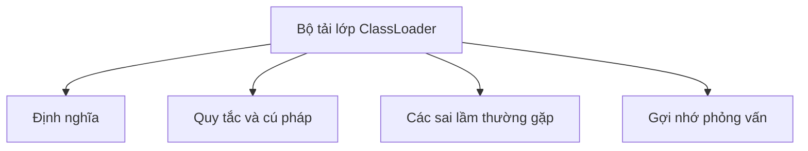

# 32 - Bộ tải lớp (ClassLoader)

Chủ đề này tuân theo đề cương tổng thể trong [outline.md](../outline.md). Mục tiêu là hiểu sâu sắc từng khái niệm để có thể giải thích, nhận biết trong mã nguồn và trả lời các câu hỏi phỏng vấn.

## Thứ tự học tập (Study Order)

- [Khái niệm Quy trình Tải Lớp (Class Loading Process Concepts)](theory/01-class-loading-process-concepts.md)
- [Thuật ngữ khóa (Key Terms)](terms/01-key-terms.md)

## Danh sách kiểm tra đề cương (Outline Checklist)

- Quy trình tải lớp (Class loading process)
- Bootstrap ClassLoader
- Platform/Extension ClassLoader
- Application ClassLoader
- Mô hình ủy quyền cha (Parent delegation model)
- Tải lớp động (Dynamic class loading)
- `Class.forName`
- Classpath
- Tải tệp JAR cơ bản (Basic JAR loading)

## Thuật ngữ khóa (Key Terms)

- Bộ tải lớp (Class loader)
- Bootstrap ClassLoader
- Platform ClassLoader
- Application ClassLoader
- Mô hình ủy quyền cha (Parent delegation model)
- TCCL (Thread Context ClassLoader)
- Tải lớp (Loading)
- Liên kết (Linking)
- Khởi tạo (Initialization)
- Metaspace
- Rò rỉ bộ nhớ (Memory leak)

## Tự kiểm tra (Self-Check)

- Tại sao ba giai đoạn của quy trình tải lớp (classloading) chi phối việc thực thi tĩnh?
  &rarr; Xem [Làm thế nào ba giai đoạn của classloading chi phối thực thi tĩnh (How the three phases of classloading govern static execution)](theory/01-class-loading-process-concepts.md#why-the-three-phases-of-classloading-govern-static-execution)
- Tại sao mô hình ủy quyền cha bảo vệ các API cốt lõi?
  &rarr; Xem [Tại sao mô hình ủy quyền cha bảo vệ các API cốt lõi (Why the parent delegation model protects core APIs)](theory/01-class-loading-process-concepts.md#why-the-parent-delegation-model-protects-core-apis)
- Tại sao các không gian tên ClassLoader quyết định tính duy nhất của định danh kiểu?
  &rarr; Xem [Tại sao không gian tên ClassLoader quyết định tính duy nhất của định danh kiểu (Why ClassLoader namespaces dictate type identity uniqueness)](theory/01-class-loading-process-concepts.md#why-classloader-namespaces-dictate-type-identity-uniqueness)
- Tại sao các khung công tác cắm (plugin) và SPI phải phá vỡ mô hình ủy quyền cha?
  &rarr; Xem [Tại sao các khung công tác SPI và plugin phải phá vỡ mô hình ủy quyền cha (Why SPI and plugin frameworks must break parent delegation)](theory/01-class-loading-process-concepts.md#why-spi-and-plugin-frameworks-must-break-parent-delegation)
- Tại sao các bộ tải lớp tùy chỉnh (custom classloaders) gây ra rò rỉ bộ nhớ Metaspace?
  &rarr; Xem [Tại sao các Classloader tùy chỉnh gây ra rò rỉ bộ nhớ Metaspace (Why Custom Classloaders Cause Metaspace Memory Leaks)](theory/01-class-loading-process-concepts.md#why-custom-classloaders-cause-metaspace-memory-leaks)

## Thẻ Anki (Anki Cards)

- [Cơ bản (Basic)](anki/basic.tsv)
- [Cơ bản mở rộng (Basic Extra)](anki/basic-extra.tsv)
- [Điền vào chỗ trống (Cloze)](anki/cloze.tsv)
- [Câu hỏi mã nguồn (Code Question)](anki/code-question.tsv)

## Sơ đồ Mermaid tổng quan (Mermaid Overview)

## Liên kết tham khảo (Reference Links)

- https://docs.oracle.com/en/java/javase/21/docs/api/java.base/java/lang/ClassLoader.html
