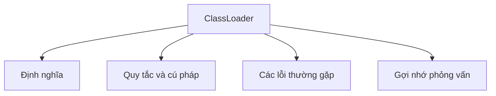

# 32 - Bộ Tải Lớp (ClassLoader)

Chủ đề này tuân theo đề cương chính trong [outline.md](../outline.md). Mục tiêu là hiểu sâu sắc từng khái niệm để có thể giải thích, nhận biết chúng trong mã nguồn và trả lời các câu hỏi phỏng vấn.

## Thứ Tự Học Tập

- [Khái niệm Quá trình Tải Lớp (Class Loading Process)](theory/01-class-loading-process-concepts.md)
- [Các Thuật Ngữ Khóa](terms/01-key-terms.md)

## Danh Sách Khái Niệm

- Quá trình tải lớp (Class loading process)
- Bộ tải lớp Khởi động (Bootstrap ClassLoader)
- Bộ tải lớp Nền tảng/Mở rộng (Platform/Extension ClassLoader)
- Bộ tải lớp Ứng dụng (Application ClassLoader)
- Mô hình ủy thác cha (Parent delegation model)
- Tải lớp động (Dynamic class loading)
- Class.forName
- Đường dẫn lớp (Classpath)
- Tải tệp JAR cơ bản (Basic JAR loading)

## Các Thuật Ngữ Khóa

- Bộ tải lớp (Class loader)
- Bộ tải lớp Khởi động (Bootstrap ClassLoader)
- Bộ tải lớp Nền tảng (Platform ClassLoader)
- Bộ tải lớp Ứng dụng (Application ClassLoader)
- Mô hình ủy thác cha (Parent delegation model)
- TCCL (Thread Context ClassLoader - Bộ tải lớp theo ngữ cảnh luồng)
- Tải lớp (Loading)
- Liên kết (Linking)
- Khởi tạo (Initialization)
- Metaspace
- Rò rỉ bộ nhớ (Memory leak)

## Tự Kiểm Tra

- Tại sao ba giai đoạn của quá trình tải lớp (classloading) chi phối việc thực thi các thành phần tĩnh?
  &rarr; Xem [Tại sao ba giai đoạn của quá trình tải lớp chi phối việc thực thi các thành phần tĩnh](theory/01-class-loading-process-concepts.md#why-the-three-phases-of-classloading-govern-static-execution)
- Tại sao mô hình ủy thác cha bảo vệ các API cốt lõi?
  &rarr; Xem [Tại sao mô hình ủy thác cha bảo vệ các API cốt lõi](theory/01-class-loading-process-concepts.md#why-the-parent-delegation-model-protects-core-apis)
- Tại sao không gian tên (namespace) của Bộ tải lớp quyết định tính duy nhất của danh tính kiểu dữ liệu?
  &rarr; Xem [Tại sao không gian tên của Bộ tải lớp quyết định tính duy nhất của danh tính kiểu dữ liệu](theory/01-class-loading-process-concepts.md#why-classloader-namespaces-dictate-type-identity-uniqueness)
- Tại sao các khung công tác SPI và plugin bắt buộc phải phá vỡ mô hình ủy thác cha?
  &rarr; Xem [Tại sao các khung công tác SPI và plugin bắt buộc phải phá vỡ mô hình ủy thác cha](theory/01-class-loading-process-concepts.md#why-spi-and-plugin-frameworks-must-break-parent-delegation)
- Tại sao các bộ tải lớp tùy chỉnh lại gây ra rò rỉ bộ nhớ Metaspace?
  &rarr; Xem [Tại sao các bộ tải lớp tùy chỉnh gây ra rò rỉ bộ nhớ Metaspace](theory/01-class-loading-process-concepts.md#why-custom-classloaders-cause-metaspace-memory-leaks)

## Thẻ Anki

- [Basic](anki/basic.tsv)
- [Basic Extra](anki/basic-extra.tsv)
- [Cloze](anki/cloze.tsv)
- [Code Question](anki/code-question.tsv)

## Sơ Đồ Mermaid Tổng Quan

## Liên Kết Tham Khảo

- https://docs.oracle.com/en/java/javase/21/docs/api/java.base/java/lang/ClassLoader.html
