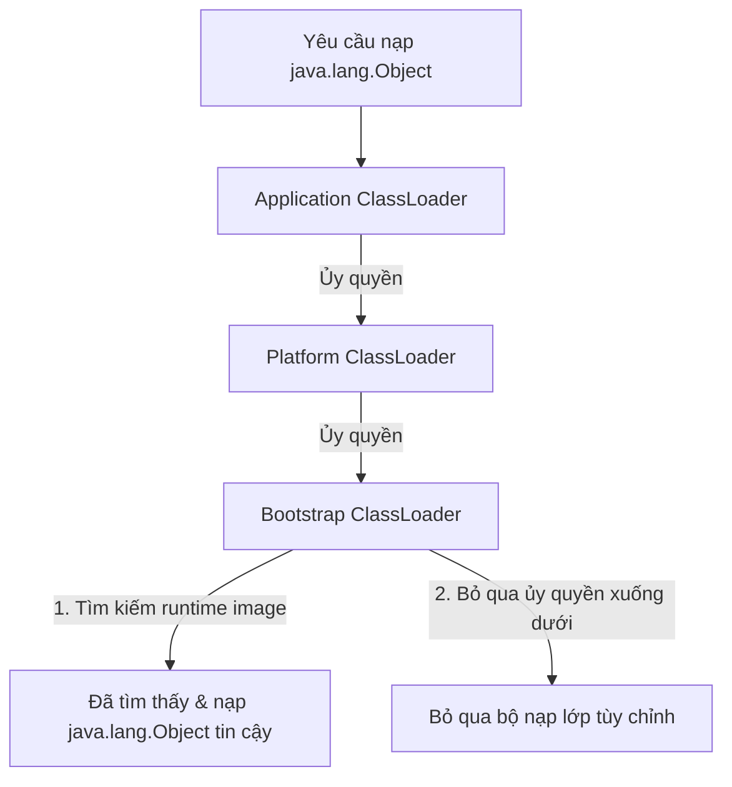

# ClassLoader - Phần 1

## Mục tiêu học tập (Learning Goal)

Tài liệu này bao gồm một phần trọng tâm của **ClassLoader**. Hãy nghiên cứu từng khái niệm như một quy tắc Java thực tế, thay vì chỉ là từ vựng rời rạc.

## Phạm vi đề mục (Outline Coverage)

| Khái niệm (Concept) | Điều cần biết (What to know) |
| --- | --- |
| `Class loading process` | Vòng đời nhiều giai đoạn của việc nạp, liên kết và khởi tạo các định nghĩa lớp vào bộ nhớ JVM. |
| `Bootstrap ClassLoader` | Bộ nạp gốc bằng mã máy (native-code) chịu trách nhiệm nạp các lớp chạy cốt lõi (ví dụ: `java.lang.Object`). |
| `Platform/Extension ClassLoader` | Bộ nạp đảm nhận nạp các mô-đun nền tảng không cốt lõi hoặc các API mở rộng. |
| `Application ClassLoader` | Bộ nạp (system class loader) thực hiện nạp các lớp từ đường dẫn lớp classpath của ứng dụng. |
| `Parent delegation model` | Cơ chế trong đó các bộ nạp ủy quyền việc nạp lớp cho cha của chúng trước khi tự mình thử nạp. |
| `Dynamic class loading` | Nạp các lớp vào bộ nhớ JVM tại thời điểm chạy theo yêu cầu thay vì nạp ngay lúc khởi động. |
| `Class.forName` | Phương thức của API phản chiếu (reflection) được sử dụng để nạp và tùy chọn khởi tạo lớp một cách động. |
| `Classpath` | Tham số cấu hình cho JVM biết nơi để tìm kiếm các lớp và các gói do người dùng định nghĩa. |
| `Basic JAR loading` | Cách JVM giải quyết các tệp lớp được đóng gói bên trong các tệp lưu trữ nén định dạng ZIP (JAR). |

## Ghi chú chi tiết (Detailed Notes)

### Quy trình nạp lớp (Class loading process)

Quy trình nạp lớp là cơ chế của JVM để đưa mã bytecode nhị phân đã biên dịch (được lưu trữ trong các tệp `.class` hoặc lấy từ luồng mạng) vào bộ nhớ và chuyển đổi nó thành một đối tượng `java.lang.Class` có thể sử dụng được. Quá trình này diễn ra một cách động theo yêu cầu (on-demand), thay vì nạp tất cả các lớp khi khởi động ứng dụng.

## Tại sao ba giai đoạn nạp lớp kiểm soát việc thực thi tĩnh (Why the three phases of classloading govern static execution)

Nạp lớp không phải là một bước nguyên tử duy nhất mà là một quy trình có cấu trúc bao gồm ba giai đoạn riêng biệt: Nạp (Loading), Liên kết (Linking), và Khởi tạo (Initialization). Trong giai đoạn **Nạp (Loading)**, bộ nạp lớp đọc biểu diễn nhị phân của lớp (mảng byte từ tệp `.class` hoặc luồng mạng) và xây dựng cấu trúc siêu dữ liệu `java.lang.Class` tương ứng trong Metaspace. Giai đoạn **Liên kết (Linking)** được chia nhỏ thành *Xác thực (Verification)* (đảm bảo mã bytecode hợp lệ và an toàn), *Chuẩn bị (Preparation)* (phân bổ bộ nhớ cho các trường tĩnh và khởi tạo chúng về các giá trị mặc định của JVM như `0` hoặc `null`), và *Phân giải (Resolution)* (phân giải các tham chiếu tượng trưng (symbolic references) trong vùng nhớ hằng số thành các tham chiếu bộ nhớ trực tiếp thực tế). Cuối cùng, giai đoạn **Khởi tạo (Initialization)** chạy các trình khởi tạo tĩnh (phương thức `<clinit>`) và gán các giá trị thực tế do lập trình viên chỉ định cho các biến tĩnh. JVM đảm bảo rằng quá trình khởi tạo tĩnh diễn ra một cách lười (lazily), chỉ khi lớp lần đầu tiên được sử dụng tích cực—chẳng hạn như khi một thể hiện mới được tạo, một phương thức tĩnh được gọi, hoặc một trường tĩnh được truy cập.

### Mô hình tư duy: Các giai đoạn nạp lớp (Mental Model: Class Loading Phases)
```
+------------------------------------------------------------------------+
| 1. LOADING: Đọc bytecode -> Tạo siêu dữ liệu Class<?> trong Metaspace  |
+------------------------------------------------------------------------+
                                   |
                                   v
+------------------------------------------------------------------------+
| 2. LINKING:                                                            |
|    - Xác thực (Verification): Kiểm tra định dạng và an toàn bytecode   |
|    - Chuẩn bị (Preparation): Phân bổ bộ nhớ tĩnh & ghi mặc định (0/null)|
|    - Phân giải (Resolution): Ánh xạ tham chiếu tượng trưng tới địa chỉ  |
+------------------------------------------------------------------------+
                                   |
                                   v
+------------------------------------------------------------------------+
| 3. INITIALIZATION: Chạy các trình khởi tạo tĩnh (<clinit>) & gán giá trị|
+------------------------------------------------------------------------+
```

### Ví dụ mã nguồn (Code Example)
```java
public class ClassLoadingPhasesDemo {
    static class Target {
        // Giai đoạn chuẩn bị (Preparation): value được khởi tạo bằng 0
        // Giai đoạn khởi tạo (Initialization): value được gán bằng 42
        public static int value = 42;
        
        static {
            System.out.println("Target class initialized!");
        }
    }

    public static void main(String[] args) throws Exception {
        System.out.println("Main started");
        
        // Nạp động bằng Class.forName mà không khởi tạo
        Class<?> clazz = Class.forName("ClassLoadingPhasesDemo$Target", false, ClassLoadingPhasesDemo.class.getClassLoader());
        System.out.println("Target class loaded but not initialized yet.");
        
        // Kích hoạt việc sử dụng tích cực
        int val = Target.value;
        System.out.println("Static value accessed: " + val);
        
        // Đầu ra:
        // Main started
        // Target class loaded but not initialized yet.
        // Target class initialized!
        // Static value accessed: 42
    }
}
```

### Chuỗi nguyên nhân - kết quả (Cause-Effect Chain)

```text
Kích hoạt hoạt động của lớp (ví dụ: truy cập tĩnh)
  → Lớp được nạp nếu chưa có
  → Liên kết thực hiện xác thực và chuẩn bị (giá trị không mặc định)
  → Khởi tạo thực thi các khối tĩnh và phép gán thực tế
  → Lớp hoàn toàn sẵn sàng cho việc thực thi vào thời gian chạy.
```


---

### Bootstrap ClassLoader
Bootstrap ClassLoader là cha của tất cả các bộ nạp lớp. Nó được viết bằng mã máy (C/C++) và nhúng trực tiếp bên trong chính JVM. Nó chịu trách nhiệm nạp các lớp nền tảng Java cốt lõi, chẳng hạn như các lớp trong gói `java.lang`, `java.util`, và các gói cơ bản khác (từ mô-đun `java.base` trong Java 9+). Vì được viết bằng mã máy, nó không có đối tượng Java `java.lang.ClassLoader` tương ứng; việc gọi `getClassLoader()` trên các lớp cốt lõi như `java.lang.String` hoặc `java.lang.Object` sẽ trả về `null`.

### Platform/Extension ClassLoader
Platform ClassLoader (được gọi là Extension ClassLoader trước Java 9) nạp các lớp từ các thư mục nền tảng/mở rộng. Trong Java 9 và mới hơn, mục đích của nó là nạp các lớp nền tảng và API không phải là một phần của môi trường chạy cốt lõi (ví dụ: SQL, các gói xử lý XML) nhưng là một phần của đặc tả tiêu chuẩn Java SE.

### Application ClassLoader
Còn được gọi là System ClassLoader, Application ClassLoader chịu trách nhiệm nạp các lớp từ đường dẫn lớp (classpath) của ứng dụng (được chỉ định bởi biến môi trường `CLASSPATH`, hoặc tùy chọn dòng lệnh `-classpath` / `-cp`). Nó là bộ nạp mặc định cho các lớp do người dùng định nghĩa và được viết bằng Java (lớp con của `java.lang.ClassLoader`).

### Mô hình ủy quyền cha (Parent delegation model)
Mô hình ủy quyền cha là khung phân cấp hướng dẫn cách các bộ nạp lớp tìm kiếm các lớp. Khi một bộ nạp lớp nhận được yêu cầu nạp một lớp, trước tiên nó không tự mình tìm kiếm lớp đó. Thay vào đó, nó ủy quyền việc tìm kiếm cho bộ nạp lớp cha của nó. Việc ủy quyền này truyền ngược lên tận Bootstrap ClassLoader. Chỉ khi tất cả các bộ nạp lớp tổ tiên không xác định được vị trí của lớp thì bộ nạp lớp con mới tự mình thực hiện nạp lớp.

## Tại sao mô hình ủy quyền cha bảo vệ các API cốt lõi (Why the parent delegation model protects core APIs)

Mô hình ủy quyền cha là một cơ chế bảo mật cốt lõi trong Máy ảo Java. Khi một bộ nạp lớp được yêu cầu nạp một lớp, nó luôn ủy quyền yêu cầu đó cho bộ nạp lớp cha của nó trước tiên, truyền ngược lên tận Bootstrap ClassLoader, trước khi tự mình thử nạp lớp. Sự phân cấp này đảm bảo rằng các lớp chạy cốt lõi, chẳng hạn như `java.lang.Object` hoặc `java.lang.String`, luôn được nạp bởi Bootstrap ClassLoader từ runtime image đáng tin cậy, chứ không phải bởi một ứng dụng không đáng tin cậy hoặc bộ nạp lớp tùy chỉnh. Ngay cả khi một nhà phát triển độc hại đóng gói một lớp `java.lang.Object` giả mạo trong một tệp JAR, mô hình ủy quyền cha vẫn đảm bảo rằng yêu cầu bị chặn ở đỉnh của cây phân cấp, và lớp chính thức của JVM sẽ được nạp thay thế. Hơn nữa, JVM thực thi các kiểm tra thời gian chạy (chẳng hạn như kiểm tra các tên gói bắt đầu bằng `java.`) và ném ra ngoại lệ `SecurityException` nếu một bộ nạp lớp không đáng tin cậy cố gắng định nghĩa một lớp bên trong một gói bị hạn chế.

### Mô hình tư duy: Mô hình ủy quyền cha (Mental Model: Parent Delegation Model)


### Ví dụ mã nguồn (Code Example)
```java
// Ví dụ mô phỏng kiểm tra ngăn chặn gói
public class ClassProtectionDemo {
    public static void main(String[] args) {
        try {
            ClassLoader customLoader = new ClassLoader() {
                @Override
                protected Class<?> findClass(String name) throws ClassNotFoundException {
                    // Cố gắng chiếm đoạt java.lang bằng cách định nghĩa một lớp giả bên trong nó
                    byte[] dummyBytes = new byte[0];
                    return defineClass(name, dummyBytes, 0, 0);
                }
            };
            customLoader.loadClass("java.lang.FakeCoreClass");
        } catch (SecurityException e) {
            System.out.println("SecurityException caught: " + e.getMessage());
            // Đầu ra: SecurityException caught: Prohibited package name: java.lang
        } catch (ClassNotFoundException e) {
            System.out.println("Class not found");
        }
    }
}
```

### Chuỗi nguyên nhân - kết quả (Cause-Effect Chain)

```text
Yêu cầu lớp tùy chỉnh
  → Ủy quyền ngược lên Bootstrap ClassLoader
  → Lớp API cốt lõi tin cậy được trả về
  → Kiểm tra gói thời gian chạy thất bại khi cố gắng định nghĩa trực tiếp `java.*`
  → JVM ném ra `java.lang.SecurityException` ngăn chặn hành vi chiếm đoạt API.
```


---

### Nạp lớp động (Dynamic class loading)

Nạp lớp động đề cập đến khả năng của JVM trong việc nạp các lớp tại thời điểm chạy theo yêu cầu (on-demand), thay vì biên dịch tĩnh tất cả hoặc nạp chúng trong quá trình khởi động JVM. Điều này cho phép các chương trình nạp các plugin, driver, hoặc mô-đun một cách động mà không cần khởi động lại ứng dụng.

## Tại sao các không gian tên ClassLoader quyết định tính duy nhất của nhận dạng kiểu (Why ClassLoader namespaces dictate type identity uniqueness)

Trong Máy ảo Java, danh tính của một lớp không chỉ được xác định bởi tên đầy đủ của nó (ví dụ: `com.example.Service`). Thay vào đó, danh tính thời gian chạy (runtime identity) của một lớp là sự kết hợp giữa tên đầy đủ của nó và thể hiện `ClassLoader` cụ thể đã định nghĩa nó. Điều này có nghĩa là nếu hai thực thể `ClassLoader` khác nhau nạp cùng một tệp lớp từ ổ đĩa, JVM vẫn coi chúng là hai kiểu dữ liệu hoàn toàn khác biệt. JVM phân chia các kiểu bằng cách sử dụng các gói thời gian chạy liên kết với bộ nạp lớp định nghĩa chúng, đảm bảo cách ly không gian tên lớp. Do đó, bạn không thể ép kiểu (cast) một thực thể của một lớp được nạp bởi `ClassLoader A` sang định nghĩa lớp được nạp bởi `ClassLoader B`, và việc cố gắng làm như vậy sẽ dẫn đến lỗi `ClassCastException` vào thời gian chạy.

### Mô hình tư duy: Phân tách kiểu ClassLoader (Mental Model: ClassLoader Type Separation)
```
+-------------------------------------------------------------------+
|                           Bộ nhớ JVM                              |
|  +---------------------------+     +---------------------------+  |
|  |       ClassLoader A       |     |       ClassLoader B       |  |
|  |  [com.example.Service]    |     |  [com.example.Service]    |  |
|  |     (Type ID: Class@1)    |     |     (Type ID: Class@2)    |  |
|  +-------------+-------------+     +-------------+-------------+  |
|                |                                 |                |
|       Khởi tạo dưới dạng:               Khởi tạo dưới dạng:        |
|            serviceObj1                       serviceObj2          |
+-------------------------------------------------------------------+
Cố gắng: (com.example.Service) serviceObj2 (sử dụng ngữ cảnh Class@1)
Đầu ra: java.lang.ClassCastException
```

### Ví dụ mã nguồn (Code Example)
```java
// Ví dụ minh họa sự không khớp kiểu do không gian tên
public class NamespaceTypeMismatchDemo {
    public static void main(String[] args) throws Exception {
        // Giả sử CustomClassLoader tải các byte của lớp từ một thư mục cụ thể
        ClassLoader loader1 = new CustomClassLoader();
        ClassLoader loader2 = new CustomClassLoader();
        
        Class<?> clazz1 = loader1.loadClass("com.example.Service");
        Class<?> clazz2 = loader2.loadClass("com.example.Service");
        
        System.out.println("clazz1 == clazz2: " + (clazz1 == clazz2));
        // In ra: clazz1 == clazz2: false
        
        Object instance2 = clazz2.getDeclaredConstructor().newInstance();
        System.out.println("Is instance2 instance of clazz1? " + clazz1.isInstance(instance2));
        // In ra: Is instance2 instance of clazz1? false
    }
}
```

### Chuỗi nguyên nhân - kết quả (Cause-Effect Chain)

```text
Nhiều phiên bản classloader nạp cùng một lớp
  → Các đối tượng `java.lang.Class` riêng biệt được tạo ra trong bộ nhớ
  → Các không gian tên phân vùng nhận dạng kiểu
  → Công cụ thực thi JVM phát hiện các bộ nạp định nghĩa không khớp trong quá trình kiểm tra ép kiểu
  → Lỗi `ClassCastException` bị ném ra bất chấp tên lớp giống hệt nhau.
```


---

### Class.forName

`Class.forName` là một phương thức của API phản chiếu được sử dụng để nạp một lớp một cách động bằng tên đầy đủ của nó. Theo mặc định, việc gọi `Class.forName(name)` không chỉ nạp lớp mà còn liên kết và khởi tạo lớp đó (chạy các khối tĩnh). Nếu việc khởi tạo chưa được mong muốn ngay lập tức, bạn có thể sử dụng phương thức nạp chồng có ba đối số: `Class.forName(name, initialize, classloader)`.

## Tại sao các framework SPI và plugin phải phá vỡ mô hình ủy quyền cha (Why SPI and plugin frameworks must break parent delegation)

Mô hình ủy quyền cha nghiêm ngặt hoạt động theo kiểu từ trên xuống dưới (top-down), trong đó các bộ nạp lớp ủy quyền ngược lên trên để nạp các lớp nền tảng cốt lõi. Tuy nhiên, mô hình này bị phá vỡ khi các API nền tảng cốt lõi (được nạp bởi Bootstrap ClassLoader) cần khám phá và nạp các triển khai của nhà cung cấp dịch vụ bên thứ ba (SPI - nằm trong đường dẫn lớp classpath và được nạp bởi Application ClassLoader). Ví dụ, API kết nối cơ sở dữ liệu Java (JDBC) tồn tại dưới dạng các lớp nền tảng cốt lõi, nhưng nó cần nạp các driver cơ sở dữ liệu (như driver PostgreSQL hoặc MySQL) do ứng dụng cung cấp. Để giải quyết điều này, Java đã giới thiệu Thread Context ClassLoader (TCCL), cho phép một luồng chỉ định một bộ nạp lớp hỗ trợ (thường là Application ClassLoader) có thể được các lớp cốt lõi truy xuất để nạp các lớp của ứng dụng. Tương tự, OSGi và các máy chủ ứng dụng web triển khai các mạng ủy quyền tùy chỉnh (như nạp cha-sau hoặc nạp ngang hàng) để cô lập các plugin hoặc cho phép các ứng dụng web ghi đè lên các thư viện dùng chung cấp máy chủ.

### Mô hình tư duy: Phá vỡ ủy quyền cha cho SPI (Mental Model: Breaking Parent Delegation for SPI)
```
+-----------------------------------------------------------------------+
|  Bootstrap ClassLoader (Nạp java.sql.DriverManager)                   |
+-----------------------------------------------------------------------+
                                  |
            Cần nạp driver cơ sở dữ liệu (ví dụ: org.postgresql.Driver)
            Nếu chỉ dùng ủy quyền cha: Bootstrap không thể nhìn thấy
            các lớp của Application loader (khả năng hiển thị xuống dưới bị cấm).
                                  |
                                  v
+-----------------------------------------------------------------------+
|  TCCL Hook (Thread.currentThread().getContextClassLoader())           |
|  Cho phép DriverManager truy vấn Application ClassLoader              |
+-----------------------------------------------------------------------+
                                  |
                                  v
+-----------------------------------------------------------------------+
|  Application ClassLoader (Nạp org.postgresql.Driver)                  |
+-----------------------------------------------------------------------+
```

### Ví dụ mã nguồn (Code Example)
```java
import java.sql.Driver;
import java.util.ServiceLoader;

public class TCCLDemo {
    public static void main(String[] args) {
        // Theo mặc định, TCCL được đặt thành Application ClassLoader
        ClassLoader originalTCCL = Thread.currentThread().getContextClassLoader();
        
        // Tạm thời vô hiệu hóa TCCL để giả lập môi trường bootstrap sạch
        Thread.currentThread().setContextClassLoader(null);
        
        try {
            // ServiceLoader sử dụng Thread Context ClassLoader mặc định để tìm kiếm SPI
            ServiceLoader<Driver> loader = ServiceLoader.load(Driver.class);
            // Việc này sẽ không thể tìm thấy driver trên classpath ứng dụng nếu TCCL là null
            boolean found = loader.iterator().hasNext();
            System.out.println("Drivers found without TCCL: " + found);
            // In ra: Drivers found without TCCL: false
        } finally {
            // Khôi phục lại TCCL
            Thread.currentThread().setContextClassLoader(originalTCCL);
        }
    }
}
```

### Chuỗi nguyên nhân - kết quả (Cause-Effect Chain)

```text
Thư viện cốt lõi được nạp bởi Bootstrap ClassLoader
  → Cần khởi tạo lớp triển khai trong Application ClassLoader
  → Ủy quyền hướng xuống bị cấm theo mô hình mặc định
  → Thread Context ClassLoader được truy xuất từ môi trường thực thi luồng hiện tại
  → Bỏ qua ủy quyền mặc định bằng cách truy vấn trực tiếp bộ nạp ứng dụng
  → SPI được nạp thành công.
```


---

### Classpath

Đường dẫn lớp (Classpath) là một tham số cấu hình (tùy chọn dòng lệnh hoặc biến môi trường) chỉ định các thư mục và tệp lưu trữ ZIP/JAR nơi tìm kiếm các lớp phục vụ cho việc biên dịch và thực thi chương trình.

## Tại sao các Classloader tùy chỉnh gây ra rò rỉ bộ nhớ Metaspace (Why Custom Classloaders Cause Metaspace Memory Leaks)

Các container ứng dụng web như Tomcat sử dụng các classloader tùy chỉnh để cô lập nhiều bản triển khai chạy trên cùng một phiên bản JVM. Mỗi ứng dụng web được triển khai sẽ được phân bổ một thực thể `WebappClassLoader` riêng biệt để xử lý việc nạp các lớp đặc thù của ứng dụng mà không gây ảnh hưởng đến các ứng dụng khác. Tuy nhiên, thiết lập này rất dễ dẫn đến rò rỉ bộ nhớ Metaspace do các quy tắc giữ lại tham chiếu nghiêm ngặt của bộ thu gom rác Java GC. Mỗi đối tượng lớp được nạp sẽ giữ một tham chiếu mạnh (strong reference) đến classloader định nghĩa ra nó thông qua phương thức `getClassLoader()`, và ngược lại, classloader duy trì một tham chiếu đến tất cả các lớp mà nó đã nạp. Nếu một luồng, trường tĩnh, biến thread-local hoặc registry toàn hệ thống (như trình điều khiển JDBC hoặc logging framework) giữ lại một tham chiếu duy nhất đến bất kỳ lớp ứng dụng nào sau khi gỡ bỏ ứng dụng (undeploy), toàn bộ classloader và tất cả các lớp đã nạp của nó sẽ không thể được gom rác. Vì siêu dữ liệu lớp được lưu trữ trong Metaspace, việc triển khai lại (redeploy) ứng dụng nhiều lần sẽ tích tụ siêu dữ liệu lớp bị rò rỉ, cuối cùng làm cạn kiệt bộ nhớ JVM heap hoặc Metaspace và ném ra lỗi `OutOfMemoryError: Metaspace`.

### Mô hình tư duy: Chu kỳ tham chiếu ClassLoader (Mental Model: ClassLoader Reference Cycle)
```
Hệ thống đăng ký (ví dụ: ThreadLocal hoặc JDBC)
      | (Rò rỉ tham chiếu)
      v
[Lớp của ứng dụng (ví dụ: MyLeakedClass)]
      | (getClassLoader())
      v
[WebappClassLoader]
      | (Giữ tham chiếu đến tất cả các lớp đã nạp)
      v
[Siêu dữ liệu lớp trong Metaspace (Hàng trăm lớp)] ---> Bộ nhớ không thể được thu hồi!
```

### Ví dụ mã nguồn (Code Example)
```java
public class MetaspaceLeakSample {
    private static final ThreadLocal<Object> context = new ThreadLocal<>();

    public static void runLeak(ClassLoader webappLoader) throws Exception {
        // Nạp một lớp của ứng dụng bằng cách sử dụng bộ nạp webapp tùy chỉnh của chúng ta
        Class<?> leakedClass = webappLoader.loadClass("com.example.LeakedContext");
        Object instance = leakedClass.getDeclaredConstructor().newInstance();
        
        // Lưu trữ thể hiện này trong một ThreadLocal không bao giờ được xóa dọn
        context.set(instance);
        
        // Ứng dụng web hiện đã được "gỡ bỏ" (tham chiếu webappLoader được đặt thành null)
        webappLoader = null;
        
        // System.gc() không thể thu hồi webappLoader vì biến thread-local
        // vẫn tham chiếu đến thực thể lớp, thực thể này tham chiếu đến lớp,
        // lớp này lại tham chiếu đến webappLoader.
        System.gc();
        System.out.println("Undeployed webapp but leak remains.");
        // In ra: Undeployed webapp but leak remains.
    }
}
```

### Chuỗi nguyên nhân - kết quả (Cause-Effect Chain)

```text
Ứng dụng web bị gỡ bỏ
  → Các tham chiếu đến classloader tùy chỉnh bị container loại bỏ
  → Trường tĩnh hoặc ThreadLocal giữ tham chiếu đến lớp ứng dụng web
  → Lớp giữ tham chiếu đến classloader định nghĩa nó
  → Classloader giữ tham chiếu đến tất cả các lớp nó đã nạp
  → GC không thể thu hồi classloader hoặc bất kỳ lớp đã nạp nào
  → Dung lượng Metaspace tăng liên tục qua các lần triển khai lại
  → Ngoại lệ Metaspace OutOfMemoryError xảy ra.
```


---

### Nạp tệp JAR cơ bản (Basic JAR loading)

Nạp tệp JAR (Java Archive) cho phép tổng hợp nhiều tệp `.class` đã biên dịch, các tệp cấu hình tài nguyên, và siêu dữ liệu (metadata) vào một tệp lưu trữ duy nhất được nén bằng định dạng ZIP. JVM nạp các lớp trực tiếp từ bên trong các tệp JAR bằng cách đọc các mục nhập ZIP của chúng, sử dụng các cấu hình tìm kiếm classpath để giải quyết các thư viện phụ thuộc bên ngoài.

## Reference Links

- https://docs.oracle.com/en/java/javase/21/docs/api/java.base/java/lang/ClassLoader.html (API ClassLoader chính thức)
- https://docs.oracle.com/javase/specs/jvms/se21/html/jvms-5.html (Đặc tả JVM: Nạp, Liên kết, và Khởi tạo)
- https://tomcat.apache.org/tomcat-11.0-doc/class-loader-howto.html (Tài liệu Hướng dẫn ClassLoader của Tomcat)
