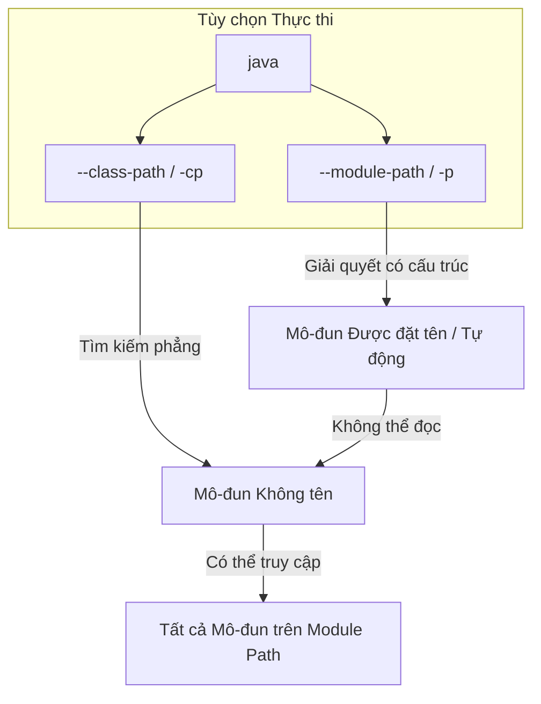

# Hệ Thống Mô-đun Java (Java Module System) - Phần 1

## Mục Tiêu Học Tập

Tài liệu này tập trung vào **Hệ Thống Mô-đun Java** (được giới thiệu từ Java 9 dưới tên gọi Dự án Jigsaw). Hãy nghiên cứu cách các mô-đun thực thi cơ chế đóng gói mạnh mẽ (strong encapsulation), giải quyết tình trạng "địa ngục đường dẫn lớp" (classpath hell), và thay đổi cách JVM tải cũng như bảo mật các lớp.

## Tóm Tắt Nội Dung (Outline Coverage)

- **`What is a module?`** — Một tập hợp tự mô tả của mã nguồn (các gói) và dữ liệu (các tài nguyên) đi kèm với một bộ mô tả mô-đun.
- **`module-info.java`** — Tệp bộ mô tả mô-đun xác định tên mô-đun, các phụ thuộc, và các gói được xuất.
- **`requires`** — Chỉ thị khai báo một sự phụ thuộc vào một mô-đun khác.
- **`exports`** — Chỉ thị giúp các kiểu dữ liệu công khai (public type) trong một gói có thể truy cập được bởi các mô-đun khác tại thời điểm biên dịch và thời điểm chạy.
- **`opens`** — Chỉ thị cho phép phản chiếu sâu (deep reflection) tại thời điểm chạy trên một gói trong khi chặn quyền truy cập tại thời điểm biên dịch.
- **`Named module`** — Một mô-đun có tên được xác định trong tệp `module-info.class`, được tải từ đường dẫn mô-đun (module path).
- **`Unnamed module`** — Một mô-đun gom tất cả các lớp được tải từ classpath để duy trì khả năng tương thích ngược.
- **`Automatic module`** — Một mô-đun cầu nối được tạo ra khi một tệp JAR truyền thống (không chứa `module-info.class`) được đặt trên đường dẫn mô-đun (module path).
- **`Module-level encapsulation`** — Kiểm soát truy cập mạnh mẽ được thực thi ở cấp JVM, chặn việc rò rỉ API công khai và phản chiếu trái phép.
- **`Module path vs Classpath`** — Classpath là một danh sách phẳng, nhạy cảm với thứ tự của các tệp JAR; Module path là một tập hợp các mô-đun được đặt tên có nhận thức về cấu trúc.

---

## Ghi Chú Chi Tiết

### Mô-đun là gì? (What is a Module?)

Một **mô-đun (Module)** là một gói chứa các lớp Java, giao diện (Interface), và tài nguyên được nhóm lại với nhau đi kèm một **bộ mô tả mô-đun (Module descriptor)** (`module-info.class`). Nó giới thiệu một cấp độ gộp nhóm cao hơn so với các gói (Package), chuyển đổi Java từ một danh sách các lớp phẳng thành một đồ thị phụ thuộc có cấu trúc.

#### Tại sao Mô-đun Giải quyết được Classpath Hell và Lỗ hổng Bảo mật

Trong Java truyền thống (Java 8 trở về trước), tất cả các lớp được tải qua **Đường dẫn lớp (Classpath)** đều được gom vào một không gian tên (Namespace) phẳng duy nhất. Điều này dẫn đến hai khuyết điểm chí mạng:
1. **Địa ngục Đường dẫn lớp (Classpath Hell)**: Nếu hai tệp JAR chứa cùng một tên lớp trong cùng một gói (gọi là "gói bị chia tách" - split package), JVM sẽ tải tệp JAR nào xuất hiện trước trên dòng lệnh. Điều này khiến quá trình triển khai thiếu tính xác định. Hơn nữa, nếu thiếu một phụ thuộc, trình biên dịch cũng không biết; ứng dụng vẫn khởi động bình thường và chỉ sập vài giờ sau đó khi mã nguồn cố gắng thực thi lớp bị thiếu, ném ra ngoại lệ `NoClassDefFoundError`.
2. **Khả năng đóng gói yếu**: Từ khóa sửa đổi `public` đồng nghĩa với việc "công khai đối với toàn bộ JVM". Bất kỳ lập trình viên nào cũng có thể nhập các API nội bộ của JDK (như `sun.misc.Unsafe`) hoặc các gói nội bộ của thư viện. Điều này ngăn cản các tác giả thư viện sửa đổi các chi tiết triển khai nội bộ, vì những thay đổi này sẽ làm hỏng ứng dụng của người dùng.

Hệ thống Mô-đun Java (Dự án Jigsaw) giải quyết những vấn đề này bằng cách giới thiệu cơ chế **Đóng gói mạnh mẽ (Strong Encapsulation)** và **Cấu hình đáng tin cậy (Reliable Configuration)**:
- **Đóng gói mạnh mẽ**: Các gói bên trong một mô-đun sẽ vô hình đối với các mô-đun khác trừ khi được xuất khẩu (exports) một cách tường minh. Ngay cả khi một lớp và các phương thức của nó được khai báo là `public`, chúng vẫn không thể được truy cập bởi mô-đun khác trừ khi mô-đun chứa lớp đó `exports` gói của nó.
- **Cấu hình đáng tin cậy**: Các phụ thuộc được khai báo rõ ràng. Khi khởi động, JVM kiểm tra đồ thị mô-đun. Nếu thiếu bất kỳ mô-đun bắt buộc nào, hoặc nếu có sự phụ thuộc vòng (Cyclic dependency), JVM sẽ lập tức dừng hoạt động với thông báo lỗi rõ ràng trước khi chạy bất kỳ đoạn mã ứng dụng nào.

#### Phép so sánh: Đống bộ nhớ lộn xộn so với Thùng container niêm phong
- **Đường dẫn lớp Classpath (Cũ)**: Một đống lộn xộn các bộ phận rời rạc. Bất kỳ ai cũng có thể thò tay vào, lấy bất kỳ bộ phận nào, hoặc vô tình ghi đè một bộ phận bằng một bản sao trùng lặp vì không có ranh giới nào cả.
- **Đường dẫn mô-đun Module Path (Hiện đại)**: Các thùng container được niêm phong kỹ càng. Mỗi container đều có một bản khai báo ở bên ngoài (`module-info.class`) nêu rõ nó cần gì từ các container khác và những nội dung cụ thể nào bên trong được phép mang ra ngoài.

```mermaid
flowchart TD
    subgraph Classpath (Flat Heap)
        A[Class A] --- B[Class B]
        C[Class C] --- A
        D[Duplicate Class B]
    end
    subgraph Module Path (Encapsulated Modules)
        subgraph Module A
            DirA[module-info.class] -->|requires| ModuleB
            ExportA[exports package.a]
        end
        subgraph ModuleB
            DirB[module-info.class]
            ExportB[exports package.b]
            InternalB[internal.package.c]
        end
    end
```

#### Chuỗi Nguyên nhân - Kết quả của việc Xác thực lúc Khởi động
```text
Thiếu tệp JAR trên Classpath
  → JVM bỏ qua nó khi khởi động
  → Classloader cố gắng tải lớp tại thời điểm chạy
  → Ném ClassNotFoundException / NoClassDefFoundError (Ứng dụng sập trên môi trường thực tế)

Thiếu Mô-đun trên Module Path
  → JVM giải quyết đồ thị mô-đun khi khởi động
  → Phát hiện thiếu phụ thuộc trong module-info
  → Ứng dụng dừng lập tức với lỗi chi tiết (Cơ chế thất bại nhanh an toàn)
```

---

### module-info.java và các Chỉ thị Mô-đun

Tệp mô tả mô-đun phải được đặt tên là `module-info.java` và nằm ở thư mục gốc của thư mục nguồn (ví dụ: `src/main/java/module-info.java`). Nó được biên dịch thành tệp `module-info.class`.

```java
// File: src/main/java/module-info.java
module com.example.app {
    // Requires standard library or custom modules
    requires java.sql;
    requires transitive com.example.util; // Any module requiring 'com.example.app' gets 'com.example.util' automatically

    // Exports public classes in this package to all modules
    exports com.example.app.api;

    // Restricts exports to a specific module (Qualified Export)
    exports com.example.app.internal to com.example.trusted;

    // Opens a package for deep reflection (even private fields) at runtime only
    opens com.example.app.model to spring.beans, jackson.databind;
}
```

#### Các Chỉ thị `requires`
- `requires <module-name>`: Chỉ định rằng mô-đun này phụ thuộc vào một mô-đun khác. Nó thiết lập **khả năng đọc (Readability)** (Mô-đun A có thể đọc Mô-đun B).
- `requires transitive <module-name>`: Chỉ định một phụ thuộc mà phụ thuộc đó cũng tự động được chuyển tiếp đến bất kỳ mô-đun nào phụ thuộc vào mô-đun hiện tại.
- `requires static <module-name>`: Một phụ thuộc chỉ cần thiết tại thời điểm biên dịch. Nó là tùy chọn tại thời điểm chạy.

---

### exports so với opens (exports vs opens)

Một nguồn gây nhầm lẫn phổ biến là khi nào nên sử dụng `exports` và khi nào nên dùng `opens`. Chúng đại diện cho các phong cách kiểm soát truy cập khác nhau:

**`exports`** cho phép truy cập lúc biên dịch (các mô-đun khác có thể viết mã sử dụng các lớp này), cho phép truy cập trực tiếp lúc chạy, và cho phép phản chiếu lúc chạy (nông) (chỉ các phần tử public mới có thể được kiểm tra). Tuy nhiên, nó chặn phản chiếu sâu lúc chạy (truy cập các thành viên `private` sẽ ném ngoại lệ).

**`opens`** chặn truy cập lúc biên dịch (trình biên dịch ném lỗi "package does not exist") và truy cập trực tiếp lúc chạy. Tuy nhiên, nó cho phép phản chiếu lúc chạy (nông) và phản chiếu sâu lúc chạy (có thể truy cập các trường/phương thức `private` qua `.setAccessible(true)`).

#### Chặn Phản chiếu Sâu (Deep Reflection Block)

Nếu bạn cố gắng thực hiện phản chiếu sâu trên một gói được xuất khẩu (exports) nhưng không được mở (opens):
```java
package com.example.app.api;
public class User {
    private String secretToken = "12345";
}
```
Nếu một khung công tác (Framework) cố gắng truy cập `secretToken` bằng phản chiếu:
```java
// Code inside a framework module
Field field = User.class.getDeclaredField("secretToken");
field.setAccessible(true); // Throws InaccessibleObjectException under strong encapsulation!
String secret = (String) field.get(userInstance); 
```
**Ngoại lệ đầu ra**:
```text
java.lang.reflect.InaccessibleObjectException: Unable to make field private java.lang.String com.example.app.api.User.secretToken accessible: 
module com.example.app does not "opens com.example.app.api" to framework.module
```

#### Chuỗi Nguyên nhân - Kết quả của `opens` so với `exports`
```text
Lớp A cần gọi Lớp B tại thời điểm biên dịch
  → Gói chứa Lớp B phải được EXPORTED
  → Trình biên dịch biên dịch thành công.

Framework cần kiểm tra các trường private của Lớp B tại thời điểm chạy
  → Gói chứa Lớp B phải được OPENED
  → JVM cho phép gọi setAccessible(true)
  → Phản chiếu thành công không ném Ngoại lệ.
```

---

### Classpath so với Module Path

Trình biên dịch Java (`javac`) và môi trường chạy (`java`) hoạt động khác nhau tùy thuộc vào việc mã nguồn được đặt trên Classpath hay trên Module Path.



#### Tải Lớp Mô-đun so với Tải Lớp Phẳng
1. **Đường dẫn lớp Classpath (Phẳng)**:
   - Dòng lệnh: `java -cp lib/dep.jar:app.jar com.example.Main`
   - Bộ tải lớp (Classloader) tìm kiếm các tệp JAR một cách tuần tự trong một danh sách phẳng.
   - Mọi thứ được tải từ classpath đều được đặt vào **Mô-đun Không tên (Unnamed Module)**.
2. **Đường dẫn mô-đun Module Path (Mô-đun)**:
   - Dòng lệnh: `java --module-path lib:app.jar -m com.example.app/com.example.Main`
   - JVM sử dụng module path để xây dựng một đồ thị có cấu trúc.
   - Chỉ các gói được xuất khẩu tường minh bởi mô-đun chứa chúng mới có thể được tìm kiếm bởi các classloader khác.
   - Các phụ thuộc vòng được phát hiện trong quá trình giải quyết đồ thị và bị từ chối trước khi bắt đầu tải lớp.

---

### Mô-đun được Đặt tên, Không được Đặt tên, và Mô-đun Tự động

Để cho phép di chuyển từng bước từ Java 8, Java định nghĩa ba loại mô-đun:

**Mô-đun được Đặt tên (Named Module)** được định nghĩa bằng tệp `module-info.class` và được tải từ đường dẫn mô-đun (`--module-path`). Việc xuất khẩu (exports) hoặc mở (opens) được thực hiện tường minh theo định nghĩa. Mô-đun này có thể đọc các mô-đun được khai báo `requires` rõ ràng. Nguồn gốc tên gọi được định nghĩa trong `module-info.java`.

**Mô-đun không Đặt tên (Unnamed Module)** không có tệp `module-info.class` (ngầm định) và được tải từ đường dẫn lớp (`-cp`). Nó xuất khẩu tất cả các gói và có thể đọc tất cả mô-đun trên Module Path. Nó không có nguồn gốc tên gọi (được gọi là không tên).

**Mô-đun Tự động (Automatic Module)** là tệp JAR cũ (không có `module-info.class`) và được tải từ đường dẫn mô-đun (`--module-path`). Nó xuất khẩu và mở tất cả các gói. Nó có thể đọc tất cả mô-đun (được đặt tên, không đặt tên, tự động). Tên của nó được trích xuất từ tên tệp JAR hoặc thuộc tính Manifest.

#### Cơ chế Cầu nối Di cư
Bởi vì các mô-đun được đặt tên không thể yêu cầu (requires) mô-đun không đặt tên (vì nó không có tên và không thể được tham chiếu tường minh), việc tải trực tiếp mã nguồn cũ vào một mô-đun được đặt tên sẽ bị lỗi. Để bắc cầu cho vấn đề này:
1. Bạn đặt một tệp JAR thư viện cũ lên **Đường dẫn mô-đun (Module Path)**.
2. JVM đối xử với nó như một **Mô-đun Tự động**. Nó tự động có một tên mô-đun (ví dụ: `commons.lang3` từ tệp `commons-lang3-3.12.0.jar` or via the `Automatic-Module-Name` manifest header).
3. Các mô-đun được đặt tên bây giờ có thể khai báo `requires commons.lang3;`.
4. Mô-đun tự động có thể đọc tất cả các mô-đun khác (bao gồm cả mô-đun không đặt tên của classpath), làm cầu nối kết nối giữa thế giới cũ và thế giới mới.

```text
Mô-đun được Đặt tên
  → requires com.helper (Mô-đun Tự động)
  → truy cập lớp cũ kế thừa
  → Thành công!
```

---

## Liên Kết Tham Khảo

- [Tài liệu hướng dẫn về Mô-đun Java của Oracle](https://dev.java/learn/modules/)
- [Đặc tả Ngôn ngữ Java: Chương 7.7 (Khai báo Mô-đun)](https://docs.oracle.com/javase/specs/jls/se21/html/jls-7.html#jls-7.7)
- [Hướng dẫn khởi đầu nhanh Dự án Jigsaw](https://openjdk.org/projects/jigsaw/quick-start)
