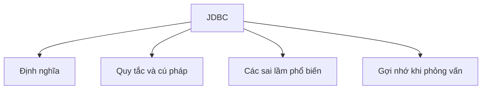

# 34 - JDBC (Kết Nối Cơ Sở Dữ Liệu Java - Java Database Connectivity)

Chủ đề này bám sát đề cương chính trong [outline.md](../../outline.md). Mục tiêu là hiểu sâu sắc từng khái niệm để có thể giải thích, nhận diện trong mã nguồn và trả lời tốt các câu hỏi phỏng vấn.

## Thứ Tự Học Tập (Study Order)

- [Các Khái Niệm JDBC (What Is Jdbc Concepts)](theory/01-what-is-jdbc-concepts.md)
- [Khái Niệm Quay Lui Giao Dịch (Rollback Concepts)](theory/02-rollback-concepts.md)
- [Các Thuật Ngữ Khóa (Key Terms)](terms/01-key-terms.md)

## Danh Sách Đề Cương (Outline Checklist)

- JDBC là gì?
- Driver (Trình điều khiển)
- DriverManager
- Connection (Kết nối)
- Statement (Câu lệnh)
- PreparedStatement (Câu lệnh chuẩn bị trước)
- CallableStatement (Câu lệnh gọi thủ tục)
- ResultSet (Tập kết quả)
- Giao dịch (Transaction):
  - commit (Xác nhận)
  - rollback (Quay lui)
  - setAutoCommit (Thiết lập tự động xác nhận)
- Batch processing (Xử lý theo lô)
- SQL Injection (Tấn công chèn mã SQL)
- Bể chứa kết nối cơ bản (Basic Connection Pool)
- DataSource (Nguồn dữ liệu)
- Các thao tác CRUD sử dụng JDBC

## Tự Kiểm Tra (Self-Check)

1. Tại sao `PreparedStatement` ngăn chặn được tấn công SQL injection, và làm thế nào nó tận dụng bộ đệm kế hoạch truy vấn (query plan cache) của cơ sở dữ liệu để nâng cao hiệu năng so với `Statement`?
2. Tại sao việc tắt chế độ tự động commit (auto-commit) lại ghi đè lên hành vi mặc định của cơ sở dữ liệu, và tại sao việc kiểm soát thủ công này lại quan trọng để duy trì các ranh giới ACID của giao dịch?
3. Tại sao các điểm lưu trữ `Savepoint` của cơ sở dữ liệu cho phép quay lui (rollback) một phần, và cơ chế bên dưới cũng như tác động của nó lên các mức cô lập giao dịch (transaction isolation levels) khi thực thi một phần quay lui là gì?
4. Tại sao các bể chứa kết nối cơ sở dữ liệu (như HikariCP) mang lại hiệu năng vượt trội, và làm thế nào chúng tái sử dụng các kết nối vật lý để tránh việc bắt tay TCP (TCP handshakes) và chi phí xác thực cơ sở dữ liệu?
5. Tại sao các tài nguyên JDBC (`Connection`, `Statement`, `ResultSet`) phải được đóng theo đúng thứ tự ngược lại so với khi chúng được tạo ra, và cấu trúc try-with-resources ngăn chặn rò rỉ tài nguyên như thế nào trong cơ chế thu gom rác của JVM?

## Thẻ Học Anki (Anki Cards)

- [Basic](anki/basic.tsv)
- [Basic Extra](anki/basic-extra.tsv)
- [Cloze](anki/cloze.tsv)
- [Code Question](anki/code-question.tsv)

## Sơ Đồ Mermaid Tổng Quan (Mermaid Overview)

## Liên Kết Tham Khảo (Reference Links)

- https://docs.oracle.com/javase/tutorial/jdbc/
- https://docs.oracle.com/en/java/javase/21/docs/api/java.sql/java/sql/package-summary.html
