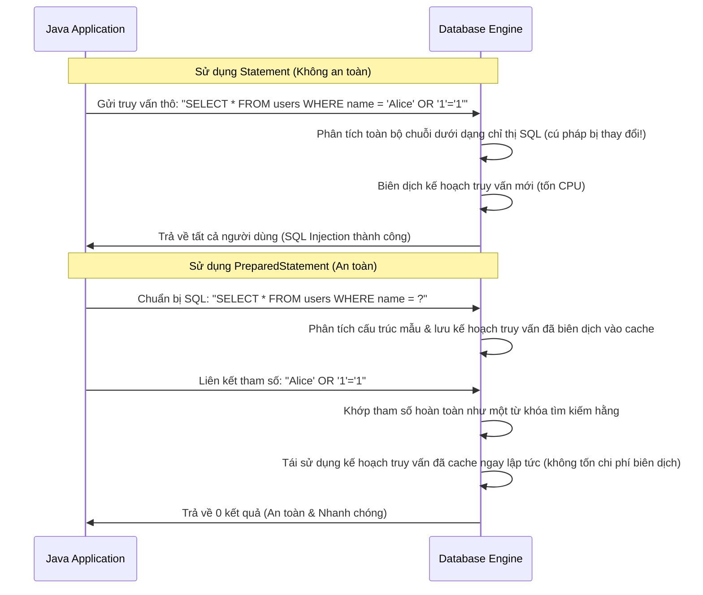

# JDBC - Phần 1 (JDBC - Part 1)

## Mục tiêu học tập

Tài liệu này tập trung vào một phần trọng tâm của **JDBC**. Hãy nghiên cứu từng khái niệm dưới dạng quy tắc Java thực tế, thay vì chỉ học các từ vựng rời rạc.

## Đề cương chi tiết

- **`What is JDBC?`** — JDBC là gì? (What is JDBC?): JDBC là API Java để kết nối với các cơ sở dữ liệu quan hệ.
- **`Driver`** — Trình điều khiển (Driver): Trình điều khiển là một khái niệm cụ thể trong JDBC; hãy tìm hiểu quy tắc Java của nó, các trường hợp sử dụng hợp lệ và trạng thái lỗi thay vì chỉ nhớ tên của nó.
- **`DriverManager`** — Trình quản lý trình điều khiển (DriverManager): DriverManager là một khái niệm cụ thể trong JDBC; hãy tìm hiểu quy tắc Java của nó, các trường hợp sử dụng hợp lệ và trạng thái lỗi thay vì chỉ nhớ tên của nó.
- **`Connection`** — Kết nối (Connection): Kết nối đại diện cho một kết nối cơ sở dữ liệu đang hoạt động được sử dụng để tạo các câu lệnh và quản lý các giao dịch.
- **`Statement`** — Câu lệnh (Statement): Câu lệnh thực thi các câu lệnh SQL tĩnh nhưng không nên được sử dụng với đầu vào không đáng tin cậy.
- **`PreparedStatement`** — Câu lệnh chuẩn bị trước (PreparedStatement): PreparedStatement biên dịch trước SQL với các tham số giữ chỗ và liên kết các giá trị một cách an sau.
- **`CallableStatement`** — Câu lệnh gọi hàm (CallableStatement): CallableStatement gọi các thủ tục lưu trữ (stored procedure) thông qua JDBC.
- **`ResultSet`** — Tập kết quả (ResultSet): ResultSet đại diện cho một tập hợp kết quả cơ sở dữ liệu, cung cấp quyền truy cập vào dữ liệu đã truy xuất.
- **`Transaction:`** — Giao dịch (Transaction): Giao dịch là một nhóm các quy tắc liên quan trong JDBC tập hợp một số chi tiết liên quan.
- **`commit`** — commit: commit lưu các thay đổi của giao dịch hiện tại một cách vĩnh viễn.

## Ghi chú chi tiết

### What is JDBC?

JDBC là API Java để kết nối với các cơ sở dữ liệu quan hệ.

Sử dụng nó để dự đoán quy tắc Java chính xác, dạng được cho phép và trạng thái lỗi. Hãy ôn tập bằng một ví dụ nhỏ thay vì chỉ học vẹt nhãn dán.

Kiểm tra thực tế:

- Định nghĩa `What is JDBC?` trong một câu.
- Nhận diện `What is JDBC?` trong mã nguồn, lệnh, tài liệu, hoặc câu hỏi phỏng vấn.
- Giải thích một lỗi, hạn chế, hoặc sự đánh đổi liên quan đến `What is JDBC?`.

Ví dụ nhỏ hoặc mô hình tư duy:

- `PreparedStatement` liên kết các giá trị một cách an toàn với các tham số giữ chỗ.

### Trình điều khiển (Driver)

Trình điều khiển (Driver) là một khái niệm cụ thể trong JDBC; hãy tìm hiểu quy tắc Java của nó, các trường hợp sử dụng hợp lệ và trạng thái lỗi thay vì chỉ nhớ tên của nó.

Sử dụng nó để dự đoán quy tắc Java chính xác, dạng được cho phép và trạng thái lỗi. Hãy ôn tập bằng một ví dụ nhỏ thay vì chỉ học vẹt nhãn dán.

Kiểm tra thực tế:

- Định nghĩa `Driver` trong một câu.
- Nhận diện `Driver` trong mã nguồn, lệnh, tài liệu, hoặc câu hỏi phỏng vấn.
- Giải thích một lỗi, hạn chế, hoặc sự đánh đổi liên quan đến `Driver`.

Ví dụ nhỏ hoặc mô hình tư duy:

- Khi đọc mã nguồn, hãy hỏi: `Driver` thay đổi, cho phép, từ chối hoặc làm rõ điều gì?

### Trình quản lý trình điều khiển (DriverManager)

Trình quản lý trình điều khiển (DriverManager) là một khái niệm cụ thể trong JDBC; hãy tìm hiểu quy tắc Java của nó, các trường hợp sử dụng hợp lệ và trạng thái lỗi thay vì chỉ nhớ tên của nó.

Sử dụng nó để dự đoán quy tắc Java chính xác, dạng được cho phép và trạng thái lỗi. Hãy ôn tập bằng một ví dụ nhỏ thay vì chỉ học vẹt nhãn dán.

Kiểm tra thực tế:

- Định nghĩa `DriverManager` trong một câu.
- Nhận diện `DriverManager` trong mã nguồn, lệnh, tài liệu, hoặc câu hỏi phỏng vấn.
- Giải thích một lỗi, hạn chế, hoặc sự đánh đổi liên quan đến `DriverManager`.

Ví dụ nhỏ hoặc mô hình tư duy:

- Khi đọc mã nguồn, hãy hỏi: `DriverManager` thay đổi, cho phép, từ chối hoặc làm rõ điều gì?

### Kết nối (Connection)

Kết nối (Connection) đại diện cho một kết nối cơ sở dữ liệu đang hoạt động được sử dụng để tạo các câu lệnh và quản lý các giao dịch.

Sử dụng nó để dự đoán quy tắc Java chính xác, dạng được cho phép và trạng thái lỗi. Hãy ôn tập bằng một ví dụ nhỏ thay vì chỉ học vẹt nhãn dán.

Kiểm tra thực tế:

- Định nghĩa `Connection` trong một câu.
- Nhận diện `Connection` trong mã nguồn, lệnh, tài liệu, hoặc câu hỏi phỏng vấn.
- Giải thích một lỗi, hạn chế, hoặc sự đánh đổi liên quan đến `Connection`.

Ví dụ nhỏ hoặc mô hình tư duy:

- Khi đọc mã nguồn, hãy hỏi: `Connection` thay đổi, cho phép, từ chối hoặc làm rõ điều gì?

### Câu lệnh (Statement)

Câu lệnh (Statement) thực thi các câu lệnh SQL tĩnh nhưng không nên được sử dụng với đầu vào không đáng tin cậy.

Sử dụng nó để dự đoán quy tắc Java chính xác, dạng được cho phép và trạng thái lỗi. Hãy ôn tập bằng một ví dụ nhỏ thay vì chỉ học vẹt nhãn dán.

Kiểm tra thực tế:

- Định nghĩa `Statement` trong một câu.
- Nhận diện `Statement` trong mã nguồn, lệnh, tài liệu, hoặc câu hỏi phỏng vấn.
- Giải thích một lỗi, hạn chế, hoặc sự đánh đổi liên quan đến `Statement`.

Ví dụ nhỏ hoặc mô hình tư duy:

- Khi đọc mã nguồn, hãy hỏi: `Statement` thay đổi, cho phép, từ chối hoặc làm rõ điều gì?

### Câu lệnh chuẩn bị trước (PreparedStatement)

Câu lệnh chuẩn bị trước (PreparedStatement) biên dịch trước SQL với các tham số giữ chỗ và liên kết các giá trị một cách an toàn.

Sử dụng nó để dự đoán quy tắc Java chính xác, dạng được cho phép và trạng thái lỗi. Hãy ôn tập bằng một ví dụ nhỏ thay vì chỉ học vẹt nhãn dán.

Kiểm tra thực tế:

- Định nghĩa `PreparedStatement` trong một câu.
- Nhận diện `PreparedStatement` trong mã nguồn, lệnh, tài liệu, hoặc câu hỏi phỏng vấn.
- Giải thích một lỗi, hạn chế, hoặc sự đánh đổi liên quan đến `PreparedStatement`.

Ví dụ nhỏ hoặc mô hình tư duy:

- `PreparedStatement` liên kết các giá trị một cách an toàn với các tham số giữ chỗ.

## Tại sao PreparedStatement ngăn chặn SQL Injection và tận dụng bộ nhớ đệm kế hoạch truy vấn (Query Plan Caching)

Khi một cơ sở dữ liệu nhận được một câu lệnh SQL, nó sẽ phân tích cú pháp truy vấn, kiểm tra cú pháp, phân giải tên và biên dịch một kế hoạch thực thi (kế hoạch truy vấn - query plan). Quá trình phân tích và lên kế hoạch này rất tốn tài nguyên CPU, do đó các cơ sở dữ liệu hiện đại lưu trữ các kế hoạch truy vấn đã biên dịch vào bộ đệm cache. Nếu một `Statement` thô được sử dụng với phép cộng chuỗi (ví dụ: `SELECT * FROM users WHERE name = '` + name + `'`), cấu trúc truy vấn sẽ thay đổi với mỗi tên đầu vào khác nhau, khiến bộ nhớ đệm kế hoạch truy vấn trở nên vô dụng và buộc cơ sở dữ liệu phải biên dịch lại truy vấn mỗi lần thực thi. Nguy hiểm hơn, phép cộng chuỗi cho phép đầu vào độc hại chứa các lệnh SQL (ví dụ: `' OR '1'='1`) thao túng cây cú pháp của chính câu lệnh SQL, dẫn đến chèn mã độc SQL (SQL injection). Nguy kịch hơn, `PreparedStatement` biên dịch trước mẫu truy vấn với các tham số giữ chỗ (`?`) ngay khi khởi tạo. Các tham số đầu vào được gửi riêng biệt với câu lệnh SQL trong quá trình thực thi. Công cụ cơ sở dữ liệu đối xử với các giá trị tham số hoàn toàn như các giá trị hằng (literal value) thay vì các lệnh SQL có thể thực thi, vô hiệu hóa mọi nỗ lực chèn mã độc trong khi đảm bảo cấu trúc truy vấn đã biên dịch vẫn giống hệt nhau, cho phép các công cụ cơ sở dữ liệu tái sử dụng các kế hoạch truy vấn đã lưu đệm một cách hiệu quả.

### Mô hình tư duy: Khe nhận thư truy vấn so với tập lệnh Shell có thể thực thi
Hãy tưởng tượng bạn gửi một yêu cầu tới phòng xử lý thư:
- **Statement (Không an toàn)**: Bạn gửi một bức thư hoàn chỉnh có nội dung "Chạy script: xóa tệp X". Trình thông dịch đọc toàn bộ trang giấy và thực thi bất cứ điều gì được viết trên đó. Nếu ai đó viết thêm "và xóa tệp Y", phòng xử lý thư vẫn thực hiện vì họ phân tích toàn bộ văn bản dưới dạng các chỉ thị.
- **PreparedStatement (An toàn)**: Bạn gửi trước một mẫu (template): "Chạy script: xóa tệp [FILE_NAME]". Phòng xử lý thư phân tích và tối ưu hóa mẫu này một lần duy nhất. Sau đó, bạn chỉ gửi tham số "X" qua một khe chuyên dụng. Ngay cả khi bạn gửi tham số "X; xóa tệp Y", phòng xử lý thư vẫn đối xử với toàn bộ đầu vào đó hoàn toàn như một tên tệp, cố gắng xóa một tệp duy nhất có tên chính xác là `X; xóa tệp Y`, ngăn chặn hoàn toàn việc thực thi bất kỳ lệnh mới nào.



### Ví dụ mã nguồn
```java
String sql = "SELECT * FROM users WHERE username = ? AND password = ?";
try (Connection conn = dataSource.getConnection();
     PreparedStatement pstmt = conn.prepareStatement(sql)) {
     
    // Malicious input trying to bypass authentication
    String inputUser = "admin";
    String inputPass = "' OR '1'='1";
    
    pstmt.setString(1, inputUser);
    pstmt.setString(2, inputPass);
    
    try (ResultSet rs = pstmt.executeQuery()) {
        if (rs.next()) {
            System.out.println("Login success");
        } else {
            System.out.println("Login failed"); // Expected output: Login failed
        }
    }
}
```

### Chuỗi nguyên nhân - kết quả
1. **Đầu vào tham số độc hại** (`' OR '1'='1`) ➔ 
2. **Biên dịch trước mẫu truy vấn** (`username = ?`) ➔ 
3. **Tách biệt cú pháp truy vấn và dữ liệu tham số** ➔ 
4. **Tham số được đối xử hoàn toàn như một giá trị hằng** ➔ 
5. **Cây cú pháp cơ sở dữ liệu không bị thay đổi** ➔ 
6. **Không thể chèn mã độc VÀ Đạt tỉ lệ trúng cache kế hoạch truy vấn** ➔ 
7. **Thực thi an toàn và tối ưu**.

### Câu lệnh gọi hàm (CallableStatement)

Câu lệnh gọi hàm (CallableStatement) gọi các thủ tục lưu trữ (stored procedure) thông qua JDBC.

Sử dụng nó để dự đoán quy tắc Java chính xác, dạng được cho phép và trạng thái lỗi. Hãy ôn tập bằng một ví dụ nhỏ thay vì chỉ học vẹt nhãn dán.

Kiểm tra thực tế:

- Định nghĩa `CallableStatement` trong một câu.
- Nhận diện `CallableStatement` trong mã nguồn, lệnh, tài liệu, hoặc câu hỏi phỏng vấn.
- Giải thích một lỗi, hạn chế, hoặc sự đánh đổi liên quan đến `CallableStatement`.

Ví dụ nhỏ hoặc mô hình tư duy:

- Khi đọc mã nguồn, hãy hỏi: `CallableStatement` thay đổi, cho phép, từ chối hoặc làm rõ điều gì?

### Tập kết quả (ResultSet)

Tập kết quả (ResultSet) đại diện cho một tập hợp kết quả cơ sở dữ liệu, cung cấp quyền truy cập tuần tự vào các hàng dữ liệu đã được lấy ra.

Nó quan trọng vì nó duy trì một con trỏ (cursor) trỏ đến hàng dữ liệu hiện tại, con trỏ này ban đầu được đặt trước hàng đầu tiên. Bạn phải gọi `next()` để di chuyển con trỏ tiến lên và lấy dữ liệu.

Kiểm tra thực tế:

- Định nghĩa `ResultSet` trong một câu.
- Nhận diện `ResultSet` trong mã nguồn, lệnh, tài liệu, hoặc câu hỏi phỏng vấn.
- Giải thích một lỗi, hạn chế, hoặc sự đánh đổi liên quan đến `ResultSet`.

Ví dụ nhỏ hoặc mô hình tư duy:

- Khi đọc mã nguồn, hãy hỏi: `ResultSet` thay đổi, cho phép, từ chối hoặc làm rõ điều gì?

### Giao dịch (Transaction)

Giao dịch (Transaction) là một nhóm các quy tắc liên quan trong JDBC tập hợp một số chi tiết liên quan.

Sử dụng nó để dự đoán quy tắc Java chính xác, dạng được cho phép và trạng thái lỗi. Hãy ôn tập bằng một ví dụ nhỏ thay vì chỉ học vẹt nhãn dán.

Kiểm tra thực tế:

- Định nghĩa `Transaction:` trong một câu.
- Nhận diện `Transaction:` trong mã nguồn, lệnh, tài liệu, hoặc câu hỏi phỏng vấn.
- Giải thích một lỗi, hạn chế, hoặc sự đánh đổi liên quan đến `Transaction:`.

Ví dụ nhỏ hoặc mô hình tư duy:

- Khi đọc mã nguồn, hãy hỏi: `Transaction:` thay đổi, cho phép, từ chối hoặc làm rõ điều gì?

### commit

commit lưu các thay đổi của giao dịch hiện tại một cách vĩnh viễn.

Sử dụng nó để dự đoán quy tắc Java chính xác, dạng được cho phép và trạng thái lỗi. Hãy ôn tập bằng một ví dụ nhỏ thay vì chỉ học vẹt nhãn dán.

Kiểm tra thực tế:

- Định nghĩa `commit` trong một câu.
- Nhận diện `commit` trong mã nguồn, lệnh, tài liệu, hoặc câu hỏi phỏng vấn.
- Giải thích một lỗi, hạn chế, hoặc sự đánh đổi liên quan đến `commit`.

Ví dụ nhỏ hoặc mô hình tư duy:

- Khi đọc mã nguồn, hãy hỏi: `commit` thay đổi, cho phép, từ chối hoặc làm rõ điều gì?

## Tại sao các tài nguyên JDBC phải được đóng theo thứ tự ngược lại một cách nghiêm ngặt

Các thao tác JDBC phụ thuộc vào ba tài nguyên chính: `Connection` (đại diện cho phiên kết nối cơ sở dữ liệu vật lý), `Statement` hoặc `PreparedStatement` (đại diện cho ngữ cảnh thực thi truy vấn SQL đã biên dịch), và `ResultSet` (đại diện cho con trỏ đọc các hàng trong bảng cơ sở dữ liệu). Các tài nguyên này được cấu trúc theo phân cấp: một `Connection` tạo ra một `Statement`, và một `Statement` tạo ra một `ResultSet`. Trong cơ sở dữ liệu, mỗi tài nguyên này nắm giữ các khối bộ nhớ phía máy chủ (server-side memory block), bảng tạm thời, và các con trỏ cursor tương ứng. Nếu chúng không được đóng đúng cách, các tài nguyên phía máy chủ này vẫn mở, gây ra rò rỉ kết nối (connection leak) hoặc lỗi cạn kiệt con trỏ (chẳng hạn như lỗi của Oracle `ORA-01000: maximum open cursors exceeded`). Chúng phải được đóng theo thứ tự ngược lại một cách nghiêm ngặt so với thứ tự tạo ra (`ResultSet` -> `Statement` -> `Connection`). Việc đóng một tài nguyên cha (ví dụ: `Connection`) *trước* tài nguyên con của nó (ví dụ: `ResultSet`) sẽ khiến công cụ cơ sở dữ liệu còn lại các con trỏ cursor mồ côi hoặc kích hoạt trạng thái ổ cắm socket lơ lửng, có thể khiến các truy vấn tiếp theo bị treo hoặc ném ra các `SQLException` không mong muốn. Việc sử dụng câu lệnh try-with-resources của Java 7 đảm bảo việc đóng tài nguyên diễn ra đúng cách, tự động và an toàn. Try-with-resources tự động dịch thành một khối `finally` lồng nhau để gọi `.close()` trên tất cả các biến tài nguyên được khai báo bên trong dấu ngoặc đơn theo đúng thứ tự ngược lại của khai báo, ngay cả khi có ngoại lệ xảy ra trong quá trình thực thi truy vấn.

### Mô hình tư duy: Hộp búp bê Nga Matryoshka lồng nhau
Hãy tưởng tượng ba chiếc hộp lồng vào nhau: một chiếc hộp lớn (`Connection`), một chiếc hộp trung bình (`Statement`) bên trong nó, và một chiếc hộp nhỏ (`ResultSet`) bên trong chiếc hộp đó. Nếu bạn cố gắng đóng chiếc hộp lớn lại trong khi chiếc hộp nhỏ vẫn đang mở và nhô ra ngoài, bạn sẽ làm hỏng bản lề (tài nguyên bị treo). Để đóng cả bộ một cách sạch sẽ mà không làm hỏng hóc, bạn phải đóng chiếc hộp nhỏ trước, sau đó là chiếc hộp trung bình, và cuối cùng là chiếc hộp lớn.

```mermaid
graph TD
    subgraph Creation Order [Thứ tự tạo]
        A[1. Connection] --> B[2. Statement / PreparedStatement]
        B --> C[3. ResultSet]
    end
    subgraph Close Order (Strict Reverse) [Thứ tự đóng (Ngược lại nghiêm ngặt)]
        C1[1. ResultSet.close] --> B1[2. Statement.close]
        B1 --> A1[3. Connection.close]
    end
    A -.->|Cha của| B
    B -.->|Cha của| C
    C1 -.->|Con của| B1
    B1 -.->|Con của| A1
```

### Ví dụ mã nguồn
```java
// Correct closure using try-with-resources (Automatic reverse-order closing)
String sql = "SELECT id, email FROM users WHERE role = ?";
try (Connection conn = dataSource.getConnection();                       // 1st created, last closed
     PreparedStatement stmt = conn.prepareStatement(sql)) {               // 2nd created, 2nd closed
     
    stmt.setString(1, "ADMIN");
    
    try (ResultSet rs = stmt.executeQuery()) {                            // 3rd created, 1st closed
        while (rs.next()) {
            System.out.println("Admin ID: " + rs.getInt("id"));
        }
    } // rs.close() is called automatically here
} // stmt.close() is called automatically, then conn.close() is called automatically
```

### Chuỗi nguyên nhân - kết quả
1. **Khối try-with-resources kết thúc** -> 
2. **Các khối finally lồng nhau do trình biên dịch tạo ra được thực thi** -> 
3. **`ResultSet.close()` được gọi trước tiên, giải phóng con trỏ cơ sở dữ liệu** -> 
4. **`Statement.close()` được gọi thứ hai, giải phóng phiên biên dịch cơ sở dữ liệu** -> 
5. **`Connection.close()` được gọi cuối cùng, trả kết nối vật lý về lại bể chứa (pool)** -> 
6. **Không xảy ra rò rỉ tài nguyên trên cả client JVM lẫn máy chủ cơ sở dữ liệu**.

## Câu hỏi ôn tập thường gặp

- Khái niệm nào ở đây là quy tắc thời điểm biên dịch?
- Khái niệm nào ở đây ảnh hưởng đến hành vi thời điểm chạy?
- Khái niệm nào ở đây có khả năng là bẫy phỏng vấn?

## Các ví dụ mã nguồn

### Truy vấn với PreparedStatement và ResultSet
```java
String sql = "SELECT id, name, email FROM users WHERE status = ?";
try (Connection conn = dataSource.getConnection();
     PreparedStatement stmt = conn.prepareStatement(sql)) {
     
    stmt.setString(1, "ACTIVE");
    try (ResultSet rs = stmt.executeQuery()) {
        while (rs.next()) {
            int id = rs.getInt("id");
            String name = rs.getString("name");
            System.out.println("User: " + id + " - " + name);
        }
    }
}
```

### Gọi thủ tục lưu trữ với CallableStatement
```java
try (Connection conn = dataSource.getConnection();
     CallableStatement stmt = conn.prepareCall("{call get_user_salary(?, ?)}")) {
     
    stmt.setInt(1, 101); // Input parameter
    stmt.registerOutParameter(2, java.sql.Types.DOUBLE); // Output parameter
    stmt.execute();
    double salary = stmt.getDouble(2);
    System.out.println("Salary: " + salary);
}
```

## Các lỗi thường gặp

- **Quên đóng tài nguyên**: Nếu Connection, Statement, hoặc ResultSet không được đóng (ví dụ: không sử dụng try-with-resources), nó có thể nhanh chóng làm cạn kiệt bể chứa kết nối cơ sở dữ liệu (connection pool) hoặc giới hạn con trỏ.
- **SQL Injection với Statement**: Cộng các chuỗi để xây dựng các câu lệnh SQL (ví dụ: `"SELECT * FROM users WHERE name = '" + name + "'"`) thay vì sử dụng các tham số giữ chỗ (`?`) trong một `PreparedStatement`.
- **Đọc ResultSet trước khi gọi next()**: Con trỏ ban đầu được định vị trước hàng đầu tiên, do đó gọi `rs.getString(1)` mà không gọi `rs.next()` trước sẽ ném ra ngoại lệ `SQLException`.

## Liên kết tham khảo

- https://docs.oracle.com/javase/tutorial/jdbc/basics/prepared.html (PreparedStatement Basics)
- https://docs.oracle.com/en/java/javase/21/docs/api/java.sql/java/sql/PreparedStatement.html (Java SE 21 PreparedStatement API)
- https://docs.oracle.com/javase/tutorial/jdbc/basics/processingsqlstatements.html (Processing SQL Statements)
