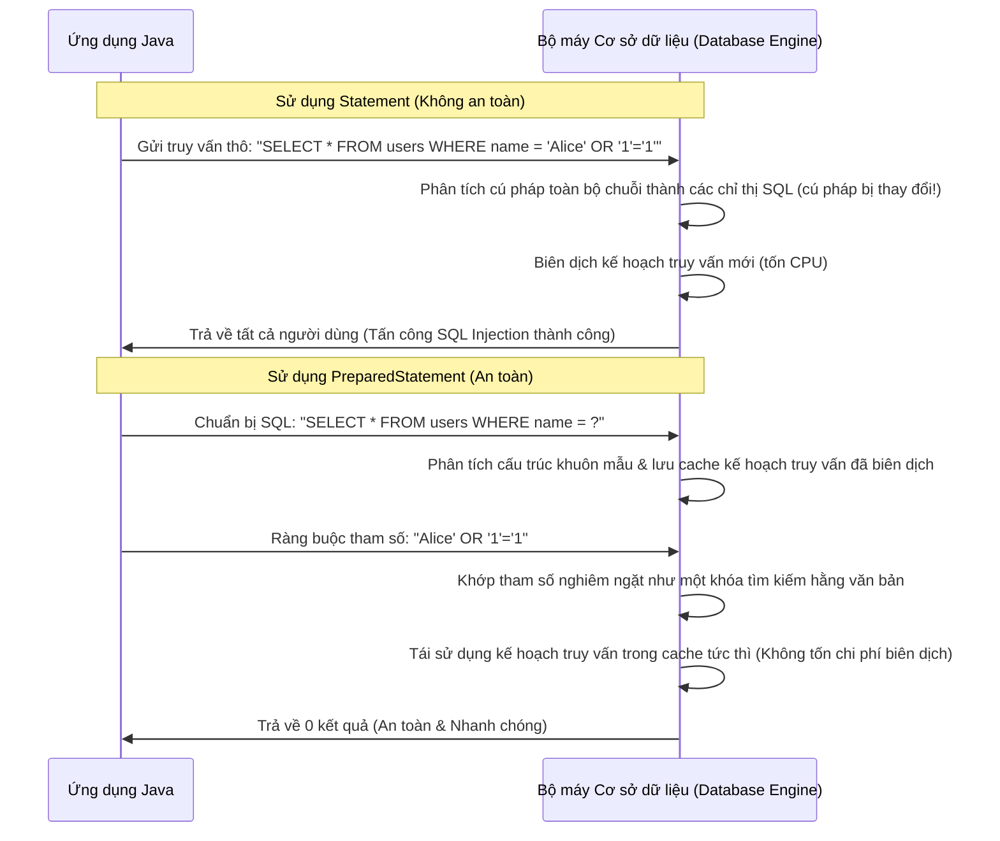

# JDBC - Phần 1

## Mục tiêu học tập (Learning Goal)

Tài liệu này bao gồm một phần trọng tâm của **JDBC**. Hãy nghiên cứu từng khái niệm như một quy tắc Java thực tế, thay vì chỉ là từ vựng rời rạc.

## Phạm vi đề mục (Outline Coverage)

| Khái niệm (Concept) | Điều cần biết (What to know) |
| --- | --- |
| `What is JDBC?` | JDBC là API Java để kết nối tới các cơ sở dữ liệu quan hệ. |
| `Driver` | Driver là một khái niệm cụ thể trong JDBC; hãy tìm hiểu quy tắc Java, các trường hợp sử dụng hợp lệ và chế độ lỗi của nó thay vì chỉ nhớ tên. |
| `DriverManager` | DriverManager là một khái niệm cụ thể trong JDBC; hãy tìm hiểu quy tắc Java, các trường hợp sử dụng hợp lệ và chế độ lỗi của nó thay vì chỉ nhớ tên. |
| `Connection` | Connection đại diện cho một kết nối cơ sở dữ liệu đang hoạt động được sử dụng để tạo các câu lệnh và quản lý giao dịch. |
| `Statement` | Statement thực thi SQL tĩnh nhưng không nên được sử dụng với đầu vào không đáng tin cậy. |
| `PreparedStatement` | PreparedStatement biên dịch trước SQL với các trình giữ chỗ và ràng buộc các giá trị một cách an sau. |
| `CallableStatement` | CallableStatement thực hiện các cuộc gọi tới thủ tục lưu trữ (stored procedures) thông qua JDBC. |
| `ResultSet` | ResultSet đại diện cho tập kết quả cơ sở dữ liệu, cung cấp quyền truy cập vào dữ liệu được truy xuất. |
| `Transaction:` | Transaction là một nhóm các quy tắc liên quan trong JDBC nhằm nhóm các chi tiết liên quan lại với nhau. |
| `commit` | commit giúp lưu các thay đổi của giao dịch hiện tại một cách vĩnh viễn. |

## Ghi chú chi tiết (Detailed Notes)

### JDBC là gì? (What is JDBC?)

JDBC là API Java để kết nối tới các cơ sở dữ liệu quan hệ.

Sử dụng nó để dự đoán chính xác quy tắc Java, biểu mẫu được phép và chế độ lỗi (failure mode). Xem xét nó với một ví dụ nhỏ thay vì chỉ ghi nhớ nhãn tên.

Các bước kiểm tra thực tế:
- Định nghĩa `What is JDBC?` trong một câu.
- Nhận diện `What is JDBC?` trong mã nguồn, các lệnh, tài liệu hoặc các câu hỏi phỏng vấn.
- Giải thích một lỗi, hạn chế, hoặc đánh đổi liên quan đến `What is JDBC?`.

Ví dụ nhỏ hoặc mô hình tư duy:
- `PreparedStatement` ràng buộc các giá trị một cách an toàn bằng các trình giữ chỗ.

### Driver

Driver là một khái niệm cụ thể trong JDBC; hãy tìm hiểu quy tắc Java, các trường hợp sử dụng hợp lệ và chế độ lỗi của nó thay vì chỉ nhớ tên.

Sử dụng nó để dự đoán chính xác quy tắc Java, biểu mẫu được phép và chế độ lỗi (failure mode). Xem xét nó với một ví dụ nhỏ thay vì chỉ ghi nhớ nhãn tên.

Các bước kiểm tra thực tế:
- Định nghĩa `Driver` trong một câu.
- Nhận diện `Driver` trong mã nguồn, các lệnh, tài liệu hoặc các câu hỏi phỏng vấn.
- Giải thích một lỗi, hạn chế, hoặc đánh đổi liên quan đến `Driver`.

Ví dụ nhỏ hoặc mô hình tư duy:
- Khi đọc mã nguồn, hãy hỏi: `Driver` thay đổi, cho phép, từ chối hoặc làm rõ điều gì?

### DriverManager

DriverManager là một khái niệm cụ thể trong JDBC; hãy tìm hiểu quy tắc Java, các trường hợp sử dụng hợp lệ và chế độ lỗi của nó thay vì chỉ nhớ tên.

Sử dụng nó để dự đoán chính xác quy tắc Java, biểu mẫu được phép và chế độ lỗi (failure mode). Xem xét nó với một ví dụ nhỏ thay vì chỉ ghi nhớ nhãn tên.

Các bước kiểm tra thực tế:
- Định nghĩa `DriverManager` trong một câu.
- Nhận diện `DriverManager` trong mã nguồn, các lệnh, tài liệu hoặc các câu hỏi phỏng vấn.
- Giải thích một lỗi, hạn chế, hoặc đánh đổi liên quan đến `DriverManager`.

Ví dụ nhỏ hoặc mô hình tư duy:
- Khi đọc mã nguồn, hãy hỏi: `DriverManager` thay đổi, cho phép, từ chối hoặc làm rõ điều gì?

### Connection

Connection đại diện cho một kết nối cơ sở dữ liệu đang hoạt động được sử dụng để tạo các câu lệnh và quản lý giao dịch.

Sử dụng nó để dự đoán chính xác quy tắc Java, biểu mẫu được phép và chế độ lỗi (failure mode). Xem xét nó với một ví dụ nhỏ thay vì chỉ ghi nhớ nhãn tên.

Các bước kiểm tra thực tế:
- Định nghĩa `Connection` trong một câu.
- Nhận diện `Connection` trong mã nguồn, các lệnh, tài liệu hoặc các câu hỏi phỏng vấn.
- Giải thích một lỗi, hạn chế, hoặc đánh đổi liên quan đến `Connection`.

Ví dụ nhỏ hoặc mô hình tư duy:
- Khi đọc mã nguồn, hãy hỏi: `Connection` thay đổi, cho phép, từ chối hoặc làm rõ điều gì?

### Statement

Statement thực thi SQL tĩnh nhưng không nên được sử dụng với đầu vào không đáng tin cậy.

Sử dụng nó để dự đoán chính xác quy tắc Java, biểu mẫu được phép và chế độ lỗi (failure mode). Xem xét nó với một ví dụ nhỏ thay vì chỉ ghi nhớ nhãn tên.

Các bước kiểm tra thực tế:
- Định nghĩa `Statement` trong một câu.
- Nhận diện `Statement` trong mã nguồn, các lệnh, tài liệu hoặc các câu hỏi phỏng vấn.
- Giải thích một lỗi, hạn chế, hoặc đánh đổi liên quan đến `Statement`.

Ví dụ nhỏ hoặc mô hình tư duy:
- Khi đọc mã nguồn, hãy hỏi: `Statement` thay đổi, cho phép, từ chối hoặc làm rõ điều gì?

### PreparedStatement

PreparedStatement biên dịch trước SQL với các trình giữ chỗ và ràng buộc các giá trị một cách an toàn.

Sử dụng nó để dự đoán chính xác quy tắc Java, biểu mẫu được phép và chế độ lỗi (failure mode). Xem xét nó với một ví dụ nhỏ thay vì chỉ ghi nhớ nhãn tên.

Các bước kiểm tra thực tế:
- Định nghĩa `PreparedStatement` trong một câu.
- Nhận diện `PreparedStatement` trong mã nguồn, các lệnh, tài liệu hoặc các câu hỏi phỏng vấn.
- Giải thích một lỗi, hạn chế, hoặc đánh đổi liên quan đến `PreparedStatement`.

Ví dụ nhỏ hoặc mô hình tư duy:
- `PreparedStatement` ràng buộc các giá trị một cách an toàn bằng các trình giữ chỗ.

## Tại sao PreparedStatement ngăn chặn lỗi chèn mã SQL và tận dụng việc lưu cache kế hoạch truy vấn (Why PreparedStatement Prevents SQL Injection and Leverages Query Plan Caching)

Khi cơ sở dữ liệu nhận được một câu lệnh SQL, nó sẽ phân tích cú pháp truy vấn, kiểm tra cú pháp, giải quyết các tên gọi, và biên dịch một kế hoạch thực thi (kế hoạch truy vấn - query plan). Quá trình phân tích cú pháp và lập kế hoạch này tiêu tốn nhiều CPU, vì vậy các cơ sở dữ liệu hiện đại thực hiện lưu cache các kế hoạch truy vấn đã biên dịch. Nếu một `Statement` thô được sử dụng với phép nối chuỗi (ví dụ: `SELECT * FROM users WHERE name = '` + name + `'`), cấu trúc truy vấn sẽ thay đổi theo từng giá trị đầu vào của tên, làm cho bộ nhớ đệm kế hoạch truy vấn trở nên vô dụng và buộc cơ sở dữ liệu phải biên dịch lại truy vấn mỗi lần thực thi. Nguy hiểm hơn, việc nối chuỗi cho phép đầu vào độc hại chứa các lệnh SQL (ví dụ: `' OR '1'='1`) thao túng chính cây cú pháp của lệnh SQL, dẫn đến lỗi chèn mã SQL (SQL injection). Ngược lại, `PreparedStatement` biên dịch trước khuôn mẫu truy vấn với các trình giữ chỗ (`?`) ngay từ đầu. Các tham số đầu vào được gửi riêng biệt với câu lệnh SQL trong quá trình thực thi. Bộ máy cơ sở dữ liệu xử lý các giá trị tham số nghiêm ngặt dưới dạng giá trị hằng văn bản (literal values) chứ không phải là các lệnh SQL có thể thực thi, giúp vô hiệu hóa mọi nỗ lực chèn mã độc đồng thời đảm bảo cấu trúc truy vấn đã biên dịch vẫn giống hệt nhau, cho phép các bộ máy cơ sở dữ liệu tái sử dụng hiệu quả các kế hoạch truy vấn trong cache.

### Mô hình tư duy: Hộp thư truy vấn so với Kịch bản thực thi (Mental Model: The Query Mail slot vs. Executable Shell script)
Hãy tưởng tượng bạn gửi một mệnh lệnh đến phòng thư tín.
- **Statement (Không an toàn)**: Bạn gửi một bức thư hoàn chỉnh có nội dung "Chạy kịch bản: xóa tệp X". Người thông dịch đọc toàn bộ trang và thực thi bất cứ điều gì được viết. Nếu ai đó thêm vào "và xóa tệp Y", phòng thư tín vẫn thực hiện vì họ phân tích toàn bộ văn bản dưới dạng các chỉ dẫn.
- **PreparedStatement (An toàn)**: Bạn gửi trước một khuôn mẫu: "Chạy kịch bản: xóa tệp [TÊN_TỆP]". Phòng thư tín phân tích và tối ưu hóa khuôn mẫu này một lần duy nhất. Sau đó, bạn chỉ gửi tham số "X" qua một hộp thư chuyên dụng. Ngay cả khi bạn gửi tham số là "X; xóa tệp Y", phòng thư tín vẫn coi toàn bộ đầu vào nghiêm ngặt là tên tệp, cố gắng xóa một tệp duy nhất có tên chính xác là `X; xóa tệp Y`, ngăn chặn việc thực thi bất kỳ lệnh mới nào.



### Ví dụ mã nguồn (Code Example)
```java
String sql = "SELECT * FROM users WHERE username = ? AND password = ?";
try (Connection conn = dataSource.getConnection();
     PreparedStatement pstmt = conn.prepareStatement(sql)) {
     
    // Đầu vào độc hại cố gắng vượt qua xác thực
    String inputUser = "admin";
    String inputPass = "' OR '1'='1";
    
    pstmt.setString(1, inputUser);
    pstmt.setString(2, inputPass);
    
    try (ResultSet rs = pstmt.executeQuery()) {
        if (rs.next()) {
            System.out.println("Login success");
        } else {
            System.out.println("Login failed"); // Đầu ra mong đợi: Login failed
        }
    }
}
```

### Chuỗi nguyên nhân - kết quả (Cause-Effect Chain)
1. **Đầu vào tham số độc hại** (`' OR '1'='1`) -> 
2. **Biên dịch trước khuôn mẫu truy vấn** (`username = ?`) -> 
3. **Phân tách cú pháp truy vấn và dữ liệu tham số** -> 
4. **Tham số được xử lý nghiêm ngặt dưới dạng giá trị hằng văn bản** -> 
5. **Cây cú pháp cơ sở dữ liệu không bị thay đổi** -> 
6. **Không thể chèn mã lệnh VÀ Trúng cache kế hoạch truy vấn** -> 
7. **Thực thi an toàn và được tối ưu hóa**.

### CallableStatement

CallableStatement thực hiện các cuộc gọi tới thủ tục lưu trữ (stored procedures) thông qua JDBC.

Sử dụng nó để dự đoán chính xác quy tắc Java, biểu mẫu được phép và chế độ lỗi (failure mode). Xem xét nó với một ví dụ nhỏ thay vì chỉ ghi nhớ nhãn tên.

Các bước kiểm tra thực tế:
- Định nghĩa `CallableStatement` trong một câu.
- Nhận diện `CallableStatement` trong mã nguồn, các lệnh, tài liệu hoặc các câu hỏi phỏng vấn.
- Giải thích một lỗi, hạn chế, hoặc đánh đổi liên quan đến `CallableStatement`.

Ví dụ nhỏ hoặc mô hình tư duy:
- Khi đọc mã nguồn, hãy hỏi: `CallableStatement` thay đổi, cho phép, từ chối hoặc làm rõ điều gì?

### ResultSet

ResultSet đại diện cho tập kết quả cơ sở dữ liệu, cung cấp quyền truy cập tuần tự vào các dòng dữ liệu được truy xuất.

Nó quan trọng vì nó duy trì một con trỏ (cursor) trỏ đến dòng dữ liệu hiện tại, con trỏ này ban đầu được đặt trước dòng đầu tiên. Bạn bắt buộc phải gọi `next()` để di chuyển con trỏ tiến lên và lấy dữ liệu.

Các bước kiểm tra thực tế:
- Định nghĩa `ResultSet` trong một câu.
- Nhận diện `ResultSet` trong mã nguồn, các lệnh, tài liệu hoặc các câu hỏi phỏng vấn.
- Giải thích một lỗi, hạn chế, hoặc đánh đổi liên quan đến `ResultSet`.

Ví dụ nhỏ hoặc mô hình tư duy:
- Khi đọc mã nguồn, hãy hỏi: `ResultSet` thay đổi, cho phép, từ chối hoặc làm rõ điều gì?

### Transaction:

Transaction là một nhóm các quy tắc liên quan trong JDBC nhằm nhóm các chi tiết liên quan lại với nhau.

Sử dụng nó để dự đoán chính xác quy tắc Java, biểu mẫu được phép và chế độ lỗi (failure mode). Xem xét nó với một ví dụ nhỏ thay vì chỉ ghi nhớ nhãn tên.

Các bước kiểm tra thực tế:
- Định nghĩa `Transaction:` trong một câu.
- Nhận diện `Transaction:` trong mã nguồn, các lệnh, tài liệu hoặc các câu hỏi phỏng vấn.
- Giải thích một lỗi, hạn chế, hoặc đánh đổi liên quan đến `Transaction:`.

Ví dụ nhỏ hoặc mô hình tư duy:
- Khi đọc mã nguồn, hãy hỏi: `Transaction:` thay đổi, cho phép, từ chối hoặc làm rõ điều gì?

### commit

commit giúp lưu các thay đổi của giao dịch hiện tại một cách vĩnh viễn.

Sử dụng nó để dự đoán chính xác quy tắc Java, biểu mẫu được phép và chế độ lỗi (failure mode). Xem xét nó với một ví dụ nhỏ thay vì chỉ ghi nhớ nhãn tên.

Các bước kiểm tra thực tế:
- Định nghĩa `commit` trong một câu.
- Nhận diện `commit` trong mã nguồn, các lệnh, tài liệu hoặc các câu hỏi phỏng vấn.
- Giải thích một lỗi, hạn chế, hoặc đánh đổi liên quan đến `commit`.

Ví dụ nhỏ hoặc mô hình tư duy:
- Khi đọc mã nguồn, hãy hỏi: `commit` thay đổi, cho phép, từ chối hoặc làm rõ điều gì?

## Tại sao các tài nguyên JDBC phải được đóng theo thứ tự ngược lại một cách nghiêm ngặt (Why JDBC Resources Must Be Closed in Strict Reverse Order)

Các hoạt động JDBC dựa trên ba tài nguyên chính: `Connection` (đại diện cho phiên làm việc cơ sở dữ liệu vật lý), `Statement` hoặc `PreparedStatement` (đại diện cho ngữ cảnh thực thi truy vấn SQL đã biên dịch), và `ResultSet` (đại diện cho con trỏ đọc các dòng của bảng cơ sở dữ liệu). Các tài nguyên này được cấu trúc theo dạng phân cấp: một `Connection` tạo ra một `Statement`, và một `Statement` tạo ra một `ResultSet`. Trong cơ sở dữ liệu, mỗi tài nguyên này chiếm giữ các khối bộ nhớ tương ứng phía máy chủ, các bảng tạm thời, và các con trỏ. Nếu chúng không được đóng đúng cách, các tài nguyên phía máy chủ này vẫn mở, gây ra lỗi rò rỉ kết nối hoặc cạn kiệt con trỏ (chẳng hạn như lỗi của Oracle: `ORA-01000: maximum open cursors exceeded`). Chúng phải được đóng theo thứ tự ngược lại một cách nghiêm ngặt so với khi tạo ra (`ResultSet` -> `Statement` -> `Connection`). Việc đóng một tài nguyên cha (ví dụ: `Connection`) *trước* tài nguyên con của nó (ví dụ: `ResultSet`) sẽ để lại các con trỏ mồ côi (orphaned cursors) cho bộ máy cơ sở dữ liệu hoặc kích hoạt các trạng thái socket lơ lửng, có thể khiến các truy vấn tiếp theo bị treo hoặc ném ra các ngoại lệ `SQLException` không mong muốn. Việc sử dụng câu lệnh try-with-resources của Java 7 đảm bảo việc đóng tài nguyên diễn ra đúng cách, tự động và an toàn. Try-with-resources tự động biên dịch thành một khối `finally` lồng nhau để gọi `.close()` trên tất cả các biến tài nguyên được khai báo bên trong dấu ngoặc đơn theo đúng thứ tự ngược lại so với khai báo của chúng, ngay cả khi có ngoại lệ xảy ra trong quá trình thực thi truy vấn.

### Mô hình tư duy: Hộp búp bê lồng nhau (Mental Model: The Nesting Doll Box)
Hãy tưởng tượng ba chiếc hộp lồng vào nhau: hộp lớn (`Connection`), hộp trung bình (`Statement`) bên trong nó, và hộp nhỏ (`ResultSet`) bên trong cùng. Nếu bạn cố đóng hộp lớn lại trong khi hộp nhỏ vẫn đang mở và thò ra ngoài, bạn sẽ làm hỏng bản lề (treo tài nguyên). Để đóng bộ hộp một cách sạch sẽ mà không làm hỏng, bạn phải đóng hộp nhỏ trước, sau đó là hộp trung bình, và cuối cùng là hộp lớn.

```mermaid
graph TD
    subgraph Thứ tự Khởi tạo (Creation Order)
        A[1. Connection] --> B[2. Statement / PreparedStatement]
        B --> C[3. ResultSet]
    end
    subgraph Thứ tự Đóng (Ngược lại nghiêm ngặt - Strict Reverse)
        C1[1. ResultSet.close] --> B1[2. Statement.close]
        B1 --> A1[3. Connection.close]
    end
    A -.->|Là cha của| B
    B -.->|Là cha của| C
    C1 -.->|Là con của| B1
    B1 -.->|Là con của| A1
```

### Ví dụ mã nguồn (Code Example)
```java
// Đóng đúng cách sử dụng try-with-resources (Tự động đóng theo thứ tự ngược lại)
String sql = "SELECT id, email FROM users WHERE role = ?";
try (Connection conn = dataSource.getConnection();                       // Khởi tạo đầu tiên, đóng sau cùng
     PreparedStatement stmt = conn.prepareStatement(sql)) {               // Khởi tạo thứ hai, đóng thứ hai
     
    stmt.setString(1, "ADMIN");
    
    try (ResultSet rs = stmt.executeQuery()) {                            // Khởi tạo thứ ba, đóng đầu tiên
        while (rs.next()) {
            System.out.println("Admin ID: " + rs.getInt("id"));
        }
    } // rs.close() được gọi tự động tại đây
} // stmt.close() được gọi tự động, sau đó conn.close() được gọi tự động
```

### Chuỗi nguyên nhân - kết quả (Cause-Effect Chain)
1. **Thoát khỏi khối try-with-resources** -> 
2. **Thực thi các khối `finally` lồng nhau do trình biên dịch tạo ra** -> 
3. **`ResultSet.close()` được gọi đầu tiên, giải phóng con trỏ cơ sở dữ liệu** -> 
4. **`Statement.close()` được gọi thứ hai, giải phóng phiên biên dịch cơ sở dữ liệu** -> 
5. **`Connection.close()` được gọi sau cùng, trả lại kết nối vật lý về nhóm kết nối (pool)** -> 
6. **Không xảy ra hiện tượng rò rỉ tài nguyên trên cả JVM máy khách lẫn máy chủ cơ sở dữ liệu**.

## Các câu hỏi ôn tập phổ biến (Common Review Prompts)

- Khái niệm nào ở đây là quy tắc trong thời gian biên dịch (compile-time)?
- Khái niệm nào ở đây ảnh hưởng đến hành vi thời gian chạy (runtime)?
- Khái niệm nào ở đây có khả năng là bẫy phỏng vấn?

## Ví dụ mã nguồn (Code Examples)

### Truy vấn bằng PreparedStatement và ResultSet (Querying with PreparedStatement and ResultSet)
```java
String sql = "SELECT id, name, email FROM users WHERE status = ?";
try (Connection conn = dataSource.getConnection();
     PreparedStatement stmt = conn.prepareStatement(sql)) {
     
    stmt.setString(1, "ACTIVE");
    try (ResultSet rs = stmt.executeQuery()) {
        while (rs.next()) {
            int id = rs.getInt("id");
            String name = rs.getString("name");
            System.out.println("User: " + id + " - " + name);
        }
    }
}
```

### Gọi thủ tục lưu trữ bằng CallableStatement (Stored Procedure call with CallableStatement)
```java
try (Connection conn = dataSource.getConnection();
     CallableStatement stmt = conn.prepareCall("{call get_user_salary(?, ?)}")) {
     
    stmt.setInt(1, 101); // Tham số đầu vào (Input parameter)
    stmt.registerOutParameter(2, java.sql.Types.DOUBLE); // Tham số đầu ra (Output parameter)
    stmt.execute();
    double salary = stmt.getDouble(2);
    System.out.println("Salary: " + salary);
}
```

## Các lỗi thường gặp (Common Mistakes)

- **Quên đóng tài nguyên (Forgetting to Close Resources)**: Nếu Connection, Statement, hoặc ResultSet không được đóng (ví dụ: không sử dụng try-with-resources), nó có thể nhanh chóng làm cạn kiệt nhóm kết nối cơ sở dữ liệu hoặc các giới hạn con trỏ.
- **Tấn công SQL Injection với Statement**: Nối chuỗi để xây dựng các câu lệnh SQL (ví dụ: `"SELECT * FROM users WHERE name = '" + name + "'"`) thay vì sử dụng các trình giữ chỗ (`?`) trong một `PreparedStatement`.
- **Đọc ResultSet trước khi gọi next()**: Con trỏ ban đầu được định vị trước dòng đầu tiên, vì vậy việc gọi `rs.getString(1)` mà không gọi `rs.next()` trước tiên sẽ ném ra ngoại lệ `SQLException`.

## Reference Links

- https://docs.oracle.com/javase/tutorial/jdbc/basics/prepared.html (Kiến thức cơ bản về PreparedStatement)
- https://docs.oracle.com/en/java/javase/21/docs/api/java.sql/java/sql/PreparedStatement.html (API PreparedStatement trong Java SE 21)
- https://docs.oracle.com/javase/tutorial/jdbc/basics/processingsqlstatements.html (Xử lý các câu lệnh SQL)
