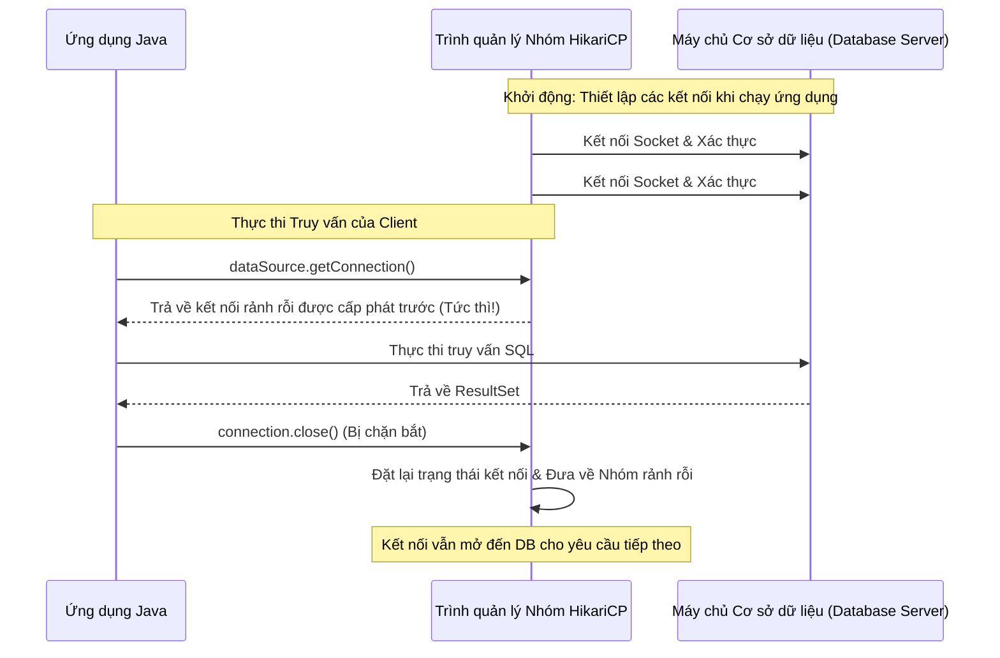

# JDBC - Phần 2

## Mục tiêu học tập (Learning Goal)

Tài liệu này bao gồm một phần trọng tâm của **JDBC**. Hãy nghiên cứu từng khái niệm như một quy tắc Java thực tế, thay vì chỉ là từ vựng rời rạc.

## Phạm vi đề mục (Outline Coverage)

| Khái niệm (Concept) | Điều cần biết (What to know) |
| --- | --- |
| `rollback` | rollback hủy bỏ các thay đổi của giao dịch hiện tại kể từ lần commit cuối cùng. |
| `setAutoCommit` | setAutoCommit định cấu hình xem các câu lệnh SQL có được tự động commit hay được nhóm lại thành các giao dịch. |
| `Batch processing` | Xử lý lô (Batch processing) là một khái niệm cụ thể trong JDBC; hãy tìm hiểu quy tắc Java, các trường hợp sử dụng hợp lệ và chế độ lỗi của nó thay vì chỉ nhớ tên. |
| `SQL Injection` | Lỗi chèn mã SQL (SQL injection) xảy ra khi đầu vào không đáng tin cậy làm thay đổi ý nghĩa của một lệnh SQL. |
| `Basic Connection Pool` | Nhóm kết nối cơ bản là một khái niệm cụ thể trong JDBC; hãy tìm hiểu quy tắc Java, các trường hợp sử dụng hợp lệ và chế độ lỗi của nó thay vì chỉ nhớ tên. |
| `DataSource` | DataSource là một nhà máy có thể cấu hình cho các kết nối cơ sở dữ liệu, thường được hỗ trợ bởi một nhóm kết nối (pool). |
| `CRUD using JDBC` | Thao tác CRUD (Tạo, Đọc, Cập nhật, Xóa) sử dụng JDBC là việc sử dụng API Java để kết nối và thao tác với các cơ sở dữ liệu quan hệ. |

## Ghi chú chi tiết (Detailed Notes)

### rollback

rollback hủy bỏ các thay đổi của giao dịch hiện tại kể từ lần commit cuối cùng.

Sử dụng nó để dự đoán chính xác quy tắc Java, biểu mẫu được phép và chế độ lỗi (failure mode). Xem xét nó với một ví dụ nhỏ thay vì chỉ ghi nhớ nhãn tên.

Các bước kiểm tra thực tế:
- Định nghĩa `rollback` trong một câu.
- Nhận diện `rollback` trong mã nguồn, các lệnh, tài liệu hoặc các câu hỏi phỏng vấn.
- Giải thích một lỗi, hạn chế, hoặc đánh đổi liên quan đến `rollback`.

Ví dụ nhỏ hoặc mô hình tư duy:
- Khi đọc mã nguồn, hãy hỏi: `rollback` thay đổi, cho phép, từ chối hoặc làm rõ điều gì?

### setAutoCommit

setAutoCommit xác định xem các câu lệnh được thực thi ở chế độ tự động commit (tự động lưu ngay lập tức từng câu lệnh SQL) hay chế độ commit thủ công (nhóm các câu lệnh thành các giao dịch).

Nó quan trọng bởi vì đối với các hoạt động giao dịch nhiều bước (ví dụ: chuyển tiền ngân hàng), chế độ tự động commit bắt buộc phải được vô hiệu hóa (`setAutoCommit(false)`) để đảm bảo thực thi nguyên tử (atomic execution).

Các bước kiểm tra thực tế:
- Định nghĩa `setAutoCommit` trong một câu.
- Nhận diện `setAutoCommit` trong mã nguồn, các lệnh, tài liệu hoặc các câu hỏi phỏng vấn.
- Giải thích một lỗi, hạn chế, hoặc đánh đổi liên quan đến `setAutoCommit`.

Ví dụ nhỏ hoặc mô hình tư duy:
- Khi đọc mã nguồn, hãy hỏi: `setAutoCommit` thay đổi, cho phép, từ chối hoặc làm rõ điều gì?

## Tại sao vô hiệu hóa tự động commit thiết lập các ranh giới ACID của giao dịch (Why Disabling Auto-Commit Establishes Transactional ACID Boundaries)

Theo mặc định, các kết nối JDBC mới hoạt động ở chế độ tự động commit, trong đó mỗi câu lệnh SQL riêng lẻ được coi là một giao dịch riêng biệt và được commit ngay lập tức vào cơ sở dữ liệu sau khi thực thi. Mặc dù tiện lợi, mô hình này vi phạm các thuộc tính Tính nguyên tử (Atomicity) và Tính nhất quán (Consistency) của các giao dịch ACID đối với các hoạt động yêu cầu nhiều cập nhật liên quan (chẳng hạn như chuyển tiền giữa hai tài khoản). Nếu một cập nhật thành công và cập nhật tiếp theo thất bại (ví dụ: do gián đoạn mạng hoặc vi phạm quy tắc nghiệp vụ), cơ sở dữ liệu sẽ bị để lại ở trạng thái bị hỏng, cập nhật một phần. Việc vô hiệu hóa tự động commit (`conn.setAutoCommit(false)`) chỉ thị cho bộ máy cơ sở dữ liệu nhóm tất cả các lệnh SQL tiếp theo vào một khối giao dịch logic duy nhất. Việc kiểm soát thủ công này đảm bảo rằng hoặc tất cả các sửa đổi được hoàn tất cùng nhau thông qua `conn.commit()`, hoặc tất cả các thay đổi hoàn toàn bị hủy bỏ thông qua `conn.rollback()` trong trường hợp xảy ra lỗi, giúp bảo toàn tính nhất quán của cơ sở dữ liệu.

### Mô hình tư duy: Tự động commit hoạt động so với Ranh giới giao dịch (Mental Model: Auto-Commit Active vs. Transactional Boundaries)
```mermaid
flowchart TD
    subgraph AutoCommitActive [Tự động commit Hoạt động - Auto-Commit = true (Mặc định)]
        A[withdraw.executeUpdate()] --> B[Được commit tức thì vào DB]
        B --> C[Sự cố mạng / Lỗi xảy ra]
        C --> D[deposit.executeUpdate() thất bại]
        D --> E[Trạng thái DB: Tiền bị rút nhưng chưa bao giờ được gửi - Không nhất quán!]
    end
    subgraph AutoCommitDisabled [Tự động commit Bị tắt - Auto-Commit = false (Giao dịch)]
        F[withdraw.executeUpdate()] --> G[Trạng thái chờ xử lý trong nhật ký giao dịch DB]
        G --> H[Sự cố mạng / Lỗi xảy ra]
        H --> I[Khối Catch bắt được lỗi]
        I --> J[conn.rollback() được gọi]
        J --> K[Trạng thái DB: Tất cả các thay đổi bị hủy bỏ - Nhất quán!]
    end
```

### Ví dụ mã nguồn: Quản lý giao dịch khi vô hiệu hóa tự động commit (Code Example: Transaction Management with Auto-Commit Disabled)
```java
public void transferMoney(Connection conn, int fromId, int toId, double amount) throws SQLException {
    try {
        // Vô hiệu hóa tự động commit để thiết lập ranh giới giao dịch
        conn.setAutoCommit(false); 
        
        try (PreparedStatement withdraw = conn.prepareStatement("UPDATE accounts SET balance = balance - ? WHERE id = ?");
             PreparedStatement deposit = conn.prepareStatement("UPDATE accounts SET balance = balance + ? WHERE id = ?")) {
            
            withdraw.setDouble(1, amount);
            withdraw.setInt(2, fromId);
            withdraw.executeUpdate();
            
            // Giả lập lỗi runtime để kích hoạt rollback
            if (true) { throw new SQLException("Simulated network outage"); }
            
            deposit.setDouble(1, amount);
            deposit.setInt(2, toId);
            deposit.executeUpdate();
            
            conn.commit(); // Không bao giờ chạy đến dòng này trong ví dụ này
        }
    } catch (SQLException e) {
        conn.rollback(); // Hủy bỏ cập nhật rút tiền, duy trì tính nhất quán
        System.out.println("Transaction rolled back: " + e.getMessage()); // In ra "Transaction rolled back: Simulated network outage"
    } finally {
        conn.setAutoCommit(true); // Khôi phục lại trạng thái mặc định
    }
}
```

### Chuỗi nguyên nhân - kết quả (Cause-Effect Chain)

```text
Gọi `conn.setAutoCommit(false)`
  → Cơ sở dữ liệu ngừng commit các câu lệnh riêng lẻ
  → Tất cả các cập nhật được ghi vào nhật ký undo/redo (undo/redo logs) như một khối logic duy nhất
  → Ngoại lệ thời gian chạy bị ném ra
  → `conn.rollback()` được gọi trong khối catch
  → Cơ sở dữ liệu hủy bỏ các nhật ký giao dịch đang chờ xử lý
  → Trạng thái cơ sở dữ liệu được khôi phục về ban đầu, duy trì tính nhất quán ACID.
```


---

## Tại sao các Savepoint cho phép khôi phục từng phần và các cơ chế cô lập của chúng (Why Savepoints Enable Partial Rollbacks and Their Isolation Mechanics)

Một `Savepoint` cho phép một giao dịch được chia thành các bước logic, giúp ứng dụng có thể khôi phục (roll back) một nhóm nhỏ các cập nhật mà không cần hủy bỏ toàn bộ giao dịch. Điều này cực kỳ hữu ích trong các quy trình làm việc phức tạp khi các nhiệm vụ phụ tùy chọn có thể thất bại nhưng giao dịch chính vẫn phải commit (ví dụ: in nhãn vận chuyển có thể thất bại, nhưng việc thanh toán đơn hàng vẫn phải được ghi nhận). Khi một `Savepoint` được thiết lập, cơ sở dữ liệu sẽ đánh dấu một trạng thái cụ thể trong nhật ký undo/redo của giao dịch. Nếu một khôi phục từng phần (partial rollback) được thực thi (`conn.rollback(savepoint)`), cơ sở dữ liệu sẽ chỉ đảo ngược các sửa đổi được thực hiện *sau* điểm lưu đó, trong khi vẫn giữ nguyên các khóa và các sửa đổi được thực hiện *trước* điểm lưu. Giao dịch vẫn duy trì trạng thái hoạt động, và cơ sở dữ liệu giữ nguyên mức cô lập giao dịch hiện tại (ví dụ: Read Committed hoặc Repeatable Read), đảm bảo rằng các thay đổi chưa được commit trước điểm lưu vẫn không hiển thị đối với các phiên làm việc cơ sở dữ liệu đồng thời khác.

### Mô hình tư duy: Khôi phục từng phần thông qua các điểm kiểm tra Savepoint (Mental Model: Partial Rollback via Savepoint Checkpoints)
```
Giao dịch bắt đầu (setAutoCommit(false))
      |
[Cập nhật số dư tài khoản]
      |
Tạo Savepoint: conn.setSavepoint("PostBalanceUpdate")
      |
[Cố gắng gửi thông báo SMS (nhiệm vụ phụ bị lỗi)]
      | (Thất bại)
Khôi phục về Savepoint: conn.rollback(savepoint)
      | (Chỉ đảo ngược cập nhật SMS, cập nhật số dư tài khoản vẫn chờ xử lý)
Commit giao dịch: conn.commit()
      |
DB chỉ hoàn tất thay đổi số dư tài khoản.
```

### Ví dụ mã nguồn: Khôi phục từng phần sử dụng Savepoint (Code Example: Partial Rollback using Savepoints)
```java
import java.sql.*;

public class SavepointDemo {
    public void processOrder(Connection conn) throws SQLException {
        Savepoint savepoint = null;
        try {
            conn.setAutoCommit(false);
            
            // 1. Hành động quan trọng: Thu tiền khách hàng
            try (PreparedStatement charge = conn.prepareStatement("UPDATE accounts SET balance = balance - 50.0 WHERE id = 1")) {
                charge.executeUpdate();
            }
            
            // Thiết lập savepoint sau hành động quan trọng
            savepoint = conn.setSavepoint("PaymentMade");
            
            // 2. Hành động không quan trọng: Ghi nhật ký kiểm toán (giả lập thất bại)
            try (PreparedStatement log = conn.prepareStatement("INSERT INTO invalid_table (msg) VALUES ('paid')")) {
                log.executeUpdate(); // Sẽ thất bại do thiếu bảng
            }
            
            conn.commit();
        } catch (SQLException e) {
            if (savepoint != null) {
                // Chỉ khôi phục hành vi ghi nhật ký kiểm toán không quan trọng, giữ lại cập nhật thanh toán
                conn.rollback(savepoint); 
                conn.commit(); // Hoàn tất thanh toán
                System.out.println("Partial rollback executed: payment charged, audit logged failed.");
            } else {
                conn.rollback(); // Khôi phục toàn bộ nếu chính việc thanh toán thất bại
            }
        }
    }
}
```

### Chuỗi nguyên nhân - kết quả (Cause-Effect Chain)

```text
Tạo `Savepoint` qua `conn.setSavepoint()`
  → Cơ sở dữ liệu đánh dấu điểm kiểm tra (checkpoint) trong nhật ký undo của giao dịch
  → Câu lệnh phụ thất bại
  → Gọi `conn.rollback(savepoint)`
  → Cơ sở dữ liệu đảo ngược các bản ghi nhật ký undo được ghi nhận sau điểm kiểm tra
  → Các khóa và thay đổi trước điểm kiểm tra vẫn hoạt động
  → Giao dịch commit thành công chỉ với các thay đổi chính.
```


---

### Xử lý lô (Batch processing)

Xử lý lô là một khái niệm cụ thể trong JDBC; hãy tìm hiểu quy tắc Java, các trường hợp sử dụng hợp lệ và chế độ lỗi của nó thay vì chỉ nhớ tên.

Sử dụng nó để dự đoán chính xác quy tắc Java, biểu mẫu được phép và chế độ lỗi (failure mode). Xem xét nó với một ví dụ nhỏ thay vì chỉ ghi nhớ nhãn tên.

Các bước kiểm tra thực tế:
- Định nghĩa `Batch processing` trong một câu.
- Nhận diện `Batch processing` trong mã nguồn, các lệnh, tài liệu hoặc các câu hỏi phỏng vấn.
- Giải thích một lỗi, hạn chế, hoặc đánh đổi liên quan đến `Batch processing`.

Ví dụ nhỏ hoặc mô hình tư duy:
- Khi đọc mã nguồn, hãy hỏi: `Batch processing` thay đổi, cho phép, từ chối hoặc làm rõ điều gì?

### SQL Injection

Lỗi chèn mã SQL (SQL injection) xảy ra khi đầu vào không đáng tin cậy làm thay đổi ý nghĩa của một lệnh SQL.

Sử dụng nó để dự đoán chính xác quy tắc Java, biểu mẫu được phép và chế độ lỗi (failure mode). Xem xét nó với một ví dụ nhỏ thay vì chỉ ghi nhớ nhãn tên.

Các bước kiểm tra thực tế:
- Định nghĩa `SQL Injection` trong một câu.
- Nhận diện `SQL Injection` trong mã nguồn, các lệnh, tài liệu hoặc các câu hỏi phỏng vấn.
- Giải thích một lỗi, hạn chế, hoặc đánh đổi liên quan đến `SQL Injection`.

Ví dụ nhỏ hoặc mô hình tư duy:
- Khi đọc mã nguồn, hãy hỏi: `SQL Injection` thay đổi, cho phép, từ chối hoặc làm rõ điều gì?

### Nhóm kết nối cơ bản (Basic Connection Pool)

Nhóm kết nối cơ bản là một khái niệm cụ thể trong JDBC; hãy tìm hiểu quy tắc Java, các trường hợp sử dụng hợp lệ và chế độ lỗi của nó thay vì chỉ nhớ tên.

Sử dụng nó để dự đoán chính xác quy tắc Java, biểu mẫu được phép và chế độ lỗi (failure mode). Xem xét nó với một ví dụ nhỏ thay vì chỉ ghi nhớ nhãn tên.

Các bước kiểm tra thực tế:
- Định nghĩa `Basic Connection Pool` trong một câu.
- Nhận diện `Basic Connection Pool` trong mã nguồn, các lệnh, tài liệu hoặc các câu hỏi phỏng vấn.
- Giải thích một lỗi, hạn chế, hoặc đánh đổi liên quan đến `Basic Connection Pool`.

Ví dụ nhỏ hoặc mô hình tư duy:
- Khi đọc mã nguồn, hãy hỏi: `Basic Connection Pool` thay đổi, cho phép, từ chối hoặc làm rõ điều gì?

### DataSource

DataSource là một nhà máy có thể cấu hình cho các kết nối cơ sở dữ liệu, thường được hỗ trợ bởi một nhóm kết nối (pool).

Sử dụng nó để dự đoán chính xác quy tắc Java, biểu mẫu được phép và chế độ lỗi (failure mode). Xem xét nó với một ví dụ nhỏ thay vì chỉ ghi nhớ nhãn tên.

Các bước kiểm tra thực tế:
- Định nghĩa `DataSource` trong một câu.
- Nhận diện `DataSource` trong mã nguồn, các lệnh, tài liệu hoặc các câu hỏi phỏng vấn.
- Giải thích một lỗi, hạn chế, hoặc đánh đổi liên quan đến `DataSource`.

Ví dụ nhỏ hoặc mô hình tư duy:
- Khi đọc mã nguồn, hãy hỏi: `DataSource` thay đổi, cho phép, từ chối hoặc làm rõ điều gì?

## Tại sao nhóm kết nối cơ sở dữ liệu mang lại hiệu năng cải thiện vượt trội (Why Database Connection Pools Yield Massive Performance Gains)

Thiết lập một kết nối cơ sở dữ liệu vật lý mới là một hoạt động cực kỳ tốn kém vì nó yêu cầu thực hiện bắt tay ba bước TCP (TCP three-way handshake), trao đổi thông tin đăng nhập và phân quyền cơ sở dữ liệu, và phân bổ bộ nhớ tiến trình cũng như tài nguyên phía máy chủ. Trong các ứng dụng web có lưu lượng truy cập cao, việc khởi tạo một kết nối mới cho mỗi yêu cầu HTTP đầu vào tạo ra một điểm nghẽn hiệu năng nghiêm trọng và nhanh chóng làm cạn kiệt tài nguyên cơ sở dữ liệu. Các framework nhóm kết nối (như HikariCP hoặc Apache Commons DBCP) giải quyết vấn đề này bằng cách thiết lập một nhóm các kết nối cơ sở dữ liệu vật lý đang hoạt động khi khởi động ứng dụng. Khi ứng dụng yêu cầu một kết nối thông qua `dataSource.getConnection()`, trình quản lý nhóm ngay lập tức bàn giao một kết nối rảnh rỗi đã được thiết lập sẵn từ nhóm. Khi gọi `connection.close()`, kết nối này không thực sự bị đóng; thay vào đó, trình quản lý nhóm chặn cuộc gọi đóng này, đặt lại trạng thái kết nối (xóa các bảng tạm thời và các giao dịch), và trả lại kết nối về nhóm để tái sử dụng, hoàn toàn bỏ qua việc bắt tay socket và chi phí xác thực.

### Mô hình tư duy: Các kết nối được cấp phát trước so với Bắt tay thủ công (Mental Model: Pre-allocated Connections vs. Manual Handshakes)


### Ví dụ mã nguồn: Tái sử dụng kết nối với HikariCP (Code Example: Connection Reuse with HikariCP)
```java
import com.zaxxer.hikari.HikariConfig;
import com.zaxxer.hikari.HikariDataSource;
import java.sql.Connection;
import java.sql.ResultSet;
import java.sql.Statement;

public class ConnectionPoolDemo {
    private static HikariDataSource dataSource;

    static {
        HikariConfig config = new HikariConfig();
        config.setJdbcUrl("jdbc:h2:mem:test;DB_CLOSE_DELAY=-1");
        config.setUsername("sa");
        config.setPassword("");
        config.setMaximumPoolSize(10); // Giữ tối đa 10 kết nối có thể tái sử dụng
        dataSource = new HikariDataSource(config);
    }

    public static void runQuery() throws Exception {
        // getConnection trả về một kết nối trong nhóm chỉ trong vài mili giây
        try (Connection conn = dataSource.getConnection(); 
             Statement stmt = conn.createStatement();
             ResultSet rs = stmt.executeQuery("SELECT 1")) {
            if (rs.next()) {
                System.out.println("Result: " + rs.getInt(1)); // In ra "Result: 1"
            }
        } // conn.close() trả kết nối về pool, không đóng socket thực tế
    }
}
```

### Chuỗi nguyên nhân - kết quả (Cause-Effect Chain)

```text
Nhóm kết nối được thiết lập khi khởi động
  → Các socket vật lý hoạt động được tạo ra và xác thực
  → `getConnection()` truy vấn trình quản lý nhóm
  → Lấy được và trả về socket rảnh rỗi dưới một mili giây
  → `close()` đặt lại trạng thái phiên và giải phóng socket về cho trình quản lý nhóm
  → Không yêu cầu đóng socket hay xác thực lại
  → Giảm độ trễ và giảm tải sử dụng CPU của máy chủ cơ sở dữ liệu.
```


---

### Thao tác CRUD bằng JDBC (CRUD using JDBC)

JDBC là API Java để kết nối tới các cơ sở dữ liệu quan hệ.

Sử dụng nó để dự đoán chính xác quy tắc Java, biểu mẫu được phép và chế độ lỗi (failure mode). Xem xét nó với một ví dụ nhỏ thay vì chỉ ghi nhớ nhãn tên.

Các bước kiểm tra thực tế:
- Định nghĩa `CRUD using JDBC` trong một câu.
- Nhận diện `CRUD using JDBC` trong mã nguồn, các lệnh, tài liệu hoặc các câu hỏi phỏng vấn.
- Giải thích một lỗi, hạn chế, hoặc đánh đổi liên quan đến `CRUD using JDBC`.

Ví dụ nhỏ hoặc mô hình tư duy:
- `PreparedStatement` ràng buộc các giá trị một cách an toàn bằng các trình giữ chỗ.

## Các câu hỏi ôn tập phổ biến (Common Review Prompts)

- Khái niệm nào ở đây là quy tắc trong thời gian biên dịch (compile-time)?
- Khái niệm nào ở đây ảnh hưởng đến hành vi thời gian chạy (runtime)?
- Khái niệm nào ở đây có khả năng là bẫy phỏng vấn?

## Ví dụ mã nguồn (Code Examples)

### Quản lý giao dịch (commit và rollback) (Transaction Management (commit and rollback))
```java
Connection conn = null;
try {
    conn = dataSource.getConnection();
    conn.setAutoCommit(false); // Kích hoạt kiểm soát giao dịch thủ công
    
    try (PreparedStatement withdraw = conn.prepareStatement("UPDATE accounts SET balance = balance - ? WHERE id = ?");
         PreparedStatement deposit = conn.prepareStatement("UPDATE accounts SET balance = balance + ? WHERE id = ?")) {
         
        withdraw.setDouble(1, 100.0);
        withdraw.setInt(2, 1);
        withdraw.executeUpdate();
        
        deposit.setDouble(1, 100.0);
        deposit.setInt(2, 2);
        deposit.executeUpdate();
        
        conn.commit(); // Commit nếu cả hai thành công
    }
} catch (Exception e) {
    if (conn != null) {
        try {
            conn.rollback(); // Rollback khi xảy ra lỗi
        } catch (SQLException ex) {
            ex.printStackTrace();
        }
    }
} finally {
    if (conn != null) {
        try {
            conn.close();
        } catch (SQLException ex) {
            ex.printStackTrace();
        }
    }
}
```

### Xử lý lô (Batch Processing)
```java
String sql = "INSERT INTO logs (message, created_at) VALUES (?, ?)";
try (Connection conn = dataSource.getConnection();
     PreparedStatement stmt = conn.prepareStatement(sql)) {
     
    conn.setAutoCommit(false);
    
    for (int i = 0; i < 1000; i++) {
        stmt.setString(1, "Log message " + i);
        stmt.setTimestamp(2, new java.sql.Timestamp(System.currentTimeMillis()));
        stmt.addBatch();
        
        if (i % 100 == 0) {
            stmt.executeBatch(); // Thực thi mỗi 100 phần tử
        }
    }
    stmt.executeBatch(); // Thực thi các phần tử còn lại
    conn.commit();
}
```

## Các lỗi thường gặp (Common Mistakes)

- **Giả định tự động commit bị tắt theo mặc định (Assuming Auto-Commit is Off by Default)**: Theo mặc định, các kết nối cơ sở dữ liệu mới ở chế độ tự động commit. Bạn bắt buộc phải gọi `conn.setAutoCommit(false)` một cách tường minh để bắt đầu một giao dịch.
- **Quên gọi Commit (Forgetting to Commit)**: Nếu tự động commit bị tắt và bạn thực thi các câu lệnh chèn/cập nhật dữ liệu, bạn bắt buộc phải gọi `conn.commit()`. Nếu không, cơ sở dữ liệu sẽ hủy bỏ các thay đổi khi kết nối bị đóng hoặc bị thu hồi bởi GC.
- **Không xử lý các ngoại lệ khi gọi Rollback**: Nếu có lỗi xảy ra trong quá trình thực thi giao dịch, việc gọi `conn.rollback()` cũng có thể ném ra một ngoại lệ `SQLException`. Điều này nên được xử lý đúng cách trong một khối try-catch lồng nhau bên trong khối catch chính.

## Reference Links

- https://docs.oracle.com/javase/tutorial/jdbc/basics/transactions.html (Sử dụng Giao dịch trong JDBC)
- https://docs.oracle.com/en/java/javase/21/docs/api/java.sql/java/sql/Connection.html#setAutoCommit(boolean) (Tài liệu JavaDoc Connection setAutoCommit)
- https://docs.oracle.com/en/java/javase/21/docs/api/java.sql/java/sql/Savepoint.html (Tài liệu JavaDoc Savepoint)
- https://github.com/brettwooldridge/HikariCP (Tham khảo GitHub HikariCP Connection Pool)
