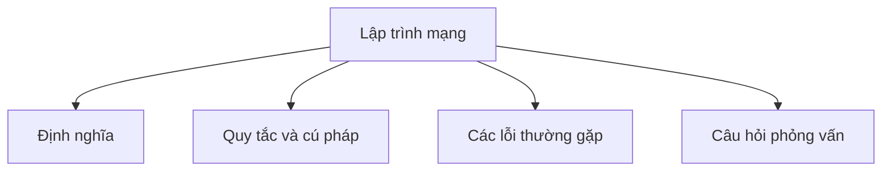

# 35 - Lập trình mạng (Networking)

Chủ đề này bám sát đề cương chính trong [outline.md](../outline.md). Mục tiêu là hiểu sâu sắc từng khái niệm để có thể giải thích, nhận diện trong mã nguồn và trả lời các câu hỏi phỏng vấn.

## Thứ tự học tập (Study Order)

- [Các khái niệm lập trình Socket (Socket Programming Concepts)](theory/01-socket-programming-concepts.md)
- [Các khái niệm về HttpURLConnection (HttpURLConnection Concepts)](theory/02-httpurlconnection-concepts.md)
- [Các thuật ngữ chính (Key Terms)](terms/01-key-terms.md)

## Danh sách đề cương (Outline Checklist)

- Lập trình Socket (Socket programming)
- Socket TCP (TCP socket)
- Socket UDP (UDP socket)
- `Socket`
- `ServerSocket`
- `DatagramSocket`
- `InetAddress`
- `URL`
- `URI`
- Yêu cầu HTTP cơ bản (Basic HTTP request)
- `HttpURLConnection`
- `HttpClient` trong Java 11 (Java 11 HttpClient)
- Mô hình khách-chủ (Client-server model)

## Tự kiểm tra (Self-Check)

Trước khi chuyển sang chủ đề tiếp theo, hãy xác nhận rằng bạn có thể trả lời các câu hỏi sau:
1. Tại sao TCP yêu cầu giai đoạn thiết lập kết nối (bắt tay - handshake) sử dụng `Socket` và `ServerSocket`, trong khi UDP (`DatagramSocket`) thực hiện truyền gói tin không kết nối (connectionless packet transfer)?
   &rarr; Xem [Tại sao bắt tay TCP khác biệt với UDP không kết nối (Why TCP Handshakes Differ From Connectionless UDP)](theory/01-socket-programming-concepts.md#why-tcp-handshakes-differ-from-connectionless-udp)
2. Tại sao việc chạy trực tiếp các thao tác I/O socket chặn (blocking socket I/O operations) (như `accept()` hoặc `read()`) trên luồng chính (main thread) của ứng dụng là một lỗi nghiêm trọng, và đa luồng (multithreading) giải quyết vấn đề này như thế nào?
   &rarr; Xem [Tại sao các thao tác Socket chặn không được chạy trên luồng chính (Why Blocking Socket Operations Must Not Run on the Main Thread)](theory/01-socket-programming-concepts.md#why-blocking-socket-operations-must-not-run-on-the-main-thread)
3. Tại sao Java 20 không khuyến khích sử dụng (deprecate) các hàm khởi tạo của `URL` (như `new URL(string)`), và tại sao nên khởi tạo `URI` trước rồi chuyển đổi bằng `uri.toURL()`?
   &rarr; Xem [Tại sao Java 20 không khuyến khích các hàm khởi tạo URL để chuyển sang dùng URI (Why Java 20 Deprecated URL Constructors in Favor of URI)](theory/01-socket-programming-concepts.md#why-java-20-deprecated-url-constructors-in-favor-of-uri)
4. Tại sao `HttpURLConnection` gặp phải các hạn chế về hiệu năng (ví dụ: API chặn - blocking API, quản lý tài nguyên phức tạp), và `HttpClient` hiện đại trong Java 11 cải thiện hiệu năng cũng như hỗ trợ thực thi bất đồng bộ (asynchronous execution) như thế nào?
   &rarr; Xem [Tại sao Java 11 HttpClient thay thế HttpURLConnection (Why Java 11 HttpClient Supersedes HttpURLConnection)](theory/02-httpurlconnection-concepts.md#why-java-11-httpclient-supersedes-httpurlconnection)
5. Tại sao các luồng socket (socket stream) và socket phải được đóng đúng cách, và hậu quả ở cấp độ hệ điều hành (OS-level) (ví dụ: ngoại lệ liên kết cổng - port binding exception, rò rỉ bộ mô tả tệp - file descriptor leak) nếu không thực hiện việc này là gì?
   &rarr; Xem [Tại sao Socket và Luồng phải được đóng đúng cách (Why Sockets and Streams Must Be Closed Properly)](theory/01-socket-programming-concepts.md#why-sockets-and-streams-must-be-closed-properly)

## Thẻ Anki (Anki Cards)

- [Cơ bản (Basic)](anki/basic.tsv)
- [Cơ bản mở rộng (Basic Extra)](anki/basic-extra.tsv)
- [Điền vào chỗ trống (Cloze)](anki/cloze.tsv)
- [Câu hỏi code (Code Question)](anki/code-question.tsv)

## Sơ đồ Mermaid tổng quan (Mermaid Overview)

## Liên kết tham khảo (Reference Links)

- https://docs.oracle.com/javase/tutorial/networking/
- https://docs.oracle.com/en/java/javase/21/docs/api/java.base/java/net/package-summary.html
